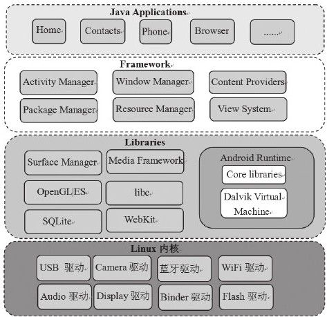
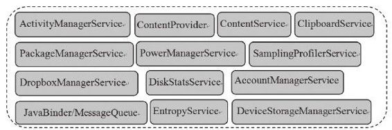

# 1.1　Android系统架构

1.1 Android系统架构到目前为止（2012年），Android系统的最新版本是4.0.3。而就在本书即将完稿之时，业界有传闻说Android4.0.4版本已经对大厂商发布。Android系统推出速度之快让很多开发人员都很惊讶。当然，推出的速度如此之快有一些是出于商业上的考虑。不管怎样，Android系统在进化过程中，大体架构是相对稳定的。图1-1为Android的系统架图1-1 Android系统架构构图。

相信绝大多数读者对图1-1或类似图表的内容已经非常熟悉了。此处，我们就不再赘述。

本书作为“深入理解Android”系列的第二卷，从内容上将承接《深入理解Android：

卷I》（本书以后简称“卷I”），但是本书关注的焦点将从Native层Framework转移到Java层Framework。本书涵盖的内容如图1-2所示。

图1-2本书涵盖的内容从图1-2中读者可发现，本书的大部分内容都在讨论Service（服务）。这是因为Android Java层Fram ework的核心就是这些Service。毫不夸张地说，正是这些Service支撑了整个Java层的运转。读者可参考第3章的图3-1来了解Framework中Service的概貌。
