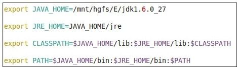
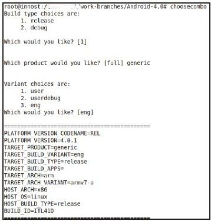

# 1.2.2　编译源码

1.部署JDKAndroid2.3及以后版本的代码编译都需要使用JDK1.6，所以首先要做的就是下载JDK1.6。下载地址是h p：//www.oracle.com /technetwork/java/javasebusiness/downloads/index.htm l。笔者下载的文件是jdk-6u27-linux-x64.bin。把它放到一个目录中，比如将其放到/mnt/hgfs/E目录下，然后在这个目录中执行下面这个文件：

./jdk-6u27-linux-x64.bin这个命令的作用其实就是解压。解压后的结果在/m nt/hgfs/E/jdk1.6.0_27目录中。有了JDK后，还需要设置～/.bashrc文件。在该文件末尾添加如图1-4所示的几行语句。

图1-4 Java环境部署示意图重新登录系统后，Java环境就添加到系统中了。

2.编译源码编译源码的步骤非常简单。我们在卷I也详细介绍了编译方法。不过本书要求读者必须先编译整个系统，步骤如下：

执行source build/envsetup.sh命令。该命令将导入Android编译环境。

输入choosecombo并执行，它是在envsetup.sh中定义的一个函数。在执行过程中，分别选择release、generic、eng即可。最终屏幕输出如图1-5所示。

执行make命令以编译整个系统。编译时间由机器配置决定。笔者的4核4GB内存的机器的编译时间大概为2小时。

图1-5编译设置效果图
