# 1.2.3　利用Eclipse调试system_process

本节将介绍如何利用Eclipse来调试AndroidJava Fram ework的核心进程system _process。

1.配置Eclipse首先要下载AndroidSDK，下载地址为h p：//developer.android.com /sdk/index.html。在Linux环境下，该网站截图如图1-6所示。

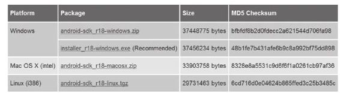

图1-6 AndroidSDK下载网页截图笔者下载的是Linux系统上的SDK。解压后的位置在/thunderst/disk/anroid/android-sdk-linux_86下。

然后要为Eclipse安装ADT插件(AndroidDevelopm entTools），步骤如下：

单击Eclipse菜单栏Help下的Insta NewSoftware，输入Android ADT下载地址：

h p s：//d l-ssl.google.com /android/eclipse/，然后安装其中的所有组件，并重启Eclipse。

单击Eclipse菜单栏Preferences下的Android一栏，在右边的SDKLocation文本框中输入刚才解压SDK后得到的目录（笔者设置的为/thunderst/disk/anroid/android-sdk-

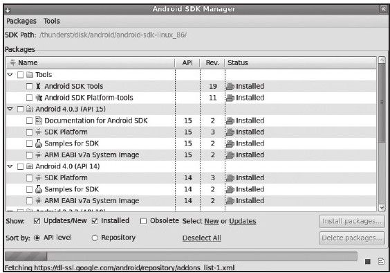

linux_86），最终结果如图1-7所示。

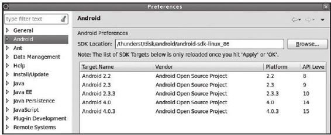

图1-7 SDK安装示意图图1-8 Android SDK M anager对话框单击Eclipse菜单栏W indow下的AndroidSDKManager，弹出一个对话框，如图1-82.使用Co ee BytesJava插件所示。

Co ee BytesJava是Eclipse的一个插件，在图1-8中选择下载其中的Tools和对应版本用于对代码进行折叠，其功能比Eclipse自带的SDK文档、镜像文件、开发包等。有条件的代码折叠功能强大很多。在研究大段代码的读者可以将Android 4.0.3和Android4.0时，该插件的作用非常明显。此插件的安装对应的内容及Tools全部下载下来。

和配置步骤如下：

单击Eclipse菜单栏Help下的Insta NewSoftware，在弹出的对话框中输入h p：//eclipse.realjenius.com /update-site，选择安装这个插件即可。

单击Eclipse菜单栏W indow下的Preference，在左上角输入Folding进行搜索，结果如图1-9所示。

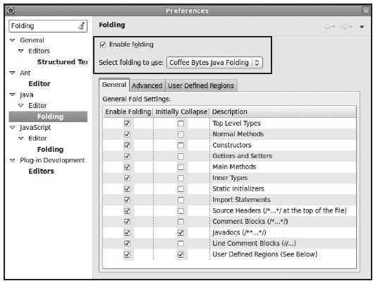

图1-9 Co ee BytesJava插件配置在图1-9所示的对话框中，要先勾选Enablefolding选项，然后从Selectfolding to use框中选择Co ee BytesJava Folding(见图1-9中的黑框）。图1-9右下部分的复选框用来配置此插件的代码折叠功能。读者不妨按照图1-9所示来配置它。使用该插件后的示意图如图1-10所示。

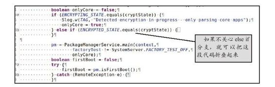

图1-10 Co eeBytesJava插件的使用示例从图1-10中可看到，使用该插件后，代码中所有分支基本上都可以折叠起来，该功能将帮助开发人员集中精力关注自己所关心的分支。

3.导入Android源码

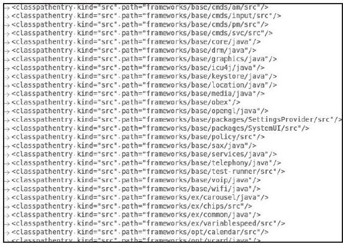

注意，导入源码必须在编译完整个Android源码后才可以实施，其步骤如下：

复制Android源码目录/developm ent/ide/eclipse/.classpath到Android源码根目录。

打开Android源码根目录下的.classpath文件。该文件是供Eclipse使用的，其中保存的图1-11 .classpath文件的部分内容是源码目录中各个模块的路径。由于我们只关心Framework相关的模块，因此可以把另外，在Eclipse环境中，一些不必要的模块一些不是Framework的目录从该文件中注会导致后续Android源码编译失败。笔者共释掉。同时，去掉不必要的模块也可加快享了一个已经配置好的.classpath文件，读Android源码导入速度。图1-11所示为该文者可从件的部分内容。

h p：//download.csdn.net/detail/innost/4247578处下载并直接使用。

单击Eclipse菜单栏N ew下的Java Project，弹出如图1-12所示的对话框。设置Location为Android4.0源码所在的路径。

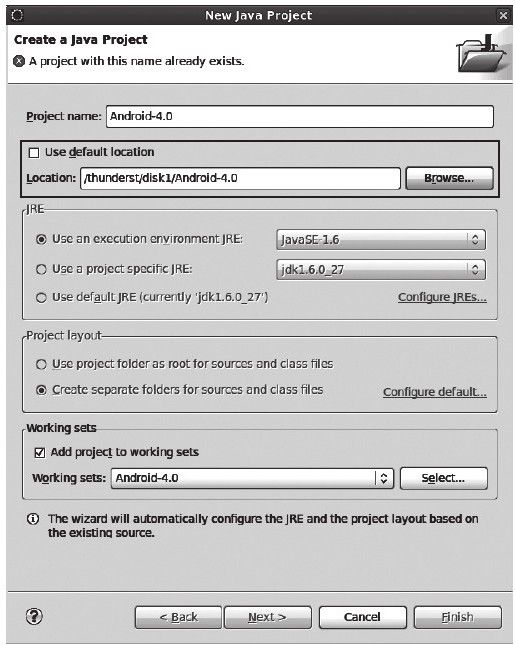

图1-12导入Android源码示意图由于Android4.0源码文件较多，导入过程会持续较长一段时间，大概十几分钟。

注意导入源码前一定要取消Eclipse的自动编译选项（通过菜单栏Project下的BuildProjectAutomatica y设置）。另外，源码导入完毕后，读者千万不要清理（clean）

这个工程。清理会删除之前源码编译生成的文件，导致后续又得重新编译Android系统。

4.创建并运行模拟器单击Eclipse菜单栏W indow下的AVDManager，创建模拟器，如图1-13所示。

模拟器创建完毕后即可启动它。

5.调试system _process调试system _process的步骤如下：

首先编译Android源码工程。编译过程中会

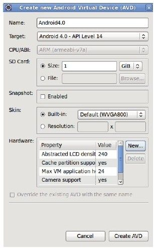

有很多警告。如果有错误，大部分原因是.classpath文件将不需要的模块包含了进来。读者可根据Eclipse的提示做相应处理。

在Android源码工程上右击，在弹出的菜单中依次单击Debug As-＞DebugConfigurations，弹出如图1-14所示的对话框，然后从左边找到RemoteJavaApplication一栏。

单击图1-14左上角黑框中的新建按钮，然后按图1-15所示的黑框中的内容来设置该对话框。

图1-13模拟器创建示意图

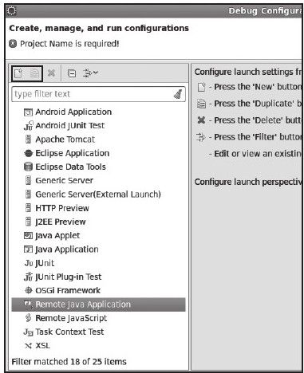

图1-14 Debug配置框示意图由图1-15可知，需要选择Remote调试端口号为8600，Host类型为localhost。8600是system _process进程的调试端口号。

Eclipse一旦连接到该端口，即可通过JDWP协议来调试system _process。

配置完毕后，单击图1-15所示对话框右下角的Debug按钮，即可启动system _process的调试。

图1-16所示为笔者调试startActivity流程的示意图。

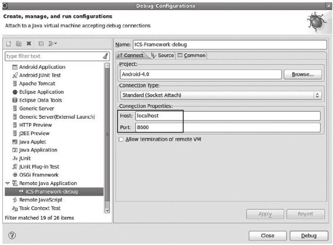

图1-15 Rem oteJavaApplication配置示意图

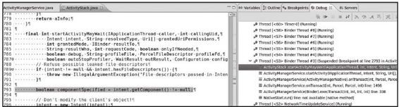

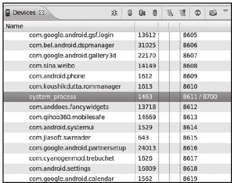

图1-16 system _process调试效果图另外，system_process的调试端口号可由DDMS查询，如图1-17所示。

由图1-17可知，在笔者测试的这台机器上，system _process的调试端口号为8611，由图1-17查询system _process调试端口于系统有可能因为意外而重启，故号system _process的端口号并不固定为8600。读者在调试它的时候最好先通过DDM S确认当前system _process的调试端口号。
