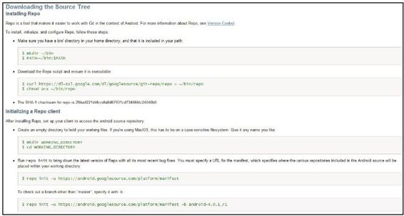

# 1.2　搭建开发环境

本节将讨论Android4.0源码下载和编译的方法、Eclipse开发环境的搭建方法，以及system _process进程的调试方法等相关知识。

1.2.1下载源码Android 2.3以后，Google官方推荐使用64位的操作系统来编译源码。所以，读者要先安装64位的操作系统（OperatingSystem,OS）。笔者推荐的操作系统是Ubuntu10.04X86-64版。另外，要提醒读者的是，不要随意升级Ubuntu，因为高版本Ubuntu中自带的GCC版本过高，会导致

编译Android源码时出现问题。

提示其实32位的Ubuntu也可以编译Android 2.3以后的Android系统源码，但操作颇为麻烦，而且也没什么技术含量。建议读者遵照官方要求去做。

本处不过多讨论Android源码下载的步骤，图1-3 Android源码下载网页示意图原因是：这是一个需要读者动手操作的过注意读者应选择下载Android4.0.1的源程，看着电脑屏幕操作比看书后输入大串的码。虽然最新的Android4.0.3从版本号上字符串的效率要高很多。

看变化不大，但实际代码却有较大变化。

基于上面这个原因，这里笔者向读者提供一另外，如果读者发现本章提供的下载地址无个官方说明文档，地址是法连接，可从笔者博客上的链接去下载源码h p：//source.android.com /source/do和工具，笔者博客地址是：

wnloading.html。该网页中有详细的代码h p：//blog.csdn.net/innost/article/det下载步骤，读者只要执行简单的复制和粘贴ails/7525205。

操作即可下载到源代码。建议读者亲自动手实验。图1-3为该网页的截图。
