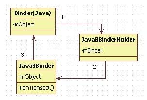
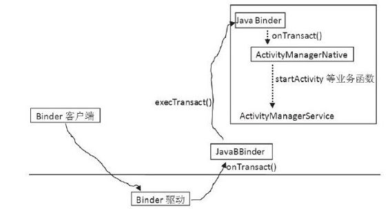

# 2.2.3　addService实例分析


这个例子源自ActivityM anagerService（AMS），我们通过它揭示Java层Binder的工作原理。该例子的分析步骤如下：

首先分析AMS如何将自己注册到ServiceM anager。

然后分析AMS如何响应客户端的Binder调用请求。

本例的起点是setSystem Process函数，其代码如下所示：

[--＞ActivityM anagerService.java：
setSystem Process]

```java
publi c stati c void setSystemProcess
(){
try{
Acti vit yManagerService m=mSelf;
//将Acti vit yManagerService服务注册到
ServiceManager中
ServiceManager.addService
("acti vit y",m);
```

……//省略后续内容

```
}
……
return;
}
```

上面所示代码行的目的是将AMS服务注册到ServiceM anager中。AM S是Android核心服务中的核心，以后我们会经常和它打交道。

大家知道，整个Android系统中有一个Native的ServiceM anager(以后简称SM）进程，它统筹管理Android系统上的所有Service。成为一个Service的必要条件是在SM中注册。下面来看Java层的Service是如何在SM中注册的。

1.在SM中注册服务（1）创建ServiceM anagerProxy在SM中注册服务的函数为addService，其代码如下：

[--＞ServiceM anager.java：addService]

```java
publi c stati c void addService(String
name, IBinder service){
try{
//getIServiceManager返回什么
getIServiceManager().addService
(name, service);
}
……
}
//分析getIServiceManager函数
private stati c IServiceManager
getIServiceManager(){
……
//调用asInterface,传递的参数类型为
IBinder
sServiceManager=ServiceManagerNati ve.a
sInterface(
BinderInternal.getContextObject
());
return sServiceManager;
}
```

asInterface的参数为BinderInternal.getContextO bject的返回值。这是一个native的函数，其实现的代码为：

[--＞android_util _Binder.cpp：

```cpp
android_os_BinderInternal_getContextO
bject]
stati c jobject
android_os_BinderInternal_getContextOb
ject(
JNIEnv*env, jobject clazz){
/*
下面这句代码,我们在卷I第6章详细分析
过,它将返回一个BpProxy对象,其中
NULL(即0,用于标识目的端)指定Proxy通
信的目的端是ServiceManager
*/
sp<IBinder>b=ProcessState:self()-
>getContextObject(NULL);
//由Native对象创建一个Java对象,下面分
析该函数
return javaObjectForIBinder(env,
b);
}
```

[--＞android_util _Binder.cpp：
javaO bjectForIBinder]

```cpp
jobject javaObjectForIBinder
(JNIEnv*env, const sp<IBinder>&
val)
{
//mProxyLock是一个全局的静态CMutex对象
AutoMutex_l(mProxyLock);
/*
val对象实际类型是BpBinder,读者可自行
分析BpBinder.cpp中的fi ndObject函数。
事实上,在Nati ve层的BpBinder中有一个
ObjectManager,它用来管理在Nati ve
BpBinder上创建的Java BpBinder对象。下
面这个fi ndObject用来判断
gBinderProxyO sets
是否已经保存在ObjectManager中。如果
是,那就需要删除旧的object
*/
jobject object=(jobject)val->
fi ndObject(&gBinderProxyO sets);
if(object!=NULL){
jobject res=env->Ca ObjectMethod
(object,
gWeakReferenceO sets.mGet);
android_atomic_dec(&
gNumProxyRefs);
val->detachObject(&
gBinderProxyO sets);
env->DeleteGlobalRef(object);
}
//创建一个新的BinderProxy对象,并注册
到Nati ve BpBinder对象的ObjectManager中
object=env->NewObject
(gBinderProxyO sets.mClass,
gBinderProxyO sets.mConstructor);
if(object!=NULL){
env->SetIntField(object,
gBinderProxyO sets.mObject,(int)
val.get());
val->incStrong(object);
jobject refObject=env->NewGlobalRef(
env->GetObjectField(object,
gBinderProxyO sets.mSelf));
/*
将这个新创建的BinderProxy对象注册
(a ach)到BpBinder的ObjectManager
中,同时注册一个回收函数
proxy_cleanup。当BinderProxy对象撤销
(detach)的时候,该函数会被调用,以释
放一些资源。读者可自行研究
proxy_cleanup函数
*/
val->a achObject(&
gBinderProxyO sets, refObject,
jnienv_to_javavm(env),
proxy_cleanup);
//DeathRecipientList保存了一个用于死亡
通知的list
sp<DeathRecipientList>drl=new
DeathRecipientList;drl->incStrong
((void*)javaObjectForIBinder);
//将死亡通知li st和BinderProxy对象联系
起来
env->SetIntField(object,
gBinderProxyO sets.mOrgue,
reinterpret_cast<ji nt>(drl.get
()));
//增加该Proxy对象的引用计数
android_atomic_inc(&
gNumProxyRefs);
//下面这个函数用于垃圾回收。创建的
Proxy对象一旦超过200个,该函数
//将调用BinderInter类的ForceGc做一次垃
圾回收
incRefsCreated(env);
}
return object;
}
```

BinderInternal.getContextO bject该函数完成了以下两个工作：

创建了一个Java层的BinderProxy对象。

通过JNI，该BinderProxy对象和一个Native的BpProxy对象挂钩，而该BpProxy对象的通信目标就是ServiceM anager。

大家还记得Native层Binder中那个著名的interface_cast宏吗？在Java层中，虽然没有这样的宏，但是定义了一个类似的函数asInterface。下面来分析ServiceM anagerNative类的asInterface函数，其代码如下：

[--＞ServiceM anagerN ative.java：
asInterface]

```java
stati c publi c IServiceManager
asInterface(IBinder obj)
{
```

……//以obj为参数，创建一个ServiceManagerProxy对象

```
return new ServiceManagerProxy
(obj);
}
```

上面的代码和N ative层interface_cast非常类似，都是以一个BpProxy对象为参数构造一个和业务相关的Proxy对象，例如这里的ServiceM anagerProxy对象。Service-ManagerProxy对象的各个业务函数会将相应请求打包后交给BpProxy对象，最终由BpProxy对象发送给Binder驱动以完成一次通信。

提示实际上BpProxy也不会和Binder驱动交互，真正和Binder驱动交互的是IPCThreadState。

（2）addService函数分析现在来分析ServiceM anagerProxy的addService函数，其代码如下：

[--＞ServiceM anagerN ative.java：
addService]

```java
publi c void addService(String name,
IBinder service)
throws RemoteExcepti on{
Parcel data=Parcel.obtain();
Parcel reply=Parcel.obtain();
data.writ eInterfaceToken
(IServiceManager.descriptor);
data.writ eString(name);
//注意下面这个writ eStrongBinder函数,
```

后面我们会详细分析它

```
data.writ eStrongBinder(service);
//mRemote实际上就是BinderProxy对象,调
用它的transact,将封装好的请求数据
//发送出去
mRemote.transact
(ADD_SERVICE_TRANSACTION, data,
reply,0);
reply.recycle();
data.recycle();
}
```

BinderProxy的transact是一个native函数，其实现代码如下：

[--＞android_util _Binder.cpp：
android_os_BinderProxy_transact]

```cpp
stati c jboolean
android_os_BinderProxy_transact
(JNIEnv*env, jobject obj,
ji nt code, jobject dataObj,
jobject replyObj, ji nt fl ags)
{
……
//从Java的Parcel对象中得到Nati ve的
Parcel对象
Parcel*data=parcelForJavaObject(env,
dataObj);
if(data==NULL){
return JNI_FALSE;
}
//得到一个用于接收回复的Parcel对象
Parcel*reply=parcelForJavaObject(env,
replyObj);
if(reply==NULL&&replyObj!=NULL){
return JNI_FALSE;
}
//从Java的BinderProxy对象中得到之前已
经创建好的那个Nati ve的BpBinder对象
IBinder*target=(IBinder*)
env->GetIntField(obj,
gBinderProxyO sets.mObject);
……
//通过Nati ve的BpBinder对象,将请求发送
给ServiceManager
status_t err=target->transact(code,
*data, reply, fl ags);
……
signalExcepti onForError(env, obj,
err);
return JNI_FALSE;
}
```

看了上面的代码你会发现，Java层的Binder架构最终还是要借助Native的Binder架构进行通信。

关于Binder架构，笔者有一个体会愿和读者一起讨论分析。

从架构的角度看，在Java中搭建了一整套框架，如IBinder接口、Binder类和BinderProxy类。但是从通信角度看，架构的编写不论采用的是Native语言还是Java语言，只要把请求传递到Binder驱动就可以了，所以通信的目的是向binder发送请求和接收回复。在这个目的之上，考虑到软件的灵活性和可扩展性，于是编写了一个架构。

反过来说，也可以不使用架构（即没有使用任何接口、派生之类的东西）而直接和binder交互，例如，ServiceM anager作为Binder架构的一个核心程序，就是直接读取/dev/binder设备，获取并处理请求。从这一点上看，Binder架构的目的虽是简单的（即打开binder设备，然后读请求和写回复），但是架构是复杂的（编写各种接口类和封装类等）。我们在研究源码时，一定要先搞清楚目的。实现只不过是达到该目的的一种手段和方式。脱离目的而去研究实现，如缘木求鱼，很容易偏离事物本质。

在对addService进行分析时，我们曾提示writeStrongBinder是一个特别的函数。那么它特别在哪里呢？我们后边会进行介绍。

（3）Binder、JavaBBinderHolder和JavaBBinderActivityM anagerService从ActivityM anagerNative类派生，并实现了一些接口，其中和Binder架构相关的只有这个ActivityM anagerNative类，其原型如下：

[--＞ActivityM anagerN ative.java]

publi c abstract classActi vit yManagerNati veextends Binderimplements IActi vit yManagerActivityM anagerNative从Binder派生，并实现了IActivityM anager接口。下面来看ActivityM anagerNative的构造函数：

[--＞ActivityM anagerN ative.java]

```java
publi c Acti vit yManagerNati ve(){
a achInterface(this,
```

descriptor）；//该函数很简单，读者可自行分析

```
}
//这是Acti vit yManagerNati ve父类的构造
函数,即Binder的构造函数
publi c Binder(){
init();
}
```

Binder构造函数中会调用native的init函数，其实现的代码如下：

[--＞android_util _Binder.cpp：
android_os_Binder_init]

```cpp
stati c void android_os_Binder_init
(JNIEnv*env, jobject obj)
{
//创建一个JavaBBinderHolder对象
JavaBBinderHolder*jbh=new
JavaBBinderHolder();
bh->incStrong((void*)
android_os_Binder_init);
//将这个JavaBBinderHolder对象保存到
Java Binder对象的mObject成员中env->
SetIntField(obj,
gBinderO sets.mObject,(int)jbh);
}
```

从上面代码可知，Java的Binder对象将和一个Native的JavaBBinderHolder对象相关联。JavaBBinderHolder的定义如下：

[--＞android_util _Binder.cpp]

```cpp
class JavaBBinderHolder:publi c
RefBase
{
publi c:
sp<JavaBBinder>get(JNIEnv*env,
jobject obj)
{
AutoMutex_l(mLock);
sp<JavaBBinder>b=mBinder.promote
();
if(b==NULL){
//创建一个JavaBBinder, obj实际上是Java
层中的Binder对象
b=new JavaBBinder(env, obj);
mBinder=b;
}
return b;
}
……
private:
Mutex mLock;
wp<JavaBBinder>mBinder;
};
```

从派生关系上可以发现，JavaBBinderHolder仅从RefBase派生，所以它不属于Binder家族。Java层的Binder对象为什么会和Native层的一个与Binder家族无关的对象绑定呢？仔细观察JavaBBinderHolder的定义可知：

JavaBBinderHolder类的get函数中创建了一个JavaBBinder对象，这个对象就是从BnBinder派生的。

那么，这个get函数是在哪里调用的？答案在下面这句代码中：

```
//其中,data是Parcel对象,service此时
还是Acti vit yManagerService
data.writ eStrongBinder(service);
```

writeStrongBinder会做一个替换工作，下面是它的native代码实现：

[--＞android_util _Binder.cpp：
android_os_Parcel_W riteStrong Binder]

```cpp
stati c void
android_os_Parcel_writ eStrongBinder
(JNIEnv*env,
jobject clazz, jobject object)
{
//parcel是一个Nati ve的对象,
```

writ eStrongBinder的真正参数是

```
//ibinderForJavaObject的返回值
const status_t err=parcel->
writ eStrongBinder(
ibinderForJavaObject(env,
object));
}
```

[--＞android_util _Binder.cpp：
ibinderForJavaO bject]

```cpp
sp<IBinder>ibinderForJavaObject
(JNIEnv*env, jobject obj)
{
//如果Java的obj是Binder类,则首先获得
JavaBBinderHolder对象,然后调用
//它的get函数。而这个get函数将返回一个
JavaBBinder
if(env->IsInstanceOf(obj,
gBinderO sets.mClass)){
JavaBBinderHolder*jbh=
(JavaBBinderHolder*)env->
GetIntField(obj,
gBinderO sets.mObject);
return jbh!=NULL?jbh->get(env,
obj):NULL;
}
//如果obj是BinderProxy类,则返回Nati ve
的BpBinder对象
if(env->IsInstanceOf(obj,
gBinderProxyO sets.mClass)){
return(IBinder*)
env->GetIntField(obj,
gBinderProxyO sets.mObject);
}
return NULL;
}
```

通过上面的介绍你会发现，addService实际添加到Parcel的并不是AMS本身，而是一个名为JavaBBinder的对象。addService正是该JavaBBinder对象最终传递到Binder驱动。

读者此时容易想到，Java层中所有的Binder对应的都是这个JavaBBinder。当然，不同的Binder对象对应不同的JavaBBinder对象。

图2-2展示了Binder、JavaBBinderHolder和Java-BBinder的关系。

由图2-2可知：



图2-2 Binder、JavaBBinderHolder和JavaBBinder三者的关系Java层的Binder通过m Object指向一个Native层的JavaBBinderHolder对象。

Native层的JavaBBinderHolder对象通过m Binder成员变量指向一个Native的Java-BBinder对象。

Native的JavaBBinder对象又通过m Object变量指向一个Java层的Binder对象。

为什么不直接让Java层的Binder对象指向Native层的JavaBBinder对象呢？由于缺乏设计文档，这里不便妄加揣测，但从JavaBBinderHolder的实现上来分析，估计和垃圾回收（内存管理）有关，因为JavaBBinderHolder中的m Binder对象的类型被定义成弱引用wp了。

建议对此，如果读者有更好的解释，不妨登录笔者的博客与大家分享一下。另外，读者务必阅读“卷I”第6章以搞清楚ServiceM anager最终是如何处理addService请求的。

2.ActivityM anagerService响应请求初见JavaBBinder时，你可能多少有些吃惊。回想一下Native层的Binder架构：虽然在代码中调用的是Binder类提供的接口，但其对象却是一个实际的服务端对象，例如M ediaPlayerService对象、AudioFlinger对象。

而Java层的Binder架构中，JavaBBinder却是一个和业务完全无关的对象。那么，这个对象如何实现不同业务呢？为回答此问题，我们必须看它的onTransact函数。当收到请求时，系统会调用这个函数。

关于这个问题，建议读者阅读卷I“第6章深入理解Binder”。

[--＞android_util _Binder.cpp：
onTransact]

```cpp
virtual status_t onTransact(
uint32_t code, const Parcel&data,
Parcel*reply, uint32_t fl ags=0)
{
JNIEnv*env=javavm_to_jnienv(mVM);
IPCThreadState*thread_state=IPCThreadS
tate:self();
……
//调用Java层Binder对象的execTransact函
数
jboolean res=env->Ca BooleanMethod
(mObject,
gBinderO sets.mExecTransact, code,
(int32_t)&data,(int32_t)reply,
fl ags);
……
return res!=JNI_FALSE?NO_ERROR:
UNKNOWN_TRANSACTION;
}
```

就本例而言，上面代码中的mObject就是ActivityM anagerService，现在调用它的exec-Transact函数，该函数在Binder类中实现，具体代码如下：

[--＞Binder.java：execTransact]

```java
private boolean execTransact(int
code, int dataObj, int replyObj, int
fl ags){
Parcel data=Parcel.obtain(dataObj);
Parcel reply=Parcel.obtain
(replyObj);
boolean res;
try{
//调用onTransact函数,派生类可以重新实
现这个函数,以完成业务功能
res=onTransact(code, data, reply,
fl ags);
}……
reply.recycle();
data.recycle();
return res;
}
```

ActivityM anagerNative类实现了onTransact函数，代码如下：

[--＞ActivityM anagerN ative.java：
onTransact]

```java
publi c boolean onTransact(int code,
Parcel data, Parcel reply, int fl ags)
throws RemoteExcepti on{
swit ch(code){
case START_ACTIVITY_TRANSACTION:
{
data.enforceInterface
(IActi vit yManager.descriptor);
IBinder b=data.readStrongBinder();
……
//再由Acti vit yManagerService实现业务函
数startActi vit y
int result =startActi vit y(app, intent,
resolvedType,
grantedUriPermissions, grantedMode,
result To, result Who,
requestCode, onlyIfNeeded, debug,
profil eFil e,
profil eFd, autoStopProfil er);
reply.writ eNoExcepti on();
reply.writ eInt(result);
return true;
}
```

由此可以看出，JavaBBinder仅是一个传声筒，它本身不实现任何业务函数，其工作是：

当它收到请求时，只是简单地调用它所绑定的Java层Binder对象的execTransact。

该Binder对象的execTransact调用其子类实现的onTransact函数。

子类的onTransact函数将业务又派发给其子类来完成。请读者务必注意其中的多层继承关系。

通过这种方式，来自客户端的请求就能传递到正确的Java层Binder对象了。图2-3展示了AMS响应请求的整个流程。



图2-3 AMS响应请求的流程图2-3中，右上角的大方框表示AMS这个对象，其间的虚线箭头表示调用子类重载的函数。
