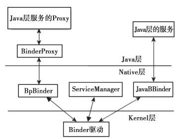

# 2.2.4　Java层Binder架构总结

图2-4展示了Java层的Binder架构。由图2-4可知：

图2-4 Java层Binder架构对于代表客户端的BinderProxy来说，Java层的BinderProxy在Native层对应一个BpBinder对象。凡是从Java层发出的请求，首先从Java层的BinderProxy传递到Native层的BpBinder，继而由BpBinder将请求发送到Binder驱动。

对于代表服务端的Service来说，Java层的Binder在Native层有一个JavaBBinder对象。前面介绍过，所有Java层的Binder在Native层都对应为JavaBBinder，而JavaBBinder仅起到中转作用，即把来自客户端的请求从Native层传递到Java层。

系统中依然只有一个Native的ServiceM anager。

至此，Java层的Binder架构已介绍完毕。从前面的分析可以看出，Java层的Binder非常依赖Native层的Binder。建议想进一步了解Binder的读者阅读卷I的“第6章深入理解Binder”。
