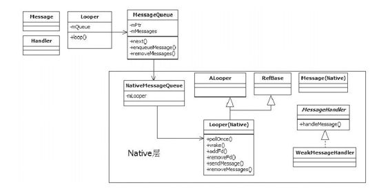

# 2.3.4　MessageQueue总结

想不到，一个小小的MessageQueue竟然有如此多的内容。在即将出版的“卷Ⅲ”中分析Android输入系统时，我们会再次在Native层与M essageQueue碰面，这里仅是为后面的相会打下一定的基础。

现在，我们将站在一个比具体代码更高的层次来认识一下MessageQueue和它的“伙伴们”。

1.消息处理的大家族合照MessageQueue只是消息处理大家族中的一员，该家族的成员“合照”如图2-5所示。

结合前述内容可从图2-5中得到：

图2-5消息处理的家族“合照”Java层提供了Looper类和M essageQueue类，其中Looper类提供循环处理消息的机制，MessageQueue类提供一个消息队列，以及插入、删除和提取消息的函数接口。另外，Handler也是在Java层常用的与消息处理相关的类。

MessageQueue内部通过mPtr变量保存一个Native层的NativeM essageQueue对象，m M essages保存来自Java层的M essage消息。

NativeM essageQueue保存一个native的Looper对象，该Looper从ALooper派生，提供po Once和addFd等函数。

Java层有M essage类和Handler类，而Native层对应也有M essage类和M essage-Handler抽象类。在编码时，一般使用的是M essageHandler的派生类W eakM essage-Handler类。

注意在include/m edia/stagfright/foundation目录下也定义了一个ALooper类，它是供stagefright使用的类似Java消息循环的一套基础类。这种同名类的产生，估计是两个事先未做交流的Team中的人写的。

2.M essageQueue处理流程总结M essageQueue核心逻辑下移到Native层后，极大地拓展了消息处理的范围，总结一下有以下几点：

M essageQueue继续支持来自Java层的Message消息，也就是早期的Message加Handler的处理方式。

M essageQueue在Native层的代表NativeM essageQueue支持来自Native层的M essage，是通过Native的M essage和M essageHandler来处理的。

NativeM essageQueue还处理通过addFd添加的Request。在后面分析输入系统时，还会大量碰到这种方式。

从处理逻辑上看，先是处理Native的M essage，然后是处理Native的Request，最后才是处理Java的Message。

对Java程序员来说，以前单纯的MessageQueue开始变得复杂。有同事经常与笔者讨论，CPU并不是很忙，为什么sendMessage的消息很久后才执行？是的，对于只了解M essageQueue Java层的工作人员，这个问题是没办法回答的。因为M essageQueue在Native层的“兄弟”NativeM essageQueue可能正在处理一个Native层的M essage，而Java的调用堆栈信息又不能打印Native层的活动。所以，笔者担心，如果Java程序员只沉迷于Java语言的话，可能不能真正理解MessageQueue了。
