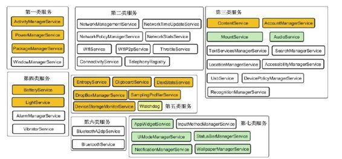

# 3.2.2　Service群英会


init1函数较简单，其实重点内容都在init2函数中。init2函数的实现代码如下：

[--＞System Server.java：init2]

```java
publi c stati c fi nal void init 2(){
Thread thr=new ServerThread();
thr.setName
("android.server.ServerThread");
```

thr.start（）；//启动一个线程，这个线程就像英雄大会一样，聚集了各路英雄

```
}
```

上面的代码将创建一个新的线程ServerThread，该线程的run函数的实现代码有600多行，如此之长的原因是，Android平台中众多Service都汇集于此。下面我们先来看Service的集体亮相，如图3-1所示。



图3-1 Service群英会图3-1中共有7大类43个Service（包括W atchdog）。实际上，还有一些Service并没有在ServerThread的run函数中露面，后面遇到时再做介绍。图3-1中的7大类服务主要包括：

位于第一大类的是Android的核心服务，如ActivityM anagerService、W indowM anager-Service等。

位于第二大类的是和通信相关的服务，如Wifi相关服务、Telephone相关服务。

位于第三大类的是和系统功能相关的服务，如AudioService、M ountService、Usb-Service等。

位于第四大类的是Ba eryService、VibratorService等服务。

位于第五大类的是EntropyService、DiskStatsService、W atchdog等相对独立的服务。

位于第六大类的是蓝牙服务。

位于第七大类的是和UI紧密相关的服务，如状态栏服务、通知管理服务等。

注意以上服务的分类并非官方标准，仅是笔者个人之见。

本章将分析其中的第五类服务。该类中的Service之间关系简单，而且功能相对独立。第五大类服务包括：

EntropyService，熵服务，它和随机数的生成有关。

ClipboardService，剪贴板服务。

DropBoxM anagerService，该服务和系统运行时日志的存储与管理有关。

DiskStatsService和DeviceStorageM onitorService，这两个服务用于查看和监测系统存储空间。

Sam plingProfil erService，这个服务是Android4.0新增的，功能非常简单。

W atchdog，即看门狗，是Android的“老员工”了。我们在卷I第4章“深入理解Zygote”中曾分析过它。Android 2.3以后其内存检测功能被去掉，所以与Android2.2相比，显得更简单了。关于Watchdog的内容，就留给读者自己分析了。

后面，将逐次分析这第五类服务的其他几项服务。
