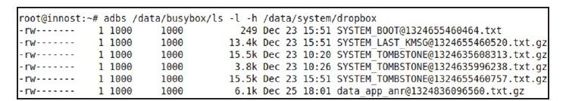

# 3.4.2　dropbox日志文件的添加


储空间。读者可自行分析这个函数。

要想理清一个Service，最好从它提供的服务开始进行分析。根据前面对DBMS的介绍可知，它提供了记录系统运行时日志信息的功能，所以这里先从dropbox日志文件的生成时说起。

当某个应用程序因为发生异常而崩溃(crash)时,ActivityM anagerService（AM S）的handleApplicationCrash函数被调用，其代码如下：

[--＞ActivityM anagerService.java：
handleApplicationCrash]

```java
publi c void handleAppli cati onCrash
(IBinder app,
Appli cati onErrorReport.CrashInfo
crashInfo){
ProcessRecord r=fi ndAppProcess
(app,"Crash");
……
//调用addErrorToDropBox函数,第一个参
数是一个字符串,为“crash”
addErrorToDropBox("crash",r, nu ,
nu , nu , nu , nu , crashInfo);
……
}
```

下面来看addErrorToDropBox函数，具体如下：

[--＞ActivityM anagerService.java：
addErrorToDropBox]

```java
publi c void addErrorToDropBox(String
eventType,
ProcessRecord process, Acti vit yRecord
acti vit y,
Acti vit yRecord parent, String
subject,
fi nal String report, fi nal Fil e
logFil e,
fi nal Appli cati onErrorReport.CrashInfo
crashInfo){
/*
dropbox日志文件的命名有一定的规则,其
前缀都是一个特定的tag(标签),
tag由两部分组成,合起来是“进程类型_事
件类型”。
下边代码中的processClass函数返回该进程
的类型,包括
“system_server”、“system_app”
和“data_app”3种。eventType用于指定事
件类型,目前也有3种类
型:“crash”、“wtf”
(what a terrible fail ure)和“anr”
*/
fi nal String dropboxTag=processClass
(process)+"_"+eventType;
//获取DBMS Bn端的对象DropBoxManager
fi nal DropBoxManager dbox=
(DropBoxManager)
mContext.getSystemService
(Context.DROPBOX_SERVICE);
/*
对于DBMS,不仅通过tag标识文件名,还可
以根据配置的情况,允许或禁止特定tag日
志
文件的记录。isTagEnable将判断DBMS是否
禁止该标签,如果该tag已被禁止,则不允
许记
录日志文件
*/
if(dbox==nu ||!dbox.isTagEnabled
(dropboxTag))return;
//创建一个StringBuil der,用于保存日志
信息
fi nal StringBuil der sb=new
StringBuil der(1024);
appendDropBoxProcessHeaders(process,
sb);
```

……//将信息保存到字符串sb中

```
//单独启动一个线程用于向DBMS添加信息
Thread worker=new Thread("Error
dump:"+dropboxTag){
@Override
publi c void run(){
if(report!=nu){
sb.append(report);
}
if(logFil e!=nu){
```

try{//如果有log文件，那么把log文件内容读到sb中

```
sb.append(Fil eUtil s.readTextFil e
(logFil e,
128*1024,"\n\n[[ TRUNCATED]] "));
}……
}
//读取crashInfo信息,一般记录的是调用
堆栈信息
if(crashInfo!=nu&&
crashInfo.stackTrace!=nu){
sb.append(crashInfo.stackTrace);
}
String
setti ng=Setti ngs.Secure.ERROR_LOGCAT_P
REFIX+dropboxTag;
//查询Settings数据库,判断该tag类型的
日志是否对所记录的信息有行数限制,例如
某
```

些tag的日志文件只准记录1000行的信息

```
int li nes=Setti ngs.Secure.getInt
(mContext.getContentResolver(),
setti ng,0);
if(lines>0){
sb.append("\n");
InputStreamReader input=nu;
try{
//创建一个新进程以运行logcat,后面的参
数都是logcat常用的参数
java.lang.Process logcat=new
ProcessBuil der("/system/bin/logcat",
"-v","ti me","-b","events","-
b","system","-b",
"main","-t",String.valueOf
(li nes))
.redirectErrorStream(true).start
();
//由于新进程的输出已经重定向,因此这里
可以获取最后lines行的信息,不熟悉
```

ProcessBuidler的读者可以查看SDK中关于它的用法说明

```
……
}
//调用DBMS的addText
dbox.addText(dropboxTag, sb.toString
());
}
};
if
(process==nu ||process.pid==MY_PID)
{
```

worker.run（）；//如果是SystemServer进程崩溃了，则不能在别的线程执行

```
}else{
worker.start();
}
```

由上面代码可知，addErrorToDropBox在生成日志的内容上花了不少工夫，因为这些是最重要的，最后仅调用addText函数便将内容传给DBMS的功能。

addText函数定义在DropBoxM anager类中，代码如下：

[--＞DropBoxM anager.java：addText]

```java
publi c void addText(String tag,
String data){
/*
mService和DBMS交互。DBMS对外只提供一个
add函数用于日志添加,而DBM提供了3个函
数,
分别是addText、addData、addFil e,以方
便使用
*/
try{mService.add(new Entry(tag,0,
data));}……
}
```

DBM向DBMS传递的数据被封装在一个Entry中。下面来看DBMS的add函数，其代码如下：

[--＞DropBoxM anagerService.java：
add]

```java
publi c void add(DropBoxManager.Entry
entry){
Fil e temp=nu;
OutputStream output=nu;
fi nal String tag=entry.getTag();//
```

先取出这个Entry的tag

```
try{
int fl ags=entry.getFlags();
……
//做一些初始化工作,包括生成dropbox目
录、统计当前已有的dropbox文件信息等
init();
if(!isTagEnabled(tag))return;//
```

如果该tag被禁止，则不能生成日志文件

```
long max=trimToFit();
long lastTrim=System.currentTimeMilli s
();
//BlockSize一般是4KB
byte[] bu er=new byte[mBlockSize];
//从Entry中得到一个输入流。与JavaI/O
相关的类比较多,且用法非常灵活,建议读
者阅
```

读《Java编程思想》中“JavaI/O系统”一章

```
InputStream input=entry.getInputStream
();
……
int read=0;
whil e(read<bu er.length){
int n=input.read(bu er, read,
bu er.length-read);
if(n<=0)break;
read+=n;
}
//先生成一个临时文件,命名方式为“drop
线程id.tmp”
temp=new Fil e(mDropBoxDir,"drop"+
Thread.currentThread().getId()
+".tmp");
int bu erSize=mBlockSize;
if(bu erSize>4096)
bu erSize=4096;
if(bu erSize<512)bu erSize=512;
Fil eOutputStream foutput=new
Fil eOutputStream(temp);
output=new Bu eredOutputStream
(foutput, bu erSize);
//生成GZIP压缩文件
if(read==bu er.length&&
((fl ags&DropBoxManager.IS_GZIPPED)
==0)){
output=new GZIPOutputStream
(output);
fl ags=fl ags|DropBoxManager.IS_GZIPPED
;
}
/*
DBMS很珍惜/data分区,若所生成文件的
size大于一个BlockSize,
则一定要先压缩
*/
```

……//写文件，这段代码非常烦琐，其主要目的是尽量节省存储空间

```
/*
生成一个EntryFile对象,并保存到DBMS内
部的一个数据容器中。
DBMS除了负责生成文件外,还提供查询的功
能,这个功能由getNextEntry完成。
另外,刚才生成的临时文件在createEntry
函数中会重命为带标签的名字,
读者可自行分析createEntry函数
*/
long ti me=createEntry(temp, tag,
fl ags);
temp=nu;
Intent dropboxIntent=new
Intent
(DropBoxManager.ACTION_DROPBOX_ENTRY_
ADDED);
dropboxIntent.putExtra
(DropBoxManager.EXTRA_TAG, tag);
dropboxIntent.putExtra
(DropBoxManager.EXTRA_TIME, ti me);
if(!mBooted){
dropboxIntent.addFlags
(Intent.FLAG_RECEIVER_REGISTERED_ONLY
);
}
//发送DROPBOX_ENTRY_ADDED广播。系统中
目前还没有程序接收该广播
mContext.sendBroadcast
(dropboxIntent,
android.Manif est.permission.READ_LOGS
);
}……
}
```

上面代码中略去了DBMS写文件的部分，我们从代码注释中可获悉，DBMS非常珍惜/data分区的空间，需要考虑每一个日志文件的压缩以节省存储空间。如果说细节体现功力，那么这正是一个极好的例证。

一个真实设备上/data/system /dropbox目录中的内容如图3-2所示。



图3-2真实设备中dropbox目录中的内容图3-2中最后一项data_app_anr@ 1324836096560.txt.gz的大小是6.1KB，该文件解压后得到的文件大小是42KB。看来，压缩确实节省了不少存储空间。

另外，我们从图3-2中还发现了其他不同的tag，如SYSTEM _BOOT、SYSTEM_TOMBSTONE等，这些都是由BootReceiver在收到BOOT_COM PLETE广播后收集相关信息并传递给DBMS而生成的日志文件。
