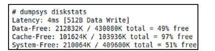

# 3.5.1　DiskStatsService分析


DiskStatsService代码非常简单，不过也有一个很有意思的地方，例如：

[--＞D iskStatsService.java]

publi c class DiskStatsService extendsBinderDiskStatsService从Binder派生，却没有实现任何接口，也就是说，DiskStatsService没有任何业务函数可供调用。为什么系统会存在这样的服务呢？

为了解释这个问题，有必要先介绍系统中一个很重要的命令—dumpsys。正如其名，这个命令用于打印系统中指定服务的信息，其实现代码如下：

[--＞dum psys.cpp：m ain]

```cpp
int main(int argc, char*const
argv[])
{
//先获取与ServiceManager进程通信的
BpServiceManager对象
sp<IServiceManager>
sm=default ServiceManager();
ffl ush(stdout);
Vector<String16>services;
Vector<String16>args;
```

if（argc==1）{//如果输入参数个数为1，则先查询在SM中注册的所有Service

```
services=sm->li stServices();
//将Service排序
services.sort(sort_func);
args.add(String16("-a"));
}else{
//指定查询某个Service
services.add(String16(argv[1]));
//保存剩余参数,以后可以传给Service的
dump函数
for(int i=2;i<argc;i++){
args.add(String16(argv[i]));
}
const size_t N=services.size();
……
for(size_t i=0;i<N;i++){
sp<IBinder>service=sm->checkService
(services[i]);
……
//通过Binder调用该Service的dump函数,
```

将args也传给dump函数

```
int err=service->dump(STDOUT_FILENO,
args);
……
}
return 0;
}
```

从上面代码可知，dumpsys通过Binder调用某个Service的dump函数。那么“dum psys diskstats”的输出会是什么呢？马上来试试，结果如图3-3所示。



图3-3 dum psysdiskstats的结果图示图3-3说明了执行“dum psys diskstats”打印了系统中内部存储设备的使用情况。

dumpsys是工作中常用的命令，建议读者掌握它的用法。

再来看DiskStatsService的dum p函数，其实现代码如下：

[--＞DiskStatsService.java：dum p]

```java
protected void dump(Fil eDescriptor
fd, PrintWrit er pw, String[] args){
byte[] junk=new byte[512];
for(int i=0;i<junk.length;i++)
junk[i]=(byte)i;
//输出/data/system/perft est.tmp文件信
息,输出后即删除该文件
//目前还不清楚这个文件由谁生成。从名字
上看应该和性能测试有关
Fil e tmp=new Fil e
(Environment.getDataDirectory(),
"system/perft est.tmp");
Fil eOutputStream fos=nu;
IOExcepti on error=nu;
long before=SystemClock.upti meMilli s
();
try{
fos=new Fil eOutputStream(tmp);
fos.writ e(junk);
}……
long aft er=SystemClock.upti meMilli s
();
if(tmp.exists())tmp.delete();
if(error!=nu){
……
}else{
pw.print("Latency:");
pw.print(aft er-before);
pw.printl n("ms[512B Data Writ e]");
}
//打印内部存储设备各个分区的信息
reportFreeSpace
(Environment.getDataDirectory
(),"Data",pw);
reportFreeSpace
(Environment.getDownloadCacheDirector
y(),"Cache",pw);
reportFreeSpace(new Fil e
("/system"),"System",pw);
//有些厂商还会将/proc/yas信息打印出
来
}
```

从前述代码中可发现，DiskStatsService没有实现任何业务接口，似乎只是为了调试而存在。所以笔者认为，DiskStatsService的功能完全可以被整合到后面即将介绍的Device-StorageM anagerService类中。总之，本节最重要的就是dumpsys这个命令了，读者一定要掌握它的用法。
