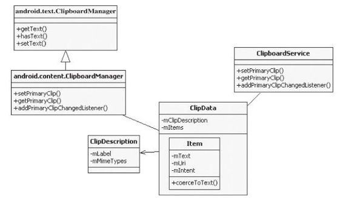

# 3.7　ClipboardService分析

ClipboardService(CBS)是Android系统中的元老级服务了，自Android1.0起就支持剪贴功能。在Android4.0中再遇见它时，此功能已有了长足改进。先来看和剪贴功能有关的类的家族图谱，如图3-4所示。

由图3-4可知：

在Android 4.0中，源码中的content.ClipboardM anager类继承自text.ClipboardM anager类。从text.ClipboardM anager类的命名中也可看出，早期的剪贴功能只支持文本。

ClipboardManager由剪贴板服务的客户端使用，在SDK中有相应文档说明。

新增一个ClipData类，它就像一个容器，管理存储在其中的数据信息。具体的数据信息存储在ClipData的成员变量mItems中。该变量是一个Item类型的数组，每一个Item代表一项数据。

ClipDescription类用来描述一个ClipData中的数据类型。目前，Android系统中的剪图3-4和剪贴功能有关的类贴板支持3种类型的数据（Text、Intent，下边我们通过一个例子来分析CBS。该例子以及URL列表）。

来源于AndroidSDK提供的一段示例代码剪贴板的服务端由ClipboardService实现。

(取自SDK安装目录/sam ple/android-14/NotePad）。
