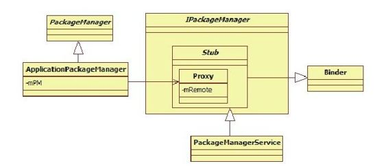

# 4.1　概述


PackageM anagerService是本书分析的第一个核心服务，也是Android系统中最常用的服务之一。它负责系统中Package的管理，应用程序的安装、卸载、信息查询等。

图4-1展示了PackageM anagerService及客户端的类家族。



图4-1 PackageM anagerService及客户端类家族由图4-1可知：

IPackageManager接口类中定义了服务端和客户端通信的业务函数，还定义了内部类Stub，该类从Binder派生并实现了IPackageM anager接口。

PackageM anagerService继承自IPackageM anager.Stub类，由于Stub类从Binder派生，因此PackageM anagerService将作为服务端参与Binder通信。

Stub类中定义了一个内部类Proxy，该类有一个IBinder类型（实际类型为BinderProxy）的成员变量m Rem ote，根据第2章介绍的Binder系统的知识，mRemote用于和服务端PackageM anagerService通信。

IPackageManager接口类中定义了许多业务函数，但是出于安全等方面的考虑，Android对外（即SDK）提供的只是一个子集，该子集被封装在抽象类PackageM anager中。客户端一般通过Context的getPackageM anager函数返回一个类型为PackageM anager的对象，该对象的实际类型是PackageM anager的子类ApplicationPackageM anager。这种基于接口编程的方式，虽然极大降低了模块之间的耦合性，却给代码分析带来了不小的麻烦。

ApplicationPackageM anager类继承自PackageM anager类。它并没有直接参与Binder通信，而是通过mPM成员变量指向一个IPackageM anager.Stub.Proxy类型的对象。

提示读者在源码中可能找不到IPackageM anager.java文件。该文件在编译过程中是IPackage-M anager.aidl经aidl工具处理后得到的，最终的文件位于Android源码/out/target/com m on/obj/JAVA_LIBRARIES/fram ew ork_interm ediates/src/core/java/android/content/pm /目录中。如果读者没有整体编译过源码，也可使用aidl工具单独处理IPackageM anager.aidl。

aidl工具生成的结果文件有着相似的代码结构。读者不妨看看下面这个笔者通过编译生成的IPackageM anager.java文件。注意，aidl工具生成的结果文件没有格式缩进，所以看起来困难，读者可用Eclipse中的源文件格式化命令处理它。

[--＞IPackageM anager.java]

```java
publi c interface IPackageManager
extends android.os.IInterface{
//定义内部类Stub,派生自Binder,实现
IPackageManager接口
publi c stati c abstract class Stub
extends android.os.Binder
implements
android.content.pm.IPackageManager{
private stati c fi nal java.lang.String
DESCRIPTOR=
"android.content.pm.IPackageManager";
publi c Stub(){
this.a achInterface(this,
DESCRIPTOR);
}
……
//定义Stub的内部类Proxy,实现
IPackageManager接口
private stati c class Proxy implements
android.content.pm.IPackageManager{
//通过mRemote变量和服务端交互
private android.os.IBinder mRemote;
Proxy(android.os.IBinder remote){
mRemote=remote;
}
……
}
……
}
```

接下来分析PackageM anagerService，为书写方便，以后将其简称为PKMS。
