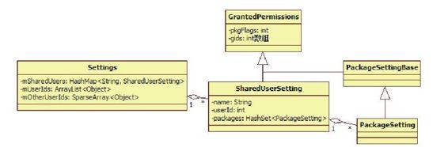
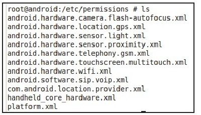
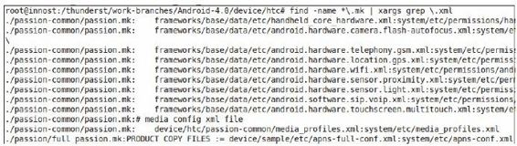
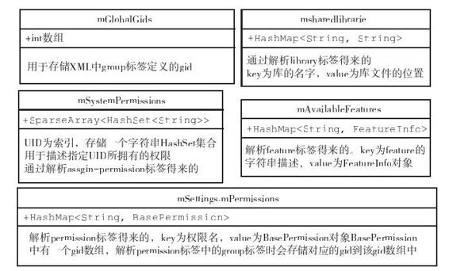

# 4.3.1　构造函数分析之前期准备工作


下面开始分析构造函数第一阶段的工作，先看如下所示的代码。

[--＞PackageM anagerService.java：构造

函数]

```
publi c PackageManagerService(Context
context, boolean factoryTest,
boolean onlyCore){
……
if(mSdkVersion<=0){
/*
mSdkVersion是PKMS的成员变量,定义的时
候进行赋值,其值取自系统属性
ro.buil d.version.sdk,即编译的SDK版
本。如果没有定义,则APK
就无法知道自己运行在Android哪个版本上
*/
Slog.w(TAG,"****ro.buil d.version.sdk
```

notset！"）；//打印一句警告

```
}
mContext=context;
```

mFactoryTest=factoryTest；//假定为false，即运行在非工厂模式下

```
mOnlyCore=onlyCore;//假定为false,即
```

运行在普通模式下

```
//如果此系统是eng版,则扫描Package后,
```

不对package做dex优化

```
mNoDexOpt="eng".equals
(SystemProperti es.get
("ro.buil d.type"));
//mMetrics用于存储与显示屏相关的一些属
性,例如屏幕的宽/高尺寸,分辨率等信息
mMetrics=new DisplayMetrics();
//Setti ngs是一个非常重要的类,该类用于
存储系统运行过程中的一些设置,
//下面进行详细分析
mSetti ngs=new Setti ngs();
//①addSharedUserLPw是什么?马上来分析
mSetti ngs.addSharedUserLPw
("android.uid.system",
Process.SYSTEM_UID,
Appli cati onInfo.FLAG_SYSTEM);
mSetti ngs.addSharedUserLPw
("android.uid.phone",
```

MULTIPLE_APPLICATION_UIDS//该变量的默认值是true

```
?RADIO_UID:FIRST_APPLICATION_UID,
Appli cati onInfo.FLAG_SYSTEM);
mSetti ngs.addSharedUserLPw
("android.uid.log",
MULTIPLE_APPLICATION_UIDS
?LOG_UID:FIRST_APPLICATION_UID,
Appli cati onInfo.FLAG_SYSTEM);
mSetti ngs.addSharedUserLPw
("android.uid.nfc",
MULTIPLE_APPLICATION_UIDS
?NFC_UID:FIRST_APPLICATION_UID,
Appli cati onInfo.FLAG_SYSTEM);
```

……//第一段结束刚进入构造函数，就会遇到第一个较为复杂的数据结构Setti ng及它的addShared-User-LPw函数。Setting的作用是管理Android系统运行过程中的一些设置信息。

到底是哪些信息呢？来看下面的分析。

1.初识Setti ngs先分析addSharedUserLPw函数。此处截取该函数的调用代码，如下所示：

```
mSetti ngs.addSharedUserLPw
("android.uid.system",//字符串
```

Process.SYSTEM_UID，//系统进程使用的用户id，值为1000Appli cati onInfo.FLAG_SYSTEM//标志系统

```
Package
);
```

以此处的函数调用为例，我们为addSharedUserLPw传递了3个参数：第一个是字符串"android.uid.system "；第二个是SYSTEM_UID，其值为1000；第三个是FLAG_SYSTEM标志，用于标识系统Package。

在进入对addSharedUserLPw函数的分析前，先介绍一下SYSTEM_UID及相关知识。

（1）Android系统中UID/GID介绍UID为用户ID的缩写，GID为用户组ID的缩写，这两个概念均与Linux系统中进程的权限管理有关。一般说来，每一个进程都会有一个对应的UID（即表示该进程属于哪个用户，不同用户有不同权限）。一个进程也可分属不同的用户组（每个用户组都有对应的权限）。

提示Linux的UID/GID还可细分为几种类型，此处我们仅考虑普适意义的UID/GID。

如上所述，UID/GID和进程的权限有关。在Android平台中，系统定义的UID/GID在Process.java文件中，如下所示：

[--＞Process.java]

```java
//系统进程使用的UID/GID,值为1000
publi c stati c fi nal int
SYSTEM_UID=1000;
//Phone进程使用的UID/GID,值为1001
publi c stati c fi nal int
PHONE_UID=1001;
//she进程使用的UID/GID,值为2000
publi c stati c fi nal int
SHELL_UID=2000;
//使用LOG的进程所在的组的UID/GID为1007
publi c stati c fi nal int LOG_UID=1007;
//供WIF相关进程使用的UID/GID为1010
publi c stati c fi nal int
WIFI_UID=1010;
//mediaserver进程使用的UID/GID为1013
publi c stati c fi nal int
MEDIA_UID=1013;
//设置能读写SD卡的进程的GID为1015
publi c stati c fi nal int
SDCARD_RW_GID=1015;
//NFC相关的进程的UID/GID为1025
publi c stati c fi nal int NFC_UID=1025;
//有权限读写内部存储的进程的GID为1023
publi c stati c fi nal int
MEDIA_RW_GID=1023;
//第一个应用Package的起始UID为10000
publi c stati c fi nal int
FIRST_APPLICATION_UID=10000;
//系统所支持的最大的应用Package的UID为
99999
publi c stati c fi nal int
LAST_APPLICATION_UID=99999;
//和蓝牙相关的进程的GID为2000
publi c stati c fi nal int
BLUETOOTH_GID=2000;
```

对不同的UID/GID授予不同的权限，接下来介绍和权限设置相关的代码。

提示读者可用adbshe登录到自己的手机，然后用busybox提供的ps命令查看进程的uid。

下面分析addSharedUserLPw函数，代码如下：

[--＞Setti ngs.java：addSharedUserLPw]

```java
SharedUserSetti ng addSharedUserLPw
(String name, int uid, int pkgFlags)
{
/*
注意这里的参数:name为字符串
android.uid.system, uid为1000,
pkgFlags为
Appli cati onInfo.FLAG_SYSETM(以后简写
为FLAG_SYSTEM)
*/
//mSharedUsers是一个HashMap, key为字符
串,值为SharedUserSetti ng对象
SharedUserSetti ng s=mSharedUsers.get
(name);
if(s!=nu){
if(s.userId==uid){
return s;
}……
return nu;
}
//创建一个新的SharedUserSetti ng对象,
```

并设置的userId为uid，

```
//SharedUserSetti ng是什么?有什么作
用?
s=new SharedUserSetti ng(name,
pkgFlags);
s.userId=uid;
if(addUserIdLPw(uid, s,name)){
mSharedUsers.put(name, s);//将name
```

与s键值对添加到mSharedUsers中保存

```
return s;
}
return nu;
}
```

从以上代码可知，Settings中有一个mSharedUsers成员，该成员存储的是字符串与SharedUserSetti ng键值对，也就是说以字符串为key得到对应的SharedUserSetti ng对象。

那么SharedUserSetti ng是什么？它的目的是什么？来看一个例子。

（2）SharedUserSetti ng分析该例子来源于SystemUI的AndroidM anifest.xm l，如下所示：

[--＞System UI的AndroidM anifest.xm l]

```
<manif est xmlns:
android="h p://schemas.android.com/a
pk/res/android"
package="com.android.systemui"
coreApp="true"
android:
sharedUserId="android.uid.system"
android:process="system">
……
```

在xml中，声明了一个名为android：

sharedUserId的属性，其值为"android.uid.system "。sharedUserId和UID有关，它有两个作用：

两个或多个声明了同一种sharedUserId的APK可共享彼此的数据，并且可运行在同一进程中。

更重要的是，通过声明特定的sharedUserId，该APK所在进程将被赋予指定的UID。例如，本例中的SystemUI声明了system的uid，运行SystemUI的进程就可享有system用户所对应的权限（实际上就是将该进程的uid设置为system的uid）了。

提示除了在AndroidM anifest.xm l中声明sharedUserId外，APK在编译时还必须使用对应的证书进行签名。例如本例的SystemUI，在其Android.mk中需要额外声

```
明LOCAL_CERTIFICATE:=platform,如
```

此，才可获得指定的UID。

通过以上介绍读者能知道，如何组织一种数据结构来包括上面的内容。此处有3个关键点需注意：

XM L中sharedUserId属性指定了一个字符串，它是UID的字符串描述，故对应数据结构中也应该有这样一个字符串，这样就把代码和XML中的属性联系起来了。

在Linux系统中，真正的uid是一个整数，所以该数据结构中必然有一个整型变量。

多个Package可声明同一个sharedUserId，因此该数据结构必然会保存那些声明了相同sharedUserId的Package的某些信息。

了解了上面3个关键点后，再来看Android是如何设计相应数据结构的，其中ShareUser-Setti ng类的关系如图4-2所示。



图4-2 SharedUserSetti ng类的关系图由图4-2可知：

Setti ngs类定义了一个m SharedUsers成员，它是一个HashMap，以字符串（如android.uid.system）为key，对应的Value是一个SharedUserSetti ng对象。

SharedUserSetti ng派生自GrantedPerm issions类，从GrantedPerm issions类的命名可知，它和权限有关。SharedUserSetti ng定义了一个成员变量packages，类型为HashSet，用于保存声明了相同sharedUserId的Package的权限设置信息。

每个Package有自己的权限设置。权限的概念由PackageSetting类表达。该类继承自Packagesetti ngBase，而PackageSetti ngBase又继承自GrantedPerm issions。

Settings中还有两个成员，一个是m UserIds，另一个是m OtherUserIds，这两位成员的类型分别是ArrayList和SparseArray。其目的是以UID为索引，得到对应的SharedUserSetti ngs对象。在一般情况下，以索引获取数组元素的速度，比以key获取HashMap中元素的速度要快很多。

提if示根据以上对mUserIds和mOtherUserIds的描述，可知这是典型的以空间换时间的做法。

下边来分析addUserIdLPw函数，它的功能就是将SharedUserSetti ngs对象保存到对应的数组中，代码如下：

[--＞Setti ngs.java：addUserLPw ]

```java
private boolean addUserIdLPw(int uid,
Object obj, Object name){
//uid不能超出限制。Android对uid进行了
分类,应用APK所在进程的uid从10000开
始,
//而系统APK所在进程的uid小于10000
(uid>
=PackageManagerService.FIRST_APPLICATI
ON_UID+
PackageManagerService.MAX_APPLICATION_
UIDS){
return false;
}
if(uid>
=PackageManagerService.FIRST_APPLICATI
ON_UID){
int N=mUserIds.size();
//计算索引,其值是uid和
FIRST_APPLICATION_UID的差
fi nal int index=uid-
PackageManagerService.FIRST_APPLICATIO
N_UID;
whil e(index>=N){
mUserIds.add(nu);
N++;
}
```

……//判断该索引位置的内容是否为空，为空才保存

```
mUserIds.set(index, obj);//mUserIds
```

保存应用Package的uid

```
}else{
……
mOtherUserIds.put(uid, obj);//系统
```

Package的uid由mOtherUserIds保存

```
}
return true;
}
```

至此，对Settings的分析就告一段落了。在这次“行程”中，我们重点分析了UID/GID以及SharedUserId方面的知识，并见识好几个重要的数据结构。希望读者通过SystemUI的实例能够理解这些数据结构存在的目的。

2.XML文件扫描下面继续分析PKMS的构造函数，代码如下：

[--＞PackageM angerService.java：构造

函数]……//接前一段

```
String separateProcesses=//该值和调试
```

有关。一般不设置该属性

```
SystemProperti es.get
("debug.separate_processes");
if(separateProcesses!=nu&&
separateProcesses.length()>0){
……
}else{
mDefParseFlags=0;
mSeparateProcesses=nu;
}
//创建一个Instaer对象,该对象和
Native进程insta d交互,以后分析
insta d
//时再来讨论它的作用
mInsta er=new Insta er();
```

WindowManager wm=//得到一个WindowManager对象

```
(WindowManager)
context.getSystemService
(Context.WINDOW_SERVICE);
Display d=wm.getDefault Display();
```

d.getMetrics（mMetrics）；//获取当前设备的显示屏信息

```
synchronized(mInsta Lock){
synchronized(mPackages){
//创建一个ThreadHandler对象,实际就是
创建一个带消息循环处理的线程,该线程
//的工作是:程序的安装和卸载等。以后分
析程序安装时会和它亲密接触
mHandlerThread.start();
//以ThreadHandler线程的消息循环
(Looper对象)为参数创建一个
PackageHandler,
//可知该Handler的handleMessage函数将运
行在此线程上
mHandler=new PackageHandler
(mHandlerThread.getLooper());
File
dataDir=Environment.getDataDirectory
();
//mAppDataDir指向/data/data目录
mAppDataDir=new Fil e
(dataDir,"data");
//mUserAppDataDir指向/data/user目录
mUserAppDataDir=new Fil e
(dataDir,"user");
//mDrmAppPrivateInsta Dir指
向/data/app-private目录
mDrmAppPrivateInsta Dir=new Fil e
(dataDir,"app-private");
/*
创建一个UserManager对象,目前没有什么
作用,但其前途将不可限量。
根据Google的设想,未来手机将支持多个
User,每个User将安装自己的应用,
该功能为Android智能手机推向企业用户打
下坚实基础
*/
mUserManager=new UserManager
(mInsta er, mUserAppDataDir);
//①从文件中读权限
readPermissions();
//②readLPw分析
mRestoredSetti ngs=mSetti ngs.readLPw
();
long
startTime=SystemClock.upti meMilli s
();
```

以上代码中创建了几个对象，此处暂可不去理会它们。另外，以上代码中还调用了两个函数，分别是readPerm ission和Settti ngs的readLPw，它们有什么作用呢？下面就展开分析。

（1）readPerm issions函数分析先来分析readPermissions函数，从其函数名可猜测到它和权限有关，代码如下：

[--＞PackageM anagerService.java：
readPerm issions]

```java
void readPermissions(){
//指向/system/etc/permission目录,该目
录中存储了和设备相关的一些权限信息
Fil e li braryDir=new Fil e
(Environment.getRootDirectory(),
"etc/permissions");
……
for(Fil e f:li braryDir.li stFil es
()){
//先处理该目录下的非platf orm.xml文件
if(f.getPath().endsWit h
("etc/permissions/platf orm.xml")){
conti nue;
}
```

……//调用readPermissionFromXml解析此XML文件

```
readPermissionsFromXml(f);
}
fi nal Fil e permFil e=new Fil e
(Environment.getRootDirectory(),
"etc/permissions/platf orm.xml");
//解析platform.xml文件,看来该文件优先
级最高
readPermissionsFromXml(permFil e);
}
```

悬着的心终于放了下来！readPermissions函数不就是调用readPerm issionFrom Xm l函数解析/system /etc/perm issions目录下的文件吗？这些文件似乎都是XML文件。该目录下都有哪些XML文件呢？这些XML文件中有些什么内容呢？来看一个实际的例子，如图4-3所示。

图4-3中列出的是笔者G7手机上/system /etc/perm issions目录下的内容。在上面的代码中，虽然最后才解析到platform.xml文件，但是此处先分析该文件的内容具体如下：



图4-3/system /etc/perm issions目录下的内容

[--＞platform .xm l]

＜permissions＞＜！--建立权限名与gid的映射关系。如下面声明的BLUTOOTH_ADMIN权限，它对应的用户组是net_bt_admin。注意，该文件中的permission标签只对那些需要通过读写设备(蓝牙/camera)/创建socket等进程划分了gid。因为这些权限涉及和Linux内核交互，所以需要在底层权限（由不同的用户组界定）和Android层权限（由不同的字符串界定）之间建立映射关系--＞

```xml
<permission
name="android.permission.BLUETOOTH_ADM
IN">
<group gid="net_bt_admin"/>
</permission>
<permission
name="android.permission.BLUETOOTH">
<group gid="net_bt"/>
</permission>
……
<!--
```

赋予对应uid相应的权限。如果下面一行表示uid为she，那么就赋予它SEND_SMS的权限，其实就是把它加到对应的用户组中--＞

```
<assign-permission
name="android.permission.SEND_SMS"uid=
"she "/>
<assign-permission
name="android.permission.CALL_PHONE"ui
d="she "/>
<assign-permission
name="android.permission.READ_CONTACTS
"uid="she "/>
<assign-permission
name="android.permission.WRITE_CONTACT
S"uid="she "/>
<assign-permission
name="android.permission.READ_CALENDAR
"uid="she "/>
……
```

＜！--系统提供的Java库，应用程序运行时候必须要链接这些库，该工作由系统自动完成--＞

```
<li brary name="android.test.runner"
fil e="/system/frameworks/android.test.
runner.jar"/>
<li brary name="javax.obex"
fil e="/system/frameworks/j avax.obex.j
ar"/>
```

platform.xml文件中主要使用了如下4个标签：

perm ission和group用于建立Linux层gid和Android层pemission之间的映射关系。

assign-perm ission用于向指定的uid赋予相应的权限。这个权限由Android定义，用字符串表示。

library用于指定系统库。当应用程序运行时，系统会自动为这些进程加载这些库。

了解了platform.xml后，再看其他的XML文件，这里以handheld-core-hardware.xm l为例进行介绍，其内容如下：

[~>handheld-core-hardware.xml]这个XML文件包含了许多feature标签。根据该文件中的注释，这些feature标签用来描述一个手持终端（包括手机、平板电脑等）应该支持的硬件特性’例如支持camera、支持蓝牙等。

注意对于不同的硬件特性，还需要包含其他的XML文件。例如，要支持前置摄像头，还需要包含android.hardw are. cam era,front.xml文件。这些文件内容大体一样，都通过feature标签表明自己的硬件特性。

相关说明可参考handheld-core-hardware.xm l中的注释。

有读者可能会好奇，真实设备上/system /etc/perm ission目录中的文件是从哪里的呢？答案是，在编译阶段由不同硬件平台根据自己的配置信息复制相关文件到目标目录中得来的。

这里给出一个例子，如图4-4所示。



图4-4 /system /etc/perm ission目录中文件的来源由图4-4可知，当编译的设备目标为htc-passion时，就会将Android源码目录/fram ew orks/base/data/etc/下某些和该目标设备硬件特性匹配的XML文件复制到最终输出目录/system /etc/perm issions下。编译完成后，将生成system镜像。把该镜像文件烧到手机中，就成了目标设备使用的情况了。

注意Android4.0源码中并没有与htc相关的文件，这是笔者从Android2.3源码中移植过去的。读者可参考笔者一篇关于如何移植Android 4.0到G7的博文，地址为h p：//blog.csdn.net/innost/article/details/6977167。

了解了与XML相关的知识后，再来分析readPerm issionFrom Xm l函数。相信读者已经知道它的作用了，就是将XML文件中的标签以及它们之间的关系转换成代码中的相应数据结构，代码如下：

[--＞PackageM anagerService.java：
readPerm issionsFrom Xm l]

```java
private void readPermissionsFromXml
(Fil e permFil e){
Fil eReader permReader=nu;
try{
permReader=new Fil eReader
(permFil e);
}……
try{
XmlPu Parser parser=Xml.newPu Parser
();
parser.setInput(permReader);
XmlUtil s.beginDocument
(parser,"permissions");
whil e(true){
String name=parser.getName();
//解析group标签,前面介绍的XML文件中没
有单独使用该标签的地方
if("group".equals(name)){
String gidStr=parser.getA ributeValue
(nu,"gid");
if(gidStr!=nu){
int gid=Integer.parseInt(gidStr);
//转换XML中的gid字符串为整型,并保存到
mGlobalGids中
mGlobalGids=appendInt(mGlobalGids,
gid);
}……
}else if("permission".equals
```

（name））{//解析permission标签

```
String perm=parser.getA ributeValue
(nu,"name");
……
perm=perm.intern();
//调用readPermission处理
readPermission(parser, perm);
//下面解析的是assign-permission标签
}else if("assign-permission".equals
(name)){
String perm=parser.getA ributeValue
(nu,"name");
……
String uidStr=parser.getA ributeValue
(nu,"uid");
……
//如果是assign-permission,则取出uid字
符串,然后获得Linux平台上
//的整型uid值
int uid=Process.getUidForName
(uidStr);
……
perm=perm.intern();
//和assign相关的信息保存在
mSystemPermissions中
HashSet<String>
perms=mSystemPermissions.get(uid);
if(perms==nu){
perms=new HashSet<String>();
mSystemPermissions.put(uid, perms);
}
perms.add(perm);……
}else if("li brary".equals(name))
```

{//解析li brary标签

```
String lname=parser.getA ributeValue
(nu,"name");
String lfil e=parser.getA ributeValue
(nu,"fil e");
if(lname==nu){
……
}else if(lfil e==nu){
……
}else{
//将XML中的name和li brary属性值存储到
mSharedLibraries中
mSharedLibraries.put(lname, lfil e);
}……
}else if("feature".equals(name))
```

{//解析feature标签

```
String fname=parser.getA ributeValue
(nu,"name");
……{
//在XML中定义的feature由FeatureInfo表
达
FeatureInfo fi =new FeatureInfo();
fi .name=fname;
//存储feature名和对应的FeatureInfo到
mAvail ableFeatures中
mAvail ableFeatures.put(fname, fi);
}……
}
```

readPerm issions函数果然是将XM L中的标签转换成对应的数据结构。总结相关的数据结构，如图4-5所示，此处借用了UML类图。在每个类图中，首行是数据结构名，第二行是数据结构的类型，第三行是注释。

这里必须再次强调：图4-5中各种数据结构的目的是为了保存XML中各种标签及它们之间的关系。在分析过程中，最重要的是理解各种标签的作用，而不是它们所使用的数据结构。

（2）readLPw的“佐料”readLPw函数的功能也是解析文件，不过这些文件的内容却是在PKMS正常启动后生成的。这里仅介绍作为readLPw“佐料”的文件的信息。文件的具体位置在Settings构造函数中指明，其代码如下：



图4-5通过readPerm issions函数建立的数据结构及其关系

[--＞Setti ngs.java：Setti ngs]

```java
Setti ngs(){
File
dataDir=Environment.getDataDirectory
();
Fil e systemDir=new Fil e
(dataDir,"system");//指
```

向/data/system目录

```
systemDir.mkdirs();//创建该目录
……
/*
一共有5个文件,packages.xml和packages-
backup.xml为一组,用于描述系统中所安装
的
Package的信息,其中backup是临时文件。
PKMS先把数据写到backup中,信息都写成功
后再
改名成非backup的文件。其目的是防止在写
文件过程中出错,导致信息丢失。
packages-stopped.
xml和packages-stopped-backup.xml为一
组,用于描述系统中强制停止运行的
Pakcage的
信息,backup也是临时文件。如果此处存在
该临时文件,表明此前系统因为某种原因中
断了正常流
程。packages.list列出当前系统中应用级
(即UID大于10000)Package的信息
*/
mSetti ngsFil ename=new Fil e
(systemDir,"packages.xml");
mBackupSetti ngsFil ename=new Fil e
(systemDir,"packages-backup.xml");
mPackageListFil ename=new Fil e
(systemDir,"packages.li st");
mStoppedPackagesFil ename=new Fil e
(systemDir,"packages-
stopped.xml");
mBackupStoppedPackagesFil ename=new
Fil e(systemDir,
"packages-stopped-backup.xml");
}
```

上面5个文件共分为3组，这里简单介绍一下这些文件的来历（不考虑临时的backup文件）。

packages.xm l：PKM S扫描完目标文件夹后会创建该文件。当系统进行程序安装、卸载和更新等操作时，均会更新该文件。该文件保存了系统中与Package相关的一些信息。

packages.list：描述系统中存在的所有非系统自带的APK的信息。当这些程序有变动时，PKMS就会更新该文件。

packages-stopped.xm l：从系统自带的设置程序中进入应用程序页面，然后在选择强制停止（ForceStop）某个应用时，系统会将该应用的相关信息记录到此文件中。也就是该文件保存系统中被用户强制停止的Package的信息。

readLPw的函数功能就是解析其中的XML文件的内容，然后建立并更新对应的数据结构，例如停止的Package重启之后依然是stopped状态。

提示读者看完本章后，可自行分析该函数。在此之前，建议读者不必关注该函数。

3.第一阶段工作总结在继续征程前，先总结一下PKMS构造函数在第一阶段的工作，千言万语汇成一句话：

扫描并解析XML文件，将其中的信息保存到特定的数据结构中。

第一阶段扫描的XML文件与权限及上一次扫描得到的Package信息有关，它为PKMS下一阶段的工作提供了重要的参考信息。
