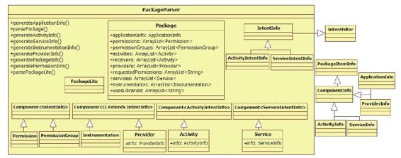
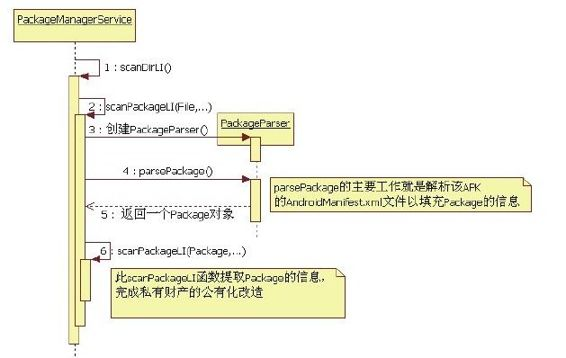
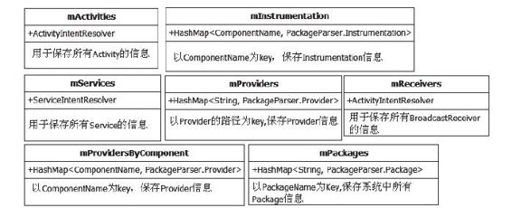

# 4.3.2　构造函数分析之扫描Package


PKMS构造函数第二阶段的工作就是扫描系统中的APK了。由于需要逐个扫描文件，因此手机上装的程序越多，PKMS的工作量就越大，系统启动速度也就越慢。

1.系统库的dex优化接着对PKMS构造函数进行分析，代码如下：

[--＞vPackageM anagerService.java]

```java
……
mRestoredSetti ngs=mSetti ngs.readLPw
```

（）；//接第一段的结尾

```
long
startTime=SystemClock.upti meMilli s
```

（）；//记录扫描开始的时间

```
//定义扫描参数
int
scanMode=SCAN_MONITOR|SCAN_NO_PATHS|SC
AN_DEFER_DEX;
if(mNoDexOpt){
```

scanMode|=SCAN_NO_DEX；//在控制扫描过程中是否对APK文件进行dex优化

```
}
fi nal HashSet<String>li bFil es=new
HashSet<String>();
//mFrameworkDir指向/system/frameworks
目录
mFrameworkDir=new Fil e
(Environment.getRootDirectory
(),"framework");
//mDalvikCacheDir指向/data/dalvik-
cache目录
mDalvikCacheDir=new Fil e
(dataDir,"dalvik-cache");
boolean didDexOpt=false;
/*
获取Java启动类库的路径,在init.rc文件
中通过BOOTCLASSPATH环境变量输出,该值
如下
/system/framework/core.jar:/system/fr
ameworks/core-junit .jar:
/system/frameworks/bouncycastl e.jar:/
system/frameworks/ext.jar:
/system/frameworks/framework.jar:/sys
tem/frameworks/android.poli cy.jar:
/system/frameworks/services.jar:/syst
em/frameworks/apache-xml.jar:
/system/frameworks/filt erfw.jar
该变量指明了framework所有核心库及文件
位置
*/
String
bootClassPath=System.getProperty
("java.boot.class.path");
if(bootClassPath!=nu){
String[] paths=split String
(bootClassPath,':');
for(int i=0;i<paths.length;i++){
```

try{//判断该Jar包是否需要重新做dex优化if

```
(dalvik.system.DexFil e.isDexOptNeeded
(paths[i])){
/*
将该Jar包文件路径保存到libFiles中,然
后通过mInsta对象发送
命令给insta d,让其对该Jar包进行dex优
化
*/
li bFil es.add(paths[i]);
mInsta er.dexopt(paths[i],
Process.SYSTEM_UID, true);
didDexOpt=true;
}
}……
}
}……
/*
还li记得mSharedLibrarires的作用吗?它保
存的是platform.xml中声明的系统库的信
息。
这里也要判断系统库是否需要做dex优化。
处理方式同上
*/
if(mSharedLibraries.size()>0){
……
}
//将framework-res.apk添加到li bFil es
```

中。framework-res.apk定义了系统常用的

```
//资源,还有几个重要的Activity,如长按
Power键后弹出的选择框
bFil es.add(mFrameworkDir.getPath
()+"/framework-res.apk");
//列举/system/frameworks目录中的文件
String[] frameworkFil es=mFrameworkDir.
li st();
if(frameworkFil es!=nu){
```

……//判断该目录下的APK或Jar文件是否需要做dex优化。处理方式同上

```
}/*
上面代码对系统库(BOOTCLASSPATH指定,
或platf orm.xml定义,或
/system/frameworks目录下的Jar包与APK文
件)进行一次仔细检查,该优化的一定要优
化。
如果发现期间对任何一个文件进行了优化,
则设置didDexOpt为true
*/
if(didDexOpt){
String[] fil es=mDalvikCacheDir.li st
();
if(fil es!=nu){
/*
如果前面对任意一个系统库重新做过dex优
化,就需要删除cache文件。原因和
dalvik虚拟机的运行机制有关。本书暂不探
讨dex及cache文件的作用。
从删除cache文件这个操作来看,这些cache
文件应该使用了dex优化后的系统库,
所以当系统库重新做dex优化后,就需要删
除旧的cache文件。可简单理解为缓存失效
*/
for(int i=0;i<fil es.length;i++){
String fn=fil es[i];
if(fn.startsWit h("data@app@")
||fn.startsWit h("data@app-
private@")){
(new Fil e(mDalvikCacheDir,
fn)).delete();
……
}
```

2.扫描系统Package清空cache文件后，PKMS终于进入重点段了。接下来看PKMS第二阶段工作的核心内容，即扫描Package，相关代码如下：

[--＞PackageM anagerService.java]

```java
//创建文件夹监控对象,监
```

视/system/frameworks目录。利用了Linux平台的inotif y机制

```
mFrameworkInsta Observer=new
AppDirObserver(
mFrameworkDir.getPath(),
OBSERVER_EVENTS, true);
mFrameworkInsta Observer.startWatchin
g();
/*
调用scanDirLI函数扫
描/system/frameworks目录,这个函数很重
要,稍后会再分析。
注意,在第三个参数中设置了SCAN_NO_DEX
标志,因为该目录下的package在前面的流
程
中已经过判断并根据需要做过dex优化了
*/
scanDirLI(mFrameworkDir,
PackageParser.PARSE_IS_SYSTEM
|PackageParser.PARSE_IS_SYSTEM_DIR,
scanMode|SCAN_NO_DEX,0);
//创建文件夹监控对象,监视/system/app
目录
mSystemAppDir=new Fil e
(Environment.getRootDirectory
(),"app");
mSystemInsta Observer=new
AppDirObserver(
mSystemAppDir.getPath(),
OBSERVER_EVENTS, true);
mSystemInsta Observer.startWatching
();
//扫描/system/app下的package
scanDirLI(mSystemAppDir,
PackageParser.PARSE_IS_SYSTEM
|PackageParser.PARSE_IS_SYSTEM_DIR,
scanMode,0);
//监视并扫描/vendor/app目录
mVendorAppDir=new Fil e
("/vendor/app");
mVendorInsta Observer=new
AppDirObserver(
mVendorAppDir.getPath(),
OBSERVER_EVENTS, true);
mVendorInsta Observer.startWatching
();
//扫描/vendor/app下的package
scanDirLI(mVendorAppDir,
PackageParser.PARSE_IS_SYSTEM
|PackageParser.PARSE_IS_SYSTEM_DIR,
scanMode,0);
//和insta d交互。以后单独分析insta d
mInsta er.moveFil es();
```

由以上代码可知，PKMS将扫描以下几个目录。

/system /fram eworks：该目录中的文件都是系统库，例如fram ework.jar、services.jar、fram ework-res.apk。不过scanDirLI只扫描APK文件，所以fram ework-res.apk是该目录中唯一“受宠”的文件。

/system/app：该目录下全是默认的系统应用，例如Browser.apk、Setti ngsProvider.apk等。

/vendor/app：该目录中的文件由厂商提供，即全是厂商特定的APK文件，目前市面上的厂商都把自己的应用放在/system/app目录下。

注意本书把这3个目录称为系统package目录，以区分后面的非系统package目录。

PKMS调用scanDirLI函数进行扫描，下面来分析此函数。

（1）scanDirLI函数分析sifcanDirLI函数的代码如下：

[--＞PackageM anagerService.java：
scanD irLI]

```java
private void scanDirLI(Fil e dir, int
fl ags, int scanMode, long
currentTime){
```

String[] fil es=dir.li st（）；//列举该目录下的文件

```
……
int i;
for(i=0;i<fil es.length;i++){
Fil e fil e=new Fil e(dir, fil es[i]);
(!isPackageFil ename(fil es[i])){
```

continue；//根据文件名后缀，判断是否为APK文件。这里只扫描APK文件

```
}/*
调用scanPackageLI函数扫描一个特定的文
件,返回值是PackageParser的内部类
Package,该类的实例代表一个APK文件,所
以它就是和APK文件对应的数据结构
*/
PackageParser.Package
pkg=scanPackageLI(fil e,
fl ags|PackageParser.PARSE_MUST_BE_APK,
scanMode, currentTime);
if(pkg==nu&&(fl ags&
PackageParser.PARSE_IS_SYSTEM)==0&&
mLastScanError==PackageManager.INSTALL
_FAILED_INVALID_APK){
//注意此处flags的作用,只有非系统
Package扫描失败,才会删除该文件
fil e.delete();
}
```

接着来分析scanPackageLI函数。PKM S中有两个同名的scanPackageLI函数，后面会一一见到。先来看第一个也是最先碰到的scanPackageLI函数。

（2）初会scanPackageLI函数首次相遇的scanPackageLI函数的代码如下：

[--＞PackageM anagerService.java：
scanPackageLI]

```java
private PackageParser.Package
scanPackageLI(Fil e scanFil e, int
parseFlags,
int scanMode, long currentTime)
{
mLastScanError=PackageManager.INSTALL_
SUCCEEDED;
String scanPath=scanFil e.getPath();
```

parseFlags|=mDefParseFlags；//默认的扫描标志，正常情况下其值为0

```
//创建一个PackageParser对象
PackageParser pp=new PackageParser
(scanPath);
pp.setSeparateProcesses
(mSeparateProcesses);//mSeparatePro
cesses为空
pp.setOnlyCoreApps
(mOnlyCore);//mOnlyCore为false
/*
调用PackageParser的parsePackage函数解
析APK文件。注意,这里把代表屏幕
信息的mMetrics对象也传了进去
*/
fi nal PackageParser.Package
pkg=pp.parsePackage(scanFil e,
scanPath, mMetrics, parseFlags);
……
PackageSetti ng ps=nu;
PackageSetti ng updatedPkg;
……
/*
这里略去一大段代码,主要是关于Package
升if级方面的工作。读者可能会比较好奇:既
然是
升级,一定有新旧之分,如果这里刚解析后
得到的Package信息是新的,那么旧Package
的信息从何得来?还记得4.3.1节中提到的
package.xml文件吗?此文件中存储的就是
上一次扫描得到的Package信息。对比这两
次的信息就知道是否需要做升级了。这部分
代码
比较烦琐,但不影响我们正常分析。感兴趣
的读者可自行研究
*/
//收集签名信息,这部分内容涉及
[1]
```

signature，本书暂不讨论。

```
(!co ectCertifi catesLI(pp, ps,
pkg, scanFil e, parseFlags))
return nu;
//判断是否需要设置PARSE_FORWARD_LOCK标
志,这个标志针对资源文件和Class文件
//不在同一个目录的情况。目前只
有/vendor/app目录下的扫描会使用该标
```

志。这里不讨论

```
//这种情况。
if(ps!=nu&&!ps.codePath.equals
(ps.resourcePath))
parseFlags|=PackageParser.PARSE_FORWAR
D_LOCK;
String codePath=nu;
String resPath=nu;
if((parseFlags&
PackageParser.PARSE_FORWARD_LOCK)!
=0){
```

……//这里不考虑PARSE_FORWARD_LOCK的情况。

```
}else{
resPath=pkg.mScanPath;
}
codePath=pkg.mScanPath;//mScanPath指
```

向该APK文件所在位置

```
//设置文件路径信息,codePath和resPath
都指向APK文件所在位置
setAppli cati onInfoPaths(pkg,
codePath, resPath);
//调用第二个scanPackageLI函数
return scanPackageLI(pkg, parseFlags,
scanMode|SCAN_UPDATE_SIGNATURE,
currentTime);
}
```

scanPackageLI函数首先调用PackageParser对APK文件进行解析。根据前面的介绍可知，PackageParser完成了从物理文件到对应数据结构的转换。下面来分析这个PackageParser。

（3）PackageParser分析PackageParser主要负责APK文件的解析，即解析APK文件中的AndroidM anifest.xm l代码如下：

[--＞PackageParser.java：parsePackage]

```java
publi c Package parsePackage(Fil e
sourceFil e, String destCodePath,
DisplayMetrics metrics, int fl ags){
mParseError=PackageManager.INSTALL_SUC
CEEDED;
mArchiveSourcePath=sourceFil e.getPath
();
```

……//检查是否为APK文件

```
XmlResourceParser parser=nu;
AssetManager assmgr=nu;
Resources res=nu;
boolean assetError=true;
try{
assmgr=new AssetManager();
int cookie=assmgr.addAssetPath
(mArchiveSourcePath);
if(cookie!=0){
res=new Resources(assmgr, metrics,
nu);
assmgr.setConfi gurati on(0,0,nu,
0,0,0,0,0,0,0,0,0,
0,0,0,0,
Buil d.VERSION.RESOURCES_SDK_INT);
/*
获得一个XML资源解析对象,该对象解析的
是APK中的AndroidManif est.xml文件。
以后再讨论AssetManager、Resource及相关
的知识
*/
parser=assmgr.openXmlResourceParser
(cookie,
ANDROID_MANIFEST_FILENAME);
assetError=false;
```

}……//出错处理

```
String[] errorText=new String[1];
Package pkg=nu;
Excepti on errorExcepti on=nu;
try{
//调用另外一个parsePackage函数
pkg=parsePackage(res, parser, fl ags,
errorText);
}……
```

……//错误处理

```
parser.close();
assmgr.close();
//保存文件路径,都指向APK文件所在的路
径
pkg.mPath=destCodePath;
pkg.mScanPath=mArchiveSourcePath;
pkg.mSignatures=nu;
return pkg;
}
```

以上代码中调用了另一个同名的PackageParser函数，此函数内容较长，但功能单一，就是解析AndroidM anifest.xml中的各种标签，这里只提取其中相关的代码：

[--＞PackageParser.java：parsePackage]

```java
private Package parsePackage(
Resources res, XmlResourceParser
parser, int fl ags, String[] outError)
throws XmlPu ParserExcepti on,
IOExcepti on{
A ributeSet a rs=parser;
mParseInstrumentati onArgs=nu;
mParseActi vit yArgs=nu;
mParseServiceArgs=nu;
mParseProviderArgs=nu;
//得到Package的名字,其实就是得到
AndroidManif est.xml中Package属性的值,
//每个APK都必须定义该属性
String pkgName=parsePackageName
(parser, a rs, fl ags, outError);
……
int type;
……
//以pkgName名字为参数,创建一个Package
```

对象。后面的工作就是解析XML并填充

```
//该Package信息
fi nal Package pkg=new Package
(pkgName);
boolean foundApp=false;
```

……//下面开始解析该文件中的标签，由于这段代码功能简单，所以这里仅列举相关函数while（……/*如果解析未完成*/）{

```
……
String tagName=parser.getName();//
```

得到标签名

```
if(tagName.equals("appli cati on")){
```

……//解析appli cati on标签

```
parseAppli cati on(pkg, res, parser,
a rs, fl ags, outError);
}else if(tagName.equals("permission-
group")){
```

……//解析permission-group标签

```
parsePermissionGroup(pkg, res,
parser, a rs, outError);
}else if(tagName.equals
("permission")){
```

……//解析permission标签

```
parsePermission(pkg, res, parser,
a rs, outError);
}else if(tagName.equals("uses-
permission")){
//从XML文件中获取uses-permission标签的
属性
sa=res.obtainA ributes(a rs,
com.android.internal.R.styleable.Andro
idManif estUsesPermission);
//取出属性值,也就是对应的权限使用声明
String name=sa.getNonResourceString
(com.android.internal.
R.styleable.AndroidManif estUsesPermiss
ion_name);
//添加到Package的requestedPermissions
数组
if(name!=nu&&!
pkg.requestedPermissions.contains
(name)){
pkg.requestedPermissions.add
(name.intern());
}
}else if(tagName.equals("uses-
confi gurati on")){
/*
该标签用于指明本Package对硬件的一些设
置参数,目前主要针对输入设备(触摸屏、
键盘
等)。游戏类的应用可能对此有特殊要求。
*/
Confi gurati onInfo cPref=new
Confi gurati onInfo();
```

……//解析该标签所支持的各种属性

```
pkg.confi gPreferences.add(cPref);//
```

保存到Package的confi gPreferences数组

```
}
```

……//对其他标签解析和处理

```
}
```

上面代码展示了AndroidM anifest.xml解析的流程，其中比较重要的函数是parser-Application，它用于解析application标签及其子标签（Android的四大组件在application标签中已声明）。

图4-6表示出了PackageParser及其内部重要成员的信息。



图4-6 PackageParser家族由图4-6可知：

PackageParser定义了相当多的内部类，这些内部类的作用就是保存对应的信息。解析AndroidM anifest.xm l文件得到的信息由Package保存。从该类的成员变量可看出，和Android四大组件相关的信息分别由activites、receivers、providers、services保存。由于一个APK可声明多个组件，因此activites和receivers等均声明为A rrayList。

以PackageParser.Activity为例，它从Com ponent＜ActivityIntentInfo＞派生。

Component是一个模板类，元素类型是ActivityIntentInfo，此类的顶层基类是IntentFilt er。PackageParser.Activity内部有一个ActivityInfo类型的成员变量，该变量保存的就是四大组件中Activity的信息。

细心的读者可能会有疑问，为什么不直接使用ActivityInfo，而是通过IntentFilt er构造出一个使用模板的复杂类型PackageParser.Activity呢？原来，Package除了保存信息外，还需要支持Intent匹配查询。例如，设置Intent的Action为某个特定值，然后查找匹配该Intent的Activity。由于ActivityIntentInfo是从IntentFilter派生的，因此它能判断自己是否满足该Intent的要求，如果满足，则返回对应的ActivityInfo。在后续章节会详细讨论根据Intent查询特定Activity的工作流程。

PackageParser定了一个轻量级的数据结构PackageLite，该类仅存储Package的一些简单信息。我们在介绍Package安装的时候，会遇到PackageLite。

注意读者需要了解Java泛型类的相关知识。

（4）与scanPackageLI再相遇在PackageParser扫描完一个APK后，此时系统已经根据该APK中AndroidM anifest.xm l，创建了一个完整的Package对象，下一步就是将该Package加入到系统中。此时调用的函数就是另外一个scanPackageLI，其代码如下：

[--＞PackageM anagerService.java：
scanPackageLI]

```java
private PackageParser.Package
scanPackageLI(PackageParser.Package
pkg,
int parseFlags, int scanMode, long
currentTime){
Fil e scanFil e=new Fil e
(pkg.mScanPath);
……
mScanningPath=scanFil e;
//设置package对象中appli cati onInfo的
flags标签,用于标示该Package为系统
//Package
if((parseFlags&
PackageParser.PARSE_IS_SYSTEM)!=0){
pkg.appli cati onInfo.fl ags|=Appli cati on
Info.FLAG_SYSTEM;
}
//①下面这句if判断极为重要,见下面的解
释
if(pkg.packageName.equals
("android")){
synchronized(mPackages){
if(mAndroidAppli cati on!=nu){
……
mPlatf ormPackage=pkg;
pkg.mVersionCode=mSdkVersion;
mAndroidAppli cati on=pkg.appli cati onInf
o;
mResolveActi vit y.appli cati onInfo=mAndr
oidAppli cati on;
mResolveActi vit y.name=ResolverActi vit y
.class.getName();
mResolveActi vit y.packageName=mAndroidA
ppli cati on.packageName;
mResolveActi vit y.processName=mAndroidA
ppli cati on.processName;
mResolveActi vit y.launchMode=Acti vit yIn
fo.LAUNCH_MULTIPLE;
mResolveActi vit y.fl ags=Acti vit yInfo.FL
AG_EXCLUDE_FROM_RECENTS;
mResolveActi vit y.theme=
com.android.internal.R.style.Theme_Hol
o_Dialog_Alert;
mResolveActi vit y.exported=true;
mResolveActi vit y.enabled=true;
//mResoveInfo的acti vit yInfo成员指向
mResolveActi vit y
mResolveInfo.acti vit yInfo=mResolveActi
vit y;
mResolveInfo.priorit y=0;
mResolveInfo.preferredOrder=0;
mResolveInfo.match=0;
mResolveComponentName=new
ComponentName(
mAndroidAppli cati on.packageName,
mResolveActi vit y.name);
}
```

刚进入scanPackageLI函数，我们就发现了一个极为重要的内容，即单独判断并处理packageNam e为“android”的Package。和该Package对应的APK是fram ework-res.apk，有图为证，如图4-7所示为该APK的AndroidM anifest.xm l中的相关内容。

图4-7 fram ework-res.apk的AndroidM anifest.xm l实际上，framework-res.apk还包含了以下几个常用的Activity。

ChooserActivity：当多个Activity符合某个Intent的时候，系统会弹出此Activity，由用户选择合适的应用来处理。

RingtonePickerActivity：铃声选择Activity。

ShutdownActivity：关机前弹出的选择对话框。

由前述知识可知，该Package和系统息息相关，因此它得到了PKMS的特别青睐，主要体现在以下几点：

m Platform Package成员用于保存该Package信息。

m AndroidApplication用于保存此Package中的ApplicationInfo。

m ResolveActivity指向用于表示ChooserActivity信息的ActivityInfo。

m ResolveInfo为ResolveInfo类型，它用于存储系统解析Intent（经IntentFilt er的过滤）后得到的结果信息，例如满足某个Intent的Activity的信息。由前面的代码可知，m ResolveInfo的activityInfo其实指向的if就是m ResolveActivity。

注意在从PKMS中查询满足某个Intent的Activity时，返回的就是ResolveInfo，再根据ResolveInfo的信息得到具体的Activity。

此处保存这些信息，主要是为了提高运行过程中的效率。Goolge工程师可能觉得ChooserActivity使用的地方比较多，所以这里单独保存了此Activity的信息。

好，继续对scanPackageLI函数进行分析。

[--＞PackageM anagerService：
scanPackageLI]

……//mPackages用于保存系统内的所有Package，以packageName为key

```
(mPackages.containsKey
(pkg.packageName)
||mSharedLibraries.containsKey
(pkg.packageName)){
return nu;
}
Fil e destCodeFil e=new Fil e
(pkg.appli cati onInfo.sourceDir);
Fil e destResourceFil e=new Fil e
(pkg.appli cati onInfo.publi cSourceDir
);
```

SharedUserSetti ng suid=nu；//代表该Package的SharedUserSetti ng对象

```
PackageSetti ng pkgSetti ng=nu;//代表
```

该Package的PackageSetti ng对象

```
synchronized(mPackages){
```

……//此段代码有300行左右，主要做了以下几方面工作

```
/*
①如果该Packge声明了uses-li brarie,那
么系统要判断该library是否
在mSharedLibraries中
②如果package声明了SharedUser,则需要
处理SharedUserSetti ngs相关内容,
由Setti ngs的getSharedUserLPw函数处理
③处理pkgSetti ng,通过调用Setti ngs的
getPackageLPw函数完成
④调用verif ySignaturesLP函数,检查该
Package的signature
*/
}
fi nal long
scanFil eTime=scanFil e.lastModifi ed
();
fi nal boolean forceDex=(scanMode&
SCAN_FORCE_DEX)!=0;
//确定运行该package的进程的进程名,一
般用packageName作为进程名
pkg.appli cati onInfo.processName=fi xPro
cessName(
pkg.appli cati onInfo.packageName,
pkg.appli cati onInfo.processName,
pkg.appli cati onInfo.uid);
if(mPlatf ormPackage==pkg){
dataPath=new Fil e
(Environment.getDataDirectory
(),"system");
pkg.appli cati onInfo.dataDir=dataPath.g
etPath();
}else{
/*
getDataPathForPackage函数返回该package
的目录
一般是/data/data/packageName/
*/
dataPath=getDataPathForPackage
(pkg.packageName,0);
if(dataPath.exists()){
```

……//如果该目录已经存在，则要处理uid的问题

```
}else{
```

……//向insta d发送insta命令，实际上就是在/data/data目录下

```
//建立packageName目录。后续将分析
iifnsta d相关知识
int ret=mInsta er.insta(pkgName,
pkg.appli cati onInfo.uid,
pkg.appli cati onInfo.uid);
//为系统所有user安装此程序
mUserManager.insta PackageForA Users
(pkgName,
pkg.appli cati onInfo.uid);
if(dataPath.exists()){
pkg.appli cati onInfo.dataDir=dataPath.g
etPath();
}……
(pkg.appli cati onInfo.nati veLibraryDir
==nu&&
pkg.appli cati onInfo.dataDir!=nu){
```

……//为该Package确定nati ve li brary所在目录

```
//一般是/data/data/packagename/li b
}
//如果该APK包含了native动态库,则需要
将它们从APK文件中解压并复制到对应目录
中
if
(if pkg.appli cati onInfo.nati veLibraryDir
!=nu){
try{
fi nal Fil e nati veLibraryDir=new
File
(pkg.appli cati onInfo.nati veLibraryDir
);
fi nal String
dataPathString=dataPath.getCanonicalPa
th();
//从Android 2.3开始,系统package的
```

nati ve库统一放在/system/li b下。所以

```
//系统不会提取系统Package目录下APK包中
的nati ve库
(isSystemApp(pkg)&&!
isUpdatedSystemApp(pkg)){
Nati veLibraryHelper.removeNati veBinari
esFromDirLI(
nati veLibraryDir)){
}else if
(nati veLibraryDir.getParentFil e
().getCanonicalPath()
.equals(dataPathString)){
boolean isSymLink;
try{
isSymLink=S_ISLNK(Libcore.os.lstat(
nati veLibraryDir.getPath
()).st_mode);
```

}……//判断是否为链接，如果是，需要删除该链接

```
if(isSymLink){
mInsta er.unli nkNati veLibraryDirector
y(dataPathString);
}
//在lib下建立和CPU类型对应的目录,例如
ARM平台的是arm/,MIPS平台的是mips/
Nati veLibraryHelper.copyNati veBinaries
IfNeededLI(scanFil e,
nati veLibraryDir);
}else{
mInsta er.li nkNati veLibraryDirectory
(dataPathString,
pkg.appli cati onInfo.nati veLibraryDir
);
}
}……
}
pkg.mScanPath=path;
if((scanMode&SCAN_NO_DEX)==0){
```

……//对该APK做dex优化

```
performDexOptLI(pkg,
forceDex,(scanMode&
SCAN_DEFER_DEX);
}
//如果该APK已经存在,要先杀掉运行该APK
的进程
if((parseFlags&
PackageManager.INSTALL_REPLACE_EXISTIN
G)!=0){
kill Appli cati on
(pkg.appli cati onInfo.packageName,
pkg.appli cati onInfo.uid);
}
……
/*
在此之前,四大组件信息都属于Package的
私有财产,现在需要把它们登记注册到PKMS
内部的
财产管理对象中。这样,PKMS就可对外提供
统一的组件信息,而不必拘泥于具体的
Package
*/
synchronized(mPackages){
if((scanMode&SCAN_MONITOR)!=0){
mAppDirs.put(pkg.mPath, pkg);
}
mSetti ngs.insertPackageSetti ngLPw
(pkgSetti ng, pkg);
mPackages.put
(pkg.appli cati onInfo.packageName,
pkg);
//处理该Package中的Provider信息
int N=pkg.providers.size();
int i;
for(i=0;i<N;i++){
PackageParser.Provider
p=pkg.providers.get(i);
p.info.processName=fi xProcessName(
pkg.appli cati onInfo.processName,
p.info.processName,
pkg.appli cati onInfo.uid);
//mProvidersByComponent提供基于
ComponentName的Provider信息查询
mProvidersByComponent.put(new
ComponentName(
p.info.packageName, p.info.name),
p);
……
}
//处理该Package中的Service信息
N=pkg.services.size();
r=nu;
for(i=0;i<N;i++){
PackageParser.Service
s=pkg.services.get(i);
mServices.addService(s);
}
//处理该Package中的BroadcastReceiver信
息
N=pkg.receivers.size();
r=nu;
for(i=0;i<N;i++){
PackageParser.Acti vit y
a=pkg.receivers.get(i);
mReceivers.addActi vit y
(a,"receiver");
……
}
//处理该Package中的Acti vit y信息
N=pkg.acti viti es.size();
r=nu;
for(i=0;i<N;i++){
PackageParser.Acti vit y
a=pkg.acti viti es.get(i);
mActi viti es.addActi vit y
```

（a，"activity"）；//后续将详细分析该调用

```
}
//处理该Package中的PermissionGroups信
息
N=pkg.permissionGroups.size();
……//permissionGroups处理
N=pkg.permissions.size();
……//permissions处理
N=pkg.instrumentati on.size();
……//instrumentati on处理
if(pkg.protectedBroadcasts!=nu){
N=pkg.protectedBroadcasts.size();
for(i=0;i<N;i++){
mProtectedBroadcasts.add
(pkg.protectedBroadcasts.get(i));
}
```

……//Package的私有财产终于完成了公有化改造

```
return pkg;
}
```

到此这个长达800行的代码就分析完了，下面总结一下Package扫描的流程。（5）

scanDirLI函数总结scanDirLI用于对指定目录下的APK文件进行扫描，如图4-8所示为该函数的调用流程。





图4-9 PKMS中重要的数据结构图4-9借用UML的类图来表示PKMS中重要图4-8 scanDirLI工作流程总结的数据结构。每个类图的第一行为成员变量名，第二行为数据类型，第三行为注释说图4-8比较简单，相关知识无须赘述。读者明。

在自行分析代码时，只要注意区分两个scanPackageLI函数即可。

3.扫描非系统Package扫描完APK文件后，Package的私有财产就非系统Package就是指那些不存储在系统目充公了。PKMS提供了好几个重要数据结构录下的APK文件，这部分代码如下：

来保存这些财产，这些数据结构的相关信息

[--＞PackageM anagerService.java：构造

如图4-9所示。

函数第三部分]

```
if(!mOnlyCore){//mOnlyCore用于控制
```

是否扫描非系统Package

```
Iterator<PackageSetti ng>psit =
mSetti ngs.mPackages.values
().it erator();
whil e(psit .hasNext()){
```

……//删除系统package中那些不存在的APK

```
}
mAppInsta Dir=new Fil e
(dataDir,"app");
```

……//删除安装不成功的文件及临时文件

```
if(!mOnlyCore){
//在普通模式下,还需要扫描/data/app以
及/data/app_private目录
mAppInsta Observer=new AppDirObserver
(
mAppInsta Dir.getPath(),
OBSERVER_EVENTS, false);
mAppInsta Observer.startWatching
();
scanDirLI(mAppInsta Dir,0,
scanMode,0);
mDrmAppInsta Observer=new
AppDirObserver(
mDrmAppPrivateInsta Dir.getPath(),
OBSERVER_EVENTS, false);
mDrmAppInsta Observer.startWatching
();
scanDirLI(mDrmAppPrivateInsta Dir,
PackageParser.PARSE_FORWARD_LOCK,
scanMode,0);
}else{
mAppInsta Observer=nu;
mDrmAppInsta Observer=nu;
}
```

结合前述代码，这里总结几个存放APK文件的目录。

系统Package目录包括：/system /fram eworks、/system /app和/vendor/app。

非系统Package目录包括：/data/app、/data/app-private。

4.第二阶段工作总结PKMS构造函数第二阶段的工作任务非常繁重，要创建比较多的对象，所以它是一个耗时耗内存的操作。在工作中，我们一直想优化该流程以加快启动速度，例如延时扫描不重要的APK，或者保存Package信息到文件中，然后在启动时从文件中恢复这些信息以减少APK文件读取并解析XML的工作量。但是一直没有一个比较完满的解决方案，原因有很多。比如APK之间有着比较微妙的依赖关系，因此到底延时扫描哪些APK，尚不能确定。另外，笔者感到比较疑惑的一个问题是：对于多核CPU架构，PKMS可以启动多个线程以扫描不同的目录，但是目前代码中还没有寻找到相关的蛛丝马迹。难道此处真的就不能优化了吗？读者如果有更好的解决方案，不妨和大家分享一下。

[1]Signature和Android安全机制有关。本系列书后续拟考虑编写有关Android安全方面的专题卷。感兴趣的读者也可先阅读《Application Security for the AndroidPlatform》一书。
