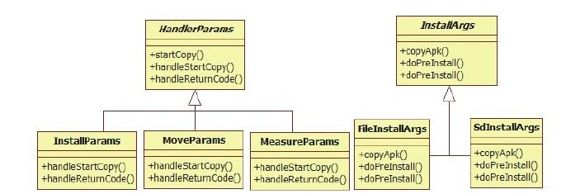

# 4.4.3　installPackageWithVerification函数分析


```
verifi cati onURI,
Manif estDigest manif estDigest){
//检查客户端进程是否具有安装Package的
```

权限。在本例中，该客户端进程是she

```
mContext.enforceCalli ngOrSelf Permissio
n(
android.Manif est.permission.INSTALL_PA
CKAGES, nu);
fi nal int uid=Binder.getCalli ngUid
();
fi nal int filt eredFlags;
if(uid==Process.SHELL_UID||uid==0){
```

……//如果通过she pm的方式安装，则增加INSTALL_FROM_ADB标志

```
filt eredFlags=fl ags|PackageManager.INS
TALL_FROM_ADB;
}else{
filt eredFlags=fl ags&~
PackageManager.INSTALL_FROM_ADB;
}
//创建一个Message, code为INIT_COPY,将
该消息发送给之前在PKMS构造函数中
//创建的mHandler对象,将在另外一个工作
线程中处理此消息
fi nal Message
msg=mHandler.obtainMessage
(INIT_COPY);
//创建一个Insta Params,其基类是
HandlerParams
msg.obj=new Insta Params(packageURI,
observer,
filt eredFlags, insta erPackageName,
verifi cati onURI, manif estDigest);
mHandler.sendMessage(msg);
}
```

insta PackageW ithVerifi cation函数倒是蛮清闲，简简单单创建几个对象，然后发送INIT_COPY消息给mHandler，就甩手退出了。根据之前在PKMS构造函数中介绍的知识可知，mHandler被绑定到另外一个工作线程（借助ThreadHandler对象的Looper）中，所以该INIT_COPY消息也将在那个工作线程中进行处理。我们马上转战到那。

1.INIT_COPY处理INIT_COPY只是安装流程的第一步。先来看相关代码：

[--＞PackageM anagerService.java：
handleM esssage]

```java
publi c void handleMessage(Message
msg){
try{
doHandleMessage(msg);//调用
doHandleMessage函数
}……
}
void doHandleMessage(Message msg){
swit ch(msg.what){
case INIT_COPY:{
//①这里记录的是params的基类类型
HandlerParams,实际类型为Insta Params
HandlerParams params=(HandlerParams)
msg.obj;
//idx为当前等待处理的安装请求的个数
int idx=mPendingInsta s.size();
if(!mBound){
/*
很多读者可能想不到,APK的安装居然需要
使用另外一个APK提供的服务,该服务就是
Default ContainerService,由
Default CotainerService.apk提供,
下面的connectToService函数将调用
bindService来启动该服务
*/
if(!connectToService()){
return;
```

}else{//如果已经连上，则以idx为索引，将params保存到mPendingInsta s中

```
mPendingInsta s.add(idx, params);
}
}else{
mPendingInsta s.add(idx, params);
if(idx==0){
//如果安装请求队列之前的状态为空,则表
明要启动安装
mHandler.sendEmptyMessage
(MCS_BOUND);
}
break;
}
```

……//后续再分析这里假设之前已经成功启动了DefaultContainerService(以后简称DCS），并且idx为零，所以这是PKMS首次处理安装请求，也就是说，下一个将要处理的是MCS_BOUND消息。

注意connectToService在调用bindService时会传递一个DefaultContainerConnection类型的对象，以接收服务启动的结果。当该服务成功启动后，此对象的onServiceConnected被调用，其内部也将发送MCS_BOUND消息给m Handler。

2.MCS_BOUND处理现在，安装请求的状态从INIT_COPY变成MCS_BOUND了，此时的处理流程是怎样的呢？依然在doHandleM essage函数中，直接从对应的case开始，代码如下：

[--＞PackageM anagerService.java：
doHandleM essage]

……//接doHandleMesage中的swit ch/case

```
case MCS_BOUND:{
if(msg.obj!=nu){
mContainerService=
(IMediaContainerService)msg.obj;
}
if(mContainerService==nu){
```

……//如果没法启动该service，则不能安装程序

```
mPendingInsta s.clear();
}else if(mPendingInsta s.size()>
0){
HandlerParams
params=mPendingInsta s.get(0);
if(params!=nu){
//调用params对象的startCopy函数,该函
数由基类HandlerParams定义
if(params.startCopy()){
……
if(mPendingInsta s.size()>0){
```

mPendingInsta s.remove（0）；//删除队列头

```
}
if(mPendingInsta s.size()==0){
if(mBound){
```

……//如果安装请求都处理完了，则需要和Service断绝联系，

```
//通过发送MSC_UNB消息处理断交请求。读
者可自行研究此情况的处理流程
removeMessages(MCS_UNBIND);
Message ubmsg=obtainMessage
(MCS_UNBIND);
sendMessageDelayed(ubmsg,10000);
}
}else{
//如果还有未处理的请求,则继续发送
```

MCS_BOUND消息。

```
//为什么不通过一个循环来处理所有请求呢
mHandler.sendEmptyMessage
(MCS_BOUND);
}
```



```
}
}……
break;
图4-10 HandlerParam s及Insta Args
```

MCS_BOUND的处家理族成还员算简单，就是调用HandlerParam s的startCopy函数。在深入由图4-10可知：

分析前，应先认识一下HandlerParams及相关H a的nd对le象rP。aram s和Insta Args均为抽象类。

```
(H a1n)d Hle arPn adrlaemrPsa有ra m 3s个和In子s ta类A,rg s分介绍别是
Insta Param s、M oveParam s和
```

除了HandlerParams家族外，这里提前请出M easureParam s。其中，Insta Param s用另外一个家族—InstaArgs家庭，如图4-10于处理APK的安装，MoveParams用于处理所示。

某个已安装APK的“搬家”请求（例如从内部存储移动到SD卡上），MeasureParams用于查询某个已安装的APK占据存储空间的大小（例如在设置程序中得到的某个APK使用的缓存文件的大小）。

对于InstaParams来说，它还有两个伴儿，即Insta Args的派生类FileInsta Args和SdInsta Args。其中，FileInsta Args针对的是安装在内部存储中的APK，而SdInsta Args针对的是那些安装在SD卡上的APK。

本节将讨论用于内部存储安装的FileInsta Args。

提示即将出版的“卷Ⅲ”将详细介绍M ountService和SdInsta Args的处理流程。

在前面MCS_BOUND的处理中，首先调用Insta Param s的startCopy函数，该函数由其基类HandlerParams实现，代码如下：

[--＞PackageM anagerService.java：
HandlerParam s.startCopy]

```java
fi nal boolean startCopy(){
boolean res;
try{
//MAX_RETIRES目前为4,表示尝试4次安
装,如果还不成功,则认为安装失败
if(++mRetries>MAX_RETRIES){
mHandler.sendEmptyMessage
(MCS_GIVE_UP);
handleServiceError();
return false;
}else{
```

handleStartCopy（）；//①调用派生类的handleStartCopy函数

```
res=true;
}
}……
```

handleReturnCode（）；//②调用派生类的handleReturnCode，返回处理结果

```
return res;
}
```

在上述代码中，基类的startCopy将调用子类实现的handleStartCopy和handleReturn-Code函数。下面来看InstaParams是如何实现这两个函数的。

（2）Insta Param s分析先来看派生类Insta Param s的handleStartCopy函数，代码如下：

[--＞PackageM anagerService：
Insta Param s.handleStartCopy]

```
publi c void handleStartCopy()throws
RemoteExcepti on{
int
ret=PackageManager.INSTALL_SUCCEEDED;
```

fi nal boolean fwdLocked=//本书不考虑fwdLocked的情况

```
(fl ags&
PackageManager.INSTALL_FORWARD_LOCK)
!=0;
//根据adbinsta的参数,判断安装位置
fi nal boolean onSd=(fl ags&
PackageManager.INSTALL_EXTERNAL)!
=0;
fi nal boolean onInt=(fl ags&
PackageManager.INSTALL_INTERNAL)!
=0;
PackageInfoLit e pkgLit e=nu;
if(onInt&&onSd){
//APK不能同时安装在内部存储空间和SD卡
上
ret=PackageManager.INSTALL_FAILED_INVA
LID_INSTALL_LOCATION;
}else if(fwdLocked&&onSd){
//fwdLocked的应用不能安装在SD卡上
ret=PackageManager.INSTALL_FAILED_INVA
LID_INSTALL_LOCATION;
}else{
fi nal long lowThreshold;
//获取DeviceStorageMonit orService的
binder客户端
fi nal DeviceStorageMonit orService dsm=
(DeviceStorageMonit orService)
ServiceManager.getService(
DeviceStorageMonit orService.SERVICE
);
if(dsm==nu){
lowThreshold=0L;
}else{
//从DSMS查询内部存储空间最小余量,默认
是总存储空间的10%
lowThreshold=dsm.getMemoryLowThreshold
();
}
try{
//授权DefContainerService URI读权限
mContext.grantUriPermission
(DEFAULT_CONTAINER_PACKAGE,
packageURI,
Intent.FLAG_GRANT_READ_URI_PERMISSION
);
//①调用DCS的getMinimalPackageInfo函
数,得到一个PackageInfoLit e对象
pkgLit e=mContainerService.getMinimalPa
ckageInfo(packageURI,
fl ags, lowThreshold);
```

}fi na y……//撤销URI授权

```
//pkgLit e的recommendedInsta Locati on
成员变量保存该APK推荐的安装路径
int
loc=pkgLit e.recommendedInsta Locati on
;
if
(loc==PackageHelper.RECOMMEND_FAILED_
INVALID_LOCATION){
ret=PackageManager.INSTALL_FAILED_INVA
LID_INSTALL_LOCATION;
}elseif……{
```

……//略去相关内容

```
}else{
//②根据DCS返回的安装路径,还需要调用
insta Locati onPoli cy进行检查
loc=insta Locati onPoli cy(pkgLit e,
fl ags);
if(!onSd&&!onInt){
if
(loc==PackageHelper.RECOMMEND_INSTALL
_EXTERNAL){
fl ags|=PackageManager.INSTALL_EXTERNAL
;
fl ags&=~
PackageManager.INSTALL_INTERNAL;
```

}……//处理安装位置为内部存储空间的情况

```
}
//③创建一个安装参数对象,对于安装位置
为内部存储空间的情况,args的真实类型为
Fil eInsta Args
fi nal Insta Args
args=createInsta Args(this);
mArgs=args;
if
(ret==PackageManager.INSTALL_SUCCEEDE
D){
fi nal int
requiredUid=mRequiredVerifi erPackage==
nu ?-1
:getPackageUid
(mRequiredVerifi erPackage);
if(requiredUid!=-1&&
isVerifi cati onEnabled()){
```

……//④待会再讨论verifi cation的处理

```
}else{
//⑤调用args的copyApk函数
ret=args.copyApk(mContainerService,
true);
}
```

mRet=ret；//确定返回值

```
}
```

在以上代码中，一共列出了5个关键点，总结如下：

调用DCS的getM inim alPackageInfo函数，将得到一个PackageInfoLite对象，该对象是一个轻量级的用于描述APK的结构（注意区别前面提到的PackageLite，它包含的成员变量和PackageInfoLite类似，只不过PackageLiteInfo继承了Parcelable接口，故它可通过Binder在进程间传递）。在这段代码逻辑中，主要想取得其recom m endedInsta Location的值。此值表示该APK推荐的安装路径。

调用insta LocationPolicy检查推荐的安装路径。例如系统Package不允许安装在SD卡上。

createInsta Args将根据安装位置创建不同的InstaArgs。如果是内部存储空间，则返回FileInsta Args，否则为SdInsta Args。

在正式安装前，应先对该APK进行必要的检查。这部分代码后续再介绍。

调用Insta Args的copyApk。对本例来说，将调用FileInsta Args的copyApk函数。

下面围绕这5个关键点对handleStartCopy函数展开分析，其中insta LocationPolicy和createInsta Args比较简单，读者可自行研究。

3.handleStartCopy分析（1）DefaultContainerService分析首先分析DCS的getM inim alPackageInfo函数，其代码如下：

[--＞DefaultContainerService.java：
getM inim alPackageInfo]

```java
publi c PackageInfoLit e
getMinimalPackageInfo(fi nal Uri
fil eUri, int fl ags,
long threshold){
//注意该函数的参数:fil eUri指向该APK的
文件路径(此时还在/data/local/tmp目录
下)
PackageInfoLit e ret=new
PackageInfoLit e();
……
String scheme=fil eUri.getScheme();
……
String archiveFil ePath=fil eUri.getPath
();
DisplayMetrics metrics=new
DisplayMetrics();
metrics.setToDefault s();
//调用PackageParser的parsePackageLit e
解析该APK文件
PackageParser.PackageLit e pkg=
PackageParser.parsePackageLit e
(archiveFil ePath,0);
```

if（pkg==nu）{//解析失败……//设置错误值

```
return ret;
}
ret.packageName=pkg.packageName;
ret.insta Locati on=pkg.insta Locati o
n;
ret.verifi ers=pkg.verifi ers;
//调用recommendAppInsta Locati on,取
得一个合理的安装位置
ret.recommendedInsta Locati on=
recommendAppInsta Locati on
(pkg.insta Locati on,
archiveFil ePath,
fl ags, threshold);
return ret;
}
```

APK可在AndroidM anifest.xm l中声明一个安装位置，不过DCS除了解析该位置外，还需要做进一步检查，这个工作由recom m endAppInsta Location函数完成，代码如下：

[--＞DefaultContainerService.java：
recom m endAppInsta Location]

```java
private int
recommendAppInsta Locati on(int
insta Locati on,
String archiveFil ePath, int fl ags,
long threshold){
int prefer;
boolean checkBoth=false;
check_inner:{
if((fl ags&
PackageManager.INSTALL_FORWARD_LOCK)
!=0){
prefer=PREFER_INTERNAL;
```

break check_inner；//根据FOWRAD_LOCK的情况，只能安装在内部存储

```
}else if((fl ags&
PackageManager.INSTALL_INTERNAL)!
=0){
prefer=PREFER_INTERNAL;
break check_inner;
}
```

……//检查各种情况

```
}else if
(insta Locati on==PackageInfo.INSTALL
_LOCATION_AUTO){
```

prefer=PREFER_INTERNAL；//一般设定的位置为AUTO，默认是内部空间

```
checkBoth=true;//设置checkBoth为true
break check_inner;
}
//查询setti ngs数据库中的secure表,获取
用户设置的安装路径
int insta Preference=
Setti ngs.System.getInt
(getAppli cati onContext()
.getContentResolver(),
Setti ngs.Secure.DEFAULT_INSTALL_LOCATI
ON,
PackageHelper.APP_INSTALL_AUTO);
if
(insta Preference==PackageHelper.APP
_INSTALL_INTERNAL){
prefer=PREFER_INTERNAL;
break check_inner;
}else if
(insta Preference==PackageHelper.APP
_INSTALL_EXTERNAL){
prefer=PREFER_EXTERNAL;
break check_inner;
}
prefer=PREFER_INTERNAL;
}fit
//判断外部存储空间是否为模拟的,这部分
内容我们以后再介绍
fi nal boolean
emulated=Environment.isExternalStorage
Emulated();
fi nal Fil e apkFil e=new Fil e
(archiveFil ePath);
boolean fit sOnInternal=false;
if
(checkBoth||prefer==PREFER_INTERNAL)
{
```

try{//检查内部存储空间是否足够大

```
sOnInternal=isUnderInternalThreshol
d(apkFil e, threshold);
}……
}
boolean fit sOnSd=false;
if(!emulated&&
(checkBoth||prefer==PREFER_EXTERNAL
)){
```

try{//检查外部存储空间是否足够大

```
fit sOnSd=isUnderExternalThreshold
(apkFil e);
}……
}
if(prefer==PREFER_INTERNAL){
```

if（fit sOnInternal）{//返回推荐安装路径为内部存储空间

```
return
PackageHelper.RECOMMEND_INSTALL_INTERN
AL;
}
}else if(!emulated&&
prefer==PREFER_EXTERNAL){
```

if（fitsOnSd）{//返回推荐安装路径为外部存储空间

```
return
PackageHelper.RECOMMEND_INSTALL_EXTERN
AL;
}
if(checkBoth){
```

if（fit sOnInternal）{//如果内部存储空间满足条件，先返回内部存储空间

```
return
PackageHelper.RECOMMEND_INSTALL_INTERN
AL;
}else if(!emulated&&fit sOnSd){
return
PackageHelper.RECOMMEND_INSTALL_EXTERN
AL;
}
```

……//到此，前几个条件都不满足，此处将根据情况返回一个明确的错误值

```
return
PackageHelper.RECOMMEND_FAILED_INSUFFI
CIENT_STORAGE;
}
```

DCS的getM inim alPackageInfo函数为了得到一个推荐的安装路径做了不少工作，其中，各种安装策略交叉影响。这里总结一下相关的知识点：

APK在AndroidM anifest.xm l中设置的安装点默认为AUTO，在具体对应时倾向内部存储空间。

用户在Settings数据库中设置的安装位置。

检查外部存储或内部存储是否有足够空间。

（2）Insta Args的copyApk函数分析至此，我们已经得到了一个合适的安装位置（先略过Verification这一步）。下一步工作就由copyApk来完成。根据函数名可知，该函数将完成APK文件的复制工作，此中会有蹊跷吗？来看下面的代码。

[--＞PackageM anagerService.java：
Insta Args.copyApk]

```java
int copyApk(IMediaContainerService
imcs, boolean temp)throws
RemoteExcepti on{
if(temp){
/*
本例中temp参数为true, createCopyFil e将
在/data/app目录下创建一个临时文件。
临时文件名为vmdl-随机数.tmp。为什么会
用这样的文件名呢?
因为PKMS通过Linux的inotif y机制监控
了/data/app目录,如果新复制生成的文件
名后缀
为.apk,将触发PKMS扫描。为了防止发生这
种情况,这里复制生成的文件才有了如此奇
怪的名字
*/
createCopyFil e();
}
Fil e codeFil e=new Fil e
(codeFil eName);
……
ParcelFil eDescriptor out=nu;
try{
out=ParcelFil eDescriptor.open
(codeFil e,
ParcelFil eDescriptor.MODE_READ_WRITE
);
}……
int
ret=PackageManager.INSTALL_FAILED_INSU
FFICIENT_STORAGE;
try{
mContext.grantUriPermission
(DEFAULT_CONTAINER_PACKAGE,
packageURI,
Intent.FLAG_GRANT_READ_URI_PERMISSION
);
//调用DCS的copyResource,该函数将执行
复制操作,最终结果是/data/local/tmp
//下的APK文件被复制到/data/app目录下,
```

文件名也被换成vmdl-随机数.tmp

```
ret=imcs.copyResource(packageURI,
out);
}fi na y{
```

……//关闭out，撤销URI授权

```
}
return ret;
}
```

关于临时文件，这里提供一个示例，如图4-11所示。

图4-11 createCopyFile生成的临时文件由图4-11可知，/data/app目录下有两个文件，第一个是正常的APK文件，第二个是create-CopyFile生成的临时文件。

4.handleReturnCode分析在HandlerParam s的startCopy函数中，handleStartCopy执行完之后，将调用handle-ReturnCode开展后续工作，代码如下：

[--＞PackageM anagerService.java：
Insta Param s.HandleParam s]

```java
void handleReturnCode(){
if(mArgs!=nu){
//调用processPendingInsta函数,mArgs
指向之前创建的FileInsta Args对象
processPendingInsta(mArgs, mRet);
}
```

[--＞PackageM anagerService.java：
processPendingInsta ]

```java
private void processPendingInsta
(fi nal Insta Args args,
fi nal int currentStatus){
//向mHandler中抛一个Runnable对象
mHandler.post(new Runnable(){
publi c void run(){
mHandler.removeCa backs(this);
//创建一个PackageInsta edInfo对象,
PackageInsta edInfo res=new
PackageInsta edInfo();
res.returnCode=currentStatus;
res.uid=-1;
res.pkg=nu;
res.removedInfo=new PackageRemovedInfo
();
if
(res.returnCode==PackageManager.INSTA
LL_SUCCEEDED){
//①调用Fil eInsta Args的doPreInsta
args.doPreInsta(res.returnCode);
synchronized(mInsta Lock){
//②调用insta PackageLI进行安装
insta PackageLI(args, true, res);
}
//③调用Fil eInsta Args的doPostInsta
args.doPostInsta(res.returnCode);
}
fi nal boolean
update=res.removedInfo.removedPackage
!=nu;
boolean doRestore=(!update&&
res.pkg!=nu&&
res.pkg.appli cati onInfo.backupAgentNam
e!=nu);
```

int token；//计算一个ID号

```
if(mNextInsta Token<0)
mNextInsta Token=1;
token=mNextInsta Token++;
//创建一个PostInsta Data对象
PostInsta Data data=new
PostInsta Data(args, res);
//保存到mRunningInsta s结构中,以
token为key
mRunningInsta s.put(token, data);
if
(res.returnCode==PackageManager.INSTA
LL_SUCCEEDED&&doRestore)
{
```

……//备份恢复的情况暂时不考虑

```
}
if(!doRestore){
//④抛一个POST_INSTALL消息给mHandler进
行处理
Message msg=mHandler.obtainMessage
(POST_INSTALL, token,0);
mHandler.sendMessage(msg);
}}
});
}
```

由上面代码可知，handleReturnCode主要做了4件事情：

调用Insta Args的doPreInsta函数，在本例中是FileInsta Args的doPreInsta函数。

调用PKM S的insta PackageLI函数进行APK安装，该函数内部将调用InstaArgs的doRename对临时文件进行改名。另外，还需要扫描此APK文件。此过程和4.3.2节中的内容类似。至此，该APK中的私有财产就全部被登记到PKMS内部进行保存了。

调用Insta Args的doPostInsta函数，在本例中是FileInsta Args的doPostInsta函数。

此时，该APK已经安装完成（不论失败还是成功），继续向mHandler抛送一个POST_INSTALL消息，该消息携带一个token，通过它可从m RunningInsta s数组中取得一个PostInsta Data对象。

提示对于FileInsta Args来说，其doPreInsta和doPostInsta都比较简单，读者可自行阅读相关代码。另外，读者也可自行研究PKM S的insta PackageLI函数。

这里介绍一下FileInsta Args的doRenam e函数，它的功能是为临时文件改名，最终的文件的名称一般为“包名-数字.apk”。其中，数字是一个index，从1开始。读者可参考图4-11中/data/app目录下第一个文件的文件名。

5.POST_IN STALL处理现在需要处理POST_INSTALL消息，因为adbinsta还等着安装结果呢。相关代码如下：

[--＞PackageM anagerService.java：
doHandleM essage]

……//接前面的swit ch/case

```
case POST_INSTALL:{
PostInsta Data
data=mRunningInsta s.get
(msg.arg1);
mRunningInsta s.delete(msg.arg1);
boolean deleteOld=false;
if(data!=nu){
Insta Args args=data.args;
PackageInsta edInfo res=data.res;
if
(res.returnCode==PackageManager.INSTA
LL_SUCCEEDED){
res.removedInfo.sendBroadcast(false,
true);
Bundle extras=new Bundle(1);
extras.putInt(Intent.EXTRA_UID,
res.uid);
fi nal boolean
update=res.removedInfo.removedPackage
!=nu;
if(update){
extras.putBoolean
(Intent.EXTRA_REPLACING, true);
}
//发送PACKAGE_ADDED广播
sendPackageBroadcast
(Intent.ACTION_PACKAGE_ADDED,
res.pkg.appli cati onInfo.packageName,
extras, nu , nu);
if(update){
/*
如果是APK升级,那么发送PACKAGE_REPLACE
和MY_PACKAGE_REPLACED广播。
二者不同之处在于PACKAGE_REPLACE将携带
一个extra信息
*/
}
Runti me.getRunti me().gc();
if(deleteOld){
synchronized(mInsta Lock){
//调用Fil eInsta Args的doPostDeleteLI
进行资源清理
res.removedInfo.args.doPostDeleteLI
(true);
}
if(args.observer!=nu){
try{
//通知pm安装的结果
args.observer.packageInsta ed
(res.name, res.returnCode);
}……
}break;
```
