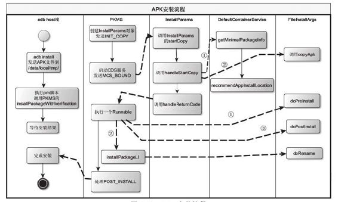

# 4.4.4　APK安装流程总结

没想到APK的安装流程竟然如此复杂，其目的无非是让APK中的“私人财产”公有化。

相比之下，在PKMS构造函数中进行公有化改造就非常简单。另外，如果考虑安装到SD卡的处理流程，那么APK的安装将会更加复杂。

这里要总结APK安装过程中的几个重要步骤，如图4-12所示。

图4-12 APK安装流程图4-12中列出以下内容：

安装APK到内部存储空间这一工作流程涉及的主要对象包括：PKMS、Default-ContainerService、Insta Param s和FileInsta Args。

此工作流程中每个对象涉及的关键函数。

对象之间的调用通过虚线表达，调用顺序通过①②③等标明。
