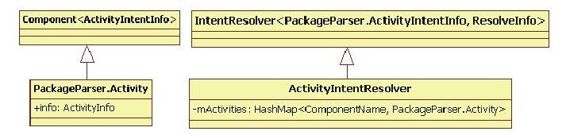

# 4.5.2　Activity信息的管理


docs/guide/topics/intents/intents-filt前面er在s.h介tm绍l中PK的M说S明扫。描APK时提到，PKM S将解析得到的package私有的Activity信息加入到自己的数据结构mActivities中保存。

下面先来看以下相关代码：

[--＞PackgeM anagerService.java：
scanPackageLI]

……//此时APK文件已经解析完成

```
N=pkg.acti viti es.size();//取出该APK
```

中包含的Activiti es信息

```
r=nu;
for(i=0;i<N;i++){
```



```
PackageParser.Acti vit y
a=pkg.acti viti es.get(i);
a.info.processName=fi xProcessName
```

图4-13相关数据结构示意图(pkg.appli cati onInfo.processName,结合代码，由图4-13可知：

```
a.info.processName,
pm kAg .catipvpitili ecsa为ti o nAI ncftiov.ituyiIdn);te n tR e s o lv e r类
```

型，是PKMS的成员变量，用于保存系统中mActi viti es.addActi vit y所有与Activity相关的信息。此数据结构内

```
(a,"acti vit y");//①加到mActi viti es
```

部有一个mActivities变量，它以中保存Com ponet-Nam e为key，保存PackageParser.Activity对象。

```
}
```

从APK中解析得到的所有和Activity相关的上面的代码中有两个比较重要的数据结构，信息（包括在XML中声明的IntentFilter标如图4-13所示。

签）都由PackageParser.Activity来保存。

前面代码中调用addActivity函数完成了私有fi信息的公有化。addActivity函数的代码如下：

[--＞PackageM anagerService.java：
ActivityIntentResolver.addActivity]

```java
publi c fi nal void addActi vit y
(PackageParser.Acti vit y a, String
type){
fi nal boolean systemApp=isSystemApp
(a.info.appli cati onInfo);
//将Component和Acti vit y保存到
mActi viti es中
mActi viti es.put(a.getComponentName
(),a);
nal int NI=a.intents.size();
for(int j=0;j<NI;j++){
//Acti vit yIntentInfo存储的就是XML中声
明的IntentFilt er信息
PackageParser.Acti vit yIntentInfo
intent=a.intents.get(j);
if(!systemApp&&intent.getPriorit y
()>0&&"acti vit y".equals(type))
{
//非系统APK的priority必须为0。后续分析
中将介绍priority的作用
intent.setPriorit y(0);
}
```

addFilt er（intent）；//接下来将分析这个函数

```
}
```

下面来分析addFilter函数，这里涉及较多的复杂的数据结构，代码如下：

[--＞IntentResolver.java：
IntentResolver.addFilt er]

```java
publi c void addFilt er(F f){
……
```

mFilt ers.add（f）；//mFilt ers保存所有IntentFilt er信息

```
//除此之外,为了加快匹配工作的速度,还
需要分类保存IntentFilt er信息
//下边register_xxx函数的最后一个参数用
于打印信息
int numS=register_intent_filt er(f,
f.schemesIterator(),
mSchemeToFilt er,"Scheme:");
int numT=register_mime_types
(f,"Type:");
if(numS==0&&numT==0){
register_intent_filt er(f,
f.acti onsIterator(),
mActi onToFilt er,"Acti on:");
}
if(numT!=0){
register_intent_filt er(f,
f.acti onsIterator(),
mTypedActi onToFilt er,"TypedActi on:"
);
}
```

正如代码注释中所说，为了加快匹配工作的速度，这里使用了泛型编程并定义了较多的成员变量。下面总结一下这些变量的作用(注意,除mFilters为HashSet<F>类型外，其他成员变量的类型都是HashMap＜String,ArrayList＜F＞＞，其中F为模板参数）。

m Schem eToFilt er：用于保存uri中与schem e相关的IntentFilt er信息。

mActionToFilter：用于保存仅设置Action条件的IntentFilt er信息。

mTypedActionToFilter：用于保存既设置了Action又设置了Data的MIME类型的IntentFilt er信息。

m Filt ers：用于保存所有IntentFilt er信息。

mW ildTypeToFilter：用于保存设置了Data类型类似“im age/*”的IntentFilt er，但是设置MIME类型类似“Image/jpeg”的不算在此类。

m TypeToFilt er：除了包含mWildTypeToFilter外，还包含那些指明了Data类型为确定参数的IntentFilter信息，例如“image/*”和“image/jpeg”等都包含在m TypeToFilt er中。

m BaseTypeToFilt er：包含M IM E中Base类型的IntentFilt er信息，但不包括Sub type为“*”的IntentFilt er。

不妨举个例子来说明这些变量的用法。

假设，在XML中声明一个IntentFilter，代码如下：

```
<intent-filt er android:
label="test">
<acti on android:
name="android.intent.acti on.VIEW"/>
data android:
mimeType="audio/*"android:
scheme="h p"
</intent-filt er>
那么:
在m TypedActionToFilt er中能够以
“android.intent.action.VIEW”为key找
到该IntentFilt er。
在m W ildTypeToFilt er和m TypeToFilt er中
能够以“audio”为key找到该
IntentFilt er。
在mSchemeToFilter中能够以“h p”为
key找到该IntentFilt er。
```
