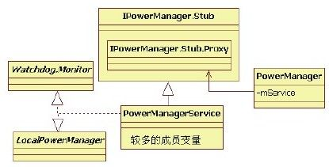

# 5.1　概述

Pow erM anagerService负责Android系统中电源管理方面的工作。作为系统核心服务之一，PowerM anagerService与其他服务及HAL层等都有交互关系，所以Power-M anagerService相对PackageM anagerService来说，其社会关系更复杂，分析难度也会更大一些。

先来看直接与PowerM anagerService有关的类家族成员，如图5-1所示由图5-1可知：

图5-1 PowerM anagerService及相关类家族Pow erM anagerService从IPowerM anager.Stub类派生，并实现了W atchdog.M onitor及LocalPowerM anager接口。PowerM an-agerService内部定义了较多的成员变量，在后续分析中，我们会对其中比较重要的成员逐一进行介绍。

根据第4章介绍的知识，IPowerM anager.Stub及内部类Proxy均由aidl工具处理IPower-M anager.aidl后得到。

客户端使用PowerManager类，其内部通过代表BinderProxy端的m Service成员变量与Pow erM anagerService进行跨Binder通信。

现在开始PowerM anagerService(以后简写为PMS）的分析之旅，先从它的调用流程入手。

提示PM S和Ba eryService、Ba eryStatsService均有交互关系，这些内容放在后面分析。
