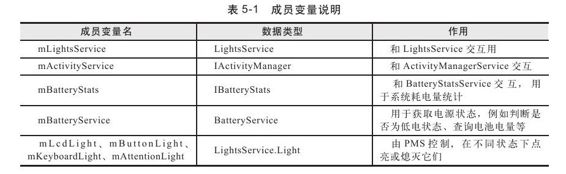
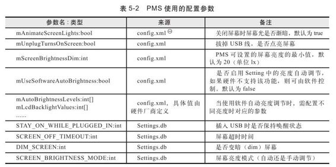

# 5.2.2　init分析


于它们的具体作用，后续分析会介绍。

第二个关键点是init函数，该函数将初始化下面分析第二个关键点。

PMS内部的一些重要成员变量，由于此函数代码较长，此处将分段讨论。

从流程角度看，init大体可分为3段。

1.init分析之一这部分的代码如下：

[--＞PowerM anagerService.java：init]

```java
void init(Context context,
LightsService li ghts, IActi vit yManager
acti vit y,
Ba eryService ba ery){
//①保存几个成员变量
mLightsService=li ghts;//保存
LightService
mContext=context;
mActi vit yService=acti vit y;//保存
Acti vit yManagerService
//保存Ba eryStatsService
mBa eryStats=Ba eryStatsService.getS
ervice();//
mBa eryService=ba ery;//保存
Ba eryService
//从LightService中获取代表不同硬件
Light的Light对象
mLcdLight=li ghts.getLight
(LightsService.LIGHT_ID_BACKLIGHT);
mBu onLight=li ghts.getLight
(LightsService.LIGHT_ID_BUTTONS);
mKeyboardLight=li ghts.getLight
(LightsService.LIGHT_ID_KEYBOARD);
mA enti onLight=li ghts.getLight
(LightsService.LIGHT_ID_ATTENTION);
//②调用nati veInit函数
nati veInit();
synchronized(mLocks){
updateNati vePowerStateLocked();//③
```



更新Native层的电源状态

```
}
```

第一阶段的工作可分为3步：

下面来看nativeInit函数，其JNI层实现代码如下：

对一些成员变量进行赋值。

调用nativeInit函数初始化Native层相关资

[--＞

源。

com _android_server_PowerM anagerService.cpp]调用updateNativePowerStateLocked更新Native层的电源状态。这个函数的调用次数stati c void较为频繁，后续分析时会讨论。

```cpp
android_server_PowerManagerService_na
ti veInit(JNIEnv*env,
```

先来看第一阶段出现的各类成员变量，如表5-1所示。

```
jobject obj){
//非常简单,就是创建一个全局引用对象
gPowerManagerServiceObj
gPowerManagerServiceObj=env->
NewGlobalRef(obj);
}
```

init第一阶段工作比较简单，下面进入第二阶段的分析。

2.init分析之二init第二阶段工作将创建两个HandlerThread对象，即创建两个带消息循环的工作线程。PM S本身由ServerThread线程创建，但它会将自己的工作委托给两个线程，它们分别是：

m ScreenO Thread：按Power键关闭屏幕时，屏幕不是突然变黑的，而是一个渐暗的过程。mScreenO Thread线程就用于控制关闭屏幕过程中的亮度调节。

mHandlerThread：该线程是PMS的主要工作线程。

先来看这两个线程的创建。

（1）m ScreenO Thread和mHandlerThread分析这部分的代码如下：

[--＞PowerM anagerService.java：init]

```java
……
mScreenO Thread=new HandlerThread
("PowerManagerService.mScreenO Threa
d"){
protected void onLooperPrepared(){
mScreenO Handler=new Handler();//
```

向这个handler发送的消息，将由此线程处理

```
synchronized(mScreenO Thread){
mInit Complete=true;
mScreenO Thread.notif yA();
}
};
```

mScreenO Thread.start（）；//创建对应的工作线程

```
synchronized(mScreenO Thread){
whil e(!mInit Complete){
```

try{//等待mScreenO Thread线程创建完成

```
mScreenO Thread.wait();
}……
}
```

注意，在Android代码中经常出现“线程A创建线程B，然后线程A等待线程B创建完成”的情况，读者了解它们的作用即可。接着看以下代码。

[--＞PowerM anagerService.java：init]

```java
mInit Complete=false;
//创建mHandlerThread
mHandlerThread=new HandlerThread
("PowerManagerService"){
protected void onLooperPrepared(){
super.onLooperPrepared();
```

init InThread（）；//①初始化另外一些成员变量

```
}
};
mHandlerThread.start();
```

……//等待mHandlerThread创建完成由于m HandlerThread承担了PM S的主要工作，因此需要先做一些初始化工作，相关的代码在initInThread中，我们会将这部分内容放在单独一节中进行讨论。

（2）initInThread分析initInThread本身比较简单，涉及3个方面的工作，总结如下：

PMS需要了解外面的世界，所以它会注册一些广播接收对象，接收诸如启动完毕、电池状态变化等广播。

PMS所从事的电源管理工作需要遵守一定的规则，而这些规则在代码中就是一些配置参数，这些配置参数的值可以是固定的（编译完后就无法改动），也可以是经由Settings数据库动态设定的。

PMS需要对外发出一些通知，例如屏幕关闭/开启。

了解initInThread的概貌后，再来看如下代码：

[--＞PowerM anagerService.java：
initInThread]

```java
void init InThread(){
mHandler=new Handler();
//PMS内部也需要使用WakeLock,此处定义
```

了几种不同的UnsynchronizedWakeLock。它们的

```
//作用见后文分析
mBroadcastWakeLock=new
UnsynchronizedWakeLock(
PowerManager.PARTIAL_WAKE_LOCK,"sleep
_broadcast",true);
//创建广播通知的Intent,用于通知
SCREEN_ON和SCREEN_OFF消息
mScreenOnIntent=new Intent
(Intent.ACTION_SCREEN_ON);
mScreenOnIntent.addFlags
(Intent.FLAG_RECEIVER_REGISTERED_ONLY
);
mScreenO Intent=new Intent
(Intent.ACTION_SCREEN_OFF);
mScreenO Intent.addFlags
(Intent.FLAG_RECEIVER_REGISTERED_ONLY
);();
//取配置参数,这些参数是编译时确定的,
```

运行过程中无法修改

```
Resources
resources=mContext.getResources();
mAnimateScreenLights=resources.getBool
ean(
com.android.internal.R.bool.confi g_ani
mateScreenLights);
```

……//见下文的配置参数汇总

```
//通过数据库设置的配置参数
ContentResolver
resolver=mContext.getContentResolver
Cursor setti ngsCursor=resolver.query
(Setti ngs.System.CONTENT_URI, nu,
```

……//设置查询条件和查询项的名字，见后文的配置参数汇总

```
nu);
//ContentQueryMap是一个常用类,简化了
```

数据库查询工作。读者可参考SDK中该类的说明文档

```
mSetti ngs=new ContentQueryMap
(setti ngsCursor,
Setti ngs.System.NAME,
true, mHandler);
//监视上边创建的ContentQueryMap中内容
的变化
Setti ngsObserver setti ngsObserver=new
Setti ngsObserver();
mSetti ngs.addObserver
(setti ngsObserver);
setti ngsObserver.update(mSetti ngs,
nu);
//注册接收通知的BroadcastReceiver
IntentFilt er filt er=new IntentFilt er
();
filt er.addActi on
(Intent.ACTION_BATTERY_CHANGED);
mContext.registerReceiver(new
Ba eryReceiver(),filt er);
filt er=new IntentFilt er();
filt er.addActi on
(Intent.ACTION_BOOT_COMPLETED);
mContext.registerReceiver(new
BootCompletedReceiver(),filt er);
filt er=new IntentFilt er();
filt er.addActi on
(Intent.ACTION_DOCK_EVENT);
mContext.registerReceiver(new
DockReceiver(),filt er);
//监视Setti ngs数据中secure表的变化
mContext.getContentResolver
().registerContentObserver(
Setti ngs.Secure.CONTENT_URI, true,
new ContentObserver(new Handler())
{
publi c void onChange(boolean
self Change){
updateSetti ngsValues();
}
});
updateSetti ngsValues();
```

……//通知其他线程

```
}
```

在上述代码中，很大一部分用于获取配置参数。同时，对于数据库中的配置值，还需要建立监测机制，细节部分请读者自己阅读相关代码，这里总结一下常用的配置参数，如表5-2所示。



除了获取配置参数外，initInThread还创建了好几个UnsynchronizedW akeLock对象，它的作用是：在Android系统中，为了抢占电力资源，客户端要使用WakeLock对象。PMS自己也不例外，所以为了保证在工作中不至于突然掉电（当其他客户端都不使用WakeLock的时候，这种情况理论上是有可能发生的），PMS需要定义供自己使用的WakeLock。由于线程同步方面的原因，PM S封装了一个UnsynchronizedW akeLock结构，它的调用已经处于锁保护下，所以在内部无须再做同步处理。UnsynchronizedW akeLock比较简单，因此不再赘述。

下面来看init第三阶段的工作。

3.init分析之三这部分内容的代码如下：

[--＞PowerM anagerService.java：init]

nativeInit（）；//不知道此处为何还要调用一次nativeInit，笔者怀疑此处为bug

```
synchronized(mLocks){
updateNati vePowerStateLocked();//更
```

新native层power状态，以后分析

```
forceUserActi vit yLocked();//强制触
```

发一次用户事件

```
mIniti ali zed=true;
```

}//init函数完毕forceUserActivityLocked表示强制触发一次用户事件。这个解释是否会让读者丈二和尚摸不着头？先来看它的代码：

[--＞PowerM anagerService.java：
f（），orceUserActivityLocked]

```java
private void forceUserActi vit yLocked
(){
if(isScreenTurningO Locked()){
mScreenBrightness.animati ng=false;
}
boolean
savedActi vit yA owed=mUserActi vit yA o
wed;
mUserActi vit yA owed=true;
//下面这个函数以后会分析,SDK中有对应
的API
userActi vit y(SystemClock.upti meMilli s
false);
mUserActi vit yA owed=savedActi vit yA o
wed;
}
```

forceUserActivityLocked内部为调用userActivity扫清了一切障碍。SDK中Pow erM anager.userActivity的说明文档“User activity happened.Turns thedevice from whatever state it’s in tofu on,and resets the auto-o tim er.”简单翻译过来是：调用此函数后，手机将被唤醒，屏幕超时时间也将重新计算。

userActivity是PMS中很重要的一个函数，本章后面将对其进行详细分析。

4.init函数总结
