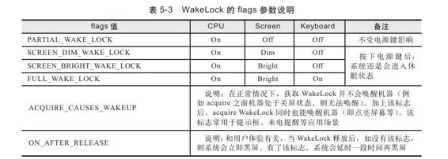

# 5.3.1　WakeLock客户端分析


1.newW akeLock分析通过PowerManager（以后简称PM）的newW akeLock将创建一个W akeLock，代码如下：

[--＞PowerM anager.java：
newW akeLock]

```java
publi c WakeLock newWakeLock(int
fl ags, String tag)
{
//tag不能为nu,否则抛出异常
return new WakeLock(fl ags,
```

tag）；//WakeLock为PM的内部类，第一个参数flags很关键

```
}
```

WakeLock的第一个参数flags很关键，它用于控制CPU/Screen/Keyboard的休眠状态。flags的可选值如表5-3所示。



由表5-3可知：

WakeLock只控制CPU、屏幕和键盘三大部分。

表中最后两项是附加标志，和前面的其他WAKE_LOCK标志组合使用。注意，PARTIAL_W AKE_LOCK比较特殊，附加标志不能影响它。

PARTIAL_W AKE_LOCK不受电源键控制，即按电源键不能使PARTIAL_W AKE_LOCK系统进入休眠状态（屏幕可以关闭，但CPU不会休眠）。了解了上述知识后，再来看如下代码：

[--＞PowerM anager.java：W akeLock]

```java
WakeLock(int fl ags, String tag)
{
//检查flags参数是否非法
mFlags=fl ags;
mTag=tag;
//创建一个Binder对象,除了做Token外,
```

PMS需要监视客户端的生死状况，否则有可能导致

```
//WakeLock不能被释放
mToken=new Binder();
}
```

客户端创建了WakeLock后，需要调用acquire以确保电力资源供应正常。下面对acquire代码进行分析。

2.acquire分析这部分的代码如下：

[--＞PowerM anager.java：
W akeLock.acquire]

```java
publi c void acquire()
{
synchronized(mToken){
acquireLocked();//调用acquireLocked
函数
}
//acquireLoced函数
private void acquireLocked(){
if(!mRefCounted||mCount++==0){
mHandler.removeCa backs
```

（mReleaser）；//引用计数控制

```
try{
//调用PMS的acquirewakeLock,注意这里传
递的参数,其中mWorkSource为空
mService.acquireWakeLock(mFlags,
mToken, mTag, mWorkSource);
}……
mHeld=true;
}
```

上边代码中调用PM S的acquireW akeLock函数与PMS交互，该函数最后一个参数为W orkSource类。这个类从Android 2.2开始就存在，但一直没有明确的作用，下面是关于它的一段说明。

```
/**见WorkSoure.java
*Describes the source of some work
that may be done by someone else.
*Currentl y the publi c representati on
of what a work source is is not
*defi ned;this is an opaque container.
*/
```

由以上注释可知，WorkSource本意用来描述某些任务的Source。传递此Source给其他人，这些人就可以执行该Source对应的工作。目前使用WorkSource的地方仅是ContentService中的SyncM anager。读者暂时可不理会W orkSource。

客户端的功能比较简单，和PMS仅通过acquireW akeLock函数交互。下面来分析服务端的工作。
