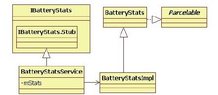
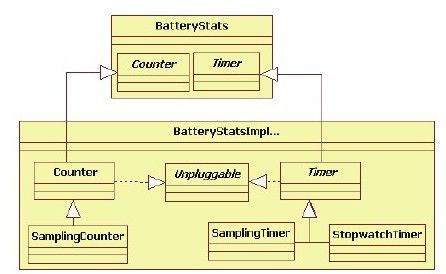
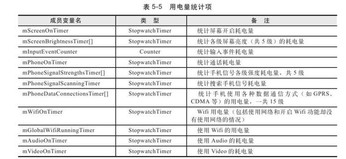
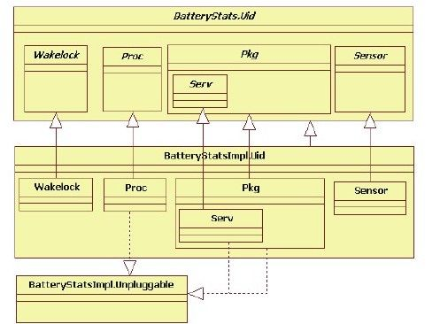
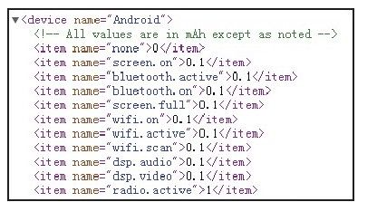

# 5.5.2　BatteryStatsService分析


……//创建BSS对象，传递一个File对象，指向/data/system/ba erystats.bin

```
mBa eryStatsService=new
Ba eryStatsService(new Fil e(
systemDir,"ba erystats.bin").toStri
ng());
}
```

BBS发布的代码如下：

[--＞ActivityM anagerService.java：m ain]

```java
//调用BSS的publish函数,在内部将其注册
到ServiceManager
m.mBa eryStatsService.publi sh
(context);
```

下面来分析BSS的构造函数。

1.Ba eryStatsService介绍让人大跌眼镜的是，BSS其实只是一个壳，具体功能委托BaeryStatsImpl（以后简称BSIm pl）来实现。Ba eryStatsService的代码如下：

[--＞Ba eryStatsService.java：
Ba eryStatsService]

```java
Ba eryStatsService(String fil ename)
{
mStats=new Ba eryStatsImpl
(fil ename);
}
```

图5-2展示了BSS及BSImpl的家族图谱。



图5-2 BSS及BSIm pl家族图谱由图5-2可知：

BSS通过成员变量mStats指向一个BSImpl类型的对象。

BSIm pl从Ba eryStats类派生。更重要的是，该类实现了Parcelable接口，由此可知，BSImpl对象的信息可以写到Parcel包中，从而可通过Binder在进程间传递。实际上，在Android手机的设置中查到的用电信息就是来自BSImpl的。

BSS的getStatistics函数提供了查询系统用电信息的接口，该函数的代码如下：

[--＞Ba eryStatsService：getStatistics]

```
publi c byte[] getStati sti cs(){
mContext.enforceCalli ngPermission(//
```

检查调用进程是否有BATTERY_STATS权限

```
android.Manif est.permission.BATTERY_ST
ATS, nu);
Parcel out=Parcel.obtain();
mStats.writ eToParcel(out,0);//将
```

BSImpl信息写到数据包中

```
byte[] data=out.marsha();//序列化
```

为一个bu er，然后通过Binder传递

```
out.recycle();
return data;
}
```

由此可以看出，电量统计的核心类是BSImpl，下面就来分析它。

2.初识BSIm plBSImpl功能是进行电量统计，那么是否存在计量工具呢？答案是肯定的，并且BSImpl使用了不止一种计量工具。

（1）计量工具和统计对象介绍BSImpl一共使用了4种计量工具，如图5-3所示。



图5-3计量工具图例由图5-3可知：

一共有两大类计量工具，Counter用于计数，Timer用于计时。

BSIm pl实现了StopwatchTim er(秒表)、Sam plingTim er（抽样计时）、Counter(计数器)和SamplingCounter(抽样计数）等4个具体的计量工具。

BSIm pl中定义了一个Unpluggable接口。

当手机插上USB线充电（不论是由交流电还是由USB供电）时，该接口的plug函数都被调用。反之，当拔去USB线时，该接口的unplug函数被调用。设置这个接口的目的是为了满足BSImpl对各种情况下系统用电量的统计要求。关于Unpluggable接口的作用，在后续内容中能见到。

虽然只有4种计量工具（笔者觉得已经相当多了），但是可以在很多地方使用它们。下面先来认识部分被挂牌要求统计用电量的对象，如表5-5所示。

表5-5中的电量统计项已经够多了吧？还不止这些，为了做到更精确，Android还希望能统计每个进程在各种情况下的耗电量。这是一项庞大的工程，怎么做到的呢？来看下一节的内容。

（2）Ba eryStats.Uid介绍在Android4.0中，和进程相关的用电量统计并非以单个PID为划分单元，而是以Uid为组，相关类结构如图5-4所示。



由图5-4可知：

Wakelock用于统计该Uid对应进程使用W akeLock的用电情况。

Proc用于统计Uid中某个进程的电量使用情况。

Pkg用于统计某个特定Package的使用情况，其内部类Serv用于统计该Pkg中Service的用电情况。

Sensor用于统计传感器用电情况。



图5-4 Ba eryStats.Uid家族基于以上的了解，以后分析将会轻松很多，下面来分析它的代码。

3.BSIm pl流程分析（1）构造函数分析先分析构造函数，代码如下：

[--＞Ba eryStatsIm pl.java：
Ba eryStatsIm pl]

```java
publi c Ba eryStatsImpl(String
fil ename){
//JournaledFil e为日志文件对象,内部包
```

含两个文件，原始文件和临时文件。目的是双备份，

```
//以防止在读写过程中文件信息丢失或出错
mFil e=new JournaledFil e(new Fil e
(fil ename),new Fil e
(fil ename+".tmp"));
```

mHandler=new MyHandler（）；//创建一个Handler对象

```
mStartCount++;
//创建表5-5中的用电统计项对象
mScreenOnTimer=new StopwatchTimer
(nu,-1,nu , mUnpluggables);
for(int i=0;i<
NUM_SCREEN_BRIGHTNESS_BINS;i++){
mScreenBrightnessTimer[i]=new
StopwatchTimer(nu,-100-i, nu,
mUnpluggables);
}
mInputEventCounter=new Counter
(mUnpluggables);
……
mOnBa ery=mOnBa eryInternal=false;/
```

/设置这两位成员变量为falseinitTimes（）；//①初始化统计时间

```
mTrackBa eryPastUpti me=0;
mTrackBa eryPastRealti me=0;
mUpti meStart=mTrackBa eryUpti meStart=
SystemClock.upti meMilli s()*1000;
mRealti meStart=mTrackBa eryRealti meSt
art=
SystemClock.elapsedRealti me()*1000;
mUnpluggedBa eryUpti me=getBa eryUpti
meLocked(mUpti meStart);
mUnpluggedBa eryRealti me=getBa eryRe
alti meLocked(mRealti meStart);
mDischargeStartLevel=0;
mDischargeUnplugLevel=0;
mDischargeCurrentLevel=0;
```

init Discharge（）；//②初始化和电池level有关的成员变量

```
clearHistoryLocked();//③删除用电统
```

计的历史记录

```
}
```

要看懂这段代码比较困难，主要原因是变量太多，并且没有注释说明。只能根据名字来推测了。在以上代码中除了计量工具外，还出现了三大类成员变量：

用于统计时间的成员变量，例如m Uptim eStart、m TrackBa eryPastUptim e等。这些参数的初始化函数为initTimes。注意，系统时间分为uptime和realtime。uptime和realtime的时间起点都从系统启动开始算(since the system wasbooted),但是uptime不包括系统休眠时间，而realtime包[1]括系统休眠时间。

用于记录各种情况下用于表电池电量的成员变量，如m DischargeStartLevel、m Discharge-CurrentLevel等，这些成员变量的初始化函数为initDischarge。

用于保存历史记录的HistroryItem，在clearHistoryLocked函数中初始化，主要有mHistory、mHistoryEnd等成员变量(这些成员变量在clearHistoryLocked函数中出现）。

上述这些成员变量的具体作用，只有通过后文的分析才能弄清楚。这里先介绍

```
StopwacherTim er。
//调用方式
mPhoneSignalScanningTimer=new
StopwatchTimer(nu,-200+1,
nu , mUnpluggables);
//mUnpluggables类型为ArrayList<
Unpluggable>,用于保存插拔USB线时需要
```

对应更新用电

```
//信息的统计对象
//StopwatchTimer的构造函数
StopwatchTimer(Uid uid, int type,
ArrayList<StopwatchTimer>ti merPool,
ArrayList<Unpluggable>unpluggables)
{
//在本例中,uid为0,type为负数,
```

ti merPool为空，unpluggables为

```
mUnpluggables
super(type, unpluggables);
mUid=uid;
mTimerPool=ti merPool;
}
//Timer的构造函数
Timer(int type, ArrayList<
Unpluggable>unpluggables){
mType=type;
mUnpluggables=unpluggables;
unpluggables.add(this);
}
```

在StopwatchTimer中比较难理解的就是unpluggables，根据注释说明，当插拔USB线时，需要更新用电统计的对象，应该将其加入到mUnpluggables数组中。

在启动秒表时，调用它的startRunningLocked函数，并传入BSIm pl实例，代码如下：

[--＞Ba eryStatsIm pl.java：
StopwatchTim er.startRuningLocked]

```java
void startRunningLocked
(Ba eryStatsImpl stats){
```

if（mNesti ng++==0）{//嵌套调用控制

```
//getBa eryRealti meLocked函数返回总的
电池使用时间
mUpdateTime=stats.getBa eryRealti meLo
cked(
SystemClock.elapsedRealti me()
*1000);
```

if（mTimerPool！=nu）{//不讨论这种情况

```
}
mCount++;
```

mAcquireTime=mTotalTime；//计数控制，请读者阅读相关注释说明

```
}
```

当停用秒表时，调用它的stopRunningLocked函数，代码如下：

[--＞Ba eryStatsIm pl.java：
StopwatchTim er.stopRunningLocked]

```java
void stopRunningLocked
(Ba eryStatsImpl stats){
if(mNesti ng==0){
```

return；//嵌套控制

```
}
if(--mNesti ng==0){
```

if（mTimerPool！=nu）{//不讨论这种情况

```
}else{
fi nal long
realti me=SystemClock.elapsedRealti me
()*1000;
//计算此次启动/停止周期的时间
fi nal long
ba eryRealti me=stats.getBa eryRealti
meLocked(realti me);
mNesti ng=1;
//mTotalTime代表从启动开始该秒停表一共
记录的时间
mTotalTime=computeRunTimeLocked
(ba eryRealti me);
mNesti ng=0;
}
if(mTotalTime==mAcquireTime)mCount-
-;
}
```

在StopwatchTimer中定义了很多的时间参数，这些参数用于记录各种时间，例如总耗时、最近一次工作周期的耗时等。如果不是工作需要（例如研究Settings应用中和BaeryInfo相关的内容），读者仅需了解它的作用即可。

（2）ActivityM anagerService和BSS交互ActivityM anagerService创建BSS后，还要进行几项操作，具体代码分别如下：

[--＞ActivityM anagerService. java：

ActivityM anagerService构造函数]

```
mBa eryStatsService=new
Ba eryStatsService(new Fil e(
systemDir,"ba erystats.bin").toStri
ng());
//操作通过BSImpl创建JournaledFil e文件
mBa eryStatsService.getActi veStati sti
cs().readLocked();
mBa eryStatsService.getActi veStati sti
cs().writ eAsyncLocked();
//BSImpl的getIsOnBa ery返回mOnBa ery
变量,初始化值为false
mOnBa ery=DEBUG_POWER?true
:
mBa eryStatsService.getActi veStati sti
cs().getIsOnBa ery();
//设置回调,该回调也用于信息统计,留到
介绍Acti vit yManagerService时再来分析
mBa eryStatsService.getActi veStati sti
cs().setCa back(this);
```

[--＞ActivityM anagerService.java：m ain]

```java
m.mBa eryStatsService.publi sh
(context);
```

[--＞Ba eryStatsService.java：publish]

```java
publi c void publi sh(Context context)
{
mContext=context;
//注意,BSS服务称为ba eryinfo,而
Ba eryService服务称为ba ery
ServiceManager.addService
("ba eryinfo",asBinder());
//PowerProfil e见下文解释
mStats.setNumSpeedSteps(new
PowerProfil e
(mContext).getNumSpeedSteps());
//设置通信信号扫描超时时间
mStats.setRadioScanningTimeout
(mContext.getResources().getInteger
(
com.android.internal.R.integer.confi g_
radioScanningTimeout)
*1000L);
}
```

在以上代码中，比较有意思的是PowerProfile类，它将解析Android 4.0源代码/fram ew orks/base/core/res/res/xm l/power_profile.xml文件。此XM L文件存储的是各种操作（和硬件相关）的耗电情况，如图5-5所示。



图5-5 PowerProfil e文件示例由图5-5可知，该文件保存了各种操作的耗电情况，以mAh（毫安时）为单位。

Pow er-Profil e的getN um SpeedSteps将返回CPU支持的频率值，目前在该XML中只定义了一个值，即400MHz。

注意在编译时，各厂家会将特定硬件平台的power_profile.xml复制到输出目录。此处展示的power_profile.xml和硬件平台无关。

（3）Ba eryService和BSS交互Ba eryService在它的processValues函数中和BSS交互，processValues函数的代码如下：

[--＞Ba eryService.java：processValues]

```java
private void processValues(){
……
mBa eryStats.setBa eryState
(mBa eryStatus, mBa eryHealt h,
mPlugType,
mBa eryLevel, mBa eryTemperature,
mBa eryVolt age);
}
```

BSS的工作由BSIm pl来完成，BsIm pl的setBa eryState函数的代码如下：

[--＞Ba eryStatsIm pl.java：
setBa eryState]

```java
publi c void setBa eryState(int
status, int healt h, int plugType, int
level,
int temp, int volt){
synchronized(this){
boolean
onBa ery=plugType==BATTERY_PLUGGED_NO
```

NE；//判断是否为电池供电int

```
oldStatus=mHistoryCur.ba eryStatus;
……
if(onBa ery){
//mDischargeCurrentLevel记录当前使用电
池供电时的电池电量
mDischargeCurrentLevel=level;
mRecordingHistory=true;//mRecordingHi
```

story表示需要记录一次历史值

```
}
//此时,onBaery为当前状态,
```

mOnBa ery为历史状态

```
if(onBa ery!=mOnBa ery){
mHistoryCur.ba eryLevel=(byte)
level;
mHistoryCur.ba eryStatus=(byte)
status;
mHistoryCur.ba eryHealt h=(byte)
healt h;
```

……//更新mHistoryCur中的电池信息

```
setOnBa eryLocked(onBa ery,
oldStatus, level);
}else{
boolean changed=false;
if(mHistoryCur.ba eryLevel!=level)
{
mHistoryCur.ba eryLevel=(byte)
level;
changed=true;
}
```

……//判断电池信息是否发生变化if（changed）{//如果发生变化，则需要增加一次历史记录

```
addHistoryRecordLocked
(SystemClock.elapsedRealti me());
}
if(!onBa ery&&
status==Ba eryManager.BATTERY_STATUS_
FULL){
mRecordingHistory=false;
}
```

setBaeryState函数的工作如下：判断当前供电状态是否发生变化，由onBaery和mOnBaery进行比较决定。其中onBaery用于判断当前是否为电池供电，mOnBaery为上次调用该函数时得到的判断值。如果供电状态发生变化（其实就是经历一次USB拔插过程），则调用setOnBa eryLocked函数。如果供电状态未发生变化，则需要判断电池信息是否发生变化，例如电量和电压等。如果发生变化，则调用addHistoryRecordLocked。该函数用于添加一次历史记录。

接下来看setOnBa eryLocked函数的代码：

[--＞Ba eryStatsIm pl.java：
setO nBa eryLocked]

```java
void setOnBa eryLocked(boolean
onBa ery, int oldStatus, int level){
boolean doWrit e=false;
//发送一个消息给mHandler,将在内部调用
Acti vit yManagerService设置的回调函数
Message m=mHandler.obtainMessage
(MSG_REPORT_POWER_CHANGE);
m.arg1=onBa ery?1:0;
mHandler.sendMessage(m);
mOnBa ery=mOnBa eryInternal=onBa er
y;
long upti me=SystemClock.upti meMilli s
()*1000;
long
mSecRealti me=SystemClock.elapsedRealti
me();
long realti me=mSecRealti me*1000;
if(onBa ery){
//关于电量信息统计,有一个值得注意的地
方:当oldStatus为满电状态,或当前电量
//大于90,或mDischargeCurrentLevel小于
20并且当前电量大于80时,要清空统计
//信息,以开始新的统计。也就是说在满足
特定条件的情况下,电量使用统计信息会清
```

零并重

```
//新开始。读者不妨用自己手机试一试
if
(oldStatus==Ba eryManager.BATTERY_ST
ATUS_FULL||level>=90
||(mDischargeCurrentLevel<20&&
level>=80)){
doWrit e=true;
resetA StatsLocked();
mDischargeStartLevel=level;
}
//读取/proc/wakelock文件,该文件反映了
系统Wakelock的使用状态,
//感兴趣的读者可自行研究
updateKernelWakelocksLocked();
mHistoryCur.ba eryLevel=(byte)
level;
mHistoryCur.states&=~
HistoryItem.STATE_BATTERY_PLUGGED_FLAG
;
//添加一条历史记录
addHistoryRecordLocked
(mSecRealti me);
//mTrackBa eryUpti meStart表示使用电池
的开始时间,由uptime表示
mTrackBa eryUpti meStart=upti me;
//mTrackBa eryRealti meStart表示使用电
池的开始时间,由realti me表示
mTrackBa eryRealti meStart=realti me;
//mUnpluggedBa eryUpti me记录总的电池
使用时间(不论中间插拔多少次)
mUnpluggedBa eryUpti me=getBa eryUpti
meLocked(upti me);
//mUnpluggedBa eryRealti me记录总的电
池使用时间
mUnpluggedBa eryRealti me=getBa eryRe
alti meLocked(realti me);
//记录电量
mDischargeCurrentLevel=mDischargeUnplu
gLevel=level;
if(mScreenOn){
mDischargeScreenOnUnplugLevel=level;
mDischargeScreenO UnplugLevel=0;
}else{
mDischargeScreenOnUnplugLevel=0;
mDischargeScreenO UnplugLevel=level;
}
mDischargeAmountScreenOn=0;
mDischargeAmountScreenO =0;
//调用doUnplugLocked函数
doUnplugLocked
(mUnpluggedBa eryUpti me,
mUnpluggedBa eryRealti me);
}else{
```

……//处理使用USB充电的情况，请读者在上面讨论的基础上自行分析

```
}
```

……//记录信息到文件

```
}
```

doUnplugLocked函数将更新对应信息，该函数比较简单，无须赘述。另外，addHistory-RecordLocked函数用于增加一条历史记录（由HistoryItem表示），读者也可自行研究。

从本节的分析可知，Android将电量统计分得非常细，例如由电池供电的情况要统计，由USB/AC充电的情况也要统计，因此有了setBa eryState函数。

（4）PowerM anagerService和BSS交互PMS和BSS交互是最多的，此处以noteScreenOn和noteUserActivity为例，来介绍BSS到底是如何统计电量的。

先来看noteScreenOn函数。当开启屏幕时，PM S会调用BSS的noteScreenOn以通知屏幕开启，该函数在内部调用BSImpl的noteScreenOnLocked，其代码如下：

[--＞Ba eryStatsIm pl. java：
noteScreenOnLocked]

```
publi c void noteScreenOnLocked(){
if(!mScreenOn){
mHistoryCur.states|=HistoryItem.STATE_
SCREEN_ON_FLAG;
//增加一条历史记录
addHistoryRecordLocked
(SystemClock.elapsedRealti me());
mScreenOn=true;
//启动mScreenOnTime秒停表,其工作就是
记录时间,读者可自行研究其内部实现
mScreenOnTimer.startRunningLocked
(this);
```

if（mScreenBrightnessBin＞=0）//启动对应屏幕亮度的秒停表（参考表5-5）

```
mScreenBrightnessTimer[mScreenBrightne
ssBin].startRunningLocked(this);
//屏幕开启也和内核WakeLock有关,所以这
里一样要更新WakeLock的用电统计
noteStartWakeLocked(-1,-1,"dummy",
WAKE_TYPE_PARTIAL);
if(mOnBa eryInternal)
updateDischargeScreenLevelsLocked
(false, true);
}
```

再来看noteUserActivity，当有输入事件触发PMS的userActivity时，该函数被调用，代码如下：

[--＞Ba eryStatsIm pl.java：
noteUserActivityLocked]

```java
//BSS的noteUserActi vit y将调用BSImpl的
noteUserActi vit yLocked
publi c void noteUserActi vit yLocked
(int uid, int event){
getUidStatsLocked
(uid).noteUserActi vit yLocked
(event);
}
```

先是调用getUidStatsLocked以获取一个Uid对象，如果该Uid是首次出现的，则要在内部创建一个Uid对象。下面直接介绍Uid的noteUserActivityLocked函数：

[--＞Ba eryStatsIm pl.java：Uid：
noteUserActivityLocked]

```java
publi c void noteUserActi vit yLocked
(int type){
if(mUserActi vit yCounters==nu){
init UserActi vit yLocked();
}
if(type<0)type=0;
else if(type>
=NUM_USER_ACTIVITY_TYPES)
type=NUM_USER_ACTIVITY_TYPES-1;
//noteUserActi vit yLocked只是调用对应
type的Counter的stepAtomic函数
//每个Counter内部都有个计数器,
```

stepAtomic使该计数器增1

```
mUserActi vit yCounters[type].stepAtomic
();
}
```

m UserActivityCounters为一个7元Counter数组，该数组对应7种不同的输入事件类型，在代码中，由BSImpl的成员变量USER_ACTIVITY_TYPES表示，如下所示：

```
stati c fi nal
String[] USER_ACTIVITY_TYPES={
"other","cheek","touch","long_touch
","touch_up","bu on","unknown"
};
```

另外，在LocalPowerM anager中，也定义了相关的type值，如下所示：

[--＞LocalPowerM anager.java]

```java
publi c interface LocalPowerManager{
publi c stati c fi nal int
OTHER_EVENT=0;
publi c stati c fi nal int
BUTTON_EVENT=1;
publi c stati c fi nal int
```

TOUCH_EVENT=2；//目前只使用这3种事件

```
……
}
```

[1]读者可阅读SDK文档中关于SystemClock类的说明。

5.5.3 Ba eryService及Ba eryStatsService总结本节重点讨论了Ba eryService和Ba eryStatsService。其中，BaeryService和系统中的供电系统交互，通过它可获取电池状态等信息。而Ba eryStatsService用于统计系统用电量的情况。就难度而言，BSS较为复杂，原因是Android试图对系统耗电量作非常详细的统计，导致统计项非常繁杂。另外，电量统计大多采用被动通知的方式（即需要其他服务主动调用BSS提供的noteXXXOn/noteXXXO函数），这种实现方法一方面加重了其他服务的负担，另一方面影响了这些服务未来的功能扩展。
