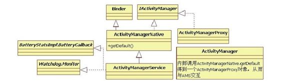

# 6.1　概述

相信绝大部分读者对本书提到的ActivityM anagerService(以后简称AMS）都有所耳闻。AMS是Android中最核心的服务，主要负责系统中四大组件的启动、切换、调度及应用进程的管理和调度等工作，其职责与操作系统中的进程管理和调度模块类似，因此它在Android中非常重要。

AMS是本书碰到的第一块“难啃的骨头”[1]，涉及的知识点较多。为了帮助读者更好地理解AMS，本章将带领读者按5条不同的线来分析它。

第一条线：同其他服务一样，将分析system _server中AM S的调用轨迹。

第二条线：以am命令启动一个Activity为例，分析应用进程的创建、Activity的启动，以及它们和AMS之间的交互等知识。

第三条线和第四条线：分别以Broadcast和Service为例，分析AM S中Broadcast和Service的相关处理流程。其中，Service的分析将只给出流程图，希望读者能在前面学习的基础上自己分析并掌握相关知识。

第五条线：以一个Crash的应用进程为出发点，分析AMS如何打理该应用进程的“身后事”。

除了这5条线外，还将统一分析在这5条线中频繁出现的与AMS中应用进程的调度、内存管理等相关的知识。

提示ContentProvider将放到下一章分析，但是本章将涉及和ContentProvider有关的知识点。

先来看AMS的家族图谱，如图6-1所示。

图6-1 AMS家族图谱由图6-1可知：

AM S由ActivityM anagerNative(以后简称AMN）类派生，并实现W atchdog.M onitor和Ba eryStatsIm pl.Ba eryCa back接口。

而AMN由Binder派生，实现了IActivityM anager接口。

客户端使用ActivityM anager类。由于AM S是系统核心服务，很多API不能开放供客户端使用，因此设计者没有让ActivityM anager直接加入AM S家族。

ActivityM anager类内部通过调用AM N的getDefault函数得到一个ActivityM anagerProxy对象，通过它可与AMS通信。

下面具体分析AMS。相信不少读者已经磨拳擦掌，跃跃欲试了。

提示读者最好在桌上放一杯清茶，以保持AMS分析旅途中头脑清醒。

[1]AMS较复杂，其中一个原因是其功能较多，另一个原因是它的代码质量及结构并不出彩。
