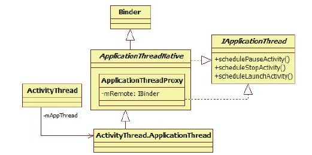

# 6.2.2　AMS的setSystemProcess分析


AM S的setSystem Process的代码如下：

[--＞ActivityM anagerService.java：
setSystem Process]

```java
publi c stati c void setSystemProcess
(){
try{
Acti vit yManagerService m=mSelf;
//向ServiceManager注册几个服务
ServiceManager.addService
("acti vit y",m);
//用于打印内存信息
ServiceManager.addService("meminfo",
new MemBinder(m));
/*
Android4.0新增的服务,用于输出应用进
程使用硬件进行显示加速方面的信息
(Appli cati ons
Graphics Accelerati on Info)。读者可通
过adb she dumpsys gfxinfo查看具体的
输出
*/
ServiceManager.addService("gfxinfo",
new GraphicsBinder(m));
```

if（MONITOR_CPU_USAGE）//该值默认为true，添加cpuinfo服务

```
ServiceManager.addService("cpuinfo",
new CpuBinder(m));
//向SM注册权限管理服务
PermissionContro er
ServiceManager.addService
("permission",new
PermissionContro er(m));
/*
重要说明:
向PackageManagerService查询package名为
android的Appli cati onInfo。
注意这句调用,虽然PKMS和AMS同属一个进
程,但是二者交互仍然借助Context。
其实,此处完全可以直接调用PKMS的函数。
为什么要费如此周折呢?后面具体说明
*/
```

Appli cati onInfo info=//使用AMS的mContext对象

```
mSelf .mContext.getPackageManager
().getAppli cati onInfo(
"android",STOCK_PM_FLAGS);
//①调用Acti vit yThread的
insta SystemAppli cati onInfo函数
mSystemThread.insta SystemAppli cati on
Info(info);
synchronized(mSelf){
//②此处涉及AMS对进程的管理,见下文分
析
ProcessRecord
app=mSelf .newProcessRecordLocked(
mSystemThread.getAppli cati onThread
(),info,
```

info.processName）；//注意，最后一个参数为字符串，值为system

```
app.persistent=true;
app.pid=MY_PID;
app.maxAdj=ProcessList.SYSTEM_ADJ;
//③保存该ProcessRecord对象
mSelf .mProcessNames.put
(app.processName, app.info.uid,
app);
synchronized(mSelf .mPidsSelf Locked){
mSelf .mPidsSelf Locked.put(app.pid,
app);
}
//根据系统当前状态,调整进程的调度优先
级和OOM_Adj,后面将详细分析该函数
mSelf .updateLruProcessLocked(app,
true, true);
}
```

}……//抛出异常

```
}
```

在以上代码中列出了一个重要说明和两个关键点。

重要说明：AMS向PKMS查询名称为android的ApplicationInfo。此处AM S和PKMS的交互是通过Context来完成的，查看这一系列函数调用的代码，最终发现AMS将通过Binder发送请求给PKMS来完成查询功能。AMS和PKMS同属一个进程，它们完全可以不通过Context来交互。此处为何要如此大费周章呢？原因很简单，Android希望system _server中的服务也通过Android运行环境来交互。这更多是从设计上来考虑的，比如组件之间交互接口的统一及未来系统的可扩展性。

关键点一：ActivityThread的insta System ApplicationInfo函数。

关键点二：ProcessRecord类，它和AM S对进程的管理有关。

通过重要说明，相信读者已能真正理解AMS的main函数中第二个目的的作用了。

现在来看第一个关键点，即ActivityThread的insta System ApplicationInfo函数。

1.ActivityThread的insta System ApplicationInfo函数insta System ApplicationInfo函数的参数为一个ApplicationInfo对象，该对象由AM S通过Context查询PKM S中一个名为android的package得来（根据前面介绍的知识，目前只有fram ework-res.apk声明其package名为android）。

再来看insta System ApplicationInfo的代码，如下所示：

[--＞ActivityThread.java：
insta System ApplicationInfo]

```java
publi c void
insta SystemAppli cati onInfo
(Appli cati onInfo info){
synchronized(this){
//返回的ContextImpl对象即之前在AMS的
main函数一节中创建的那个对象
ContextImpl context=getSystemContext
();
//又调用init初始化该Context,是不是重
复调用init呢
context.init(new LoadedApk
(this,"android",context, info,
Compati bilit yInfo.DEFAULT_COMPATIBILIT
Y_INFO),nu , this);
//创建一个Profil er对象,用于性能统计
mProfil er=new Profil er();
}
```

在以上代码中看到调用context.init的地方，读者可能会有疑惑，getSystem Context函数将返回m System Context，而此m System Context在AMS的main函数中已经初始化过了，此处为何再次初始化呢？

仔细查看看代码便会发现：

第一次执行init时，在LoadedApk构造函数中第四个表示ApplicationInfo的参数为nu。

第二次执行init时，LoadedApk构造函数的第四个参数不为空，即该参数将真正指向一个实际的ApplicationInfo，该ApplicationInfo来源于fram ework-res.apk。

基于上面的信息，某些读者可能马上能想到：Context第一次执行init的目的仅仅是创建一个Android运行环境，而该Context并没有和实际的ApplicationInfo绑定。而第二次执行init前，先利用Context和PKM S交互得到一个实际的ApplicationInfo，然后再通过init将此Context和ApplicationInfo绑定。

是否觉得前面的疑惑已豁然而解？且慢，此处又抛出了一个更难的问题：第一次执行init后得到的Context虽然没有绑定ApplicationInfo，不是也能使用吗？此处为何非要和一个ApplicationInfo绑定？答案很简单，因为fram ework-res.apk（包括后面将介绍的Setti ngsProvider.apk）运行在system _server中。和其他所有APK一样，它的运行需要一个正确初始化的Android运行环境。

长嘘一口气，这个大难题终于弄明白了！在此基础上，AMS下一步的工作就顺理成章了。

由于fram ework-res.apk是一个APK文件，和其他APK文件一样，它应该运行在一个进程中。而AMS是专门用于进程管理和调度的，所以运行APK的进程应该在AMS中有对应的管理结构。因此AMS下一步工作就是将这个运行环境和一个进程管理结构对应起来并交由AMS统一管理。

AM S中的进程管理结构是ProcessRecord。

2.ProcessRecord和IApplicationThread分析ProcessRecord之前，先来思考一个问题：AMS如何与应用进程交互？例如AMS启动一个位于其他进程的Activity，由于该Activity运行在另外一进程中，因此AMS势必要和该进程进行跨进程通信。

答案自然是通过Binder进行通信。为此，Android提供了一个IApplicationThread接口，该接口定义了AMS和应用进程之间的交互函数，图6-5所示为该接口的家族图谱。



图6-5 ApplicationThread接口的家庭图谱由图6-5可知：

ApplicationThreadNative实现了IApplicationThread接口。从该接口定义的函数可知，AMS通过它可以和应用进程进行交互，例如，AMS启动一个Activity的时候会调用该接口的scheduleLaunchActivity函数。

ActivityThread通过成员变量m AppThread指向它的内部类ApplicationThread，而ApplicationThread从ApplicationThreadNative派生。

基于以上知识，你能快速得出，IApplicationThread的Binder服务端在应用进程中还是在AMS中，这个问题的答案吗？

提示如果读者知道Binder系统支持客户端监听服务端的死亡消息，那么这个问题的答案就简单了：服务端自然在应用进程中，因为AMS需要监听应用进程的死亡通知。

有了IApplicationThread接口，AM S就可以和应用进程交互了。例如，对于下面一个简单的函数：

[--＞ActivityThread.java：
scheduleStopActivity]

```java
publi c fi nal void scheduleStopActi vit y
(IBinder token, boolean showWindow,
int confi gChanges){
```

queueOrSendMessage（//该函数内部将给一个Handler发送对应的消息

```
showWindow?H.STOP_ACTIVITY_SHOW:
H.STOP_ACTIVITY_HIDE,
token,0,confi gChanges);
}
```

当AMS想要停止（stop）一个Activity时，会调用对应进程IApplicationThreadBinder客户端的scheduleStopActivity函数。该函数服务端实现的就是向ActivityThread所在线程发送一个消息。在应用进程中，ActivityThread运行在主线程中，所以这个消息最终在主线程被处理。

提示Activity的onStop函数也将在主线程中被调用。

IApplicationThread仅仅是AM S和另外一个进程交互的接口，除此之外，AMS还需要更多的有关该进程的信息。在AMS中，进程的信息都保存在ProcessRecord数据结构中。那么，ProcessRecord是什么呢？要回答这个问题，需要先来看setSystem Process的第二个关键点，即newProcessRecordLocked函数，其代码如下：

[--＞ActivityM anagerService.java：
newProcessRecordLocked]

```java
fi nal ProcessRecord
newProcessRecordLocked
(IAppli cati onThread thread,
Appli cati onInfo info, String
customProcess){
String proc=customProcess!=nu ?
customProcess:info.processName;
Ba eryStatsImpl.Uid.Proc ps=nu;
Ba eryStatsImpl
stats=mBa eryStatsService.getActi veSt
ati sti cs();
synchronized(stats){
//BSImpl将为该进程创建一个耗电量统计项
ps=stats.getProcessStatsLocked
(info.uid, proc);
}
//创建一个ProcessRecord对象,代表对应
```

的进程。AMS和该进程的对象是第二个参数

```
thread
return new ProcessRecord(ps, thread,
info, proc);
}
```

ProcessRecord的成员变量较多，先来看看在其构造函数中都初始化了哪些成员变量。

[--＞ProcessRecord.java：
ProcessRecord]

```java
ProcessRecord
(Ba eryStatsImpl.Uid.Proc_ba erySta
ts,
IAppli cati onThread_thread,
Appli cati onInfo_info,
String_processName){
```

ba eryStats=_ba eryStats；//用于电量统计

```
info=_info;//保存Appli cati onInfo
```

processName=_processName；//保存进程名

```
//一个进程能运行多个Package, pkgList用
于保存package名
pkgList.add(_info.packageName);
thread=_thread;//保存
```

IAppli cati onThread，通过它可以和应用进程交互

```
//下面这些xxxAdj成员变量和进程调度优先
```

级、OOM_adj有关。以后再分析它们的作用

```
maxAdj=ProcessList.EMPTY_APP_ADJ;
hiddenAdj=ProcessList.HIDDEN_APP_MIN_A
DJ;
curRawAdj=setRawAdj=-100;
curAdj=setAdj=-100;
//用于控制该进程是否常驻内存(即使被杀
掉,系统也会重启它),只有重要的进程才
```

会有此待遇

```
persistent=false;
removed=false;
}
```

ProcessRecord除保存和应用进程通信的IApplicationThread对象外，还保存了进程名、不同状态对应的Oom_adj值及一个ApplicationInfo。一个进程虽然可运行多个Application，但是ProcessRecord一般保存该进程中先运行的那个Application的ApplicationInfo。

至此，已经创建了一个ProcessRecord对象，和其他应用进程不同的是，该对象对应的进程为system_server。为了彰显其特殊性，AMS为其中的一些成员变量设置了特定的值：

[--＞ActivityM anagerService：
setSystem Process]

```
app.persistent=true;//设置该值为true
```

app.pid=MY_PID；//设置pid为system_server的进程号

```
app.maxAdj=ProcessList.SYSTEM_ADJ;//
```

设置最大OOM_Adj，系统进程默认值为-16

```
//另外,app的processName被设置成
“system”
```

这时，一个针对system _server的ProcessRecord对象就创建完成了。此后AMS将把它并入自己的“势力”范围内。

AMS中有两个成员变量用于保存ProcessRecord，一个是m ProcessNam es，另一个是m PidsSelfLocked。图6-6为这两个成员变量的数据结构示意图。

图6-6 m PidsSelfLocked和mProcessNames数据结构示意图3.AM S的setSystem Process总结现在来总结回顾setSystem Process的工作：

注册AM S、meminfo、gfxinfo等服务到ServiceM anager中。

根据PKMS返回的ApplicationInfo初始化Android运行环境，并创建一个代表system _server进程的ProcessRecord，从此，system _server进程也并入AM S的管理范围内。

6.2.3 AM S的insta System Providers函数分析还记得Setti ngs数据库吗？system _server中很多Service都需要向它查询配置信息。

为此，Android提供了一个Setti ngsProvider来帮助开发者。该Provider在Setti ngsProvider.apk中，insta System Providers就会加载该APK并把Setti ngsProvider放到system _server进程中来运行。

此时的system _server进程已经加载了fram ework-res.apk，现在又要加载另外一个APK文件，这就是多个APK运行在同一进程的典型案例。另外，通过insta System Providers函数还能见识到
