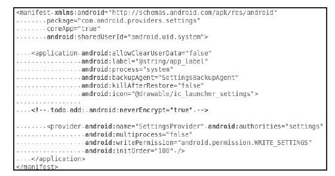
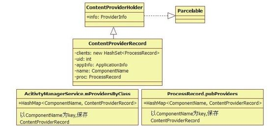
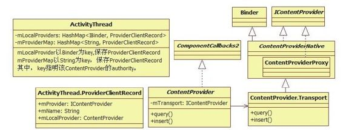

# 6.2.3　AMS的installSystemProviders函数分析


ContentProvider的安装过程。下面就来分析insta System Providers函数，其实现代码如下：

提示读者在定制自己的Android系统时，千万不可去掉/system /app/Setti ngsProvider.apk，否则系统将无法正常启动。

[--＞ActivityM anagerService.java：
insta System Providers]

```java
publi c stati c fi nal void
insta SystemProviders(){
List<ProviderInfo>providers;
synchronized(mSelf){
/*
从mProcessNames找到进程名为“system”
且uid为SYSTEM_UID的ProcessRecord,
返回值就是前面在
insta SystemAppli cati on中创建的那个
ProcessRecord,它代表
SystemServer进程
*/
ProcessRecord
app=mSelf .mProcessNames.get
("system",Process.SYSTEM_UID);
//①关键调用,见下文分析
providers=mSelf .generateAppli cati onPro
vidersLocked(app);
if(providers!=nu){
```

……//将非系统APK（即未设Appli cati onInfo.FLAG_SYSTEM标志）提供的Provider

```
//从providers列表中去掉
}
if(providers!=nu){//②为
```

SystemServer进程安装Provider

```
mSystemThread.insta SystemProviders
(providers);
}
//监视Setti ngs数据库中Secure表的变化,
```

目前只关注long_press_ti meout配置的变化

```
mSelf .mCoreSetti ngsObserver=new
CoreSetti ngsObserver(mSelf);
//UsageStatsService的工作,以后再讨论
mSelf .mUsageStatsService.monit orPackag
es();
}
```

上述代码中列出了两个关键调用，分别是：

调用generateApplicationProvidersLocked函数，该函数返回一个ProviderInfo List。

调用ActivityThread的insta System Providers函数。

ActivityThread可以看做是进程的Android运行环境，那么insta System Providers表示为该进程安装ContentProvider。

注意此处不再区分系统进程还是应用进程。由于只和ActivityThread交互，因此它运行在什么进程中无关紧要。

下面来看第一个关键点generateApplicationProvidersLocked函数。

1.AM S的generateApplicationProvidersLocked函数分析generateApplicationProvidersLocked函数的实现代码如下：

[--＞ActivityM anagerService.java：
generateApplicationProvidersLocked]

```java
private fi nal List<ProviderInfo>
generateAppli cati onProvidersLocked(
ProcessRecord app){
List<ProviderInfo>providers=nu;
try{
//①向PKMS查询满足要求的ProviderInfo,
```

最重要的查询条件包括：进程名和进程uid

```
providers=AppGlobals.getPackageManager
().
queryContentProviders
(app.processName, app.info.uid,
STOCK_PM_FLAGS|PackageManager.GET_URI_
PERMISSION_PATTERNS);
}……
if(providers!=nu){
fi nal int N=providers.size();
for(int i=0;i<N;i++){
//②AMS对ContentProvider的管理,见下文
解释
ProviderInfo cpi=(ProviderInfo)
providers.get(i);
ComponentName comp=new ComponentName
(cpi.packageName, cpi.name);
ContentProviderRecord
cpr=mProvidersByClass.get(comp);
if(cpr==nu){
cpr=new ContentProviderRecord(cpi,
app.info, comp);
//ContentProvider在AMS中用
ContentProviderRecord来表示
mProvidersByClass.put(comp, cpr);//
```

保存到AMS的mProvidersByClass中

```
}
//将信息保存到ProcessRecord中
app.pubProviders.put(cpi.name,
cpr);
//保存PackageName到ProcessRecord中
app.addPackage
(cpi.appli cati onInfo.packageName);
//对该APK进行dex优化
ensurePackageDexOpt
(cpi.appli cati onInfo.packageName);
}
return providers;
}
```

由以上代码可知：

generateApplicationProvidersLocked先从PKM S那里查询满足条件的ProviderInfo信息，而后将它们分别保存到AMS和ProcessRecord中的对应的数据结构中。

下面先来看查询函数queryContentProviders。

（1）PM S中queryContentProviders函数分析queryContentProviders函数的实现代码如下：

[--＞PackageM anagerService.java：
queryContentProviders]

```java
publi c List<ProviderInfo>
queryContentProviders(String
processName,
int uid, int fl ags){
ArrayList<ProviderInfo>
fi();nalList=nu;
synchronized(mPackages){
//还记得mProvidersByComponent的作用
吗?它以ComponentName为key,保存了
//PKMS扫描APK得到的
```

PackageParser.Provider信息。读者可参考图4-9

```
fi nal Iterator<PackageParser.Provider
>i=
mProvidersByComponent.values
().it erator();
whil e(i.hasNext()){
fi nal PackageParser.Provider p=i.next
//下面的if语句将从这些Provider中搜索本
例设置的processName为system,
//uid为SYSTEM_UID, fl ags为FLAG_SYSTEM
的Provider
if(p.info.authorit y!=nu
&&(processName==nu
||(p.info.processName.equals
(processName)
&&
p.info.appli cati onInfo.uid==uid))
&&mSetti ngs.isEnabledLPr(p.info,
fl ags)
&&(!mSafeMode||
(p.info.appli cati onInfo.fl ags
&Appli cati onInfo.FLAG_SYSTEM)!
=0)){
if(fi nalList==nu){
fi nalList=new ArrayList<ProviderInfo
>(3);
}
//由PackageParser.Provider得到
ProviderInfo,并添加到fi nalList中
//关于Provider类及ProviderInfo类,可参
考图4-6
fi nalList.add
(PackageParser.generateProviderInfo
(p, fl ags));
}
if(fi nalList!=nu)
//最终结果按provider的init Order排序,
```

该值用于表示初始化ContentProvider的顺序

```
Co ecti ons.sort(fi nalList,
mProviderInit OrderSorter);
```

return fi nalList；//返回最终结果

```
}
```

queryContentProviders函数很简单，就是从PKMS那里查找满足条件的Provider，然后生成AM S使用的ProviderInfo信息。为何偏偏能找到Setti ngsProvider呢？来看它的AndroidM anifest.xm l文件，如图6-7所示。



图6-7 Setti ngsProvider的AndroidM anifest.xm l文件示意由图6-7可知，Setti ngsProvider设置其uid为android.uid.system，同时在application中设置了process名为system。

而在fram ework-res.apk中也做了相同的设置。所以，现在可以确认SettingsProvider将和fram ework-res.apk运行在同一个进程，即system _server中。

提示从运行效率角度来说，这样做也是合情合理的。因为system_server进程中的很多Service都依赖Settings数据库，把它们放在同一个进程中，可以降低由于进程间通信带来的效率损失。

（2）关于ContentProvider的介绍前面介绍的从PKMS那里查询到的ProviderInfo还属于公有财产，现在我们要将它与AM S及ProcessRecord联系起来。

AM S保存ProviderInfo的原因是它要管理ContentProvider。

ProcessRecord保存ProviderInfo的原因是ContentProvider最终要落实到一个进程中。其实也是为了方便AMS管理，例如该进程一旦退出，AMS需要把其中的ContentProvider信息从系统中去除。

AM S及ProcessRecord均使用了一个新的数据结构ContentProviderRecord来管理ContentProvider信息。图6-8展示了ContentProviderRecord相应的数据结构。



图6-8 ContentProvicerRecord及相应的“管理团队”由图6-8可知：

ContentProviderRecord从ContentProviderHolder派生，内部保存了ProviderInfo、该Provider所驻留的进程ProcessRecord，以及使用该ContentProvider的客户端进程ProcessRecord(即clients成员变量)。

AM S的m ProviderByClass成员变量及ProcessRecord的pubProviders成员变量均以ComponentName为key来保存对应的ContentProviderRecord对象。

至此，Provider信息已经保存到AMS及ProcessRecord中了。那么，下一步的工作是什么呢？

2.ActivityThread的insta System Providers函数分析在AM S和ProcessRecord中都保存了Provider信息，但这些都仅是一些信息，并不是ContentProvider，因此下面要创建一个ContentProvider实例(即Setti ngsProvider对象）。该工作由ActivityThread的insta System Providers函数来完成，其实现代码如下：

[--＞ActivityThread.java：
insta System Providers]

```java
publi c fi nal void
insta SystemProviders(List<
ProviderInfo>providers){
if(providers!=nu)
//调用insta ContentProviders,第一个
参数真实类型是Application
insta ContentProviders
(mIniti alAppli cati on, providers);
}
```

insta ContentProviders这个函数是所有ContentProvider产生的必经之路，其实现代码如下：

[--＞ActivityThread.java：
insta ContentProviders]

```java
private void insta ContentProviders(
Context context, List<ProviderInfo>
providers){
fiif nal ArrayList<
IActi vit yManager.ContentProviderHolder
>result s=
new ArrayList<
IActi vit yManager.ContentProviderHolder
>();
Iterator<ProviderInfo>
i=providers.it erator();
whil e(i.hasNext()){
ProviderInfo cpi=i.next();
//①调用insta Provider函数,得到一个
IContentProvider对象
IContentProvider cp=insta Provider
(context, nu , cpi, false);
(cp!=nu){
IActi vit yManager.ContentProviderHolder
cph=
new
IActi vit yManager.ContentProviderHolder
(cpi);
cph.provider=cp;
//将返回的cp保存到results数组中
result s.add(cph);
synchronized(mProviderMap){
//mProviderRefCountMap,类型为HashMap
<IBinder, ProviderRefCount>,
//主要通过ProviderRefCount对
ContentProvider进行引用计数控制,一旦
```

引用计数

```
//降为零,则表示系统中没有地方使用该
ContentProvider,要考虑从系统中注销它
mProviderRefCountMap.put(cp.asBinder
(),new ProviderRefCount
(10000));
}
try{
//②调用AMS的publi shContentProviders注
册这些ContentProvider,第一个参数
//为Appli cati onThread
Acti vit yManagerNati ve.getDefault
().publi shContentProviders(
getAppli cati onThread(),result s);
}
……
}
```

insta ContentProviders实际上是标准的ContentProvider安装时调用的程序。安装ContentProvider包括两方面的工作：

先在ActivityThread中通过insta Provider得到一个ContentProvider实例。

向AM S发布这个ContentProvider实例。如此这般，一个APK中声明的Content-Provider才能发挥其该有的作用。

提示上述工作其实和BinderService类似，一个BinderService也需要先创建，然后注册到ServiceM anager中。

下面来看ActivityThread的insta Provider函数。

（1）ActivityThread的insta Provider函数分析

[--＞ActivityThread.java：insta Provider]

```java
private IContentProvider
insta Provider(Context context,
IContentProvider provider,
ProviderInfo info, boolean noisy){
//注意本例所传的参数:context为
mIniti alAppli cati on, provider为nu ,
info不为nu,
//noisy为false
ContentProvider localProvider=nu;
if(provider==nu){
Context c=nu;
Appli cati onInfo
ai=info.appli cati onInfo;
/*
下面这个if判断的作用就是为该
CifontentProvider找到对应的Appli cati on。
在AndroidManif est.xml中,
ContentProvider是Appli cati on的子标签,
所以
ContentProvider和Appli cati on有一种对应
关系。在本例中,传入的context(
其实是mIniti alAppli cati on)代表的是
framework-res.apk,而Provider代表的
是Setti ngsProvider。而
Setti ngsProvider.apk所对应的
Appli cati on还未创建,
所以下面的判断语句最终会进入最后的else
分支
*/
(context.getPackageName().equals
(ai.packageName)){
c=context;
}else if(mIniti alAppli cati on!=nu&
&
mIniti alAppli cati on.getPackageName
().equals(ai.packageName)){
c=mIniti alAppli cati on;
}else{
try{
//ai.packageName应该是
Setti ngsProvider.apk的Package,
//名为com.android.providers.setti ngs
//下面将创建一个Context,指向该APK
c=context.createPackageContext
(ai.packageName,
Context.CONTEXT_INCLUDE_CODE);
}
}//if(context.getPackageName
```

（）.equals（ai.packageName））判断结束

```
if(c==nu)return nu;
try{
/*
为什么一定要找到对应的Context呢?除了
ContentProvider和Appli cati on的
对应关系外,还有一个决定性原因:即只有
对应的Context才能加载对应APK的Java字节
码,
从而可通过反射机制生成ContentProvider
实例
*/
fi nal java.lang.ClassLoader
cl=c.getClassLoader();
//通过Java反射机制得到真正的
ContentProvider,
//此处将得到一个Setti ngsProvider对象
localProvider=(ContentProvider)
cl.loadClass(info.name).newInstance
();
//从ContentProvider中取出其mTransport
成员(见下文分析)
provider=localProvider.getIContentProv
ider();
if(provider==nu)return nu;
//初始化该ContentProvider,内部会调用
其onCreate函数
localProvider.a achInfo(c, info);
}……
```

}//if（provider==nu）判断结束

```
synchronized(mProviderMap){
/*
ContentProvider必须指明一个或多个
authority,在第4章曾经提到过,
在URL中host:port的组合表示一个
authority。这个单词不太好理解,可简单
认为它用于指定ContentProvider的位置
(类似网站的域名)
*/
String names[] =PATTERN_SEMICOLON.split
(info.authorit y);
for(int i=0;i<names.length;i++){
ProviderCli entRecord pr=new
ProviderCli entRecord(names[i],
provider, localProvider);
try{
//下面这条语句对linkToDeath的调用颇让
人费解,见下文分析
provider.asBinder().li nkToDeath
(pr,0);
mProviderMap.put(names[i],pr);
}……
```

}//for循环结束

```
if(localProvider!=nu){
//mLocalProviders用于存储由本进程创建
的ContentProvider信息
mLocalProviders.put(provider.asBinder
(),
new ProviderCli entRecord(nu ,
provider, localProvider));
}
}//synchronized结束
return provider;
}
```

以上代码不算复杂，但是涉及一些数据结构和一条令人费解的语句，即对inkToDeath函数的调用语句。先来说说那句令人费解的调用。

在本例中，provider变量并非通过函数参数传入，而是在本进程内部创建的。provider在本例中是Bn端（后面分析ContentProvider的getIContentProvider时即可知道），Bn端进程为Bn端设置死亡通知本身就比较奇怪。如果Bn端进程死亡，它设置的死亡通知也无法发送给自己。幸好源代码中有句注释：“Cachethepointerforthe rem ote provider”。意思是如果provider参数是通过insta Provider传递过来的（即该Provider代表远端进程的ContentProvider，此时它应为Bp端），那么这种处理是合适的。不管怎样，这仅仅是为了保存pointer，所以也无关紧要。

至于代码中涉及的数据结构如图6-9所示。



图6-9 ActivityThread中ContentProvider涉及的数据结构由图6-9可知：

ContentProvider类本身只是一个容器，而跨进程调用的支持是通过内部类Transport实现的。Transport从ContentProviderNative派生，而ContentProvider的成员变量m Transport指向该Transport对象。ContentProvider的getIContentProvider函数即返回m Transport成员变量。

ContentProviderNative从Binder派生，并实现了IContentProvider接口。其内部类ContentProviderProxy是供客户端使用的。

ProviderClientRecord是ActivityThread提供的用于保存ContentProvider信息的一个数据结构。它的mLocalProvider用于保存ContentProvider对象，m Provider用于保存IContentProvider对象。另外一个成员m Nam e用于保存该ContentProvider的一个authority。注意，ContentProvider可以定义多个authority，就好像一个网站有多个域名一样。

至此，本例中的Setti ngProvider已经创建完毕，接下来的工作就是把它推向历史舞台—即发布该Provider了。

（2）AM S的publishContentProviders分析publishContentProviders函数用于向AM S注册ContentProviders，其实现代码如下：

[--＞ActivityM anagerService.java：
publishContentProviders]

```java
publi c fi nal void
publi shContentProviders
(IAppli cati onThread ca er,
List<ContentProviderHolder>
providers){
……
synchronized(this){
//找到调用者所在的ProcessRecord对象
fi nal ProcessRecord
r=getRecordForAppLocked(ca er);
……
fiif nal long
origId=Binder.clearCalli ngIdentit y
();
fi nal int N=providers.size();
for(int i=0;i<N;i++){
ContentProviderHolder
src=providers.get(i);
……
//①注意:先从该ProcessRecord中找对应
的ContentProviderRecord
ContentProviderRecord
dst=r.pubProviders.get
(src.info.name);
(dst!=nu){
ComponentName comp=new ComponentName
(dst.info.packageName,
dst.info.name);
//以ComponentName为key,保存到
mProvidersByClass中
mProvidersByClass.put(comp, dst);
String
names[] =dst.info.authorit y.split
(";");
for(int j=0;j<names.length;j++)
mProvidersByName.put(names[j],
dst);//以authorit y为key,
//mLaunchingProviders用于保存处于启动
状态的Provider
int NL=mLaunchingProviders.size();
int j;
for(j=0;j<NL;j++){
if(mLaunchingProviders.get(j)
==dst){
mLaunchingProviders.remove(j);
j--;
NL--;
}//
}//for(j=0;j<NL;j++)结束
synchronized(dst){
dst.provider=src.provider;
dst.proc=r;
dst.notif yA();
}//synchronized结束
```

updateOomAdjLocked（r）；//每发布一个Provider，需要调整对应进程的oom_adj

```
}//if(dst!=nu)结束
}//for(int i=0;j<N;j++)结束
Binder.restoreCalli ngIdentit y
(origId);
}//synchronized(this)结束
}
```

这里应解释一下publishContentProviders的工作流程：

先根据调用者的PID找到对应的ProcessRecord对象。

该ProcessRecord的pubProviders中保存了ContentProviderRecord信息。该信息由前面介绍的AMS的generateApplicationProvidersLocked函数根据Package本身的信息生成。此处将判断要发布的ContentProvider是否由该Package声明。

如果判断返回成功，则将该ContentProvider及其对应的authority加到m Providers-ByNam e中。注意，AM S中还有一个m ProvidersByClass变量，该变量以Content-Provider的Com ponentNam e为key，即系统提供两种方式找到某一个Content-Provider，一种是通过authority，另一种方式就是指明Com ponentNam e。

m LaunchingProviders和最后的notif yA函数用于通知那些等待ContentProvider所在进程启动的客户端进程。例如，进程A要查询一个数据库，需要通过进程B中的某个ContentProvider来实施。如果B还未启动，那么AMS就需要先启动B。在这段时间内，A需要等待B启动并注册对应的ContentProvider。B一旦完成注册，就需要告知A退出等待以继续后续的查询工作。

现在，一个Setti ngsProvider就算正式在系统中挂牌并注册了，此后，和Settings数据
