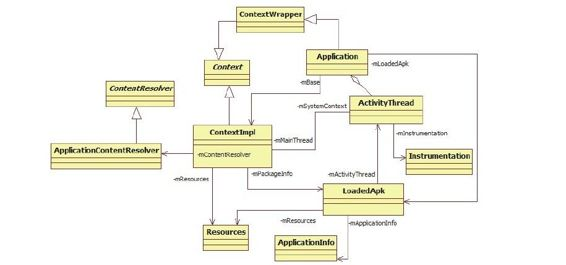
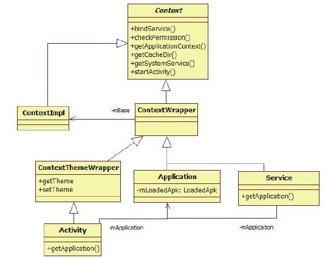
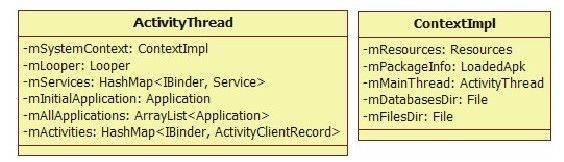

# 6.2　初识ActivityManagerService


AM S由system _server的ServerThread线程创建，提取它的调用轨迹，代码如下：

[--＞system _server.java：ServerThread的

run函数]

```
//①调用main函数,得到一个Context对象
context=Acti vit yManagerService.main
(factoryTest);
//②setSystemProcess:这样
system_server进程可加到AMS中,并被它管
理
Acti vit yManagerService.setSystemProces
s();
//③insta SystemProviders:将
Setti ngsProvider放到system_server进程
```

中来运行

```
Acti vit yManagerService.insta SystemPr
oviders();
//④在内部保存WindowManagerService(以
后简称WMS)
Acti vit yManagerService.self
().setWindowManager(wm);
//⑤和WMS交互,弹出“启动进度“对话框
Acti vit yManagerNati ve.getDefault
().showBootMessage(
context.getResources().getText(
//该字符串中文意思为:正在启动应用程序
com.android.internal.R.string.android_
upgrading_starti ng_apps),
false);
//⑥AMS是系统的核心,只有它准备好后,
```

才能调用其他服务的systemReady

```
//注意,有少量服务在AMS systemReady之
前就绪,它们不影响此处的分析
Acti vit yManagerService.self
().systemReady(new Runnable(){
publi c void run(){
startSystemUi(contextF);//启动
```

systemUi。如此，状态栏就准备好了

```
if(ba eryF!=nu)
ba eryF.systemReady();
if(networkManagementF!=nu)
networkManagementF.systemReady();
……
Watchdog.getInstance().start();//
启动Watchdog
```

……//调用其他服务的systemReady函数

```
}
```

在以上代码中，一共列出了6个重要调用及这些调用的简单说明，本节将分析除与W indowM anagerService(以后简称WMS）交互的④、⑤外的其余四项调用。

先来分析①处调用。

6.2.1 ActivityM anagerService的m ain函数分析AM S的main函数将返回一个Context类型的对象，该对象在system_server中被其他服务大量使用。Context，顾名思义，代表了一种上下文环境（笔者觉得其意义和JNIEnv类似），有了这个环境，我们可以做很多事情（例如获取该环境中的资源、Java类信息等）。那么AMS的main将返回一个怎样的上下文环境呢？来看以下代码：

[--＞ActivityM anagerService.java：m ain]

```java
publi c stati c fi nal Context main(int
factoryTest){
AThread thr=new AThread();//①创建
```

一个AThread线程对象

```
thr.start();
```

……//等待thr创建成功

```
Acti vit yManagerService
m=thr.mService;
mSelf =m;
//②调用Acti vit yThread的systemMain函数
Acti vit yThread
at=Acti vit yThread.systemMain();
mSystemThread=at;
//③得到一个Context对象,注意调用的函
数名为getSystemContext,何为System
Context
Context context=at.getSystemContext
();
context.setTheme
(android.R.style.Theme_Holo);
m.mContext=context;
m.mFactoryTest=factoryTest;
//Acti vit yStack是AMS中用来管理Acti vit y
的启动和调度的核心类,以后再分析它
m.mMainStack=new Acti vit yStack(m,
context, true);
//调用BSS的publish函数,这个知识点我们
在第5章中介绍过了
m.mBa eryStatsService.publi sh
(context);
//另外一个service:UsageStatsService。
```

读者阅读完本章后自行分析它

```
m.mUsageStatsService.publi sh
(context);
synchronized(thr){
thr.mReady=true;
```

thr.notif yA（）；//通知thr线程，本线程工作完成

```
}
//④调用AMS的startRunning函数
m.startRunning(nu , nu , nu ,
nu);
return context;
}
```

在main函数中，我们又列出了4个关键函数，分别是：

创建AThread线程。虽然AM S的main函数由ServerThread线程调用，但是AM S自己的工作并没有放在ServerThread中去做，而是新创建了一个线程，即AThread线程。

ActivityThread.system M ain函数。初始化ActivityThread对象。

ActivityThread.getSystem Context函数。

用于获取一个Context对象，从函数名上看，该Context代表了System的上下文环境。

AM S的startRunning函数。

注意，main函数中有一处等待（wait）、一处通知（notifyA），这是因为：

main函数首先需要等待AThread所在线程启动并完成一部分工作。

AThread完成那一部分工作后，将等待main函数完成后续的工作。

这种双线程互相等待的情况，在Android代码中比较少见，读者只需了解它们的目的即可。下边来分析以上代码中的第一个关键点。

1.AThread分析（1）AThread分析AThread的代码如下：

[--＞ActivityM anagerService.java：
AThread]

```java
stati c class AThread extends
Thread{//AThread从Thread类派生
Acti vit yManagerService mService;
boolean mReady=false;
publi c AThread(){
```

super（"Acti vit yManager"）；//线程名就叫Acti vit yManager

```
}
publi c void run(){
```

Looper.prepare（）；//看来，AThread线程将支持消息循环android.os.Process.setThreadPriorit y（//设置线程优先级

```
android.os.Process.THREAD_PRIORITY_FOR
EGROUND);
android.os.Process.setCanSelf Backgroun
d(false);
//创建AMS对象
Acti vit yManagerService m=new
Acti vit yManagerService();
synchronized(this){
```

mService=m；//为AThread内部成员变量mService赋值，指向AMSnotif yA（）；//通知main函数所在线程

```
}
synchronized(this){
whil e(!mReady){
try{
```

wait（）；//等待main函数所在线程的

```
notif yA
}……
}
}……
```

Looper.loop（）；//进入消息循环

```
}
```

从本质上说，AThread是一个支持消息循环及处理的线程，其主要工作就是创建AMS对象，然后通知AMS的main函数。这样看来，main函数等待的就是这个AMS对象。

（2）AMS的构造函数分析AMS的构造函数的代码如下：

[--＞ActivityM anagerService.java：
ActivityM anagerService]

```java
private Acti vit yManagerService(){
File
dataDir=Environment.getDataDirectory
```

（）；//指向/data/目录

```
Fil e systemDir=new Fil e
(dataDir,"system");//指
```

向/data/system/目录

```
systemDir.mkdirs();//创
```

建/data/system/目录

```
//创建Ba eryStatsService(以后简称
BSS)和UsageStatsService(以后简称
USS)
//我们在分析PowerManageService时已经见
过BSS了
mBa eryStatsService=new
Ba eryStatsService(new Fil e(
systemDir,"ba erystats.bin").toStri
ng());
mBa eryStatsService.getActi veStati sti
cs().readLocked();
mBa eryStatsService.getActi veStati sti
cs().writ eAsyncLocked();
mOnBa ery=DEBUG_POWER?true
:
mBa eryStatsService.getActi veStati sti
cs().getIsOnBa ery();
mBa eryStatsService.getActi veStati sti
cs().setCa back(this);
//创建USS
mUsageStatsService=new
UsageStatsService(new Fil e(
systemDir,"usagestats").toString
());
//获取OpenGl版本
GL_ES_VERSION=SystemProperti es.getInt
("ro.opengles.version",
Confi gurati onInfo.GL_ES_VERSION_UNDEFI
NED);
//mConfi gurati on类型为Confi gurati on,
```

用于描述资源文件的配置属性，例如

```
//字体、语言等
mConfi gurati on.setToDefault s();
mConfi gurati on.locale=Locale.getDefau
lt();
//mProcessStats为ProcessStats类型,用
```

于统计CPU、内存等信息。其内部工作原理就是

```
//读取并解析/proc/stat文件的内容。该文
件由内核生成,用于记录kernel及system
//一些运行时的统计信息。读者可在Linux
系统上通过manproc命令查询详细信息
mProcessStats.init();
//解析/data/system/packages-compat.xml
文件,该文件用于存储那些需要考虑屏幕尺
寸
//的APK的一些信息。读者可参考
AndroidManif est.xml中compati ble-
```

screens相关说明。

```
//当APK所运行的设备不满足要求时,AMS会
根据设置的参数以采用屏幕兼容的方式去运
行它
mCompatModePackages=new
CompatModePackages(this,
systemDir);
Watchdog.getInstance().addMonit or
(this);
//创建一个新线程,用于定时更新系统信息
(和mProcessStats交互)
mProcessStatsThread=new Thread
```

（"ProcessStats"）{……//先略去该段代码}

```
mProcessStatsThread.start();
}
```

AMS的构造函数比想象得要简单些，下面回顾一下它的工作：

创建BSS、USS、m ProcessStats(ProcessStats类型)、m ProcessStatsThread线程，这些都与系统运行状况统计相关。

创建/data/system目录，为

```
m Com patM odePackages
(Com patM odePackages类型)和
```

m Configuration（Configuration类型）等成员变量赋值。

AMSmain函数的第一个关键点就分析到此，接下来来分析它的第二个关键点。

2.ActivityThread.system M ain函数分析ActivityThread是Android Fram ework中一个非常重要的类，它代表一个应用进程的主线程（对于应用进程来说，ActivityThread的main函数确实是由该进程的主线程执行），其职责就是调度及执行在该线程中运行的四大组件。

注意应用进程指那些运行APK的进程，它们由Zyote派生（fork）而来，上面运行了dalvik虚拟机。与应用进程相对的就是系统进程(包括Zygote和system _server)。

另外，读者须将“应用进程和系统进程”与“应用APK和系统APK”的概念区分开来。

对APK的判别依赖其文件所在位置（如果APK文件在/data/app目录下，则为应用APK）。

ActivityThread.system M ain函数代码如下：

[--＞ActivityThread.java：system M ain]

```java
publi c stati c fi nal Acti vit yThread
systemMain(){
HardwareRenderer.disable(true);//禁
```

止硬件渲染加速

```
//创建一个ActivityThread对象,其构造函
数非常简单
Acti vit yThread thread=new
Acti vit yThread();
```

thread.a ach（true）；//调用它的a ach函数，注意传递的参数为true

```
return thread;
}
```

在分析ActivityThread的a ach函数之前，先提一个问题供读者思考：前面所说的ActivityThread代表应用进程（其上运行了APK）的主线程，而system _server并非一个应用进程，那么为什么此处也需要ActivityThread呢？

还记得在PackageM anagerService分析中提到的fram ework-res.apk吗？这个APK除了包含资源文件外，还包含一些Activity（如关机对话框），这些Activity实际上运[1]行在system _server进程中。从这个角度看，system _server是一个特殊的应用进程。

通过ActivityThread可以把Android系统提供的组件之间的交互机制和交互接口（如利用Context提供的API）也拓展到system _server中使用。

提示解答这个问题，对于理解system_server中各服务的交互方式是尤其重要的。

下面来看ActivityThread的a ach函数。

（1）aach函数分析

[--＞ActivityThread.java：a ach]

```java
private void a ach(boolean system){
sThreadLocal.set(this);
```

mSystemThread=system；//判断是否为系统进程

```
if(!system){
```

……//应用进程的处理流程}else{//系统进程的处理流程，该情况只在system_server中处理

```
//设置DDMS时看到的system_server进程名
为system_process
android.ddm.DdmHandleAppName.setAppNam
e("system_process");
try{
//ActivityThread的几员“大将”出场,见
后文的分析
mInstrumentati on=new Instrumentati on
();
ContextImpl context=new ContextImpl
();
//初始化context,注意第一个参数值为
getSystemContext
context.init(getSystemContext
().mPackageInfo, nu , this);
Appli cati on app=//利用Instrumentati on
```

创建一个Application对象

```
Instrumentati on.newAppli cati on
(Appli cati on.class, context);
//一个进程支持多个Application,
```

mA Applications用于保存该进程中的

```
//Appli cati on对象
mA Appli cati ons.add(app);
mIniti alAppli cati on=app;//设置
mIniti alAppli cati on
```

app.onCreate（）；//调用Appli cati on的onCreate函数

```
}……//try/catch结束
```

}//if（！system）判断结束

```
//注册Confi gurati on变化的回调通知
ViewRootImpl.addConfi gCa back(new
ComponentCa backs2(){
publi c void onConfi gurati onChanged
(Confi gurati on newConfi g){
```

……//当系统配置发生变化（如语言切换等）时，需要调用该回调

```
}
publi c void onLowMemory(){}
publi c void onTrimMemory(int level)
{}
});
}
```

aach函数中出现了几个重要成员，其类型分别是Instrum entation类、Application类及Context类，它们的作用如下（为了保证准确，这里先引用Android的官方说明）。

Instrum entation：Base class forim plem enting applicationinstrum entation code. W henrunningwith instrum entation turned on, thisclass will be instantiated foryou beforeany of the application code, a owingyou to m onitora ofthe interaction thesystem has with the application.AnInstrum entation im plem entation isdescribed to the system through anAndroidM anifest.xm l's＜instrum entation＞tag.大意是：

Instrumentation是一个工具类。当它被启用时，系统先创建它，再通过它来创建其他组件。另外，系统和组件之间的交互也将通过Instrum entation来传递，这样，Instrumentation就能监测系统和这些组件的交互情况了。在实际使用中，我们可以创建Instrumentation的派生类来进行相应的处理。读者可查询Android中Junit的使用来了解Instrumentation的作用。本书不讨论Instrum entation方面的内容。

Application：Base class for those whoneed to m aintain global applicationstate. Youcan provide your ownim plem entation by specifying its nam ein your AndroidM anifest.xm l's＜application＞tag,which will cause thatclass to be instantiated for you whenthe process for yourapplication/package is created.大意是：

Application类保存了一个全局的application状态。Application由AndroidM anifest.xm l中的＜application＞标签声明。在实际使用时需定义Application的派生类。

Context：Interface to globalinform ation about an applicationenvironm ent. This is anabstract classwhose im plem entation is provided bythe Android system .It a ows access toapplication-specifi c resources andclasses, as we as up-ca s forapplication-level operations such aslaunching activiti es, broadcasting andreceiving intents,etc.大意是：Context是一个接口，通过它可以获取并操作Application对应的资源、类，甚至包含于Application中的四大组件。

提示此处的Application是Android中的一个概念，可理解为一种容器，其内部包含四大组件。另外，一个进程可以运行多个Application。

Context是一个抽象类，而由AMS创建的是它的子类ContextImpl。如前所述，Context提供了Application的上下文信息，这些信息是如何传递给Context的呢？此问题包括两个方面：

Context本身是什么？

Context背后所包含的上下文信息又是什么？

下面来关注上边代码中调用的getSystem Context函数。

（2）getSystem Context函数分析getSystem Context函数的实现代码如下：

[--＞ActivityThread.java：
getSystem Context]

```java
publi c ContextImpl getSystemContext
(){
synchronized(this){
```

if（mSystemContext==nu）{//单例模式

```
ContextImpl
context=ContextImpl.createSystemContex
t(this);
//LoadedApk是Android2.3引入的一个新
类,代表一个加载到系统中的APK
LoadedApk info=new LoadedApk
(this,"android",context, nu,
Compati bilit yInfo.DEFAULT_COMPATIBILIT
Y_INFO);
//初始化该ContextImpl对象
context.init(info, nu , this);
//初始化资源信息
context.getResources
().updateConfi gurati on(
getConfi gurati on(),
getDisplayMetricsLocked(
Compati bilit yInfo.DEFAULT_COMPATIBILIT
Y_INFO, false));
```

mSystemContext=context；//保存这个特殊的ContextImpl对象

```
}
return mSystemContext;
}
```

以上代码无非是先创建一个ContextImpl，然后再将其初始化（调用init函数）。为什么函数名是getSystem Context呢？因为在初始化ContextImp时使用了一个LoadedApk对象。如注释中所说，LoadedApk是Android2.3引入的一个类，该类用于保存一些和APK相关的信息（如资源文件位置、JNI库位置等）。在getSystem Context函数中初始化ContextIm pl的这个LoadedApk所代表的package，名为“android”，也就是fram ework-res.apk，由于该APK仅供system _server进程使用，所以此处称为getSystem Context。

上面这些类的关系比较复杂，可通过图6-2展示它们之间的关系。



图6-2 ContextImpl和它的“兄弟”们由图6-2可知：

先来看派生关系，ApplicationContentResolver从ConentResolver派生，它主要用于和ContentProvider打交道。ContextIm pl和ContextW rapper均从Context继承，而Application则从ContextW rapper派生。

从涉及的面来看，ContextImpl涉及的面最广。它通过m Resources指向Resources，通过m PackageInfo指向LoadedApk，通过m M ainThread指向ActivityThread，通过m ContentResolver指向ApplicationContentResolver。

ActivityThread代表主线程，它通过m Instrum entation指向Instrum entation。

另外，它还保存多个Application对象。

注意在函数中有些成员变量的类型为其基类的类型，而在图6-2中直接指向了实际类型。

（3）systemM ain函数总结systemMain函数调用结束后，我们得到了什么？

得到一个ActivityThread对象，它代表应用进程的主线程。

得到一个Context对象，它背后所指向的Application环境与fram ework-res.apk有关。费了如此大的工夫，systemMain函数的目的到底是什么？一针见血地说：

system M ain函数将为system _server进程搭建一个和应用进程一样的Android运行环境。这句话涉及两个概念。

进程：来源于操作系统，是在OS中看到的运行体。我们编写的代码一定要运行在一个进程中。

Android运行环境：Android努力构筑了一个自己的运行环境。在这个环境中，进程的概念被模糊化了。组件的运行及它们之间的交互均在该环境中实现。

Android运行环境是构建在进程之上的。有Android开发经验的读者可能会发现，应用程序一般只和Android运行环境交互。基于同样的道理，system_server希望它内部的那些service也通过Android运行环境交互，因此也需为它创建一个运行环境。由于system _server的特殊性，此处调用了systemMain函数，而普通的应用进程将在主线程中调用ActivityThread的main函数来创建Android运行环境。

另外，ActivityThread虽然本意是代表进程的主线程，但是作为一个Java类，它的实例到底由什么线程创建，恐怕不是ActivityThread自己能做主的，所以在system _server中可以发现，ActivityThread对象由其他线程创建，而在应用进程中，ActivityThread将由主线程来创建。

3.ActivityThread.getSystem Context函数分析ActivityThread.getSystem Context函数在上一节已经见过了。调用该函数后，将得到一个代表系统进程的Context对象。到底什么是Context？先来看图6-3所示的Context家族图谱。

注意该族谱成员并未完全列出。另外，Activity、Service和Application所实现的接口也未画出。

由图6-3可知：

ContextW rapper比较有意思，其在SDK中的说明为Proxying im plem entationofContextthatsim plydelegatesa ofitsca s to another Context.Can besubclassed to m odify behaviorwithoutchanging the originalContext.大概意思是：ContextW rapper是一个代理类，被代理的对象是另外一个Context。在图6-3中，被代理的类其实是ContextImpl，由ContextW rapper通过m Base成员变量指定。读者可查看Context-W rapper.java，其内部函数功能的实现最终都由mBase完成。这样设计的目的是想把ContextImpl隐藏起来。



图6-3 Context家族图谱Application从ContextW rapper派生，并实现了ComponentCa backs2接口。

Application中有一个LoadedApk类型的成员变量mLoadedApk。LoadedApk代表一个APK文件。由于一个AndroidM anifest.xm l文件只能声明一个Application标签，所以一个Application必然会和一个LoadedApk绑定。

Service从ContextW rapper派生，其中Service内部成员变量m Application指向Application(在AndroidM anifest.xm l中，Service只能作为Application的子标签，所以在代码中Service必然会和一个Application绑定）。

ContextThem eW rapper重载了和Them e（主题）相关的两个函数。这些和界面有关，所以Activity作为Android系统中的UI容器，必然也会从ContextThemeW rapper派生。与Service一样，Activity内部也通过mApplication成员变量指向Application。

对ifContext的分析先到这里，再来分析第三个关键函数startRunning。

4.AM S的startRunning函数分析startRunning函数的实现代码如下：

[--＞ActivityM anagerService.java：
startRunning]

```java
//注意调用该函数时所传递的4个参数全为
nu
publi c fi nal void startRunning(String
pkg, String cls, String acti on,
String data){
synchronized(this){
```

（mStartRunning）return；//如果已经调用过该函数，则直接返回

```
mStartRunning=true;
//mTopComponent最终赋值为nu
mTopComponent=pkg!=nu&&cls!=nu
?new ComponentName(pkg, cls):nu;
mTopActi on=acti on!=nu ?acti on:
Intent.ACTION_MAIN;
```

mTopData=data；//mTopData最终为nu

```
if(!mSystemReady)return;//此时
```

mSystemReady为false，所以直接返回

```
}
```

systemReady（nu）；//这个函数很重要，可惜不在本次startRunning中调用

```
}
```

startRunning函数很简单，此处不赘述。

至此，AMS的main函数所涉及的4个知识点已全部分析完。下面回顾一下AMS的main函数的工作。

5.ActivityM anagerService的m ain函数总结AMS的main函数的目的有两个：

第一个也是最容易想到的目的是创建AMS对象。

另外一个目的比较隐晦，但是非常重要，那就是创建一个供system_server进程使用的Android运行环境。

根据目前所分析的代码，Android运行环境将包括两个类成员：ActivityThread和Context-Im pl（一般用它的基类Context）。

图6-4展示了在这两个类中定义的一些成员变量，通过它们可看出ActivityThread及Context-Im pl的作用。



图6-4 ActivityThread和ContextIm pl中的部分成员变量由图6-4可知：

ActivityThread中有一个m Looper成员，它代表一个消息循环。这恐怕是ActivityThread被称做“Thread”的一个直接证据。另外，mServices用于保存Service, Activiti es用于保存ActivityClientRecord,m A Applications用于保存Application。关于这些变量的具体作用，以后遇到时再介绍。

对于ContextImpl，其成员变量表明它和资源、APK文件有关。

AMS的main函数先分析到此，其创建的Android运行环境将在后面的分析中用到。

接下来分析AMS的第三个调用函数

```
setSystem Process。
[1]实际上,Setti ngsProvider.apk也运行于
```

system _server进程中。
