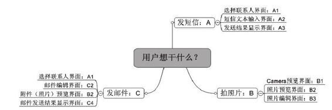
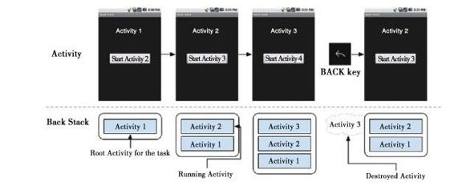
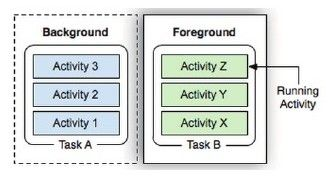
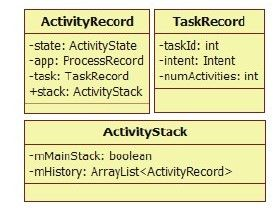

# 6.3.2　AMS的startActivityAndWait函数分析


6.3.2 AM S的startActivityAndW ait函数分析startActivityAndW ait函数有很多参数，下面先来认识一下它们。

[--＞ActivityM anagerService.java：

startActivityAndW ait原型]

```
publi c fi nal Wait Result
startActi vit yAndWait(
/*
在绝大多数情况下,一个Acitivity的启动
是由一个应用进程发起的,
IAppli cati onThread是
应用进程和AMS交互的通道,也可算是调用
进程的标识,在本例中,am并非一个应用进
程,所以
传递的ca er为nu
*/
IAppli cati onThread ca er,
//Intent及resolvedType,在本例中,
resolvedType为nu
Intent intent, String resolvedType,
//grantedUriPermissions和granteMode两
个参数和授权有关,读者可参考第3章对
Cli pboard
```

Service分析时介绍的授权知识Uri[] grantedUriPermissions，//在本例中为nuint grantedMode，//在本例中为0IBinder result To，//在本例中为nu，用于接收startActi vit yForResult的结果String result Who，//在本例中为nu

```
//requestCode在本例中为0,该值的具体意
```

义由调用者解释。如果该值大于等于0，则AMS内部保存该值，

```
//并通过onActi vit yResult返回给调用者
int requestCode,
```

boolean onlyIfNeeded，//本例为falseboolean debug，//是否调试目标进程

```
//下面3个参数和性能统计有关
String profil eFil e,
ParcelFil eDescriptor profil eFd,
boolean autoStopProfil er)
```

关于以上代码中一些参数的具体作用，以后碰到时会再作分析。建议读者先阅读SDK文档中关于Activity类定义的几个函数，如startActivity、startActivityForResult及onActivity-Result等。

startActivityAndW ait的代码如下：

[--＞ActivityM anagerService.java：
startActivityAndW ait]

```java
publi c fi nal Wait Result
startActi vit yAndWait
(IAppli cati onThread ca er,
Intent intent, String resolvedType,
Uri[] grantedUriPermissions,
int grantedMode, IBinder result To,
String result Who, int requestCode,
boolean onlyIfNeeded, boolean debug,
String profil eFil e,
ParcelFil eDescriptor profil eFd,
boolean autoStopProfil er){
//创建WaitResult对象用于存储处理结果
Wait Result res=new Wait Result();
//mMainStack为Acti vit yStack类型,调用
它的startActi vit yMayWait函数
mMainStack.startActi vit yMayWait
(ca er,-1,intent, resolvedType,
grantedUriPermissions, grantedMode,
result To, result Who,
requestCode, onlyIfNeeded, debug,
profil eFil e, profil eFd,
autoStopProfil er, res, nu);//最后
```

一个参数为Confi gurati on，

```
//在本例中为nu
return res;
}
```



mMainStack为AMS的成员变量，类型为ActivityStack，该类是Activity调度的核心角色。正式分析它之前，有必要先介绍一下相关的基础知识。

图6-10用户想干的事1.Task、Back Stack、ActivityStack及Launch m ode提示为什么叫Activity？读者可参考M errian-W ebster词典对Activity的解释（1）关于Task及Back Stack的介绍

```
[1]
:“an organi-zational unit for
```

先来看图6-10所示，其中列出了用户在perform ing a specific function”，也就Android系统上想干的三件事情，分别用是说，它是一个有组织的单元，用于完成某A、B、C表示，将每一件事情称为一个项指定功能。

Task。一个Task还可细分为多个子步骤，即由图6-10可知，A、B两个Task使用了不同Activity。

的Activity来完成相应的任务。注意，A、B这两个Task的Activity之间没有复用。

再来看C这个Task，它可细分为4个Activity，其中有两个Activity分别使用了ATask的A1、B Task的B2。C Task为什么不新建自己的Activity，而用其他Task的呢？

这是因为用户想做的事情（即Task）即使完全不同，但是当细分Task为Activity时，也可能出现Activity功能类似的情况。既然A1、B2已能满足要求，自然也就不用重复创建Activity了。另外，通过重用Activity，也可为用户提供一致的界面和体验。

了解了Android设计理念后，我们来看看Android是如何组织Task及它所包含的Activity的。此处有一个简单的例子，如图6-11所示。

由图6-11可知：

本例中的Task包含4个Activity。用户可单击按钮跳转到下一个Activity。同时，通过返回键可回到上一个Activity。

虚线下方是这些Activity的组织方式。

Android采用了Stack的方法管理这3个Activity。例如在Activity1启动Activity2后，Activity2入栈成为栈顶成员，Activity1成为栈底成员，而界面显示的是栈顶成员的内容。当按返回键时，Activity3出栈，这时候Activity2成为栈顶，界面显示也相应变成了Activity2。



图6-11 Task及Back Stack示例以上是一个Task的情况。那么，多个Task又会是何种情况呢？如图6-12所示。



图6-12多个Task的情况由图6-12可知：对多Task的情况来说，系统只支持一个处于前台的Task，即用户当前看到的Activity所属的Task的，其余的Task均处于后台，这些后台Task内部的Activity保持顺序不变。用户可以一次将整个Task挪到后台或者置为前台。

提示用过Android手机的读者应该知道，长按Home键，系统会弹出近期Task列表，使用户能快速在多个Task间切换。

以上内容从抽象角度介绍了什么是Task，以及Android如何分解Task和管理Activity，那么在实际代码中，是如何考虑并设计的呢？

（2）关于ActivityStack的介绍通过上述分析，我们对Android的设计有了一定了解，那么如何用代码来实现这一设计呢？此处有两点需要考虑：

Task内部Activity的组织方式。由图6-11可知，Android通过先入后出的方式来组织Activity。数据结构中的Stack即以这种方式工作。



图6-13 ActivityStack及相关成员多个Task的组织及管理方式。

Android设计了一个ActivityStack类来负责上述工作，它的组成如图6-13所示。

由图6-13可知：

Activity由ActivityRecord表示，Task由TaskRecord表示。ActivityRecord的task成员指向该Activity所在的Task。state变量用于表示该Activity所处的状态（包括INITIALIZING、RESUM ED、PAUSED等状态）。

ActivityStack用m H istory这个ArrayList保存ActivityRecord。令人大跌眼镜的是，该mHistory保存了系统中所有Task的ActivityRecord，而不是针对某个Task进行保存。

ActivityStack的m M ainStack成员比较有意思，它代表此ActivityStack是否为主ActivityStack。有主必然有从，但是目前系统中只有一个ActivityStack，并且它的m M ainStack为true。从ActivityStack的命名可推测，Android在开发之初也想用ActivityStack来管理单个Task中的ActivityRecord(在ActivityStack.java的注释中说过，该类为“Stateandm anagem ent of a single stack ofactivities”），但不知何故，现在的代码实现中将所有Task的ActivityRecord都放到mHistory中了，并且依然保留m M ainStack。

ActivityStack中没有成员用于保存TaskRecord。

由上述内容可知，ActivityStack采用数组的方式保存所有Task的ActivityRecord，并且没有成员保存TaskRecord。这种实现方式有优点亦有缺点：

优点是少了TaskRecord一级的管理，直接以ActivityRecord为管理单元。这种做法能降低管理方面的开销。

缺点是弱化了Task的概念，结构不够清晰。

下面来看ActivityStack中几个常用的搜索ActivityRecord的函数，代码如下：

[--＞ActivityStack.java：
topRunningActivityLocked]

```java
/*topRunningActi vit yLocked:
找到栈中第一个与notTop不同的,并且不处
于fi nishing状态的Acti vit yRecord。当
notTop为
nu时,该函数即返回栈中第一个需要显示
的ActivityRecord。提醒读者,栈的出入口
只能是栈顶。
虽然mHistory是一个数组,但是查找均从数
组末端开始,所以其行为也大体符合Stack
的定义
*/
fi nal Acti vit yRecord
topRunningActi vit yLocked
(Acti vit yRecord notTop){
int i=mHistory.size()-1;
whil e(i>=0){
Acti vit yRecord r=mHistory.get(i);
if(!r.fi nishing&&r!=notTop)
return r;
i--;
}
return nu;
}
```

类似的函数还有：

[--＞ActivityStack.java：
topRunningNonDelayedActivityLocked]

```java
/*topRunningNonDelayedActi vit yLocked
与topRunningActi vit yLocked类似,但
Acti vit yRecord要求增加一项,即
delayeResume为
false
*/
fi nal Acti vit yRecord
topRunningNonDelayedActi vit yLocked
(Acti vit yRecord notTop){
int i=mHistory.size()-1;
whil e(i>=0){
Acti vit yRecord r=mHistory.get(i);
//delayedResume变量控制是否暂缓resume
Acti vit y
if(!r.fi nishing&&!r.delayedResume
&&r!=notTop)return r;
i--;
}
return nu;
}
```

ActivityStack还提供findActivityLocked函数以根据Intent及ActivityInfo来查找匹配的ActivityRecord，同样，查找也是从mHistory尾端开始，相关代码如下：

[--＞ActivityStack.java：
findActivityLocked]

```java
private Acti vit yRecord
fi ndActi vit yLocked(Intent intent,
Acti vit yInfo info){
ComponentName cls=intent.getComponent
();
if(info.targetActi vit y!=nu)
cls=new ComponentName
(info.packageName,
info.targetActi vit y);
fi nal int N=mHistory.size();
for(int i=(N-1);i>=0;i--){
Acti vit yRecord r=mHistory.get(i);
if(!r.fi nishing)
if(r.intent.getComponent().equals
(cls))return r;
}
return nu;
}
```

另一个findTaskLocked函数的返回值是ActivityRecord，其代码如下：

```java
[Acti vit yStack.java:fi ndTaskLocked]
private Acti vit yRecord fi ndTaskLocked
(Intent intent, Acti vit yInfo info){
ComponentName cls=intent.getComponent
();
if(info.targetActi vit y!=nu)
cls=new ComponentName
(info.packageName,
info.targetActi vit y);
TaskRecord cp=nu;
fi nal int N=mHistory.size();
for(int i=(N-1);i>=0;i--){
Acti vit yRecord r=mHistory.get(i);
//r.task!=cp,表示不搜索属于同一个
Task的Acti vit yRecord
if(!r.fi nishing&&r.task!=cp
&&r.launchMode!
=Acti vit yInfo.LAUNCH_SINGLE_INSTANCE)
{
cp=r.task;
//如果Task的affinity相同,则返回这条
Acti vit yRecord
if(r.task.affi nit y!=nu){
if(r.task.affi nit y.equals
(info.taskAffi nit y))return r;
}else if(r.task.intent!=nu
&&r.task.intent.getComponent
().equals(cls)){
//如果Task Intent的ComponentName相同
return r;
}else if(r.task.affi nit yIntent!=nu
&&r.task.affi nit yIntent.getComponent
().equals(cls)){
return r;
```

}//if（r.task.affi nit y！=nu）判断结束

```
}//if(!r.fi nishing&&r.task!
```

=cp……）判断结束}//for循环结束

```
return nu;
}
```

其实，findTaskLocked是根据m History中ActivityRecord所属的Task的情况来进行相应的查找工作。

以上这4个函数均是ActivityStack中常用的函数，如果不需要逐项（casebycase）地研究AMS，那么读者仅需了解这几个函数的作用即可。

（3）关于LaunchM ode的介绍Launch Mode用于描述Activity的启动模式，目前一共有4种模式，分别是standard、singleTop、singleTask和singleInstance。初看它们，较难理解，实际上不过是Android玩的一个“小把戏“而已。启动模式就是用于控制Activity和Task关系的。

standard：一个Task中可以有多个相同类型的Activity。注意，此处是相同类型的Activity，而不是同一个Activity对象。例如在Task中有A、B、C、D等4个Activity，如果再启动A类Activity,Task就会变成A、B、C、D、A。最后一个A和第一个A是同一类型，却并非同一对象。另外，多个Task中也可以有同类型的Activity。

singleTop：当某Task中有A、B、C、D等4个Activity时，如果D想再启动一个D类型的Activity，那么Task将是什么样子呢？在singleTop模式下，Task中仍然是A、B、C、D，只不过D的onNewIntent函数将被调用，而在standard模式下，Task将变成A、B、C、D、D，最后的D为新创建的D类型Activity对象。在singleTop模式下，只有目标Acitivity当前正好在栈顶时才有效，例如只有启动处于栈顶的D时才有用，如果启动不处于栈顶的A、B、C等，则无效。

singleTask：在这种启动模式下，该Activity只存在一个实例，并且将和一个Task绑定。当需要此Activity时，系统会以onNewIntent方式启动它，而不会新建Task和Activity。注意，该Activity虽只有一个实例，但是在Task中除了它之外，还可以有其他的Activity。

singleInstance：它是singleTask的加强版，即一个Task只能有这么一个设置了singleInstance的Activity，不能再有别的Activity。而在singleTask模式中，Task还可以有其他的Activity。

注意，Android建议一般的应用开发者不要轻易使用最后两种启动模式。因为这些模式虽然名义上为LaunchMode，但是它们也会影响Activity出栈的顺序，导致用户按返回键返回时不一致的用户体验。

除了启动模式外，Android还有其他一些标志用于控制Activity及Task之间的关系。这里只列举其中一部分，详细信息请参阅SDK文档中Intent的相关说明。

FLAG_ACTIVITY_NEW _TASK：将目标Activity放到一个新的Task中。

FLAG_ACTIVITY_CLEAR_TASK：当启动一个Activity时，先把和目标Activity有关联的Task“干掉”，然后启动一个新的Task，并把目标Activity放到新的Task中。该标志必须和FLAG_ACTIVITY_NEW _TASK标志一起使用。

FLAG_ACTIVITY_CLEAR_TOP：当启动一个不处于栈顶的Activity时，先把排在它前面的Activity“干掉”。例如Task有A、B、C、D等4个Activity，要启动B，应直接把C、D“干掉”，而不是新建一个B。

提示这些启动模式和标志，在笔者看来很像洗扑克牌时的手法，因此可以称之为小把戏。虽是小把戏，但是相关代码的逻辑及分支却异常繁杂，我们应从更高的角度来看待它们。

介绍完上面的知识后，下面来分析ActivityStack的startActivityM ayW ait函数。

2.ActivityStack的startActivityM ayW ait函数分析startActivityMayW ait函数的目标是启动com .dfp.test.TestActivity，假设系统之前没有启动过该Activity，本例最终的结果将是：

由于在am中设置了FLAG_ACTIVITY_NEW _TASK标志，因此除了会创建一个新的ActivityRecord外，还会新创建一个TaskRecord。

还需要启动一个新的应用进程以加载并运行com .dfp.test.TestActivity的一个实例。

如果TestActivity不是Home，还需要停止当前正在显示的Activity。

我们可将这个函数分三部分进行介绍，下面先来分析第一部分。

（1）startActivityM ayW ait分析之一这部分的代码具体如下：

[--＞ActivityStack.java：
startActivityM ayW ait]

```java
fi nal int startActi vit yMayWait
(IAppli cati onThread ca er, int
calli ngUid,
Intent intent, String resolvedType,
Uri[] grantedUriPermissions,
int grantedMode, IBinder result To,
String result Who, int requestCode,
boolean onlyIfNeeded,
boolean debug, String profil eFil e,
ParcelFil eDescriptor profil eFd,
boolean autoStopProfil er, Wait Result
outResult , Confi gurati on confi g){
……
//在本例中,已经指明了Component,这样
可省去为Intent匹配搜索之苦
boolean
componentSpecifi ed=intent.getComponent
()!=nu;
```

/if/创建一个新的Intent，防止客户传入的Intent被修改

```
intent=new Intent(intent);
//查询满足条件的ActivityInfo,在
resolveActi vit y内部和PKMS交互,读者不
```

妨自己

```
//尝试分析该函数
Acti vit yInfo aInfo=resolveActi vit y
(intent, resolvedType, debug,
profil eFil e, profil eFd,
autoStopProfil er);
synchronized(mService){
int calli ngPid;
(calli ngUid>=0){
calli ngPid=-1;
```

}else if（ca er==nu）{//本例中，ca er为nu

```
calli ngPid=Binder.getCalli ngPid
```

（）；//取出调用进程的Pid

```
//取出调用进程的Uid。在本例中,调用进
程是am,它由she启动
calli ngUid=Binder.getCalli ngUid();
}else{
calli ngPid=calli ngUid=-1;
```

}//if（calli ngUid＞=0）判断结束

```
//在本例中confi g为nu
mConfi gWill Change=confi g!=nu
&&mService.mConfi gurati on.diff
(confi g)!=0;
fi nal long
origId=Binder.clearCalli ngIdentit y
();
if(mMainStack&&aInfo!=nu&&
(aInfo.appli cati onInfo.fl ags&
Appli cati onInfo.FLAG_CANT_SAVE_STATE)
!=0){
/*
AndroidManif est.xml中的Appli cati on标签
可以声明一个cantSaveState
属性,设置了该属性的Application将不享
受系统提供的状态保存/恢复功能。
当一个Application退到后台时,系统会为
它保存状态,当调度其到前台运行时,
将恢复它之前的状态,以保证用户体验的连
续性。声明了该属性的Application被称为
“heavy weight process”。可惜系统目前
不支持该属性,因为PackageParser
将不解析该属性。详情请见
PackageParser.java parseAppli cati on函
数
*/
}
……//待续
```

startActivityMayW ait第一阶段的工作内容相对较简单，主要包括以下几方面：

首先需要通过PKMS查找匹配该Intent的ActivityInfo。

处理FLAG_CANT_SAVE_STATE的情况，但系统目前不支持此情况。

另外，获取调用者的pid和uid。由于本例的caer为nu，故所得到的pid和uid均为am所在进程的uid和pid。

下面介绍startActivityMayW ait第二阶段的工作。

（2）startActivityM ayW ait分析之二这部分的代码具体如下：

[--＞ActivityStack.java：
startActivityM ayW ait]

```java
//调用此函数启动Activity,将返回值保存
到res
int res=startActi vit yLocked(ca er,
intent, resolvedType,
grantedUriPermissions, grantedMode,
aInfo,
result To, result Who, requestCode,
calli ngPid, calli ngUid,
onlyIfNeeded, componentSpecifi ed,
nu);
//如果confi gurati on发生变化,则调用AMS
的updateConfi gurati onLocked
//进行处理。关于这部分内容,读者学完本
章后可自行分析
if(mConfi gWill Change&&mMainStack){
mService.enforceCalli ngPermission(
android.Manif est.permission.CHANGE_CON
FIGURATION,
"updateConfi gurati on()");
mConfi gWill Change=false;
mService.updateConfi gurati onLocked
(confi g, nu , false);
}
```

此处，启动Activity的核心函数是startActivityLocked，该函数异常复杂，后面将用一节专门分析。下面先继续分析startActivityMayW ait第三阶段的工作。

（3）startActivityM ayW ait分析之三这部分的代码具体如下：

[--＞ActivityStack.java：
startActivityM ayW ait]

```java
if(outResult!=nu){
```

outResult .result =res；//设置启动结果if

```
(res==IActi vit yManager.START_SUCCESS
){
//将该结果加到mWaiti ngActi vit yLaunched
中保存
mWaiti ngActi vit yLaunched.add
(outResult);
do{
try{
```

mService.wait（）；//等待启动结果

```
}
}whil e(!outResult .ti meout&&
outResult .who==nu);
}else if
(res==IActi vit yManager.START_TASK_TO_
FRONT){
```

……//处理START_TASK_TO_FRONT结果，读者可自行分析

```
}
}//if(outResult!=nu)结束
return res;
}
```

第三阶段的工作就是根据返回值做一些处理，那么res返回成功（即

```
res==IActivityM anager.START_SUCCESS
```

的时候）后为何还需要等待呢？

这是因为目标Activity要运行在一个新的应用进程中，就必须等待那个应用进程正常启
