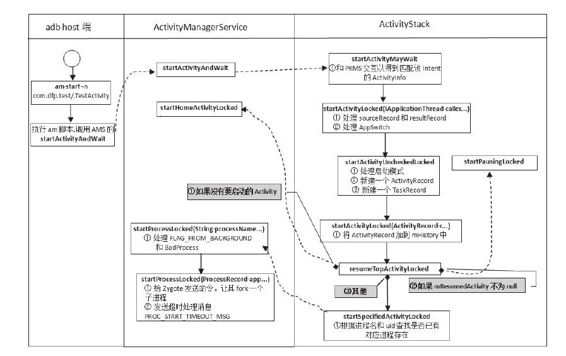

# 6.3.3　startActivityLocked分析


动并处理相关请求。注意，只有am设置了-Wsta选rt项A c，ti才vit会yL进o c入kewda是it状态。

startActivityMayW ait第二阶段的工作重[1]h p://www.m erriam -点，该函数有点长，请读者耐心看代码。

webster.com /dictionary/activity中第六条解[--释＞。ActivityStack.java：

```objectivec
startActivityLocked]
fi nal int startActi vit yLocked
(IAppli cati onThread ca er,
Intent intent, String resolvedType,
Uri[] grantedUriPermissions,
int grantedMode, Acti vit yInfo aInfo,
IBinder result To,
Siftring result Who, int requestCode,
int calli ngPid, int calli ngUid,
boolean onlyIfNeeded,
boolean componentSpecifi ed,
Acti vit yRecord[] outActi vit y){
int err=START_SUCCESS;
ProcessRecord ca erApp=nu;
//如果caer不为空,则需要从AMS中找到
```

它的ProcessRecord。本例的ca er为nu

```
if(ca er!=nu){
ca erApp=mService.getRecordForAppLock
ed(ca er);
//其实就是想得到调用进程的pid和uid
(ca erApp!=nu){
```

calli ngPid=ca erApp.pid；//一定要保证调用进程的pid和uid正确

```
calli ngUid=ca erApp.info.uid;
```

}else{//如调用进程没有在AMS中注册，则认为其是非法的

```
err=START_PERMISSION_DENIED;
}
```

}//if（ca er！=nu）判断结束

```
//下面两个变量意义很重要。sourceRecord
用于描述启动目标Activity的那个
Acti vit y,
//result Record用于描述接收启动结果的
Acti vit y,即该Acti vit y的
onActi vit yResult
//将被调用以通知启动结果,读者可先阅读
SDK中startActi vit yForResult函数的说明
Acti vit yRecord sourceRecord=nu;
Acti vit yRecord result Record=nu;
if(result To!=nu){
//本例result To为nu,
}
//获取Intent设置的启动标志,它们是和
Launch Mode类似的“小把戏”,
//所以,读者务必理解本书介绍的关于
Launch Mode的知识点
int launchFlags=intent.getFlags();
if((launchFlags&
Intent.FLAG_ACTIVITY_FORWARD_RESULT)
!=0
&&sourceRecord!=nu){
……
/*
前面介绍的Launch Mode和Acti vit y的启动
有关,实际上还有一部分标志用于控制
Activity启动结果的通知。有关
FLAG_ACTIVITY_FORWARD_RESULT的作用,读
者可
参考SDK中的说明。使用这个标签有个前
提,即Activity必须先存在,正如上边代码
的if中sourceRecord
不为nu的判断所示。另外,读者自己可尝
试编写例子,以测试
FLAG_ACTIVITY_FORWARD_RESULT
标志的作用
*/}
//检查err值及Intent的情况
if(err==START_SUCCESS&&
intent.getComponent()==nu)
err=START_INTENT_NOT_RESOLVED;
……
//如果err不为0,则调用
sendActi vit yResult Locked返回错误
if(err!=START_SUCCESS){
if(result Record!=nu)
```

{//result Record接收启动结果

```
sendActi vit yResult Locked(-1,
result Record, result Who, requestCode,
Acti vit y.RESULT_CANCELED, nu);
}
……
return err;
}
//检查权限
fiif nal int
perm=mService.checkComponentPermission
(aInfo.permission,
calli ngPid, calli ngUid,
aInfo.appli cati onInfo.uid,
aInfo.exported);
```

……//权限检查失败的处理，不必理会

```
if(mMainStack){
//可为AMS设置一个IActi vit yContro er类
型的监听者,AMS有任何动静都会回调该
//监听者。不过谁又有如此本领去监听AMS
呢?在进行Monkey测试的时候,Monkey会
//设置该回调对象。这样,Monkey就能根据
AMS放映的情况进行相应处理了
(mService.mContro er!=nu){
boolean abort=false;
try{
Intent watchIntent=intent.cloneFilt er
();
//交给回调对象处理,由它判断是否能继续
后面的行程
abort=!
mService.mContro er.acti vit yStarti ng
(watchIntent,
aInfo.appli cati onInfo.packageName);
}……
//回调对象决定不启动该Activity。在进行
Monkey测试时,可设置黑名单,位于
//黑名单中的Activity将不能启动
if(abort){
……//通知result Record
return START_SUCCESS;
}
```

}//if（mMainStack）判断结束

```
//创建一个Acti vit yRecord对象
Acti vit yRecord r=new Acti vit yRecord
(mService, this, ca erApp,
calli ngUid,
intent, resolvedType, aInfo,
mService.mConfi gurati on,
result Record, result Who, requestCode,
componentSpecifi ed);
if(outActi vit y!=nu)
```

outActi vit y[0]=r；//保存到输入参数outActi vit y数组中

```
if(mMainStack){
//mResumedActi vit y代表当前界面显示的
Acti vit y
if(mResumedActi vit y==nu
||mResumedActi vit y.info.appli cati onInf
o.uid!=calli ngUid){
//检查调用进程是否有权限切换
Application,相关知识见下文的解释
if(!
mService.checkAppSwit chA owedLocked
(calli ngPid, calli ngUid,
"Acti vit y start")){
PendingActi vit yLaunch pal=new
PendingActi vit yLaunch();
//如果调用进程没有权限切换Activity,则
只能把这次Activity启动请求保存起来,
//后续有机会时再启动它
pal.r=r;
pal.sourceRecord=sourceRecord;
……
//所有Pending的请求均保存到AMS
mPendingActi vit yLaunches变量中
mService.mPendingActi vit yLaunches.add
(pal);
mDismissKeyguardOnNextActi vit y=false;
return START_SWITCHES_CANCELED;
}
}//if(mResumedActi vit y==nu……)判
```

断结束

```
if(mService.mDidAppSwit ch){//用于控
```

制appswitch，见下文解释

```
mService.mAppSwit chesA owedTime=0;
}else{
mService.mDidAppSwit ch=true;
}
//启动处于Pending状态的Acti vit y
mService.doPendingActi vit yLaunchesLock
ed(false);
```

}//if（mMainStack）判断结束

```
//调用startActi vit yUncheckedLocked函数
err=startActi vit yUncheckedLocked(r,
sourceRecord,
grantedUriPermissions, grantedMode,
onlyIfNeeded, true);
……
return err;
}
```

startActivityLocked函数的主要工作包括：

处理sourceRecord及resultRecord。其中，sourceRecord表示发起本次请求的Activity，resultRecord表示接收处理结果的Activity（启动一个Activity肯定需要它完成某项事情，当目标Activity将事情成后，就需要告知请求者该事情的处理结果）。在一般情况下，sourceRecord和resultRecord应指向同一个Activity。

处理appswitch。如果AMS当前禁止appswitch，则只能把本次启动请求保存起来，以待允许appswitch时再处理。从代码中可知，AMS在处理本次请求前，会先调用doPendingActivityLaunchesLocked函数，在该函数内部将启动之前因系统禁止app switch而保存的Pending请求。

调用startActivityUncheckedLocked处理本次Activity启动请求。

先来看appswitch，它虽然是一个小变量，但是意义重大。

1.关于resum e/stopAppSwitches的介绍AMS提供了两个函数，用于暂时（注意，是暂时）禁止App切换。为什么会有这种需求呢？因为当某些重要（例如设置账号等）

Activity处于前台（即用户当前所见的Activity）时，不希望系统因用户操作之外的原因而切换Activity（例如恰好此时收到来电信号而弹出来电界面）。

先来看stopAppSwitches，其代码如下：

[--＞ActivityM anagerService.java：
stopAppSwitches]

```java
publi c void stopAppSwit ches(){
```

……//检查调用进程是否有STOP_APP_SWITCHES权限

```
synchronized(this){
//设置一个超时时间,过了该时间,AMS可
以重新切换App(switchapp)了
mAppSwit chesA owedTime=SystemClock.up
ti meMilli s()
+APP_SWITCH_DELAY_TIME;
mDidAppSwit ch=false;//设置
mDidAppSwit ch为false
mHandler.removeMessages
(DO_PENDING_ACTIVITY_LAUNCHES_MSG);
```

Message msg=//防止应用进程调用了stop却没调用resume，5秒后处理该消息

```
mHandler.obtainMessage
(DO_PENDING_ACTIVITY_LAUNCHES_MSG);
mHandler.sendMessageDelayed(msg,
APP_SWITCH_DELAY_TIME);
}
```

在以上代码中有两点需要注意：

此处控制机制名为appswitch，而不是activityswitch。为什么呢？因为如果从受保护的Activity中启动另一个Activity，那么这个新Activity的目的应该是针对同一任务，这次启动就不应该受appswitch的制约，反而应该对其大开绿灯。目前，在执行Setti ngs中设置设备策略(DevicePolicy)时就会stopAppSwitch。

执行stopAppSwitch后，应用程序应该调用resum eAppSwitches以允许app switch，但是为了防止应用程序有意或无意忘记resumeappswitch，系统设置了一个超时时间（5秒），过了此超时时间，系统将处理相应的消息，其内部会resumeappswitch。

再来看resumeAppSwitches函数，其实现代码如下：

[--＞ActivityM anagerService：
resum eAppSwitches]

```
publi c void resumeAppSwit ches(){
```

……//检查调用进程是否有STOP_APP_SWITCHES权限

```
synchronized(this){
mAppSwit chesA owedTime=0;
}
//注意,系统并不在此函数内启动那些被阻
止的Activity
}
```

在resum eAppSwitches中只设置m AppSwitchesA owedTim e的值为0，它并不处理在stop和resume这段时间内积攒起的Pending请求，那么这些请求是在何时被处理的呢？

从前面代码可知，如果在执行resumeappswitch后，又有新的请求需要处理，则先处理那些pending的请求（调用doPendingActivityLaunchesLocked）。

在resumeAppSwitches中并未撤销stopAppSwitches函数中设置的超时消息，所以在处理那条超时消息的过程中，也会处理pending的请求。

在本例中，由于不考虑appswitch的情况，那么接下来的工作就是调用startActivity-UncheckedLocked函数来处理本次Activity的启动请求。此时，我们已经创建了一个ActivityRecord用于保存目标Activity的相关信息。

2.startActivityUncheckedLocked函数分析startActivityUncheckedLocked函数很长，但是目的比较简单，即为新创建的Activity-Record找到一个合适的Task。本例最终的结果是创建一个新的Task，其中startActivity-UncheckedLocked函数的处理逻辑却比较复杂，对它的分析可分为三个阶段，下面先看第一阶段。

（1）startActivityUncheckedLocked分析之一这部分的代码如下：

[--＞ActivityStack.java：
startActivityUncheckedLocked]

```java
fi nal int startActi vit yUncheckedLocked
(Acti vit yRecord r,
Acti vit yRecord sourceRecord,
Uri[] grantedUriPermissions,
int grantedMode, boolean onlyIfNeeded,
boolean doResume){
//在本例中,sourceRecord为nu ,
onlyIfNeeded为false, doResume为true
fi nal Intent intent=r.intent;
fi nal int
calli ngUid=r.launchedFromUid;
int launchFlags=intent.getFlags();
//判断是否需要调用因本次Activity启动而
被系统移到后台的当前Activity的
//onUserLeaveHint函数。可阅读SDK文档中
关于Acti vit y onUserLeaveHint函数的说明
mUserLeaving=(launchFlags&
Intent.FLAG_ACTIVITY_NO_USER_ACTION)
==0;
//设置Acti vit yRecord的delayedResume为
true,本例中的doResume为true
if(!doResume)r.delayedResume=true;
//在本例中,notTop为nu
Acti vit yRecord notTop=(launchFlags&
Intent.FLAG_ACTIVITY_PREVIOUS_IS_TOP)
!=0?r:nu;
```

if（onlyIfNeeded）{……//在本例中，该变量为false，故略去相关代码

```
}
//根据sourceRecord的情况进行对应处理。
```

你能理解下面这段if/else的判断语句吗

```
if(sourceRecord==nu){
//如果请求的发起者为空,则需要新建一个
Task
if((launchFlags&
Intent.FLAG_ACTIVITY_NEW_TASK)==0)
launchFlags|=Intent.FLAG_ACTIVITY_NEW_
TASK;
}else if
(sourceRecord.launchMode==Acti vit yInf
o.LAUNCH_SINGLE_INSTANCE){
//如果sourceRecord单独占一个Instance,
```

则新的Activity必然处于另一个Task中

```
launchFlags|=Intent.FLAG_ACTIVITY_NEW_
TASK;
}else if
(r.launchMode==Acti vit yInfo.LAUNCH_SI
NGLE_INSTANCE
||r.launchMode==Acti vit yInfo.LAUNCH_SI
NGLE_TASK){
//如果启动模式设置了singleTask或
singleInstance,则也要创建新Task
launchFlags|=Intent.FLAG_ACTIVITY_NEW_
TASK;
```

}//if（sourceRecord==nu）判断结束

```
//如果新Activity和接收结果的Activity不
在一个Task中,则不能启动新的Activity
if(r.result To!=nu&&(launchFlags
&Intent.FLAG_ACTIVITY_NEW_TASK)!
=0){
sendActi vit yResult Locked(-1,
r.result To, r.result Who,
r.requestCode,
Acti vit y.RESULT_CANCELED, nu);
r.result To=nu;
}
```

startActivityUncheckedLocked第一阶段的工作还算简单，主要确定是否需要为新的Activity创建一个Task，即是否设置FLAG_ACTIVITY_NEW _TASK标志。

接下来看下一阶段的工作。

（2）startActivityUncheckedLocked分析之二这部分的代码如下：

[--＞ActivityStack.java：
startActivityUncheckedLocked]

```java
boolean addingToTask=false;
TaskRecord reuseTask=nu;
if(((launchFlags&
Intent.FLAG_ACTIVITY_NEW_TASK)!=0&
&
(launchFlags&
Intent.FLAG_ACTIVITY_MULTIPLE_TASK)
==0)
||r.launchMode==Acti vit yInfo.LAUNCH_SI
NGLE_TASK
||r.launchMode==Acti vit yInfo.LAUNCH_SI
NGLE_INSTANCE){
if(r.result To==nu){
//搜索mHistory,得到一个Acti vit yRecord
Acti vit yRecord taskTop=r.launchMode!=
Acti vit yInfo.LAUNCH_SINGLE_INSTANCE
?fi ndTaskLocked(intent, r.info)
:fi ndActi vit yLocked(intent,
r.info);
if(taskTop!=nu){
```

……//这么多复杂的逻辑处理，无非就是要找到一个合适的Task，然后对应做一些

```
//处理。此处不讨论这段代码,读者可根据
工作中的具体情况进行研究
}
```

}//if（r.result To==nu）判断结束

```
}
```

在本例中，目标Activity首次登场，所以前面的逻辑处理都没有起作用，建议读者根据具体情况分析该段代码。

下面来看startActivityUncheckLocked第三阶段的工作。

（3）startActivityUncheckLocked分析之三这部分的代码如下：

[--＞ActivityStack.java：
startActivityUncheckLocked]

```java
if(r.packageName!=nu){
//判断目标Activity是否已经在栈顶,如果
是,需要判断是创建一个新的Activity
//还是调用onNewIntent(singleTop模式的
处理)
Acti vit yRecord
top=topRunningNonDelayedActi vit yLocked
(notTop);
if(top!=nu&&r.result To==nu){
```

……//不讨论此段代码

```
}//if(top!=nu……)结束
}else{
```

……//通知错误

```
return START_CLASS_NOT_FOUND;
}
//在本例中,需要创建一个Task
boolean newTask=false;
boolean keepCurTransiti on=false;
if(r.result To==nu&&!addingToTask
&&(launchFlags&
Intent.FLAG_ACTIVITY_NEW_TASK)!=0){
if(reuseTask==nu){
```

mService.mCurTask++；//AMS中保存了当前Task的数量

```
if(mService.mCurTask<=0)
mService.mCurTask=1;
//为该Acti vit yRecord设置一个新的
TaskRecord
r.setTask(new TaskRecord
(mService.mCurTask, r.info,
intent),
nu , true);
}else r.setTask(reuseTask, reuseTask,
true);
newTask=true;
//下面这个函数为Android4.0新增的,用
于处理FLAG_ACTIVITY_TASK_ON_HOME的情
况,
//请阅读SDK文档对Intent的相关说明
moveHomeToFrontFromLaunchLocked
(launchFlags);
```

}elseif……//其他处理情况

```
//授权控制。在SDK中启动Activity的函数
```

没有授权设置方面的参数。在实际工作中，笔者曾碰

```
//到过一个有趣的情况:在开发的一款定制
系统中,用浏览器下载了受DRM保护的图
片,
//此时要启动Gaery3D来查看该图片,但
是由于为DRM目录设置了读写权限,而
Ga ery3D
//并未声明相关权限,结果抛出异常,导致
```

不能浏览该图片。由于startActivity等函数不能设置

```
//授权,最终只能修改Gaery3D并为其添
加use-permissions项
if(grantedUriPermissions!=nu&&
calli ngUid>0){
for(int i=0;i<
grantedUriPermissions.length;i++){
mService.grantUriPermissionLocked
(calli ngUid, r.packageName,
grantedUriPermissions[i],
grantedMode,
r.getUriPermissionsLocked());
}
mService.grantUriPermissionFromIntentL
ocked(calli ngUid, r.packageName,
intent, r.getUriPermissionsLocked
());
//调用startActi vit yLocked,此时
Acti vit yRecord和TaskRecord均创建完毕
startActi vit yLocked(r, newTask,
doResume, keepCurTransiti on);
return START_SUCCESS;
```

}//startActi vit yUncheckLocked函数结束startActivityUncheckLocked的第三阶段工作也比较复杂，不过针对本例，它将创建一个新的TaskRecord，并调用startActivityLocked函数进行处理。

下面我们分析startActivityLocked函数。

（4）startActivityLocked函数分析该函数的实现代码如下：

[--＞ActivityStack.java：
startActivityLocked]

```java
private fi nal void startActi vit yLocked
(Acti vit yRecord r, boolean newTask,
boolean doResume, boolean
keepCurTransiti on){
fi nal int NH=mHistory.size();
int addPos=-1;
```

if（！newTask）{//如果不是新Task，则从mHistory中找到对应的Acti vit yRecord的位置

```
……
}
if(addPos<0)addPos=NH;
//否则加到mHistory数组的最后
mHistory.add(addPos, r);
//设置Acti vit yRecord的inHistory变量为
true,表示已经加到mHistory数组中了
r.putInHistory();
r.frontOfTask=newTask;
if(NH>0){
//判断是否显示Activity切换动画之类的事
情,需要与WindowManagerService交互
}
//最终调用resumeTopActi vit yLocked
if(doResume)resumeTopActi vit yLocked
```

（nu）；//重点分析这个函数

```
}
```

在以上列出的startActivityLocked函数中，略去了一部分逻辑处理，这部分内容和Activity之间的切换动画有关（通过这些动画，使切换过程看起来更加平滑和美观，需和WMS交互）。

提示笔者认为，此处将Activity切换和动画处理这两个逻辑揉到一起并不合适，但是似乎也没有更合适的地方来进行该工作了。

读者不妨自行研读一下该段代码以加深体会。

（5）startActivityUncheckedLocked总结说实话，startActivityUncheckedLocked函数的复杂度超乎笔者的想象，只这些函数名就够让人头疼的。但是针对本例而言，相关逻辑的难度还算适中，毕竟这是Activity启动流程中最简单的情况。可用一句话总结本例中startActivityUncheckedLocked函数的功能：创建ActivityRecord和TaskRecord，并将ActivityRecord添加到mHistory末尾，然后调用resum eTopActivityLocked启动它。

下面用一节来分析resum eTopActivityLocked函数。

3.resum eTopActivityLocked函数分析resum eTopActivityLocked函数的实现代码如下：

[--＞ActivityStack.java：
resum eTopActivityLocked]

```java
fi nal boolean resumeTopActi vit yLocked
(Acti vit yRecord prev){
//从mHistory中找到第一个需要启动的
Acti vit yRecord
next=topRunningActi vit yLocked
(nu);
fi nal boolean
userLeaving=mUserLeaving;
mUserLeaving=false;
if(next==nu){
//如果mHistory中没有要启动的Acti vit y,
```

则启动Home

```
if(mMainStack)return
mService.startHomeActi vit yLocked();
}
//在本例中,next将是目标Activity
next.delayedResume=false;
```

……//和WMS交互，略去

```
//将该ActivityRecord从下面几个队列中移
除
mStoppingActi viti es.remove(next);
mGoingToSleepActi viti es.remove
(next);
next.sleeping=false;
mWaiti ngVisibleActi viti es.remove
(next);
//如果当前正在中断一个Activity,需先等
待那个Activitypause完毕,然后系统会重
新
//调用resumeTopActi vit yLocked函数以找
到下一个要启动的Activity
if(mPausingActi vit y!=nu)return
false;
/************************请读者注意
***************************/
//①mResumedActi vit y指向上一次启动的
Activity,也就是当前界面显示的这个
Acti vit y
//在本例中,当前Activity就是Home界面
if(mResumedActi vit y!=nu){
//先中断Home。这种情况放到最后进行分析
startPausingLocked(userLeaving,
false);
return true;
}
//②如果mResumedActi vit y为空,则一定是
系统第一个启动的Activity,读者应能猜测
```

到它就

```
//是Home
……//如果prev不为空,则需要通知WMS进
```

行与Activity切换相关的工作

```
try{
//通知PKMS修改该Package stop状态,详细
信息参考4.3.1节的说明
AppGlobals.getPackageManager
().setPackageStoppedState(
next.packageName, false);
}……
if(prev!=nu){
```

……//还是和WMS有关，通知它停止绘画

```
}
if(next.app!=nu&&
next.app.thread!=nu){
//如果该ActivityRecord已有对应的进程存
```

在，则只需要重启Activity。就本例而言，

```
//此进程还不存在,所以要先创建一个应用
进程
}else{
//第一次启动
if(!next.hasBeenLaunched){
next.hasBeenLaunched=true;
}else{
```

……//通知WMS显示启动界面

```
}
//调用另外一个
startSpecifi cActi vit yLocked函数
startSpecifi cActi vit yLocked(next,
true, true);
}
return true;
}
```

resum eTopActivityLocked函数中有两个非常重要的关键点：

如果mResumedActivity不为空，则需要先暂停（pause）这个Activity。由代码中的注释可知，mResumedActivity代表上一次启动的（即当前正显示的）Activity。现在要启动一个新的Activity，须先停止当前Activity，这部分工作由startPausingLocked函数完成。

mResumedActivity什么时候为空呢？当然是在启动全系统第一个Activity时，即启动Home界面的时候。除此之外，该值都不会为空。

上面代码中先分析了第二个关键点，即mResumedActivity为空的情况。选择先分析此种情况的原因是：如果先分析startPausingLocked，则后续分析会涉及3个进程，即当前Activity所在进程、AMS所在进程及目标进程，分析的难度相当大。

好了，继续我们的分析。

resum eTopActivityLocked最后将调用另外一个startSpecifi c-ActivityLocked，该函数将真正创建一个应用进程。

（1）startSpecifi cActivityLocked分析这部分的代码如下：

[--＞ActivityStack.java：
startSpecifi cActivityLocked]

```java
private fi nal void
startSpecifi cActi vit yLocked
(Acti vit yRecord r,
boolean andResume, boolean
checkConfi g){
//从AMS中查询是否已经存在满足要求的进
程(根据processName和uid来查找)
//在本例中,查询结果应该为nu
ProcessRecord
app=mService.getProcessRecordLocked
(r.processName,
r.info.appli cati onInfo.uid);
//设置启动时间等信息
if(r.launchTime==0){
r.launchTime=SystemClock.upti meMilli s
();
if(mIniti alStartTime==0)
mIniti alStartTime=r.launchTime;
}else if(mIniti alStartTime==0){
mIniti alStartTime=SystemClock.upti meM
illis();
}
//如果该进程存在并已经向AMS注册(例如
之前在该进程中启动了其他Activity)
if(app!=nu&&app.thread!=nu){
try{
app.addPackage(r.info.packageName);
//通知该进程中的启动目标Activity
realStartActi vit yLocked(r, app,
andResume, checkConfi g);
return;
}……
}
//如果该进程不存在,则需要调用AMS的
startProcessLocked创建一个应用进程
mService.startProcessLocked
(r.processName,
r.info.appli cati onInfo,
true,0,"acti vit y",
r.intent.getComponent(),false);
}
```

AM S的startProcessLocked函数将创建一个新的应用进程，下面将分析这个函数。

（2）startProcessLocked分析这部分内容的代码如下：

[--＞ActivityM anagerService.java：
startProcessLocked]

```java
fi nal ProcessRecord startProcessLocked
(String processName,
Appli cati onInfo info, boolean
knownToBeDead, int intentFlags,
String hosti ngType, ComponentName
hosti ngName,
boolean a owWhil eBooti ng){
//根据processName和uid寻找是否已经存在
ProcessRecord
app=getProcessRecordLocked
(processName, info.uid);
if(app!=nu&&app.pid>0){
```

……//处理相关情况

```
}
String hosti ngNameStr=hosti ngName!
=nu
?ifhosti ngName.fl a enToShortString
():nu;
//①处理FLAG_FROM_BACKGROUND标志,见下
文解释
if((intentFlags&
Intent.FLAG_FROM_BACKGROUND)!=0){
if(mBadProcesses.get
(info.processName, info.uid)!
=nu)
return nu;
}else{
mProcessCrashTimes.remove
(info.processName, info.uid);
(mBadProcesses.get
(info.processName, info.uid)!
=nu){
mBadProcesses.remove
(info.processName, info.uid);
if(app!=nu)app.bad=false;
}
if(app==nu){
//创建一个ProcessRecord,并保存到
```

mProcessNames中。注意，此时还没有创建实际进程

```
app=newProcessRecordLocked(nu ,
info, processName);
mProcessNames.put(processName,
info.uid, app);
}else app.addPackage
(info.packageName);
……
//②调用另外一个startProcessLocked函数
startProcessLocked(app, hosti ngType,
hosti ngNameStr);
return(app.pid!=0)?app:nu;
}
```

在以上代码中列出两个关键点，其中第一个和FLAG_FROM_BACKGROUND有关，相关知识点如下：

FLAG_FROM_BACKGROUND标志发起这次启动的Task属于后台任务。很显然，手机中没有界面供用户操作位于后台Task中的Activity。如果没有设置该标志，那么这次启动请求就是由前台Task因某种原因而触发的（例如，用户单击某个按钮）。

如果一个应用进程在1分钟内连续崩溃超过2次，则AMS会将其ProcessRecord加入所谓的mBadProcesses中。一个应用崩溃后，系统会弹出一个警告框以提醒用户。但是，如果一个后台Task启动了一个“BadProcess”，然后该Process崩溃，结果弹出一个警告框，那么用户就会觉得很奇怪：“为什么突然弹出一个框？”因此，此处将禁止后台Task启动“BadProcess”。

如果用户主动选择启动（例如，单击一个按钮），则不能禁止该操作，并且要把应用进程从mBadProcesses中移除，以给它们“重新做人”的机会。当然，若作为测试工作者，要是该应用每次启动后都会崩溃，就需要其不停地去启动该应用以达到测试的目的。

提示这其实是一种安全机制，防止不健全的程序不断启动可能会崩溃的组件，但是这种机制并不限制用户的行为。

下面来看第二个关键点，即另一个startProcessLocked函数，其代码如下：

[--＞ActivityM anagerService.java：
startProcessLocked]

```java
private fi nal void startProcessLocked
(ProcessRecord app,
String hosti ngType, String
hosti ngNameStr){
if(app.pid>0&&app.pid!=MY_PID){
synchronized(mPidsSelf Locked){
mPidsSelf Locked.remove(app.pid);
mHandler.removeMessages
(PROC_START_TIMEOUT_MSG, app);
}
app.pid=0;
}
//mProcessesOnHold用于保存那些在系统还
没有准备好就提前请求启动的
ProcessRecord
mProcessesOnHold.remove(app);
updateCpuStats();
System.arraycopy(mProcDeaths,0,
mProcDeaths,1,mProcDeaths.length-
1);
mProcDeaths[0]=0;
try{
int uid=app.info.uid;
int[] gids=nu;
```

try{//从PKMS中查询该进程所属的gid

```
gids=mContext.getPackageManager
().getPackageGids(
app.info.packageName);
}……
```

……//工厂测试

```
int debugFlags=0;
if((app.info.fl ags&
Appli cati onInfo.FLAG_DEBUGGABLE)!
=0){
debugFlags|=Zygote.DEBUG_ENABLE_DEBUGG
ER;
debugFlags|=Zygote.DEBUG_ENABLE_CHECKJ
NI;
```

}……//设置其他一些debugFlags

```
//发送消息给Zygote,它将派生一个子进
程,该子进程执行Acti vit yThread的main函
数
//注意,我们传递给Zygote的参数并没有包
```

含任何与Activity相关的信息。现在仅仅启动

```
//一个应用进程
Process.ProcessStartResult
startResult =
Process.start
("android.app.Acti vit yThread",
app.processName, uid, uid, gids,
debugFlags,
app.info.targetSdkVersion, nu);
//电量统计项
Ba eryStatsImpl
bs=app.ba eryStats.getBa eryStats
();
synchronized(bs){
if(bs.isOnBa ery())
app.ba eryStats.incStartsLocked();
}
//如果该进程为persisitent,则需要通知
Watchdog,实际上processStarted内部只
//关心刚才创建的进程是不是
com.android.phone
if(app.persistent){
Watchdog.getInstance
().processStarted(app.processName,
startResult .pid);
}
app.pid=startResult .pid;
app.usingWrapper=startResult .usingWrap
per;
app.removed=false;
synchronized(mPidsSelf Locked){
//以pid为key,将代表该进程的
ProcessRecord对象加入到mPidsSelf Locked
```

中保管

```
this.mPidsSelf Locked.put
(startResult .pid, app);
//发送一个超时消息,如果这个新创建的应
用进程10秒内没有和AMS交互,则可断定
//该应用进程启动失败
Message msg=mHandler.obtainMessage
(PROC_START_TIMEOUT_MSG);
msg.obj=app;
//正常的超时时间为10秒。不过如果该应用
进程通过valgrind加载,则延长到300秒
//valgrind是Linux平台上一款检查内存泄
露的程序,被加载的应用将在它的环境中工
作,
//这项工作需耗费较长时间。读者可查询
valgrind的用法
mHandler.sendMessageDelayed(msg,
startResult .usingWrapper
?PROC_START_TIMEOUT_WITH_WRAPPER:
PROC_START_TIMEOUT);
}……
}
```

startProcessLocked通过发送消息给[1]Zygote以派生一个应用进程，读者仔细研究所发消息的内容，会发现此处并未设置和Activity相关的信息，也就是说，该进程启动后，将完全不知道自己要干什么，怎么办？下面就此进行分析。

4.startActivity分析之半程总结至此，我们已经走完了startActivity分析之旅的一半路程，一路走来，我们越过了很多“险滩恶途”。此处用图6-14来记录前半程中的各个关键点。

图6-14列出了针对本例的调用顺序，其中对每个函数的大体功能也做了简单描述。

注意图6-14中的调用顺序及功能说明只是针对本例而言的。读者以后可结合具体情况再深入研究其中的内容。



图6-14 startActivity半程总结5.应用进程的创建及初始化如前所述，应用进程的入口是ActivityThread的main函数，它是在主线程中执行的，其代码如下：

[--＞ActivityThread.java：m ain]

```java
publi c stati c void main
(String[] args){
Sampli ngProfil erIntegrati on.start
();
//和调试及strictMode有关
CloseGuard.setEnabled(false);
//设置进程名为"<pre-initi ali zed>"
Process.setArgV0("<pre-initi ali zed
>");
//准备主线程消息循环
Looper.prepareMainLooper();
if(sMainThreadHandler==nu)
sMainThreadHandler=new Handler();
//创建一个Acti vit yThread对象
Acti vit yThread thread=new
Acti vit yThread();
//①调用aach函数,注意其参数值为
false
thread.a ach(false);
```

Looper.loop（）；//进入主线程消息循环

```
throw new Runti meExcepti on("Main
thread loop unexpectedly exit ed");
}
```

在main函数内部将创建一个消息循环Loop，接着调用ActivityThread的a ach函数，最终将主线程加入消息循环。

我们在分析AM S的setSystem Process时曾分析过ActivityThread的a ach函数，那时传入的参数值为true。现在来看设置其为false的情况。

[--＞ActivityThread.java：a ach]

```java
private void a ach(boolean system){
sThreadLocal.set(this);
mSystemThread=system;
if(!system){
ViewRootImpl.addFirstDrawHandler(new
Runnable(){
publi c void run(){
ensureJit Enabled();
}
});
//设置在DDMS中看到的本进程的名字为"<
pre-initi ali zed>"
android.ddm.DdmHandleAppName.setAppNam
e("<pre-initi ali zed>");
//设置Runti meInit的mAppli cati onObject
参数,后续会介绍RuntimeInit类
Runti meInit .setAppli cati onObject
(mAppThread.asBinder());
//获取和AMS交互的Binder客户端
IActi vit yManager
mgr=Acti vit yManagerNati ve.getDefault
();
try{
//①调用AMS的a achAppli cati on,
```

mAppThread为Appli cati onThread类型，

```
//它是应用进程和AMS交互的接口
mgr.a achAppli cati on(mAppThread);
}……
```

}else……//system process的处理

```
ViewRootImpl.addConfi gCa back(new
ComponentCa backs2()
```

{……//添加回调函数}）；

```
}
```

我们知道，AMS创建一个应用进程后，会设置一个超时时间（一般是10秒）。如果超过这个时间，应用进程还没有和AMS交互，则断定该进程创建失败。所以，应用进程启动后，需要尽快和AMS交互，即调用AMS的a achApplication函数。在该函数内部将调用a achApplicationLocked，所以此处直接分析a achApplicationLocked，先看其第一阶段的工作。

（1）a achApplicationLocked分析之一这部分的代码如下：

[--＞ActivityM anagerService.java：
a achApplicationLocked]

```java
private fi nal boolean
a achAppli cati onLocked
(IAppli cati onThread thread,
```

int pid）{//此pid代表调用进程的pid

```
ProcessRecord app;
if(pid!=MY_PID&&pid>=0){
synchronized(mPidsSelf Locked){
app=mPidsSelf Locked.get(pid);//根据
```

pid查找对应的ProcessRecord对象

```
}
}else
app=nu;
/*
如果该应用进程由AMS启动,则它一定在AMS
中有对应的ProcessRecord,读者可回顾前
面创建
应用进程的代码:AMS先创建了一个
ProcessRecord对象,然后才发命令给
Zygote。
如果此处app为nu,则表示AMS没有该进程
的记录,故需要“杀死”它
*/
if(app==nu){
if(pid>0&&pid!=MY_PID)//如果pid
```

大于零，且不是system_server进程，则

```
//Quietly(即不打印任何输出)“杀死”
process
Process.kill ProcessQuiet(pid);
else{
//调用Appli cati onThread的scheduleExit
```

函数。应用进程完成处理工作后

```
//将退出运行
//为何不像上面一样直接“杀死”它呢?读
者可查阅Linuxpid相关的知识自行解答
thread.scheduleExit();
}
return false;
}
/*
判断app的thread是否为空,如果不为空,
则表示该ProcessRecord对象还未和一个
应用进程绑定。注意,app是根据pid查找到
的,如果旧进程没有被“杀死”,则系统不
会重用
该pid。为什么此处会出现ProcessRecord
thread不为空的情况呢?见下面代码的注释
说明
*/
if(app.thread!=nu)
handleAppDiedLocked(app, true,
true);
String processName=app.processName;
try{
/*
创建一个应用进程“讣告”接收对象。当应
用进程退出时,该对象的binderDied将被调
用。这样,AMS就能做相应处理。
binderDied函数将在另外一个线程中执行,
其内部也会
调用handleAppDiedLocked。假如用户在
binderDied被调用之前又启动一个进程,
那么就会出现以上代码中app.thread不为
nu的情况。这是多线程环境中常出现的
情况,不熟悉多线程编程的读者要仔细体
会。
*/
AppDeathRecipient adr=new
AppDeathRecipient(pp, pid, thread);
thread.asBinder().li nkToDeath(adr,
0);
app.deathRecipient=adr;
}……
//设置该进程的调度优先级和oom_adj相关
的成员
app.thread=thread;
app.curAdj=app.setAdj=-100;
app.curSchedGroup=Process.THREAD_GROUP
_DEFAULT;
app.setSchedGroup=Process.THREAD_GROUP
_BG_NONINTERACTIVE;
app.forcingToForeground=nu;
app.foregroundServices=false;
app.hasShownUi=false;
app.debugging=false;
//启动成功,从消息队列中撤销
PROC_START_TIMEOUT_MSG消息
mHandler.removeMessages
(PROC_START_TIMEOUT_MSG, app);
```

a achApplicationLocked第一阶段的工作比较简单：

设置代表该应用进程的ProcessRecord对象的一些成员变量，如用于和应用进程交互的thread对象、进程调度优先级及oom_adj的值等。

从消息队列中撤销PROC_START_TIM EOUT_M SG。至此，该进程启动成功，但是这一阶段的工作仅针对进程本身（如设置调度优先级，oom_adj等），还没有涉及和Activity启动相关的内容，这部分工作将在第二阶段完成。

（2）a achApplicationLocked分析之二这部分的代码如下：

[--＞ActivityM anagerService.java：
a achApplicationLocked]

```java
……
//system_server早就启动完毕,所以
normalMode为true
boolean
normalMode=mProcessesReady||isA owedW
hil eBooti ng(app.info);
/*
我们在6.2.3节中分析过
generateAppli cati onProvidersLocked函
数,
在该函数内部将查询(根据进程名,uid确
定)PKMS以获取需运行在该进程中的
ContentProvider
*/
List providers=normalMode?
generateAppli cati onProvidersLocked
(app):nu;
try{
int
testMode=IAppli cati onThread.DEBUG_OFF
;
if(mDebugApp!=nu&&
mDebugApp.equals(processName)){
```

……//处理debug选项

```
}
……//处理Profil e
boolean isRestrictedBackupMode=false;
……//
//dex化对应的APK包
ensurePackageDexOpt
(app.instrumentati onInfo!=nu ?
app.instrumentati onInfo.packageName:
app.info.packageName);
//如果设置了Instrumentati on类,该类所
在的Package也需要dex化
if(app.instrumentati onClass!=nu)
ensurePackageDexOpt
(app.instrumentati onClass.getPackageN
ame());
Appli cati onInfo
appInfo=app.instrumentati onInfo!=nu
?app.instrumentati onInfo:app.info;
//查询该Appli cati on使用的
Compati bili yInfo
app.compat=compati bilit yInfoForPackage
Locked(appInfo);
```

if（profil eFd！=nu）//用于记录性能文件

```
profil eFd=profil eFd.dup();
//①通过Appli cati onThread和应用进程交
互,调用其bindAppli cati on函数
thread.bindAppli cati on(processName,
appInfo, providers,
app.instrumentati onClass, profil eFil e,
profil eFd,
profil eAutoStop,
app.instrumentati onArguments,
app.instrumentati onWatcher, testMode,
isRestrictedBackupMode||!normalMode,
app.persistent,
mConfi gurati on, app.compat,
getCommonServicesLocked(),
mCoreSetti ngsObserver.getCoreSetti ngsL
ocked());
//updateLruProcessLocked函数以后再作分
析
updateLruProcessLocked(app, false,
true);
//记录两个时间
app.lastRequestedGc=app.lastLowMemory=
SystemClock.upti meMilli s();
}……//try结束
..//从mProcessesOnHold和
```

mPersistentStarti ngProcesses中删除相关信息

```
mPersistentStarti ngProcesses.remove
(app);
mProcessesOnHold.remove(app);
```

由以上代码可知，第二阶段的工作主要是为调用ApplicationThread的bindApplication做准备，我们将在后面的章节中分析该函数的具体内容。此处先来看它的原型。

```
/*
正如我们在前面分析时提到的,刚创建的这
个进程并不知道自己的历史使命是什么,甚
至连自己的
进程名都不知道,只能设为<pre-
initi ali zed>。其实,Android应用进程的
历史使命是
AMS在其启动后才赋予它的,这一点和我们
理解的一般意义上的进程不太一样。根据之
前的介绍,
Android的组件应该运行在Android运行环境
中。从OS角度来说,该运行环境需要和一个
进程绑定。
所以,创建应用进程这一步只是创建了一个
能运行Android运行环境的容器,而我们的
工作实际上
还远未结束。
bindApplication的功能就是创建并初始化
位于该进程中的Android运行环境
*/
publi c fi nal void bindAppli cati on(
```

String processName，//进程名，一般是package名Appli cati onInfo appInfo，//该进程对应的Appli cati onInfoList＜ProviderInfo＞providers，//在该Package中声明的Provider信息ComponentName instrumentati onName，//和instrumentati on有关

```
//下面3个参数和性能统计有关
String profil eFil e,
ParcelFil eDescriptor profil eFd,
boolean autoStopProfil er,
//这两个和Instrumentati on有关,在本例
中,这几个参数暂时都没有用
Bundle instrumentati onArgs,
IInstrumentati onWatcher
instrumentati onWatcher,
```

int debugMode，//调试模式boolean isRestrictedBackupMode，boolean persistent，//该进程是否是为persistent进程Confi gurati on confi g，//当前的配置信息，如屏幕大小和语言等Compati bilit yInfo compatInfo，//兼容信息

```
//AMS将常用的Service信息传递给应用进
程,目前传递的Service信息只有PKMS、
//WMS及AlarmManagerService。读者可参看
AMS getCommonServicesLocked函数
Map<String, IBinder>services,
```

Bundle coreSetti ngs）//核心配置参数，目前仅有“long_press”值对bindApplication的原型分析就到此为止，再来看a achApplicationLocked最后一阶段的工作。

（3）a achApplicationLocked分析之三这部分的代码如下：

[--＞ActivityM anagerService.java：
a achApplicationLocked]

```java
boolean badApp=false;
boolean didSomething=false;
/*
至此,应用进程已经准备好了Android运行
环境,下面这条调用代码将返回
Acti vit yStack中
第一个需要运行的ActivityRecord。由于多
线程的原因,能保证得到的hr就是我们的目
标
Acti vit y吗?
*/
Acti vit yRecord
hr=mMainStack.topRunningActi vit yLocked
(nu);
if(hr!=nu&&normalMode){
//需要根据processName和uid等确定该
Activity是否与目标进程有关
if(hr.app==nu&&
app.info.uid==hr.info.appli cati onInfo.
uid
&&processName.equals
(hr.processName)){
try{
//调用AS的realStartActi vit yLocked启动
该Activity,最后两个参数为true
if(mMainStack.realStartActi vit yLocked
(hr, app, true, true)){
didSomething=true;
}
}catch(Excepti on e){
```

badApp=true；//设置badApp为true

```
}
}else{
//如果hr和目标进程无关,则调用
ensureActi viti esVisibleLocked函数处理
它
mMainStack.ensureActi viti esVisibleLock
ed(hr, nu , processName,0);
}
```

}//if（hr！=nu＆＆normalMode）判断结束

```
//mPendingServices存储那些因目标进程还
未启动而处于等待状态的ServiceRecord
if(!badApp&&mPendingServices.size
()>0){
ServiceRecord sr=nu;
try{
for(int i=0;i<mPendingServices.size
();i++){
sr=mPendingServices.get(i);
//和Acti vit y不一样的是,如果Service不
属于目标进程,则暂不处理
if(app.info.uid!=sr.appInfo.uid
||!processName.equals
```

（sr.processName））conti nue；//继续循环

```
//该Service将运行在目标进程中,所以从
mPendingService中移除它
mPendingServices.remove(i);
i--;
//处理此Service的启动,以后再作分析
realStartServiceLocked(sr, app);
```

didSomething=true；//设置该值为true

```
}
}……
```

……//启动等待的BroadcastReceiver……//启动等待的BackupAgent，相关代码类似Service的启动

```
if(badApp){
//如果以上几个组件启动有错误,则设置
```

badApp为true。此处将调用

```
handleAppDiedLocked
//进行处理。该函数我们以后再作分析
handleAppDiedLocked(app, false,
true);
return false;
}
/*
调整进程的oom_adj值。didSomething表示
在以上流程中是否启动了Acivity或其他组
件。
如果启动了任一组件,则didSomething为
true。读者以后会知道,这里的启动只是向
应用进程发出对应的指令,客户端进程是否
成功处理还是未知数。基于这种考虑,此处
不宜
马上调节进程的oom_adj。
读者可简单地把oom_adj看做一种优先级。
如果一个应用进程没有运行任何组件,那么
当内存
出现不足时,该进程是最先被系统“杀死”
的。反之,如果一个进程运行的组件越多,
那么它就
越不易被系统“杀死”以回收内存。
updateOomAdjLocked就是根据该进程中组件
的情况对应
调节进程的oom_adj值的。
*/
if(!didSomething)updateOomAdjLocked
();
return true;
}
```

a achApplicationLocked第三阶段的工作就是通知应用进程启动Activity和Service等组件，其中用于启动Activity的函数是ActivityStack realStartActivityLocked。

此处先分析应用进程的bindApplication，该函数为应用进程绑定一个Application。

提示还记得AM S中System Context执行的两次init吗？第二次init的功能就是将Context和对应的Application绑定在一起。

（4）ApplicationThread的bindApplication分析bindApplication在ApplicationThread中的实现，其代码如下：

[--＞ActivityThread.java：
bindApplication]

```java
publi c fi nal void bindAppli cati on
(……){
```

if（services！=nu）//保存AMS传递过来的系统Service信息

```
ServiceManager.init ServiceCache
(services);
//向主线程消息队列添加
SET_CORE_SETTINGS消息
setCoreSetti ngs(coreSetti ngs);
//创建一个AppBindData对象,其实就是用
来存储一些参数
AppBindData data=new AppBindData();
data.processName=processName;
data.appInfo=appInfo;
data.providers=providers;
data.instrumentati onName=instrumentati
onName;
```

……//将AMS传过来的参数保存到AppBindData中

```
//向主线程发送H.BIND_APPLICATION消息
queueOrSendMessage
(H.BIND_APPLICATION, data);
}
```

由以上代码可知，ApplicationThread接收到来自AMS的指令后，会将指令中的参数封装到一个数据结构中，然后通过发送消息的方式转交给主线程去处理。

BIND_APPLICATION最终将由handleBindApplication函数处理。该函数并不复杂，但是其中有些点是值得关注的，这些点主要是初始化应用进程的一些参数。

handleBindApplication函数的代码如下：

[--＞ActivityThread.java：
handleBindApplication]

```java
private void handleBindAppli cati on
(AppBindData data){
mBoundAppli cati on=data;
mConfi gurati on=new Confi gurati on
(data.confi g);
mCompatConfi gurati on=new Confi gurati on
(data.confi g);
//初始化性能统计对象
mProfil er=new Profil er();
mProfil er.profil eFil e=data.init Profil e
Fil e;
mProfil er.profil eFd=data.init Profil eFd
;
mProfil er.autoStopProfil er=data.init Au
toStopProfil er;
//设置进程名。从此,之前那个名为“<
pre_initi alized>”的进程终于有了正式
```

的名字

```
Process.setArgV0(data.processName);
android.ddm.DdmHandleAppName.setAppNam
e(data.processName);
if(data.persistent){
//对于persistent的进程,在低内存设备
上,不允许其使用硬件加速显示
Display display=
WindowManagerImpl.getDefault
().getDefault Display();
//当内存大于512MB,或者屏幕尺寸大于
1024像素*600像素时,可以使用硬件加速
if(!Acti vit yManager.isHighEndGfx
(display))
HardwareRenderer.disable(false);
}
//启动性能统计
if(mProfil er.profil eFd!=nu)
mProfil er.startProfili ng();
//如果目标SDK版本小于12,则设置
AsyncTask使用pool executor,否则使用
//seriali zed executor。这些executor涉
及Java Concurrent类,对此不熟悉的读者
//请自行学习和研究
(data.appInfo.targetSdkVersion<
=12)
AsyncTask.setDefault Executor
(AsyncTask.THREAD_POOL_EXECUTOR);
//设置ti mezone
TimeZone.setDefault(nu);
//设置语言
Locale.setDefault
(data.confi g.locale);
//设置资源及兼容模式
applyConfi gurati onToResourcesLocked
(data.confi g, data.compatInfo);
applyCompatConfi gurati on();
//根据传递过来的Appli cati onInfo创建一
个对应的LoadApk对象
data.info=getPackageInfoNoCheck
(data.appInfo, data.compatInfo);
//对于系统APK,如果当前系统为
userdebug/eng版,则需要使能dropbox的日
```

志记录

```
if((data.appInfo.fl ags&
(Appli cati onInfo.FLAG_SYSTEM|
Appli cati onInfo.FLAG_UPDATED_SYSTEM_AP
P))!=0){
StrictMode.conditi ona yEnableDebugLog
ging();
}
/*
如目标SDK版本大于9,则不允许在主线程使
用网络操作(如Socket connect等),否则
抛出
NetworkOnMainThreadExcepti on,这么做的
目的是防止应用程序在主线程中因网络操作
执行
时间过长而造成用户体验下降。说实话,没
有必要进行这种限制,在主线程中是否进行
网络操作
是应用的事情。再说,Socket也可作为进程
间通信的手段,在这种情况下,网络操作耗
时很短。
作为系统,不应该设置这种限制。另外,
Goolge可以提供一些开发指南或规范来指导
开发者,
而不应如此限制。
*/
if(data.appInfo.targetSdkVersion>9)
StrictMode.enableDeathOnNetwork();
//如果没有设置屏幕密度,则为Bitmap设置
默认的屏幕密度
if((data.appInfo.fl ags
&
Appli cati onInfo.FLAG_SUPPORTS_SCREEN_D
ENSITIES)==0)
Bit map.setDefault Densit y
(DisplayMetrics.DENSITY_DEFAULT);
if(data.debugMode!
=IAppli cati onThread.DEBUG_OFF){
```

……//调试模式相关处理

```
}
IBinder b=ServiceManager.getService
(Context.CONNECTIVITY_SERVICE);
IConnecti vit yManager service=
IConnecti vit yManager.Stub.asInterface
(b);
try{
//设置HTTP代理信息
ProxyProperti es
proxyProperti es=service.getProxy();
Proxy.setH pProxySystemProperty
(proxyProperti es);
}catch(RemoteExcepti on e){}
if(data.instrumentati onName!=nu){
//在正常情况下,此条件不满足
}else{
//创建Instrumentati on对象,在正常情况
都在这个条件下执行
mInstrumentati on=new Instrumentati on
();
}
//如果Package中声明了FLAG_LARGE_HEAP,
```

则可跳过虚拟机的内存限制，放心使用内存

```
if((data.appInfo.fl ags&
Appli cati onInfo.FLAG_LARGE_HEAP)!
=0)
dalvik.system.VMRunti me.getRunti me
().clearGrowthLimit();
//创建一个Appli cati on, data.info为
LoadedApk类型,在其内部会通过Java反射
机制
//创建一个在该APK AndroidManif est.xml
中声明的Application对象
Appli cati on
app=data.info.makeAppli cati on(
data.restrictedBackupMode, nu);
//mIniti alAppli cati on保存该进程中第一
个创建的Application
mIniti alAppli cati on=app;
//安装本Package中携带的ContentProvider
if(!data.restrictedBackupMode){
List<ProviderInfo>
providers=data.providers;
if(providers!=nu){
//insta ContentProviders我们已经分析
过了
insta ContentProviders(app,
providers);
mH.sendEmptyMessageDelayed
(H.ENABLE_JIT,10*1000);
}
//调用Appli cati on的onCreate函数,做一
些初始工作
mInstrumentati on.ca Appli cati onOnCrea
te(app);
}
```

由以上代码可知，bindApplication函数将设置一些初始化变量，其中最重要的有：

创建一个Application对象，该对象是本进程中运行的第一个Application。

如果该Application有ContentProvider，则应安装它们。

提示从以上代码中可知，ContentProvider的创建于bindApplication函数中，其时机早于其他组件的创建。

（5）应用进程的创建及初始化总结本节从应用进程的入口函数main开始，分析了应用进程和AMS之间的两次重要交互，它们分别是：

在应用进程启动后，需要尽快调用AMS的a achApplication函数，该函数是这个刚创建的应用进程第一次和AMS交互。此时的它还默默“无名”，连一个确定的进程名都没有。不过没关系，a achApplication函数将根据创建该应用进程之前所保存的ProcessRecord为其准备一切“手续”。

a achApplication准备好一切后，将调用应用进程的bindApplication函数，在该函数内部将发消息给主线程，最终该消息由handleBindApplication处理。handle-BindApplication将为该进程设置进程名，初始化一些策略和参数信息等。另外，它还创建一个Application对象。同时，如果该Application声明了ContentProvider，还需要为该进程安装ContentProvider。

提示这个流程有点类似生孩子，一般生之前需要到医院去登记，生完后又需去注册户口，如此这般，这个孩子才会在社会中有合法的身份。

6.ActivityStack realStartActivityLocked分析如前所述，AMS调用完bindApplication后，将通过realStartActivityLocked启动Activity。在此之前，要创建完应用进程并初始化Android运行环境（除此之外，连Content-Provider都安装好了）。

[--＞ActivityStack.java：
realStartActivityLocked]

```java
//注意,在本例中该函数的最后两个参数的
值都为true
fi nal boolean realStartActi vit yLocked
(Acti vit yRecord r, ProcessRecord
app,
boolean andResume, boolean
checkConfi g)throws RemoteExcepti on{
r.startFreezingScreenLocked(app,
0);
mService.mWindowManager.setAppVisib
ilit y(r, true);
if(checkConfi g){
```

……//处理Config发生变化的情况

```
mService.updateConfi gurati onLocked
(confi g, r,false);
}
r.app=app;
app.waiti ngToKill =nu;
//将Acti vit yRecord加到ProcessRecord的
acti viti es中保存
int idx=app.acti viti es.indexOf(r);
if(idx<0)app.acti viti es.add(r);
//更新进程的调度优先级等,以后再分析该
函数
mService.updateLruProcessLocked(app,
true, true);
try{
List<Result Info>result s=nu;
List<Intent>newIntents=nu;
if(andResume){
result s=r.result s;
newIntents=r.newIntents;
}
if(r.isHomeActi vit y)
mService.mHomeProcess=app;
//看看是否有dex对应Package的需要
mService.ensurePackageDexOpt(
r.intent.getComponent
().getPackageName());
r.sleeping=false;
r.forceNewConfi g=false;……
//①通知应用进程启动Activity
app.thread.scheduleLaunchActi vit y(new
Intent(r.intent),r,
System.identit yHashCode(r),r.info,
mService.mConfi gurati on,
r.compat, r.icicle, result s,
newIntents,!andResume,
mService.isNextTransiti onForward(),
profil eFil e, profil eFd,
profil eAutoStop);
if((app.info.fl ags&
Appli cati onInfo.FLAG_CANT_SAVE_STATE)
!=0){
```

……//处理heavy-weight的情况

```
}
}……//try结束
r.launchFail ed=false;
……
if(andResume){
r.state=Acti vit yState.RESUMED;
r.stopped=false;
mResumedActi vit y=r;//设置
```

mResumedActi vit y为目标Acti vit y

```
r.task.touchActi veTime();
//添加该任务到近期任务列表中
if(mMainStack)
mService.addRecentTaskLocked
(r.task);
//②关键函数,见下文分析
completeResumeLocked(r);
//如果在这些过程中,用户按了Power键,
```

怎么办？

```
checkReadyForSleepLocked();
r.icicle=nu;
r.haveState=false;
}……
//启动系统设置向导Activity,当系统更新
或初次使用时需要进行配置
(mMainStack)
mService.startSetupActi vit yLocked
();
return true;
}
```

在以上代码中有两个关键函数，分别是：

scheduleLaunchActivity和com pleteResum e-Locked。其中，scheduleLaunchActivity用于和应用进程交互，通知它启动目标Activity。而com pleteResum eLocked将继续AM S的处理流程。先来看第一个关键函数。

（1）scheduleLaunchActivity函数分析

[--＞ActivityThread.java：
scheduleLaunchActivity]

```java
publi c fi nal void
scheduleLaunchActi vit y(Intent intent,
IBinder token, int ident,
Acti vit yInfo info, Confi gurati on
curConfi g, Compati bilit yInfo
compatInfo,
Bundle state, List<Result Info>
pendingResult s,
List<Intent>pendingNewIntents,
boolean notResumed, boolean
isForward,
String profil eName,
ParcelFil eDescriptor profil eFd,
boolean autoStopProfil er){
Acti vit yCli entRecord r=new
Acti vit yCli entRecord();
```

……//保存AMS发送过来的参数信息

```
//向主线程发送消息,该消息的处理在
handleLaunchActi vit y中进行
queueOrSendMessage(H.LAUNCH_ACTIVITY,
r);
}
```

[--＞ActivityThread.java：
handleM essage]

```java
publi c void handleMessage(Message
msg){
swit ch(msg.what){
case LAUNCH_ACTIVITY:{
Acti vit yCli entRecord r=
(Acti vit yCli entRecord)msg.obj;
//根据Appli cati onInfo得到对应的
PackageInfo
r.packageInfo=getPackageInfoNoCheck(
r.acti vit yInfo.appli cati onInfo,
r.compatInfo);
//调用handleLaunchActi vit y处理
handleLaunchActi vit y(r, nu);
}break;
……}
```

[--＞ActivityThread.java：
handleLaunchActivity]

```java
private void handleLaunchActi vit y
(Acti vit yCli entRecord r,
Intent customIntent){
unscheduleGcIdler();
if(r.profil eFd!=nu){……//略去}
handleConfi gurati onChanged(nu ,
nu);/*
①创建Activity,通过Java反射机制创建目
标Activity,将在内部完成Activity生命周
期
的前两步,即调用其onCreate和onStart函
数。至此,我们的目标
com.dfp.test.TestActi vit y
创建完毕
*/
Acti vit y a=performLaunchActi vit y(r,
customIntent);
if(a!=nu){
r.createdConfi g=new Confi gurati on
(mConfi gurati on);
Bundle oldState=r.state;
//②调用handleResumeActi vit y,其内部有
个关键点,见下文分析
handleResumeActi vit y(r.token, false,
r.isForward);
if(!r.acti vit y.mFinished&&
r.startsNotResumed){
……//
.
r.paused=true;
}else{
//如果启动错误,通知AMS
Acti vit yManagerNati ve.getDefault()
.fi nishActi vit y(r.token,
Acti vit y.RESULT_CANCELED, nu);
}
```

handleLaunchActivity的工作包括：

首先调用perform LaunchActivity，该在函数内部通过Java反射机制创建目标Activity，然后调用它的onCreate及onStart函数。

调用handleResumeActivity，会在其内部调用目标Activity的onResume函数。除此之外，handleResum eActivity还完成了一件很重要的事情，具体见下面的代码：

[--＞ActivityThread.java：
handleResum eActivity]

```java
fi nal void handleResumeActi vit y
(IBinder token, boolean clearHide,
boolean isForward){
unscheduleGcIdler();
//内部调用目标Acti vit y的onResume函数
Acti vit yCli entRecord
r=performResumeActi vit y(token,
clearHide);
if(r!=nu){
fi nal Acti vit y a=r.acti vit y;
fi nal int forwardBit =isForward?
WindowManager.LayoutParams.SOFT_INPUT_
IS_FORWARD_NAVIGATION:0;
……
if(!r.onlyLocalRequest){
//将上面完成onResume的Acti vit y保存到
mNewActi viti es中
r.nextIdle=mNewActi viti es;
mNewActi viti es=r;
//①向消息队列中添加一个Idler对象
Looper.myQueue().addIdleHandler(new
Idler());
}
r.onlyLocalRequest=false;
……
}
```

根据第2章对MessageQueue的分析，当消息队列中没有其他要处理的消息时，将处理以上代码中通过addIdleHandler添加的Idler对象，也就是说，Idler对象的优先级最低，这是不是说它的工作不重要呢？非也。

至少在handleResum eActivity函数中添加的这个Idler并不简单，其代码如下：

[--＞ActivityThread.java：Idler]

```java
private class Idler implements
MessageQueue.IdleHandler{
publi c fi nal boolean queueIdle(){
Acti vit yCli entRecord
a=mNewActi viti es;
boolean stopProfili ng=false;
……
if(a!=nu){
mNewActi viti es=nu;
IActi vit yManager
am=Acti vit yManagerNati ve.getDefault
();
Acti vit yCli entRecord prev;
do{
if(a.activity!=nu&&!
a.acti vit y.mFinished){
//调用AMS的acti vit yIdle
am.acti vit yIdle(a.token,
a.createdConfi g, stopProfili ng);
a.createdConfi g=nu;
}
prev=a;
a=a.nextIdle;
prev.nextIdle=nu;
```

}whil e（a！=nu）；//do循环结束}//if（a！=nu）判断结束

```
……
ensureJit Enabled();
return false;
```

}//queueIdle函数结束

```
}
```

由以上代码可知，Idler将为那些已经完成onResum e的Activity调用AM S的activityIdle函数。该函数是Activity成功创建并启动的流程中与AMS交互的最后一步。

虽然对应用进程来说，Idler处理的优先级最低，但AMS似乎不这么认为，因为它还设置了超时等待，以处理应用进程没有及时调用activityIdle的情况。这个超时等待即由realStartActivityLocked中最后一个关键点com pleteResum eLocked函数设置。

（2）com pleteResum eLocked函数分析这部分的代码具体如下：

[--＞ActivityStack.java：
com pleteResum eLocked]

```java
private fi nal void
completeResumeLocked(Acti vit yRecord
next){
next.idle=false;
next.result s=nu;
next.newIntents=nu;
//发送一个超时处理消息,默认为10秒。
```

IDLE_TIMEOUT_MSG就是针对aciti vit yIdle函数的

```
Message msg=mHandler.obtainMessage
(IDLE_TIMEOUT_MSG);
msg.obj=next;
mHandler.sendMessageDelayed(msg,
IDLE_TIMEOUT);
//通知AMS
if(mMainStack)
mService.reportResumedActi vit yLocked
(next);
```

……//略去其他逻辑的代码

```
}
```

由以上代码可知，AMS给了应用进程10秒的时间，希望它在10秒内调用activityIdle函数。这个时间不算长，和前面AMS等待应用进程启动的超时时间一样。所以，笔者有些困惑，为什么要把这么重要的操作放到Idler中去做。

下面来看activityIdle函数，在其内部将调用ActivityStack activityIdleInternal。

（3）activityIdleInternal函数分析这部分的代码具体如下：

[--＞ActivityStack.java：
activityIdleInternal]

```java
fi nal Acti vit yRecord
acti vit yIdleInternal(IBinder token,
boolean fromTimeout,
Confi gurati on confi g){
/*
如果应用进程在超时时间内调用了
acti vit yIdleInternal函数,则
fromTimeout为false,
否则,一旦超时,在IDLE_TIMEOUT_MSG的消
息处理中也会调用该函数,并设置
fromTimeout
为true
*/
Acti vit yRecord res=nu;
ArrayList<Acti vit yRecord>
stops=nu;
ArrayList<Acti vit yRecord>
fi nishes=nu;
ArrayList<Acti vit yRecord>
thumbnail s=nu;
int NS=0;
int NF=0;
int NT=0;
IAppli cati onThread
sendThumbnail =nu;
boolean booti ng=false;
boolean enableScreen=false;
synchronized(mService){
//从消息队列中撤销IDLE_TIMEOUT_MSG
if(token!=nu)
mHandler.removeMessages
(IDLE_TIMEOUT_MSG, token);
int index=indexOfTokenLocked
(token);
if(index>=0){
Acti vit yRecord r=mHistory.get
(index);
res=r;
//注意,只有fromTimeout为true,才会执
行下面的条件语句
if(fromTimeout)
reportActi vit yLaunchedLocked
(fromTimeout, r,-1,-1);
if(confi g!=nu)
r.confi gurati on=confi g;
/*
mLaunchingActi vit y是一个WakeLock,它能
防止在操作Activity过程中掉电,同时
这个WakeLock不能长时间使用,否则有可能
耗费过多电量。所以,系统设置了一个超时
处理消息LAUNCH_TIMEOUT_MSG,超时时间为
10秒。一旦目标Activity启动成功,
就需要释放WakeLock
*/
if(mResumedActi vit y==r&&
mLaunchingActi vit y.isHeld()){
mHandler.removeMessages
(LAUNCH_TIMEOUT_MSG);
mLaunchingActi vit y.release();
}
r.idle=true;
mService.scheduleAppGcsLocked();
……
ensureActi viti esVisibleLocked(nu,
0);
if(mMainStack){
if(!mService.mBooted){
mService.mBooted=true;
enableScreen=true;
}
```

}//if（mMainStack）判断结束

```
}else if(fromTimeout){//注意,只有
```

fromTimeout为true，才会执行下面的case

```
reportActi vit yLaunchedLocked
(fromTimeout, nu,-1,-1);
}
/*
①processStoppingActi viti esLocked函数
返回那些因本次Activity启动而
被暂停(paused)的Acti vit y
*/
stops=processStoppingActi viti esLocked
(true);
……
for(i=0;i<NS;i++){
Acti vit yRecord r=(Acti vit yRecord)
stops.get(i);
synchronized(mService){
//如果这些Aciti vit y处于fi nishing状态,
```

则通知它们执行Destroy操作，最终它们

```
//的onDestroy函数会被调用
if(r.fi nishing)
fi nishCurrentActi vit yLocked(r,
FINISH_IMMEDIATELY);
```

else//否则将通知它们执行stop操作，最终Acti vit y的onStop被调用

```
stopActi vit yLocked(r);
```
