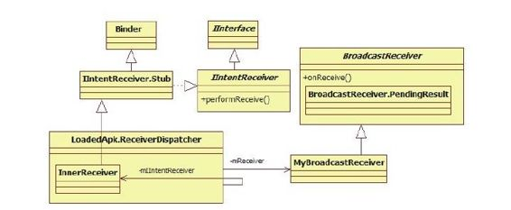
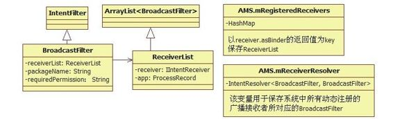
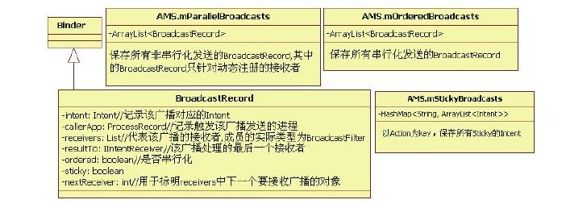

# 6.4.1　registerReceiver流程分析


1.ContextIm plregisterReceiver分析registerReceiver函数用于注册一个动态广播接收者，该函数在Context.java中声明。

根据本章前面对Context家族的介绍（参考图6-3）可知，其功能最终将通过ContextIm pl类的registerReceiver函数来完成。此处，可直接去看ContextImpl是如何实现此函数的。在SDK中一共定义了两个同名的registerReceiver函数，其代码如下：

[--＞ContextIm pl.java：registerReceiver]

```java
/*
在SDK中输出该函数,这也是最常用的函
数。当广播到来时,BroadcastReceiver对
象的onReceive
函数将在主线程中被调用
*/
publi c Intent registerReceiver
(BroadcastReceiver receiver,
IntentFilt er filt er){
return registerReceiver(receiver,
filt er,nu ,nu);
}
/*
功能和前面类似,但增加了两个参数,分别
是broadcastPermission和scheduler,作用
有
两个:
其一:对广播者的权限增加了限制,只有拥
有相应权限的广播者发出的广播才能被此接
收者接收
其二:BroadcastReceiver对象的
onReceiver函数可调度到scheduler所在的
线程中执行
*/
publi c Intent registerReceiver
(BroadcastReceiver receiver,
IntentFilt er filt er, String
broadcastPermission, Handler
scheduler){
/*
注意,下面所调用函数的最后一个参数为
getOuterContext的返回值。前面曾说过,
ContextImpl为
Context家族中真正干活的对象,而它对外
的代理人可以是Application和Activity
等,
getOuterContext就返回这个对外代理人。
一般在Acti vit y中调用registerReceiver函
数,故此处
getOuterContext返回的对外代理人的类型
就是Activity。
*/
return registerReceiverInternal
(receiver, filt er,
broadcastPermission,
scheduler, getOuterContext());
}
```

殊途同归，最终的功能由registerReceiverInternal来完成，其代码如下：

[--＞ContextIm pl.java：
registerReceiverInternal]

```java
private Intent
registerReceiverInternal
(BroadcastReceiver receiver,
IntentFilt er filt er, String
broadcastPermission, Handler
scheduler,
Context context){
IIntentReceiver rd=nu;
if(receiver!=nu){
//①准备一个IIntentReceiver对象
if(mPackageInfo!=nu&&context!
=nu){
//如果没有设置scheduler,则默认使用主
线程的Handler
if(scheduler==nu)
scheduler=mMainThread.getHandler();
//通过getReceiverDispatcher函数得到一
个IIntentReceiver类型的对象
rd=mPackageInfo.getReceiverDispatcher
(
receiver, context, scheduler,
mMainThread.getInstrumentati on(),
true);
}else{
if(scheduler==nu)
scheduler=mMainThread.getHandler();
//直接创建LoadedApk.ReceiverDispatcher
对象
rd=new LoadedApk.ReceiverDispatcher
(receiver, context, scheduler,
nu , true).getIIntentReceiver();
}//if(mPackageInfo!=nu&&
context!=nu)结束
}//if(receiver!=nu)结束
try{
//②调用AMS的registerReceiver函数
return
Acti vit yManagerNati ve.getDefault
().registerReceiver(
mMainThread.getAppli cati onThread(),
mBasePackageName,
rd, filt er, broadcastPermission);
}……
}
```

以上代码列出了两个关键点：其一是准备一个IIntentReceiver对象；其二是调用AMS的registerReceiver函数。

先来看IIntentReceiver，它是一个Interface，图6-17列出了和它相关的成员图谱。



图6-17 IIntentReceiver相关成员示意图由图6-17可知：

BroadcastReceiver内部有一个PendingResult类。该类是Android 2.3以后新增的，用于异步处理广播消息。例如，当BroadcastReceiver收到一个广播时，其onReceive函数将被调用。一般都是在该函数中直接处理该广播。不过，当该广播处理比较耗时，还可采用异步的方式进行处理，即先调用BroadcastReceiver的goAsync函数得到一个PendingResult对象，然后将该对象放到工作线程中去处理，这样onReceive函数就可以立即返回而不至于耽误太长时间（这一点对于onReceive函数被主线程调用的情况尤为有用）。在工作线程处理完这条广播后，需调用PendingResult的finish函数来完成整个广播的处理流程。

广播由AMS发出，而接收及处理工作却在另外一个进程中进行，整个过程一定涉及进程间通信。在图6-17中，虽然在BroadcastReceiver中定义了一个广播接收者，但是它与Binder没有有任何关系，故其并不直接参与进程间通信。与之相反，IIntentReceiver接口则和Binder有密切关系，故可推测广播的接收是由IIntentReceiver接口来完成的。确实，在整个流程中，首先接收到来自AMS的广播的将是该接口的Bn端，即LoadedApk.ReceiverDispather的内部类InnerReceiver。

接收广播的处理将放到本节最后再来分析，下面先来看AM S的registerReceiver函数。

2.AM S的registerReceiver分析AM S的registerReceiver函数比较简单，但是由于其中将出现一些新的变量类型和成员，因此接下来按分两部分进行分析。

（1）registerReceiver分析之一registerReceiver的返回值是一个Intent，它指向一个匹配过滤条件（由filter参数指明）的StickyIntent。即使有多个符合条件的Intent，也只返回一个。

[--＞ActivityM anagerService.java：
registerReceiver]

```java
publi c Intent registerReceiver
(IAppli cati onThread ca er, String
ca erPackage,
IIntentReceiver receiver, IntentFilt er
filt er, String permission){
synchronized(this){
ProcessRecord ca erApp=nu;
if(ca er!=nu){
ca erApp=getRecordForAppLocked
(ca er);
```

……//如果ca erApp为nu，则抛出异常，即系统不允许未登记照册的进程注册

```
//动态广播接收者
//检查调用进程是否有ca erPackage的信
息,如果没有,也抛异常
if(ca erApp.info.uid!
=Process.SYSTEM_UID&&
!ca erApp.pkgList.contains
(ca erPackage)){
throw new Securit yExcepti on(……);
}
```

}……//if（ca er！=nu）判断结束

```
List a Sti cky=nu;
//下面这段代码的功能是从系统中所有
Sti cky Intent中查询匹配IntentFilt er的
Intent,
//匹配的Intent保存在a Sti cky中
Iterator
acti ons=filt er.acti onsIterator();
if(acti ons!=nu){
whil e(acti ons.hasNext()){
String acti on=(String)acti ons.next
();
a Sti cky=getSti ckiesLocked(acti on,
filt er, a Sti cky);
}
}……
//如果存在sticky的Intent,则选取第一个
Intent作为本函数的返回值
Intent sti cky=a Sti cky!=nu ?
(Intent)a Sti cky.get(0):nu;
//如果没有设置接收者,则直接返回sticky
的Intent
if(receiver==nu)return sti cky;
//新的数据类型ReceiverList及成员变量
mRegisteredReceivers,见下文的解释
//receiver.asBinder将返回
IIntentReceiver的Bp端
ReceiverList rl
=(ReceiverList)
mRegisteredReceivers.get
(receiver.asBinder());
//如果是首次调用,则此处rl的值将为nu
if(rl==nu){
rl=new ReceiverList(this, ca erApp,
Binder.getCalli ngPid(),
Binder.getCalli ngUid(),receiver);
if(rl.app!=nu){
rl.app.receivers.add(rl);
}else{
try{
//监听广播接收者所在进程的死亡消息
receiver.asBinder().li nkToDeath
(rl,0);
}……
rl.li nkedToDeath=true;
```

}//if（rl.app！=nu）判断结束

```
//将rl保存到mRegisterReceivers中
mRegisteredReceivers.put
(receiver.asBinder(),rl);
}
//新建一个BroadcastFilt er对象
BroadcastFilt er bf=new BroadcastFilt er
```



```
(filt er, rl, ca erPackage,
permission);
```

rl.add（bf）；//将其保存到rl中图6-18 BroadcastFilt er及相关成员变量

```
//mReceiverResolver成员变量,见下文解
结合代码,对图6-18中各数据类型和成员变
释
```

量的作用及关系的解释如下：

```
mReceiverResolver.addFilt er(bf);
```

在AM S中，BroadcastReceiver的过滤条件由BroadcastFilt er表示，该类从Intent-以上代码的流程倒是很简单，不过其中出现Filt er派生。由于一个BroadcastReceiver可的几个成员变量和数据类型却严重阻碍了我设置多个过滤条件（即多次为同一个们的思维活动。先解决它们，Broadcast-Receiver对象调用BroadcastFilt er及相关成员变量如图6-18所registerReceiver函数以设置不同的过滤条示。

件),故AM S使用ReceiverList(从ArrayList＜BroadcastFilt er＞派生）这种数据类型来表达这种一对多的关系。

ReceiverList除了能存储多个BroadcastFilter外，还应该有成员指向某一个具体BroadcastReceiver。如果不这样，那么又是如何知道到底是哪个BroadcastReceiver设置的过滤条件呢？前面说过，BroadcastReceiver接收广播是通过IIntentReceiver接口进行的，故ReceiverList中有receiver成员变量指向IIntentReceiver。

AM S提供m RegisterReceivers用于保存IIntentReceiver和对应ReceiverList的关系。此外，AM S还提供m ReceiverResolver变量用于存储所有动态注册的Broadcast-Receiver所设置的过滤条件。

清楚这些成员变量和数据类型之间的关系后，接着来分析registerReceiver第二阶段的工作。（2）registerReceiver分析之二这部分代码如下：

[--＞ActivityM anagerService.java：
registerReceiver]

```java
//如果aSticky不为空,则表示有Sticky
的Intent,需要立即调度广播发送
if(a Sticky!=nu){
ArrayList receivers=new ArrayList
();
receivers.add(bf);
int N=a Sti cky.size();
for(int i=0;i<N;i++){
Intent intent=(Intent)a Sti cky.get
(i);
//为每一个需要发送的广播创建一个
BroadcastRecord(暂称之为广播记录)对
象
BroadcastRecord r=new BroadcastRecord
(intent, nu,
nu,-1,-1,nu , receivers, nu,
0,nu ,nu,
false, true, true);
//如果mPara elBroadcasts当前没有成
员,则需要触发AMS发送广播
if(mPara elBroadcasts.size()==0)
scheduleBroadcastsLocked();//向AMS
```

发送BROADCAST_INTENT_MSG消息

```
//所有非ordered广播记录都保存在
mPara elBroadcasts中
mPara elBroadcasts.add(r);
```

}//for循环结束

```
}//if(a Sticky!=nu)判断结束
return sti cky;
}//synchronized结束
}
```

这一阶段的工作用一句话就能说清楚：为每一个满足IntentFilt er的Sticky的Intent创建一个BroadcastRecord对象，并将其保存到mParelBroadcasts数组中，最后，根据情况调度AMS发送广播。

从上边的描述中可以看出，一旦存在满足条件的Sticky的Intent，系统需要尽快调度广播发送。说到这里，想和读者分享一种笔者在实际工作中碰到的情况。

我们注册了一个BroadcastReceiver，用于接收USB的连接状态。在注册完后，它的onReceiver函数很快就会被调用。当时笔者的一些同事认为是注册操作触发USB模块又发送了一次广播，却又感到有些困惑，USB模块应该根据USB的状态变化去触发广播发送，而不应理会广播接收者的注册操作，这到底是怎么一回事呢？

相信读者现在应该能轻松解决这种困惑了吧？对于Sticky的广播，一旦有接收者注册，系统会马上将该广播传递给它们。

和ProcessRecord及ActivityRecord类似，AM S定义了一个BroadcastRecord数据结构，用于存储和广播相关的信息，同时还有两个成员变量，它们作用和关系如图6-19所示。



图6-19 BroadcastReceiver及相关变量图6-19比较简单，读者可自行研究。

在代码中，registerReceiver将调用scheduleBroadcastsLocked函数，通知AMS立即着手开展广播发送工作，在其内部就发送BROADCAST_INTENT_MSG消息给
