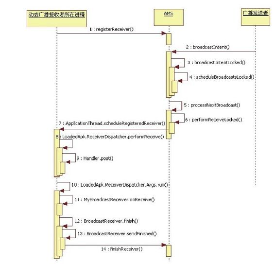

# 6.4.5　广播处理总结

广播处理的流程及相关知识点还算比较简单，可以用图6-20来表示本例中广播的处理流程。

图6-20 Broadcast处理流程在图6-20中，将调用函数所属的实际对象类型标注了出来，其中第11步的M yBroadcast-Receiver为本例中所注册的广播接收者。

注意任何广播对于静态注册者来说，都是ordered，而且该order是全局性的，并非只针对该广播的接收者，故从广播发出到静态注册者的onReceive函数被调用中间经历的这段时间相对较长。
