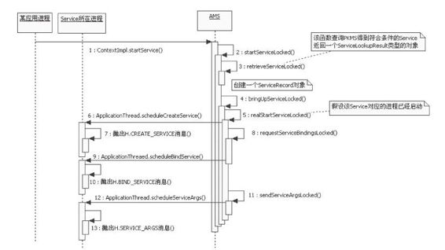
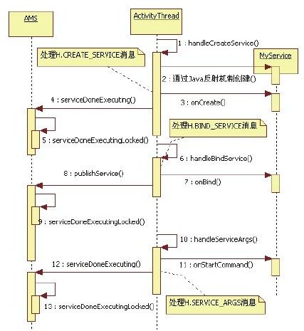

# 6.5.2　startService流程图

处理逻辑更简单。能阅读到此处的读者，想必本对节拿将下以SsetarvrticSee信rv心ice满为满分。析对象，把相关的流程图描绘出来，旨在帮读者根据该流程“授人以鱼，不如授人以渔”。希望读者在图自行研读与Service相关的处理逻辑。

经历过如此大量而又复杂的代码分析考验startService调用轨迹如图6-21和图6-22所后，能学会和掌握分析方法。

示。

图6-21 startService流程图之一图6-21列出了和startService相关的调用流程。在这个流程中，可假设Service所对应

的进程已经存在。

单独提取图6-21中Service所在进程对H.CREATE_SERVICE等消息的处理流程具体如图6-22所示。

注意图6-21和图6-22中也包含了bindService的处理流程。在实际分析时，读者可分开研究bindService和startService的处理流程。

图6-22 startService中相关M essage的处理流程
