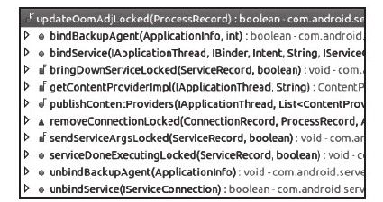

# 6.6.3　AMS进程管理函数分析


在AMS中，和进程管理有关的函数只要有两个，分别是updateLruProcessLocked和updateOomAdjLocked。这两个函数的调用点有多处，本节以a achApplication为切入点，尝试对它们进行分析。

注意AMS一共定义了3个updateOomAdjLocked函数，此处将其归为一类。

先回顾一下a achApplication函数被调用的情况：AMS新创建一个应用进程，该进程启动后最重要的就是调用AMS的a achApplication。

提示不熟悉的读者可阅读6.3.3节。

```
//a achApplication主要工作由
a achApplicationLocked完成,故直接分
```

析a achAppli-cationLocked，其相关代码如下：

[--＞ActivityM anagerService.java：
a achApplicationLocked]

```java
private fi nal boolean
a achAppli cati onLocked
(IAppli cati onThread thread,
int pid){
ProcessRecord app;
//根据之前的介绍的内容,AMS在创建应用
进程前已经将对应的ProcessRecord保存到
//mPidsSelf Locked中了
……//其他一些处理
//初始化ProcessRecord中的一些成员变量
app.thread=thread;
app.curAdj=app.setAdj=-100;
app.curSchedGroup=Process.THREAD_GROUP
_DEFAULT;
app.setSchedGroup=Process.THREAD_GROUP
_BG_NONINTERACTIVE;
app.forcingToForeground=nu;
app.foregroundServices=false;
app.hasShownUi=false;
……
//调用应用进程的bindAppli cati on,以初
始化其内部的Android运行环境
thread.bindAppli cati on(……);
//①调用updateLruProcessLocked函数
updateLruProcessLocked(app, false,
true);
app.lastRequestedGc=app.lastLowMemory=
SystemClock.upti meMilli s();
```

……//启动Activity等操作

```
//②didSomething为false,则调用
updateOomAdjLocked函数
if(!didSomething){
updateOomAdjLocked();
}
```

在以上这段代码中调用了两个重要函数，分别是updateLruProcessLocked函数和update-Oom -AdjLocked函数。

1.updateLruProcessLocked函数分析根据前文所述，我们知道了系统中所有应用进程（同时包括system _server）的Process-Record信息都保存在mPidsSelfLocked成员中。除此之外，AM S还有一个成员变量m Lru-Processes也用于保存ProcessRecord。m LruProcesses的类型虽然是ArrayList，但其内部成员却是按照ProcessRecord的lruW eight大小排序的。在运行过程中，AMS会根据lruWeight的变化调整m LruProcesses成员的位置。

就本例而言，刚连接（aach）上的这个应用进程的ProcessRecord需要通过update-LruProcessLocked函数加入m LruProcesses数组中。下面来看updateLruprocessLocked函数的代码，如下所示：

[--＞ActivityM anagerService.java：
updateLruProcessLocked]

```java
fi nal void updateLruProcessLocked
(ProcessRecord app,
boolean oomAdj, boolean
updateActi vit yTime){
```

mLruSeq++；//每一次调整LRU列表，系统都会分配一个唯一的编号

```
updateLruProcessInternalLocked(app,
oomAdj, updateActi vit yTime,0);
}
```

[--＞ActivityM anagerService.java：
updateLruProcessInternalLocked]

```java
private fi nal void
updateLruProcessInternalLocked
(ProcessRecord app,
boolean oomAdj, boolean
updateActi vit yTime, int bestPos){
//获取app在mLruProcesses中的索引位置,
```

对于本例而言，返回值lrui为-1

```
int lrui=mLruProcesses.indexOf
(app);
//如果之前有记录,则先从数组中删掉,因
为此处需要重新调整位置
if(lrui>=0)mLruProcesses.remove
(lrui);
//获取mLruProcesses中数组索引的最大
值,从0开始
int i=mLruProcesses.size()-1;
int skipTop=0;
```

app.lruSeq=mLruSeq；//将系统全局的lru调整编号赋给ProcessRecord的lruSeq

```
//更新lastActi vit yTime值,其实就是获取
一个时间
if(updateActi vit yTime){
app.lastActi vit yTime=SystemClock.upti m
eMilli s();
}
if(app.acti viti es.size()>0){
//如果该app含Acti vit y,则lruWeight为当
前时间
app.lruWeight=app.lastActi vit yTime;
}else if(app.pubProviders.size()>
0){
/*
如果有发布的ContentProvider,则
lruWeight要减去一个OFFSET。
对此的理解需结合
CONTENT_APP_IDLE_OFFSET的定义。读者暂
时把它
看做一个常数
*/
app.lruWeight=app.lastActi vit yTime-
ProcessList.CONTENT_APP_IDLE_OFFSET;
//设置skipTop。这个变量实际上没有用,
```

放在此处让人很头疼

```
skipTop=ProcessList.MIN_HIDDEN_APPS;
}ifelse{
app.lruWeight=app.lastActi vit yTime-
ProcessList.EMPTY_APP_IDLE_OFFSET;
skipTop=ProcessList.MIN_HIDDEN_APPS;
}
//从数组最后一个元素开始循环
whil e(i>=0){
ProcessRecord p=mLruProcesses.get
(i);
//下面这个if语句没有任何意义,因为
skipTop除了做自减操作外,不影响其他任
```

何内容

```
(skipTop>0&&p.setAdj>
=ProcessList.HIDDEN_APP_MIN_ADJ){
skipTop--;
}
//将app调整到合适的位置
if(p.lruWeight<=app.lruWeight||i<
bestPos){
mLruProcesses.add(i+1,app);
break;
}
i--;
}
//如果没有找到合适的位置,则把app加到
队列头
if(i<0)mLruProcesses.add(0,
app);
//如果该将app绑定到其他Service,则要对
应调整Service所在进程的LRU
if(app.connecti ons.size()>0){
for(Connecti onRecord cr:
app.connecti ons){
if(cr.binding!=nu&&
cr.binding.service!=nu
&&cr.binding.service.app!=nu
&&cr.binding.service.app.lruSeq!
=mLruSeq){
updateLruProcessInternalLocked
(cr.binding.service.app,
oomAdj, updateActi vit yTime, i+1);
}
//conProviders也是一种Provider,相关信
息下一章再介绍
if(app.conProviders.size()>0){
for(ContentProviderRecord cpr:
app.conProviders.keySet()){
```

……//对ContentProvider所在进程做类似的调整

```
}
//在本例中,oomAdj为false,故
updateOomAdjLocked不会被调用
if(oomAdj)updateOomAdjLocked();//
```

以后分析

```
}
```

由以上代码可知，updateLruProcessLocked的主要工作是根据app的lruWeight值调整它在数组中的位置。lruWeight值越大，其在数组中的位置就越靠后。如果该app和某些Service（仅考虑通过bindService建立关系的那些Service）或ContentProvider有交互关系，那么这些Service或ContentProvider所在的进程也需要调节lruWeight值。

下面介绍第二个重要函数updateOom AdjLocked。

提示在以上代码中，skipTop变量完全没有实际作用，却给为阅读代码带来了很大干扰。

2.updateOom AdjLocked函数分析分段来看updateOomAdjLocked函数。

（1）updateOom AdjLocked分析之一这部分的代码如下：

[--＞ActivityM anagerService.java：
updateOom AdjLocked]

```java
fi nal void updateOomAdjLocked(){
//在一般情况下,resumedAppLocked返回
mResumedActi vit y,即当前正处于前台的
Acti vit y
fi nal Acti vit yRecord
TOP_ACT=resumedAppLocked();
//得到前台Activity所属进程的
ProcessRecord信息
fi nal ProcessRecord TOP_APP=TOP_ACT!
=nu ?TOP_ACT.app:nu;
```

mAdjSeq++；//oom_adj在进行调节时也会有唯一的序号

```
mNewNumServiceProcs=0;
/*
下面这几句代码的作用如下:
1.根据hiddenadj划分级别,一共有9个级
别(即numSlots值)
2.根据mLruProcesses的成员个数计算平均
落在各个级别的进程数(即factor值)。但
是这里
的魔数(magicnumber)4却令人头疼不
已。如有清楚该内容的读者,不妨分享一下
研究结果
*/
int
numSlots=ProcessList.HIDDEN_APP_MAX_AD
J-
ProcessList.HIDDEN_APP_MIN_ADJ+1;
int factor=(mLruProcesses.size
()-4)/numSlots;
if(factor<1)factor=1;
int step=0;
int numHidden=0;
int i=mLruProcesses.size();
int
curHiddenAdj=ProcessList.HIDDEN_APP_MI
N_ADJ;
//从mLruProcesses数组末端开始循环
whil e(i>0){
i--;
ProcessRecord app=mLruProcesses.get
(i);
//①调用另外一个updateOomAdjLocked函数
updateOomAdjLocked(app, curHiddenAdj,
TOP_APP, true);
//updateOomAdjLocked函数会更新app的
curAdj
if(curHiddenAdj<
ProcessList.HIDDEN_APP_MAX_ADJ
&&app.curAdj==curHiddenAdj){
/*
这段代码的目的其实很简单。即当某个adj
级别的ProcessRecord处理个数超过均值
后,
就跳到下一级别进行处理。注意,这段代码
的结果会影响updateOomAdjLocked的第二个
参数
*/
step++;
if(step>=factor){
step=0;
curHiddenAdj++;
}
}//if(curHiddenAdj<
ProcessList.HIDDEN_APP_MAX_ADJ……)判
```

断结束

```
//app.kill edBackground初值为false
if(!app.kill edBackground){
if(app.curAdj>
=ProcessList.HIDDEN_APP_MIN_ADJ){
numHidden++;
//mProcessLimit初始值为ProcessList.MAX
(值为15),
//可通过setProcessLimit函数对其进行修
改
if(numHidden>mProcessLimit){
app.kill edBackground=true;
//如果后台进程个数超过限制,则会杀死对
应的后台进程
Process.kill ProcessQuiet(app.pid);
}
```

}//if（！app.kill edBackground）判断结束}//whil e循环结束updateOomAdjLocked第一阶段的工作看起来很简单，但是其中也包含一些较难理解的内容，具体如下：

处理hiddenadj，划分9个级别。

根据mLruProcesses中进程个数计算每个级别平均会存在多少进程。在这个计算过程中出现了一个魔数4令人极度费解。

利用一个循环从mLruProcesses末端开始对每个进程执行另一个updateOomAdj-Locked函数。关于这个函数的内容，我们放到下一节再讨论。

判断处于Hidden状态的进程数是否超过限制，如果超过限制，则会杀死一些进程。接着来看updateOom AdjLocked下一阶段的工作。

（2）updateOom AdjLocked分析之二这部分的代码如下：

[--＞ActivityM anagerService.java：
updateOom AdjLocked]

```java
mNumServiceProcs=mNewNumServiceProcs;
//numHidden表示处于hidden状态的进程个
数
//当Hidden进程个数小于7时(15/2的整型
值),执行if分支
if(numHidden<=
(ProcessList.MAX_HIDDEN_APPS/2)){
……
/*
我们不讨论这段缺乏文档及使用魔数的代
码,但这里有个知识点要注意:
该知识点和Android4.0新增接口
ComponentCa backs2有关,主要是通知应
用进程进行
内存清理,ComponentCa backs2接口定义
了一个函数onTrimMemory(int level),
而四大组件除BroadcastReceiver外,均实
现了该接口。系统定义了4个level以通知进
程
做对应处理:
TRIM_MEMORY_UI_HIDDEN,提示进程当前不
处于前台,故可释放一些UI资源
TRIM_MEMORY_BACKGROUND,表明该进程已加
入LRU列表,此时进程可以对一些简单的资
源
进if行((清理
TRIM_MEMORY_MODERATE,提示进程可以释放
一些资源,这样其他进程的日子会好过些。
即所谓的“我为人人,人人为我”
TRIM_MEMORY_COMPLETE,该进程需尽可能释
放一些资源,否则当内存不足时,它可能会
被杀死
*/
```

}else{//假设hidden进程数超过7，

```
fi nal int N=mLruProcesses.size();
for(i=0;i<N;i++){
ProcessRecord app=mLruProcesses.get
(i);
app.curAdj>
ProcessList.VISIBLE_APP_ADJ||app.syste
mNoUi)
&&app.pendingUiClean){
if(app.trimMemoryLevel<
ComponentCa backs2.TRIM_MEMORY_UI_HID
DEN
&&app.thread!=nu){
```

try{//调用应用进程Appli cati onThread的scheduleTrimMemory函数

```
app.thread.scheduleTrimMemory(
ComponentCa backs2.TRIM_MEMORY_UI_HID
DEN);
}……
```

}//if（app.trimMemoryLevel……）判断结束

```
app.trimMemoryLevel=
ComponentCa backs2.TRIM_MEMORY_UI_HID
DEN;
app.pendingUiClean=false;
}else{
app.trimMemoryLevel=0;
}
```

}//for循环结束}//else结束

```
//Android4.0中设置有一个开发人员选
项,其中有一项用于控制是否销毁后台的
Acti vit y
//读者可自行研究
destroyActi viti esLocked函数
if(mAlwaysFinishActi viti es)
mMainStack.destroyActi viti esLocked
(nu , false,"always-fi nish");
}
```

通过上述代码，可获得两个信息：

Android4.0增加了新的接口类ComponentCa backs2，其中只定义了一个函数onTrimMemory。从以上描述中可知，它主要通知应用进程进行一定的内存释放。

Android4.0Setti ngs新增了一个开放人员选项，通过它可控制AMS对后台Activity的操作。

这里和读者探讨一下ComponentCa backs2接口的意义。此接口的目的是通知应用程序根据情况做一些内存释放，但笔者觉得，这种设计方案的优劣尚有待考证，这主要是出于以下几种考虑：

不是所有应用程序都会实现该函数。原因有很多，主要原因是，该接口只是SDK14才有的，之前的版本没有这个接口。另外，应用程序都会尽可能抢占资源（在不超过允许范围内）以保证运行速度，不应该考虑其他程序的事情。

无法区分在不同的level下到底要释放什么样的内存。代码中的注释也是含糊其辞。到底什么样的资源可以在TRIM_MEMORY_BACKGROUND级别下释放，什么样的资源不可以在TRIM_MEMORY_BACKGROUND级别下释放？

既然系统加了这些接口，读者不妨参考源码中的使用案例来开发自己的程序。

建议真诚希望Google能给出一个明确的文档，说明这几个函数该怎么使用。

接下来分析在以上代码中出现的针对每个ProcessRecord都调用的updateOom AdjLocked函数。

[1]3.第二个updateOom AdjLocked分析这部分的代码如下：

[--＞ActivityM anagerService.java：
updateOom AdjLocked]

```java
private fi nal boolean
updateOomAdjLocked(ProcessRecord app,
int hiddenAdj,
ProcessRecord TOP_APP, boolean
doingA){
//设置该app的hiddenAdj
app.hiddenAdj=hiddenAdj;
if(app.thread==nu)return false;
fi nal boolean wasKeeping=app.keeping;
boolean success=true;
//下面这个函数的调用极其关键。从名字上
看,它会计算该进程的oom_adj及调度策略
computeOomAdjLocked(app, hiddenAdj,
TOP_APP, false, doingA);
if(app.curRawAdj!=app.setRawAdj){
if(wasKeeping&&!app.keeping){
```

……//统计电量

```
app.lastCpuTime=app.curCpuTime;
}
app.setRawAdj=app.curRawAdj;
}
//如果新旧oom_adj不同,则重新设置该进
程的oom_adj
if(app.curAdj!=app.setAdj){
if(Process.setOomAdj(app.pid,
```

app.curAdj））//设置该进程的oom_adj

```
app.setAdj=app.curAdj;
……
}
//如果新旧调度策略不同,则需重新设置该
进程的调度策略
if(app.setSchedGroup!
=app.curSchedGroup){
app.setSchedGroup=app.curSchedGroup;
//waitingToKill是一个字符串,用于描述
杀掉该进程的原因
if(app.waiti ngToKill!=nu&&
app.setSchedGroup==Process.THREAD_GROU
P_BG_NONINTERACTIVE){
Process.kill ProcessQuiet
(app.pid);//
success=false;
}else{
```

if（true）{//强制执行if分支

```
long oldId=Binder.clearCalli ngIdentit y
();
```

try{//设置进程调度策略

```
Process.setProcessGroup(app.pid,
app.curSchedGroup);
}……
}
return success;
}
```

上面的代码还算简单，主要完成两项工作：

调用computeOomAdjLocked计算获得某个进程的oom_adj和调度策略。

调整进程的调度策略和oom_adj。

建议思考一个问题：为何AMS只设置进程的调度策略，而不设置进程的调度优先级？

看来AMS调度算法的核心就在com puteOom AdjLocked中。

4.com puteOom AdjLocked分析这段代码较长，其核心思想是综合考虑各种情况以计算进程的oom_adj和调度策略。建议读者阅读代码时聚焦到AMS关注的几个因素上。computeOomAdjLocked的代码如下：

[--＞ActivityM anagerService.java：
com puteOom AdjLocked]

```java
private fi nal int computeOomAdjLocked
(ProcessRecord app, int hiddenAdj,
ProcessRecord TOP_APP, boolean
recursed, boolean doingA){
……
app.adjTypeCode=Acti vit yManager.Runnin
gAppProcessInfo.REASON_UNKNOWN;
app.adjSource=nu;
app.adjTarget=nu;
app.empty=false;
app.hidden=false;
//该应用进程包含Activity的个数
fi nal int
acti viti esSize=app.acti viti es.size
();
//如果maxAdj小于FOREGROUND_APP_ADJ,基
```

本上就没什么工作可以做了。这类进程优先级相当高

```
if(app.maxAdj<
=ProcessList.FOREGROUND_APP_ADJ){
```

……//读者可自行阅读这块代码

```
return(app.curAdj=app.maxAdj);
}
fi nal boolean
hadForegroundActi viti es=app.foreground
Acti viti es;
app.foregroundActi viti es=false;
app.keeping=false;
app.systemNoUi=false;
int adj;
int schedGroup;
//如果app为前台Activity所在的那个应用
进程
if(app==TOP_APP){
adj=ProcessList.FOREGROUND_APP_ADJ;
schedGroup=Process.THREAD_GROUP_DEFAUL
T;
app.adjType="top-acti vit y";
app.foregroundActi viti es=true;
}else if(app.instrumentati onClass!
=nu){
```

……//略过instrumentati onClass不为nu的情况

```
}else if(app.curReceiver!=nu ||
(mPendingBroadcast!=nu&&
mPendingBroadcast.curApp==app)){
//此情况对应正在执行onReceive函数的广
播接收者所在进程,它的优先级也很高
adj=ProcessList.FOREGROUND_APP_ADJ;
schedGroup=Process.THREAD_GROUP_DEFAUL
T;
app.adjType="broadcast";
}else if(app.executi ngServices.size
()>0){
//正在执行Service生命周期函数的进程
adj=ProcessList.FOREGROUND_APP_ADJ;
schedGroup=Process.THREAD_GROUP_DEFAUL
T;
app.adjType="exec-service";
}else if(acti viti esSize>0){
adj=hiddenAdj;
schedGroup=Process.THREAD_GROUP_BG_NON
INTERACTIVE;
app.hidden=true;
app.adjType="bg-acti viti es";
```

}else{//不含任何组件的进程，即所谓的Empty进程

```
adj=hiddenAdj;
schedGroup=Process.THREAD_GROUP_BG_NON
INTERACTIVE;
app.hidden=true;
app.empty=true;
app.adjType="bg-empty";
}
//下面几段代码将根据情况重新调整前面计
算得到的adj和schedGroup,请读者注意下
```

面代码中对Home进程的特殊处理

```
if(!app.foregroundActi viti es&&
acti viti esSize>0){
//对无前台Activity所在进程的处理
}
if(adj>
ProcessList.PERCEPTIBLE_APP_ADJ){
……
}
//如果前面计算出来的adj大于
HOME_APP_ADJ,并且该进程又是Home进程,
```

则需要重新调整

```
if(adj>ProcessList.HOME_APP_ADJ&&
app==mHomeProcess){
//重新调整adj和schedGroup的值
adj=ProcessList.HOME_APP_ADJ;
schedGroup=Process.THREAD_GROUP_BG_NON
INTERACTIVE;
app.hidden=false;
```

app.adjType="home"；//描述调节adj的原因

```
}
if(adj>ProcessList.PREVIOUS_APP_ADJ
&&app==mPreviousProcess
&&app.acti viti es.size()>0){
……
}
app.adjSeq=mAdjSeq;
app.curRawAdj=adj;
……
//下面这几段代码处理那些进程中含有
Service、ContentProvider组件情况下的
adj调节
if(app.services.size()!=0&&(adj
>ProcessList.FOREGROUND_APP_ADJ
||schedGroup==Process.THREAD_GROUP_BG_
NONINTERACTIVE)){
}
if(s.connecti ons.size()>0&&(adj
>ProcessList.FOREGROUND_APP_ADJ
||schedGroup==Process.THREAD_GROUP_BG_
NONINTERACTIVE)){
}
if(app.pubProviders.size()!=0&&
(adj>ProcessList.FOREGROUND_APP_ADJ
||schedGroup==Process.THREAD_GROUP_BG_
NONINTERACTIVE)){
……
}
//终于计算完毕
app.curRawAdj=adj;
if(adj>app.maxAdj){
adj=app.maxAdj;
if(app.maxAdj<
=ProcessList.PERCEPTIBLE_APP_ADJ)
schedGroup=Process.THREAD_GROUP_DEFAUL
T;
}
if(adj<
ProcessList.HIDDEN_APP_MIN_ADJ)
app.keeping=true;
……
app.curAdj=adj;
app.curSchedGroup=schedGroup;
……
return app.curRawAdj;
}
```

computeOomAdjLocked的工作比较琐碎，实际上也谈不上什么算法，仅仅是简单地根据各种情况来设置几个值。随着系统的改进和完善，这部分代码变动的可能性比较大。

5.updateOom AdjLocked调用点统计updateOomAdjLocked调用点很多，这里给出其中一个updateOomAdjLocked（ProcessRecord）函数的调用点统计，如图6-23所示。



图6-23 updateOom AdjLocked（ProcessRecord）函数的调用点统计图从图6-23中可知，此函数被调用的地方较多，这也说明AMS非常关注应用进程的状况。

提示笔者觉得，AMS中这部分代码不是特别高效，不知各位读者是否有同感？

[1]有两个名为updateOom AdjLocked的函数，这里分析的是第二个。
