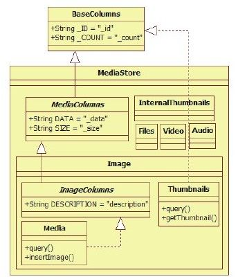
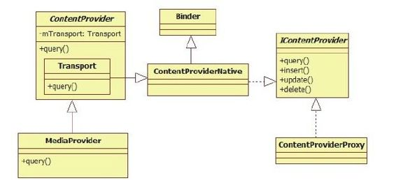

# 7.2.2　MediaStore.Image.Media的query函数分析




图7-1 M ediaStore类图由图7-1可知，MediaStore定义了较多的内部类，我们重点展示作为内部类之一的Image的情况，其中：

MediaColumns定义了所有与媒体相关的数据库表都会用到的数据库字段，而ImageColumns定义了单独针对Image的数据库字段。

Image类定义了一个名为Media的内部类用于查询和Image相关的信息，同时Image类还定义了一个名为Thumbnails的内部类用于查询和Image相关的缩略图的信息（在Android平台上，缩略图的来源有两种，一种是Image，另一种是Video，故Image定义了名为Thumbnails的内部类，而Video也定义了一个名为Thumbnails的内部类）。

提示MediaStore类较为复杂，主要原因是它定义了一些同名类。读者阅读代码时务必仔细。

下面来看Im age.M edia的query函数，其代码非常简单，如下所示：

[--＞M ediaStore.java：
Im age.M edia.query]

```java
publi c stati c fi nal class Media
implements ImageColumns{
publi c stati c fi nal Cursor query
(ContentResolver cr, Uri uri,
String[] projecti on){
//直接调用ContentResolver的query函数
return cr.query(uri, projecti on,
nu,
nu , DEFAULT_SORT_ORDER);
}
```

Im age.M edia的query函数直接调用CR的query函数，虽然CR的真实类型是Application-ContentResolver，但是此函数却由其基类CR实现。

提示追求运行效率的程序员也许会对上边这段代码的实现颇有微词，因为Im age.M edia的query函数基本上没做任何有意义的工作。相比客户端直接调用cr.query函数，此处的query就增加了一次函数调用和返回的开销（即Image.Mediaquery调用和返回时参数的入栈/出栈）。但是，通过Image.Media的封装将使程序更清晰和易读（与直接使用CR的query相比，代码阅读者一看Image.Media就知道其query函数应该和Image有关，否则需要通过解析uri参数才能确定查询的信息是什么）。代码清晰易读和运行效率高，往往是软件开发中的熊掌和鱼，它们之间的对立性，将在本章中体现得淋漓尽致。笔者建议读者在实际开发中结合具体情况决定取舍，万不可钻牛角尖。

1.ContentResolver的query函数分析这部分的代码如下：

[--＞ContentResolver.java：query]

```java
publi c fi nal Cursor query(Uri uri,
String[] projecti on,
String selecti on,
String[] selecti onArgs, String
sortOrder){
//调用acquireProvider函数,参数为uri,
```

函数也由CR实现

```
IContentProvider
provider=acquireProvider(uri);
//注意,下面将和CP交互,相关知识留待
7.4节再分析
……
}
```

CR的query将调用acquireProvider，该函数定义在CR类中，代码如下：

[--＞ContentResolver.java：query]

```java
publi c fi nal IContentProvider
acquireProvider(Uri uri){
if(!SCHEME_CONTENT.equals
(uri.getScheme()))return nu;
String auth=uri.getAuthorit y();
if(auth!=nu){
//acquireProvider是一个抽象函数,由
```

ContentResolver的子类实现。在本例中，该函数

```
//将由Appli cati onContentResolver实现。
```

uri.getAuthorit y将返回代表目标

```
//CP的名字
return acquireProvider(mContext,
uri.getAuthorit y());
}
return nu;
}
```

如上所述，acquireProvider由CR的子类实现，在本例中该函数由ApplicationContent-Resolver定义，代码如下：

[--＞ContextIm pl.java：acquireProvider]

```java
protected IContentProvider
acquireProvider(Context context,
String name){
//mMainThread指向代表应用进程主线程的
ActivityThread对象,每个应用进程只有一
个
//Acti vit yThread对象
return mMainThread.acquireProvider
(context, name);
}
```

如以上代码所示，最终ActivityThread的acquireProvider函数将被调用，希望它不要再被层层转包了。

2.AcitvityThread的acquireProvider函数分析ActivityThread的acquireProvider函数的代码如下：

[--＞ActivityThread.java：
acquireProvider]

```java
publi c fi nal IContentProvider
acquireProvider(Context c, String
name){
//①调用getProvider函数,它很重要,具
体见下文分析
IContentProvider provider=getProvider
(c, name);
……
IBinder jBinder=provider.asBinder
();
synchronized(mProviderMap){
//客户端进程将本进程使用的CP信息保存到
mProviderRefCountMap中,
//其主要功能与引用计数和资源释放有关,
```

读者暂可不理会它

```
ProviderRefCount
prc=mProviderRefCountMap.get
(jBinder);
if(prc==nu)
mProviderRefCountMap.put(jBinder, new
ProviderRefCount(1));
else prc.count++;
}
return provider;
}
```

在acquireProvider内部调用getProvider得到一个IContentProvider类型的对象，该函数非常重要，其代码为：

[--＞ActivityThread.java：getProvider]

```java
private IContentProvider getProvider
(Context context, String name){
/*
查询该应用进程是否已经保存了用于和远端
CP通信的对象existi ng。
此处,我们知道existing的类型是
IContentProvider,不过IContentProvider
是一
个interface,那么existi ng的真实类型是
什么呢?稍后再揭示
*/
IContentProvider
existi ng=getExisti ngProvider(context,
name);
if(existi ng!=nu)return
```

existi ng；//如果existi ng存在，则直接返回

```
IActi vit yManager.ContentProviderHolder
holder=nu;
try{
//如果existing不存在,则需要向AMS查
询,返回值的类型为
ContentProviderHolder
holder=Acti vit yManagerNati ve.getDefau
lt().getContentProvider(
getAppli cati onThread(),name);
}……
//注意:记住下面这个函数调用,此时是在
客户端进程中
IContentProvider prov=insta Provider
(context, holder.provider,
holder.info, true);
……
return prov;
}
```

以上代码中让人比较头疼的是其中新出现的几种数据类型，如IContentProvider、Content-ProviderHolder。先来分析AM S的getContentProvider。

3.AM S的getContentProvider函数分析getContentProvider的功能主要由getContentProviderIm pl函数实现，故此处可直接对它进行分析。

（1）getContentProviderIm pl启动目标进程getContentProviderIm pl函数较长，可分段来看，先来分析下面一段代码。

[--＞ActivityM anagerService.java：
getContentProviderIm pl]

```java
private fi nal ContentProviderHolder
getContentProviderImpl(
IAppli cati onThread ca er, String
name){
ContentProviderRecord cpr;
ProviderInfo cpi=nu;
synchronized(this){
ProcessRecord r=nu;
if(ca er!=nu){
r=getRecordForAppLocked(ca er);
```

if（r==nu）……//如果查询不到调用者信息，则抛出Securit yExcepti on}//if（ca er！=nu）判断结束

```
//name参数为调用进程指定的代表目标CP的
authorit y
cpr=mProvidersByName.get(name);
//如果cpr不为空,表明该CP已经在AMS中注
册
boolean providerRunning=cpr!=nu;
if(providerRunning){
```

……//如果该CP已经存在，则进行对应处理，相关内容可自行阅读

```
}
//如果目标CP对应进程还未启动
if(!providerRunning){
try{
//查询PKMS,得到指定的ProviderInfo信息
cpi=AppGlobals.getPackageManager
().resolveContentProvider(
name, STOCK_PM_FLAGS|
PackageManager.GET_URI_PERMISSION_PATT
ERNS);
}……
String msg;
//权限检查,此处不作讨论
if
((msg=checkContentProviderPermission
Locked(cpi, r))!=nu)
throw new Securit yExcepti on(msg);
/*
如果system_server还没启动完毕,并且该
CP不运行在system_server中,则此时不允
许启动CP。
读者还记得哪个CP运行在system_server进
程中吗?答案是Setti ngsProvider
*/
……
ComponentName comp=new ComponentName
(cpi.packageName, cpi.name);
cpr=mProvidersByClass.get(comp);
fi nal boolean fi rstClass=cpr==nu;
//初次启动MediaProvider对应进程时,
```

fi rstClass一定为true

```
if(fi rstClass){
try{
//查询PKMS,得到MediaProvider所在的
Appli cati on信息
Appli cati onInfo ai=
AppGlobals.getPackageManager
().getAppli cati onInfo(
cpi.appli cati onInfo.packageName,
STOCK_PM_FLAGS);
if(ai==nu)return nu;
//在AMS内部通过ContentProviderRecord来
保存CP的信息,类似
//Acti vit yRecord、BroadcastRecord等
cpr=new ContentProviderRecord(cpi,
ai, comp);
}……
```

}//if（fi rstClass）判断结束以上代码的逻辑比较简单，主要是为目标CP(即M ediaProvider)创建一个ContentProvider-Record对象。结合第6章的知识，AMS为四大组件都设计了对应的数据结构，如ActivityRecord、BroadcastRecord等。

接着看getContentProviderIm pl，其下一步的工作就是启动目标进程，代码如下：

[--＞ActivityM anagerService.java：
getContentProviderIm pl]

```java
/*
canRunHere函数用于判断目标CP能否运行在
前面定义的变量r所对应的进程(即调用者
所在进程)
该函数内部做如下判断:
(info.multi process||info.processName.
equals(app.processName))
&&
(uid==Process.SYSTEM_UID||uid==app.in
fo.uid)
就本例而言,MediaProvider不能运行在客
户端进程中
*/
if(r!=nu&&cpr.canRunHere(r))
return cpr;
fi nal int N=mLaunchingProviders.size
();
```

……//查找目标CP对应的进程是否正处于启动状态

```
//如果i大于等于N,表明目标进程的信息不
在mLaunchingProviders中
if(i>=N){
fi nal long
origId=Binder.clearCalli ngIdentit y
();
……
//调用startProcessLocked函数创建目标进
程
ProcessRecord proc=startProcessLocked
(cpi.processName,
cpr.appInfo, false,0,"content
provider",
new ComponentName
(cpi.appli cati onInfo.packageName,
cpi.name),false);
if(proc==nu)return nu;
cpr.launchingApp=proc;
//将该进程信息保存到
mLaunchingProviders中
mLaunchingProviders.add(cpr);
}
if(fi rstClass)mProvidersByClass.put
(comp, cpr);
mProvidersByName.put(name, cpr);
/*
下面这个函数将为客户端进程和目标CP进程
建立紧密的关系,即当目标CP进程死亡后,
AMS将根据该函数建立的关系找到客户端进
程并杀死(kill)它们。在7.2.3节
有对这个函数的相关解释
*/
incProviderCount(r, cpr);
if(cpr.launchingApp==nu)return
nu;
try{
```

cpr.wait（）；//等待目前进程的启动

```
}……
}//synchronized(this)结束
return cpr;
}
```

通过对以上代码的分析发现，getContentProviderIm pl将等待一个事件，想必读者也能明白，此处一定是在等待目标进程启动并创建好MediaProvider。目标进程的这部分工作用专业词语来表达就是发布(publish)目标ContentProvider（即本例的M ediaProvider）。

（2）M ediaProvider的创建根据第6章的介绍，目标进程启动后要做的第一件大事就是调用AMS的a achApplication函数，该函数的主要功能由a achApplicationLocked完成。我们回顾一下相关代码。

[--＞ActivityM anagerService.java：
a achApplicationLocked]

```java
private fi nal boolean
a achAppli cati onLocked
(IAppli cati onThread thread,
int pid){
……
//通过PKMS查询运行在该进程中的CP信息,
```

并保存到mProvidersByClass中

```
List providers=normalMode?
generateAppli cati onProvidersLocked
(app):nu;
//调用目标应用进程的bindAppli cati on函
数,此处将providers信息传递给目标进程
thread.bindAppli cati on(processName,
appInfo, providers,
app.instrumentati onClass,
profil eFil e,
……);
……
}
```

再来看目标进程bindApplication的实现，其内部最终会通过handleBindApplication函数处理，我们回顾一下相关代码。

[--＞ActivityThread.java：
handleBindApplication]

```java
private void handleBindAppli cati on
(AppBindData data){
……
if(!data.restrictedBackupMode){
List<ProviderInfo>
providers=data.providers;
if(providers!=nu){
//调用insta ContentProviders安装此
ContentProvider
insta ContentProviders(app,
providers);
……
}
……
}
```

AM S传递过来的ProviderInfo列表将由目标进程的insta ContentProviders处理，其相关代码如下：

[--＞ActivityThread.java：
insta ContentProviders]

```java
private void insta ContentProviders
(Context context,
List<ProviderInfo>providers){
fi nal ArrayList<
IActi vit yManager.ContentProviderHolder
>result s=
new ArrayList<
IActi vit yManager.ContentProviderHolder
>();
Iterator<ProviderInfo>
i=providers.it erator();
whil e(i.hasNext()){
//①调用insta Provider,注意该函数传
递的第二个参数为nu
IContentProvider cp=insta Provider
(context, nu , cpi, false);
if(cp!=nu){
IActi vit yManager.ContentProviderHolder
cph=
new
IActi vit yManager.ContentProviderHolder
(cpi);
cph.provider=cp;
```

result s.add（cph）；//将信息添加到result s数组中……//创建引用计数

```
}
```

}//whil e循环结束try{//②调用AMS的publi shContentProviders发布

```
ContentProviders
Acti vit yManagerNati ve.getDefault
().publi shContentProviders(
getAppli cati onThread(),result s);
}……
}
```

以上代码列出了两个关键点，分别是：

调用insta Provider得到一个IContentProvider类型的对象。

调用AM S的publishContentProviders发布本进程所运行的CP。该函数留到后面再作分析。

在继续分析之前，笔者要特别强调instaProvider，该函数既在客户端进程中被调用(还记得7.2.2节ActivityThread的acquireProvider函数中那句注释吗？），又在目标进程（即此处MediaProvider所在进程）中被调用。与客户端进程的调用相比，只在一处有明显的不同：

客户端进程调用instaProvider函数时，该函数的第二个参数不为nu。

目标进程调用instaProvider函数时，该函数的第二个参数硬编码为nu。

我们曾经在6.2.3分析过insta Provider函数，结合那里的介绍可知：instaProvider是一个通用函数，不论客户端使用远端的CP还是目标进程安装运行在其上的CP，最终都会调用它，只不过参数不同罢了。

下面来看insta Provider函数，其代码如下：

[--＞ActivityThread.java：insta Provider]

```java
private IContentProvider
insta Provider(Context context,
IContentProvider provider,
ProviderInfo info, boolean noisy){
CfiontentProvider localProvider=nu;
```

if（provider==nu）{//针对目标进程的情况

```
Context c=nu;
Appli cati onInfo
ai=info.appli cati onInfo;
if(context.getPackageName().equals
(ai.packageName)){
c=context;
```

}……//这部分代码已经在6.2.3节分析过了，其目的就是为了得到正确的

```
//Context用于加载Java字节码
try{
nal java.lang.ClassLoader
cl=c.getClassLoader();
//通过Java反射机制创建MediaProvider实
例
localProvider=(ContentProvider)cl.
loadClass(info.name).newInstance
();
//注意下面这句代码
provider=localProvider.getIContentProv
ider();
}
}else if(localLOGV){
Slog.v(TAG,"Installi ng external
provider"+info.authorit y+":"
+info.name);
```

}//if（provider==nu）判断结束

```
/*
由以上代码可知,对于provider不为nu的
情况(即客户端调用的情况),该函数没有
什么特殊的处理
*/
……
/*
引用计数及设置DeathReceipient等相关操
作。在6.2.3节中曾介绍过,目标进程为自
己
进程中的CP实例设置DeathReceipient没有
作用,因为二者在同一个进程中,自己怎么
能
接收自己的讣告消息呢?不过,如果客户端
进程为目标进程的CP设置DeathReceipient
又
有作用吗?请读者仔细思考这个问题
*/
```

return provider；//最终返回的对象是IContentProvider类型的，它到底是什么呢？

```
}
```



由以代码可知，instaProvider最终返回的是一个IContentProvider类型的对象。对于目标进程而言，该对象是通过调用CP的实例对象的（本例就是M ediaProvider）

getIContentProvider函数得来的。而对于客户端进程而言，该对象是由图7-2 ContentProvider类图instaProvider第二个参数传递进来的，那图7-2揭示了IContentProvider的真面目，么，这个IContentProvider到底是什么？

具体介绍如下：

（3）IContentProvider的真面目每个CP实例中都有一个mTransport成员，要说清楚IContentProvider，就要先来看其类型为Transport。

ContentProvider家族的类图，如图7-2所Transport类从ContentProviderN ative派示。

生。由图7-2可知，ContentProviderNative从Binder类派生，并实现了IContentProvider接口。结合前面的代码，IContentProvider将是客户端进程和目标进程交互的接口，即目标进程使用IContentProvider的Bn端Transport，而客户端使用IContentProvider的Bp端，其类型是ContentProviderProxy(定义在ContentProviderNative.java中）。

客户端如何通过IContentProviderquery函数和目标CP进程进行交互？其流程如下：

CP客户端得到IContentProvider的Bp端(实际类型是ContentProviderProxy),并调用其query函数，在该函数内部将参数信息打包，传递给Transport（它是IContentProvider的Bn端）。

Transport的onTransact函数将调用Transport的query函数，而Transport的query函数又将调用CP子类定义的query函数(即M ediaProvider的query函数)。

关于目标进程这一系列的调用函数，不妨先看看Transport的query函数，其代码为：

[--＞ContentProvider.java：
Transport.query]

```java
publi c Cursor query(Uri uri,
String[] projecti on,
String selecti on,
String[] selecti onArgs, String
sortOrder){
enforceReadPermission(uri);
//Transport为ContentProvider的内部类,
```

此处将调用ContentProvider的query函数

```
//本例中,该query函数由MediaProvider实
现,故最终会调用MediaProvider的query
return ContentProvider.this.query
(uri, projecti on, selecti on,
selecti onArgs, sortOrder);
}
```

读者务必要弄清楚，此处只有一个目标CP的实例，即只有一个M ediaProvider对象。

Transport的query函数内部虽然调用的是基类CP的query函数，但是根据面向对象的多态原理，该函数最终由其子类（本例中是M ediaProvider）来实现。

认识了IContentProvider，即知道了客户端进程和目标进程的交互接口。

继续我们的分析。此时目标进程需要将MediaProvider的信息通过AM S发布出去。

（4）AM S pulishContentProviders分析要把目标进程的CP信息发布出去，需借助AM S的pulishContentProviders函数，其代码如下：

[--＞ActivityM anagerService.java：
publishContentProviders]

```java
publi c fi nal void
publi shContentProviders
(IAppli cati onThread ca er,
List<ContentProviderHolder>
providers){
……
synchronized(this){
fi nal ProcessRecord
r=getRecordForAppLocked(ca er);
fi nal long
origId=Binder.clearCalli ngIdentit y
();
fi nal int N=providers.size();
for(int i=0;i<N;i++){
ContentProviderHolder
src=providers.get(i);
ContentProviderRecord
dst=r.pubProviders.get
(src.info.name);
if(dst!=nu){
```

……//将相关信息分别保存到mProviderByClass和mProvidersByName中

```
int NL=mLaunchingProviders.size();
```

……//目标进程已经启动，将其从mLaunchingProviders中移除

```
synchronized(dst){
```

dst.provider=src.provider；//将信息保存在dst中

```
dst.proc=r;
//触发还等在(wait)getContentProvider
中的那个客户端进程
dst.notif yA();
}
```

updateOomAdjLocked（r）；//调节目标进程的oom_adj等相关参数}//if（dst！=nu）判断结束

```
……
}
```

至此，客户端进程将从getContentProvider中返回，并调用instaProvider函数。根据前面的分析，客户端进程调用instaProvider时，其第二个参数不为nu，即客户端进程已经从AMS中得到了能直接和目标进程交互的IContentProviderBp端对象。此后，客户端就可直接使用该对象向目标进程发起请求。
