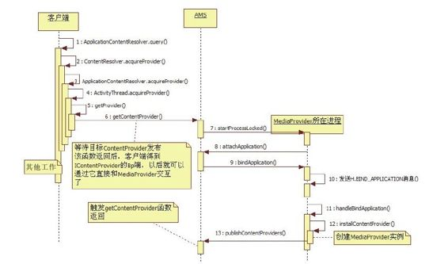

# 7.2.3　MediaProvider的启动及创建总结

回顾一下整个MediaProvider的启动和创建流程，如图7-3所示。

图7-3 M ediaProvider的启动和创建流程整个流程相对比较简单。读者在分析时只要注意instaProvider这个函数在目标进程和客户端进程中被调用时的区别即可。这里再次强调：

目标进程调用instaProvider时，传递的第二个参数为nu，使内部通过Java反射机制真正创建目标CP实例。

客户端调用instaProvider时，其第二个参数已经通过查询AMS得到。该函数真正的工作只不过是引用计数控制和设置讣告接收对象罢了。

至此，客户端进程和目标进程通信的通道IContentProvider已经登场。除此之外，客户端进程和目标CP还建立了非常紧密的关系，这种关系造成的后果就是一旦目标CP进程死亡，AMS会杀死与之有关的客户端进程。不妨回顾一下与之相关的知识点：

该关系的建立是在AMSgetContentProviderIm pl函数中调用incProviderCount完成的，关系的确立以ContentProviderRecorder保存客户端进程的ProcessRecord信息为标志。

一旦CP进程死亡，AMS能根据该ContentProviderRecorder中保存的客户端信息找到使用该CP的所有客户端进程，然后再杀死它们。

客户端能否撤销这种紧密关系呢？答案是肯定的，但这和Cursor是否关闭有关。这里先简单描述一下流程：

当Cursor关闭时，ContextIm pl的releaseProvider会被调用。根据前面的介绍，它最终会调用ActivityThread的releaseProvider函数。

ActivityThread的releaseProvider函数会导致com pleteRem oveProvider被调用，在其内部根据该CP的引用计数判断是否需要调用AM S的rem oveContentProvider。

通过AM S的rem oveContentProvider将删除对应ContentProviderRecord中此客户端进程的信息，这样一来，客户端进程和目标CP进程的紧密关系就荡然无存了。至此，本章第一条分析路线就介绍完毕了。

提示读者可能觉得，这条路线是对第6章的补充和延续。不过，虽然目标进程由AMS创建和启动，而且CP的发布也需和AMS交互，但是对于CP来说，我们更关注客户端和目标进程中CP实例间的交互。事实上，客户端得到IContentProviderBp端对象后，即可直接与目标进程的CP实例交互，也就无须借助AMS了，所以笔者将这条路线放到了本章进行分析。
