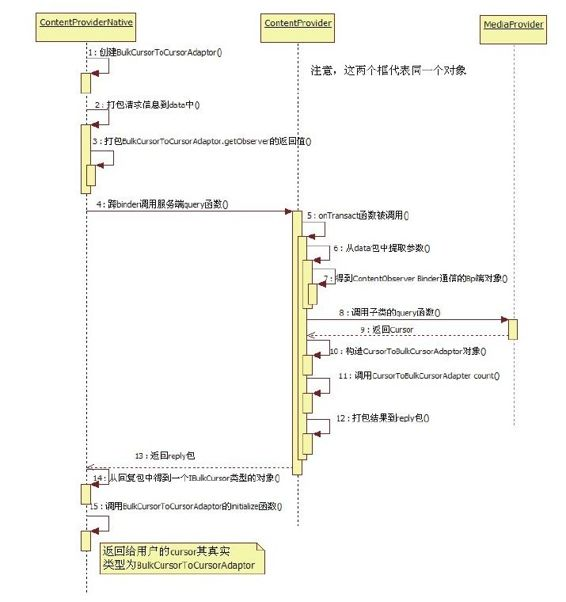

# 7.4.1　提取query关键点


1.客户端query关键点按以前的分析习惯，碰到Binder调用时会马上转入服务端（即Bn端）去分析，但是这个思路在query函数中行不通。为什么？来看IContentProviderBp端的query函数，它定义在ContentProviderProxy中，代码如下：

[--＞ContentProviderN ative.java：
ContentProviderProxy.query]

```java
publi c Cursor query(Uri url,
String[] projecti on, String selecti on,
String[] selecti onArgs, String
sortOrder)throws RemoteExcepti on{
//①构造一个BulkCursorToCursorAdaptor
对象
BulkCursorToCursorAdaptor adaptor=new
BulkCursorToCursorAdaptor();
Parcel data=Parcel.obtain();
Parcel reply=Parcel.obtain();
try{
data.writ eInterfaceToken
(IContentProvider.descriptor);
```

……//将参数打包到data请求包中

```
//②adaptor.getObserver()返回一个
IContentObserver类型的对象,把它
//也打包到data请求包中。
```

ContentObserver相关的知识留到第8章再分析

```
data.writ eStrongBinder
(adaptor.getObserver().asBinder
());
//发送请求给远端的Bn端
mRemote.transact
(IContentProvider.QUERY_TRANSACTION,
data, reply,0);
DatabaseUtil s.readExcepti onFromParcel
(reply);
//③从回复包中得到一个IBulkCursor类型
的对象
IBulkCursor bulkCursor=
BulkCursorNati ve.asInterface
(reply.readStrongBinder());
if(bulkCursor!=nu){
int rowCount=reply.readInt();
int idColumnPositi on=reply.readInt
();
boolean
wantsA OnMoveCa s=reply.readInt
()!=0;
//④调用adaptor的initi ali ze函数
adaptor.initi ali ze(bulkCursor,
rowCount,
idColumnPositi on,
wantsA OnMoveCa s);
}……
return adaptor;
}……
fina y{
data.recycle();
reply.recycle();
}
```

从以上代码中可发现，ContentProviderProxy query函数中还大有文章，其中一共列出了4个关键点。最令人头疼的是其中新出现的两个类BulkCursorToCursorAdaptor和IBulkCursor。此处不必急于分析它们。

我们再到服务端去提取query函数的关键点。

2.服务端query关键点根据第2章对Binder的介绍，客户端发来的请求先在Bn端的onTransact中得到处理，代码如下：

[--＞ContentProviderN ative.java：
onTransact]

```java
publi c boolean onTransact(int code,
Parcel data, Parcel reply, int fl ags)
throws RemoteExcepti on{
try{
swit ch(code){
```

case QUERY_TRANSACTION：//处理query请求

```
{
data.enforceInterface
(IContentProvider.descriptor);
Uri url=Uri.CREATOR.createFromParcel
(data);
```

……//从请求包中提取参数

```
//⑤创建ContentObserver Binder通信的Bp
端
IContentObserver
observer=IContentObserver.Stub.asInter
face(
data.readStrongBinder());
//⑥调用MediaProvider实现的query函数。
```

Cursor是一个接口类，那么变量

```
//cursor的真实类型是什么?
Cursor cursor=query(url, projecti on,
selecti on, selecti onArgs,
sortOrder);
if(cursor!=nu){
//⑦创建一个CursorToBulkCursorAdaptor
类型的对象
CursorToBulkCursorAdaptor adaptor=new
CursorToBulkCursorAdaptor(
cursor, observer, getProviderName
());
fi nal IBinder binder=adaptor.asBinder
();
//⑧返回结果集所含记录项的条数,这个函
数看起来极不起眼,但却非常关键
fi nal int count=adaptor.count();
//返回名为"_id"的列在结果集中的索引位
置,该列由数据库在创建表时自动添加
fi nal int
index=BulkCursorToCursorAdaptor.fi ndRo
wIdColumnIndex(
adaptor.getColumnNames());
//wantsA OnMoveCa s一般为false,读者
阅读完本章后再自行分析它
fi nal boolean wantsA OnMoveCa s=
adaptor.getWantsA OnMoveCa s();
reply.writ eNoExcepti on();
//将binder的信息写到reply回复包中
reply.writ eStrongBinder(binder);
```

reply.writ eInt（count）；//将结果集包含的记录项行数返回给客户端

```
reply.writ eInt(index);
reply.writ eInt(wantsA OnMoveCa s?
1:0);
}……
return true;
```

}……//其他情况处理

```
……
}
```

和客户端对应，服务端的query处理也比较复杂，其中的“拦路虎”仍是新出现的几种数据类型。

在扫清这些“拦路虎”之前，应先把客户端和服务端query调用的关键点总结一下。

3.提取query关键点总结我们提取query两端的调用关键点，如图7-5所示。



图7-5 query调用关键点示意再来总结一下前面提到的几个“拦路虎”，它们分别是：

客户端创建的BulkCursorToCursorAdaptor，以及从服务端query后得到的IBulkCursor。

服务端创建的CursorToCursorAdaptor，以及从子类query函数返回的Cursor。

从名字上看，这几个类都和Cursor有关，所以有必要先搞清M ediaProviderquery返回的Cursor到底是什么。

注意图7-5借用了UML的序列图来展示query调用顺序，其中ContentProvider（CP）框和M ediaProvider框代表同一个对象。另外，图7-5中的调用函数编号并不完全对应代码中的关键函数调用编号。
