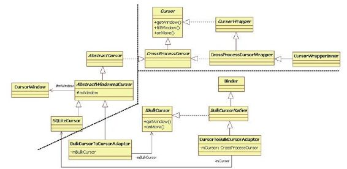

# 7.4.2　MediaProvider的query分析


本节将分析M ediaProvider的query函数。

此次分析的焦点不是MediaProvider本身的业务逻辑，而是要搞清query函数返回的Cursor到底是什么，其代码如下，：

[--＞M ediaProvider.java：query]

```java
publi c Cursor query(Uri uri,
String[] projecti onIn, String
selecti on,
String[] selecti onArgs, String sort){
int table=URI_MATCHER.match(uri);
……
//根据uri取出对应的DatabaseHelper对
象,MediaProvider针对内部存储中的媒体
```

文件和

```
//外部存储(即SD卡)中的媒体文件分别创
建了两个数据库
DatabaseHelper
database=getDatabaseForUri(uri);
//我们在7.3.2节分析过
getReadableDatabase函数的兄弟
getWrit ableDatabase函数
SQLit eDatabase
db=database.getReadableDatabase();
//创建一个SQLit eQueryBuil der对象,用于
方便开发人员编写SQL语句
SQLit eQueryBuil der qb=new
SQLit eQueryBuil der();
```

……//设置qb的参数，例如调用setTables函数为本次查询设定目标Table

```
//①调用SQLit eQueryBuil der的query函数
Cursor c=qb.query(db, projecti onIn,
selecti on,
combine(prependArgs,
selecti onArgs),groupBy, nu , sort,
limit);
if(c!=nu){
//②调用该Cursor对象的
setNotifi cati onUri函数,这部分内容和
ContentObserver
//有关,相关内容留到第8章再进行分析
c.setNotifi cati onUri(getContext
().getContentResolver(),uri);
}
return c;
}
```

上边代码列出的两个关键点分别是：

调用SQLiteQueryBuilder的query函数得到一个Cursor类型的对象。

调用Cursor类型对象的setNotifi cationUri函数。从名字上看，该函数是为Cursor对象设置通知URI。和ContentObserver有关的内容留到第8章再进行分析。

下面来看SQLiteQueryBuilder的query函数。

1.SQ LiteQ ueryBuilder的query函数分析这部分的代码如下：

[--＞SQLiteQ ueryBuilder.java：query]

```java
publi c Cursor query(SQLit eDatabase
db, String[] projecti onIn,
String selecti on,
String[] selecti onArgs, String
groupBy,
String having, String sortOrder,
String li mit){
……
//调用buil dQuery函数得到对应SQL语句的
字符串
String sql=buil dQuery(
projecti onIn, selecti on, groupBy,
having,
sortOrder, li mit);
/*
调用SQLit eDatbase的rawQueryWit hFactory
函数,mFactory是SQLit eQueryBuil der
的成员变量,初始值为nu,本例也没有设
置它,故mFactory为nu
*/
return db.rawQueryWit hFactory(
mFactory, sql, selecti onArgs,
SQLit eDatabase.fi ndEdit Table
(mTables));
}
```

[--＞SQLiteDatabase.java：
raw QueryW ithFactory]

```java
publi c Cursor rawQueryWit hFactory(
CursorFactory cursorFactory, String
sql, String[] selecti onArgs,
String edit Table){
verif yDbIsOpen();
BlockGuard.getThreadPoli cy
().onReadFromDisk();
//数据库开发中经常碰到连接池的概念,其
```

目的也是缓存重型资源。有兴趣的读者不妨自行

```
//研究一下面这个getDbConnecti on函数
SQLit eDatabase db=getDbConnecti on
(sql);
//创建一个SQLit eDirectCursorDriver对象
SQLit eCursorDriver driver=new
SQLit eDirectCursorDriver(
db, sql, edit Table);
Cursor cursor=nu;
try{
//调用SQLit eCursorDriver的query函数
cursor=driver.query(
cursorFactory!=nu ?cursorFactory:
mFactory,
selecti onArgs);
}fi na y{
releaseDbConnecti on(db);
}
return cursor;
```

以上代码中又出现一个新类型，即SQ LiteCursorDriver, cursor变量是其query函数的返回值。

（1）SQLiteCursorDriver的query函数分析SQLit eCursorDriver的query函数的代码如下：

[--＞SQLiteCursorDriver.java：query]

```java
publi c Cursor query(CursorFactory
factory, String[] selecti onArgs){
//本例中,factory为空
SQLit eQuery query=nu;
try{
mDatabase.lock(mSql);
mDatabase.closePendingStatements();
//①构造一个SQLit eQuery对象
query=new SQLit eQuery(mDatabase,
mSql,0,selecti onArgs);
//原来,最后返回的游标对象其真实类型是
SQLit eCursor
```

if（factory==nu）{//②构造一个SQLit eCursor对象

```
mCursor=new SQLit eCursor(this,
mEdit Table, query);
}else{
mCursor=factory.newCursor(mDatabase,
this,
mEdit Table, query);
}
mQuery=query;
query=nu;
```

return mCursor；//原来返回的cursor对象其真实类型是SQLit eCursor

```
}fi na y{
if(query!=nu)query.close();
mDatabase.unlock();
}
```

SQLiteCursorDriver的query函数的主要功能就是创建一个SQLiteQuery实例和一个SQLiteCursor实例。至此，我们终于搞清楚了M ediaProvider的query返回的游标对象其真实类型是SQLiteCursor。

注意这里的M ediaProviderquery指的是图7-5中的编号为8的关键调用。

下面来看SQLiteQuery和SQLiteCursor为何方神圣。

（2）SQLiteQuery介绍在图7-4中曾介绍过SQLiteQuery，它保存了和查询（即SQL的SELECT命令）命令相关的信息，其构造函数的代码如下：

[--＞SQLiteQ uery.java：构造函数]

```java
SQLit eQuery(SQLit eDatabase db, String
query, int o setIndex,
String[] bindArgs){
//注意,在本例中o setIndex为0,
```

o setIndex的意义到后面再解释super（db, query）；//调用基类构造函数

```
mO setIndex=o setIndex;
bindA ArgsAsStrings(bindArgs);
}
```

SQLiteQuery的基类是SQLiteProgram，其代码如下：

[--＞SQLiteProgram .java：构造函数]

```
SQLit eProgram(SQLit eDatabase db,
String sql){
```

this（db, sql, nu , true）；//调用另外一个构造函数，注意传递的参数

```
}
SQLit eProgram(SQLit eDatabase db,
String sql, Object[] bindArgs,
boolean compil eFlag){
//本例中bindArgs为nu , compil eFlag为
true
mSql=sql.trim();
//返回该SQL语句的类型,query语句将返回
STATEMENT_SELECT类型
int
n=DatabaseUtil s.getSqlStatementType
(mSql);
swit ch(n){
case DatabaseUtil s.STATEMENT_UPDATE:
mStatementType=n|STATEMENT_CACHEABLE;
break;
case DatabaseUtil s.STATEMENT_SELECT:
/*
mStatementType成员变量用于标示该SQL语
句的类型,如果该SQL语句
是STATEMENT_SELECT类型,则
mStatementType将设置
STATEMENT_CACHEABLE
标志。该标志表示此对象将被缓存起来,以
避免再次执行同样的SELECT命令时重新构造
一个对象
*/
mStatementType=n|STATEMENT_CACHEABLE|
STATEMENT_USE_POOLED_CONN;
break;
```

……//其他情况处理

```
default:
mStatementType=n;
}
```

db.acquireReference（）；//增加引用计数

```
db.addSQLit eClosable(this);
mDatabase=db;
nHandle=db.mNati veHandle;//此
```

mNati veHandle对应一个SQLit e3实例

```
if(bindArgs!=nu)……//绑定参数
//compli eAndBindA Args将为此对象绑定
一个sqlit e3_stmt实例,nati ve层对象的指
针
//保存在nStatement成员变量中
if(compil eFlag)compil eAndbindA Args
();
}
```

来看compileAndbindA Args函数，其代码是：

[--＞SQLiteProgram .java：
com pileAndbindA Args]

```
void compil eAndbindA Args(){
……
//如果该对象还未和native层的
sqlit e3_stmt实例绑定,则调用compil eSql
函数
if(nStatement==0)compil eSql();
```

……//绑定参数

```
for(int index:mBindArgs.keySet())
{
Object value=mBindArgs.get(index);
if(value==nu){
nati ve_bind_nu(index);
```

}……//绑定其他类型的数据

```
}
```

com pileSql函数将绑定Java层SQLiteQuery对象到一个Native的sqlite3_stmt实例。根据前文的分析，这个绑定是通过SQLiteCompileSql对象实施的，其相关代码如下：

[--＞SQLiteProgram .java：com pileSql]

```java
private void compil eSql(){
//如果mStatementType未设置
STATEMENT_CACHEABLE标志,则每次都创建
一个
//SQLit eCompil edSql对象。根据7.3.2节中
的分析,该对象会真正和Native层的
//sqlit e_stmt实例绑定
if((mStatementType&
STATEMENT_CACHEABLE)==0){
mCompil edSql=new SQLit eCompil edSql
(mDatabase, mSql);
nStatement=mCompil edSql.nStatement;
return;
}
//从SQLit eDatabase对象中查询是否已经缓
存过符合该SQL语句要求的
SQLit eCompil edSql
//对象
mCompil edSql=mDatabase.getCompil edStat
ementForSql(mSql);
if(mCompil edSql==nu){
//创建一个新的SQLit eCompil edSql对象,
```

并把它保存到mDatabase中

```
mCompil edSql=new SQLit eCompil edSql
(mDatabase, mSql);
mCompil edSql.acquire();
mDatabase.addToCompil edQueries(mSql,
mCompil edSql);
}……
//保存Nati ve层sqlit e3_stmt实例指针到
nStatement成员变量
nStatement=mCompil edSql.nStatement;
}
```

通过以上分析可以发现，SQLiteQuery将和一个代表SELECT命令的sqlit e3_stm t实例绑定。同时，为了减少创建sqlite3_stmt实例的开销，SQLiteDatabase框架还会把对应的SQL语句和对应的SQLiteCompiledSql对象缓存起来。如果下次执行同样的SELECT语句，那么系统将直接取出之前保存的SQLiteCompiledSql对象，这样就不用重新创建sqlite3_stmt实例了。

思考与直接使用SQLiteAPI相比，SQLiteDatabase框架明显考虑了更多问题。读者自己封装C++SQLite库时是否想到了这些问题？

（3）SQLiteCursor分析再来看SQLiteCursor类，其构造函数的代码如下：

[--＞SQLiteCursor.java：构造函数]

```java
publi c SQLit eCursor
(SQLit eCursorDriver driver, String
edit Table,
SQLit eQuery query){
……
mDriver=driver;
mEdit Table=edit Table;
mColumnNameMap=nu;
```

mQuery=query；//保存此SQLit eQuery对象

```
query.mDatabase.lock(query.mSql);
try{
//得到此次执行query得到的结果集所包含
的列数
int
columnCount=mQuery.columnCountLocked
();
mColumns=new String[columnCount];
for(int i=0;i<columnCount;i++){
String
columnName=mQuery.columnNameLocked
(i);
//保存列名
mColumns[i]=columnName;
if("_id".equals(columnName)){
```

mRowIdColumnIndex=i；//保存“_id”列在结果集中的索引位置

```
}
}fi na y{
query.mDatabase.unlock();
}
```

SQLiteCursor比较简单，此处不再详述。

2.Cursor分析至此，我们已经知道MediaProviderquery返回的游标对象的真实类型了。现在，终于可以请Cursor家族登台亮相了，如图7-6所示。



图7-6 Cursor家族图7-6中元素较多，包含的知识点也较为复杂，因此必须仔细阅读下文的解释。

通过7.3.1节中Sqlit eTest示例可知，query查询（即SELECT命令）的结果和一个Nativesqlite_stmt实例绑定在一起，开发者可通过遍历该sqlite_stmt实例得到自己想要的结果（例如，调用sqlite3_step遍历结果集中的行，然后通过sqlite3_column_xxx取出指定列的值）。查询结果集可通过数据库开发技术中一个专用术语——游标（Cursor）来遍历和获取。图7-6的左上部分是和Cursor有关的类，它们包括：接口类Cursor和CrossProcessCursor、抽象类AbstractCursor、AbstractW indowCursor，以及真正的实现类SQLiteCursor。根据前面的分析，SQLiteCursor内部保存一个已经绑定了sqlit e3_stm t实例的SQLiteQuery对象，故读者可简单地把SQLiteCursor看成是一个已经包含了查询结果集的游标对象，虽然此时还未真正执行SQL语句。

如上所述，SQLiteCursor是一个已经包含了结果集的游标对象。从进程角度看，query的结果集目前还属于MediaProvider所在的进程，而本次query请求是由客户端发起的，所以一定要有一种方法将MediaProvider中的结果集传递到客户端进程。数据传递使用的技术很简单，就是大家耳熟能详的共享内存技术。SQLiteAPI没有提供相关的功能，但是SQLiteDatabase框架对跨进程数据传递进行了封装，最终得到了图7-6左上部分的CursorW indow类。其代码中的注释明确表明了CursorWindow的作用，它是“A bu er containingm ulti ple cursorrows”。

认识了CursorWindow类后，相信读者就能猜出query中数据传递的大致流程了。

MediaProvider将结果集中的数据存储到CursorWindow的共享内存中，然后客户端将其从共享内存中取出来即可。

上述流程描述是对的，但实际过程并非如此简单，因为SQLiteDatabase框架希望客户端看到的不是共享内存，而是一个代表结果集的游标对象，就好像客户端查询的是本进[1]程中的数据库一样。由于存在这种要求，Android构造了图7-6右下角的类家族。其中，最重要的两个类是CursorToBulkCursorAdaptor和BulkCursorToCursorAdatpor。从名字上看，它们采用了设计模式中的Adaptor模式；从继承关系上看，这两个类将参与跨进程的Binder通信（其中客户端使用的BulkCursorToCursorAdaptor通过m BulkCursor与位于M ediaProvider所在进程的CursorToBulkCursorAdaptor通信）。这两个类中最重要的是onMove函数，以后我们碰到时再作分析。

另外，图7-6中右上角部分展示了CursorW rapperInner类的派生关系。

CursorW rapper-Inner类是ContentResolverquery函数最终返回给客户端的游标对象的类型。CursorWrapper-Inner的目的应该是拓展CursorToBulkCursorAdaptor类的功能。

Cursor家族有些复杂。笔者觉得，目前对Cursor的架构设计有些过度（over-designed）。这不仅会导致我们分析时困难重重，并且会对实际代码的运行效率造成一定损失。

下面我们将焦点放到跨进程的数据传输上。

[1]此处应该还存在其他方面的设计考虑，希望读者能参与讨论。
