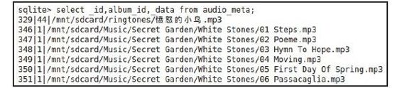
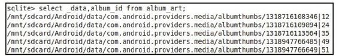

# 7.6.2　ContentProvider的openTypedAssetFile函数分析


```
return openAssetFil e(uri,"r");//此
```

函数的代码见下文

```
String baseType=getType(uri);
if(baseType!=nu&&
Cli pDescripti on.compareMimeTypes
(baseType, mimeTypeFilt er)){
return openAssetFil e(uri,"r");
}
throw new Fil eNotFoundExcepti on
("Can't open"+
uri+"as type"+mimeTypeFilt er);
}
```

[--＞ContentProvider. java：
openAssetFile]

```
publi c AssetFil eDescriptor
openAssetFil e(Uri uri, String mode)
throws Fil eNotFoundExcepti on{
//openFile由子类实现。这里还以
MediaProvider为例
ParcelFil eDescriptor fd=openFil e(uri,
mode);
//根据openFil e返回的fd得到一个
AssetFil eDescriptor对象
return fd!=nu ?new
AssetFil eDescriptor(fd,0,-1):
nu;
}
```

下面分析M ediaProvider实现的openFile函数。

1.M ediaProvideropenFile分析这部分的代码如下：

[--＞M ediaProvider.java：openFile]

```java
publi c ParcelFil eDescriptor openFil e
(Uri uri, String mode)
throws Fil eNotFoundExcepti on{
ParcelFil eDescriptor pfd=nu;
//假设URI符合下面的if条件,即客户端想
读取的是某音乐文件所属专辑(Album)的
信息
if(URI_MATCHER.match(uri)
==AUDIO_ALBUMART_FILE_ID){
DatabaseHelper
database=getDatabaseForUri(uri);
……
SQLit eDatabase
db=database.getReadableDatabase();
……
SQLit eQueryBuil der qb=new
SQLit eQueryBuil der();
//得到客户端指定的代表该音乐文件的_id
值
int songid=Integer.parseInt
(uri.getPathSegments().get(3));
qb.setTables("audio_meta");
qb.appendWhere("_id="+songid);
Cursor c=qb.query(db,
new String[] {
MediaStore.Audio.Media.DATA,
MediaStore.Audio.Media.ALBUM_ID},
nu ,nu ,nu ,nu ,nu);
if(c.moveToFirst()){
String audiopath=c.getString(0);
//获取该音乐所属的albumid值
int albumid=c.getInt(1);
//注意,下面函数中调用的ALBUMART_URI将
指向album_art表
Uri newUri=ContentUris.wit hAppendedId
(ALBUMART_URI, albumid);
try{
//调用CP实现的openFil eHelper函数。注
意,pfd的
//类型是ParcelFil eDescriptor
pfd=openFil eHelper(newUri, mode);
```



```objectivec
}……
}
```

图7-8 audio_m eta内容展示

```
c.close();
```

图7-8中设置的SQ L语句是select_id,

```
return pfd;
album _id,_data from audio_m eta,得
}
```

到的结果集包含：第一列音乐文件的_id值，第二列返回音乐文件所属专辑的……

album_id值，第三列返回对应歌曲的文件

```
}
```

存储路径。

以上代码在调用openFileHelper函数前构造在以上代码中，MediaProvider将首先通过了一个新的URI变量，根据代码中的注释可客户端指定的音乐文件的_id去查询它的专知，它将查询album_art表，不妨再看一个辑信息。此处给读者一个示例，如图7-8所示例，如图7-9所示。

示。



图7-9 album _art内容展示在图7-9中，结果集的第一列为专辑艺术家的缩略图文件存储路径，第二列为专辑艺术家album_id值。所以，要打开的文件就是对应album_id的缩略图。再来看openFileHelper的代码。

2.ContentProvideropenFileHelper函数分析这部分的代码如下：

[--＞ContentProvider. java：
openFileHelper]

```
protected fi nal ParcelFil eDescriptor
openFil eHelper(Uri uri,
String mode)throws
Fil eNotFoundExcepti on{
//获取缩略图的文件路径
Cursor c=query(uri, new String[]
{"_data"},nu , nu , nu);
int count=(c!=nu)?c.getCount
():0;
if(count!=1){
```

……//一个album_id只能对应一个缩略图文件

```
}
c.moveToFirst();
int i=c.getColumnIndex("_data");
String path=(i>=0?c.getString(i):
nu);
c.close();
if(path==nu)
throw new Fil eNotFoundExcepti on
("Column_data not found.");
int
modeBit s=ContentResolver.modeToMode
(uri, mode);
//创建ParcelFil eDescriptor对象,内部会
首先打开一个文件以得到
//一个Fil eDescriptor对象,然后再创建一
个ParcelFil eDescriptor对象,其实
//就是设置ParcelFil eDescriptor中成员变
量mFil eDescriptor的值
return ParcelFil eDescriptor.open(new
Fil e(path),modeBit s);
}
```

至此，服务端已经打开指定文件了。那么，这个服务端的文件描述符是如何传递到客户端的呢？我们单起一节来回答这个问题。
