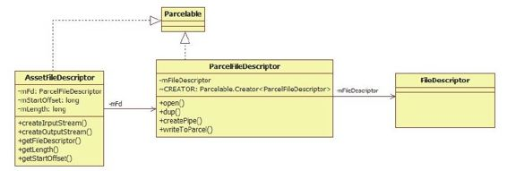

# 7.6　ContentResolver openAssetFileDescriptor函数分析


考虑到query的局限性，ContentProvider还支持另外一种更直接的数据传输方式，笔者称之为“文件流方式”。因为通过这种方式客户端将得到一个类似文件描述符的对象，然后在其上创建对应的输入或输出流对象。这样，客户端就可通过它们和CP进程交互数据了。

下面来分析这个功能是如何实现的。先向读者介绍客户端使用的函数，即CR的openAssetFileDescriptor。

7.6.1 openAssetFileDescriptor之客户端调用分析这部分的代码如下：

[--＞ContentResolver. java：
openAssetFileDescriptor]

```
publi c fi nal AssetFil eDescriptor
openAssetFil eDescriptor(Uri uri,
String mode)throws
Fil eNotFoundExcepti on{
//openAssetFil eDescriptor是一个通用函
```

数，它支持3种scheme类型的URI。见

```
//下文的解释
String scheme=uri.getScheme();
if(SCHEME_ANDROID_RESOURCE.equals
(scheme)){
if(!"r".equals(mode)){
throw new Fil eNotFoundExcepti on
("Can't writ e resources:"+uri);
}
//创建资源文件输入流
OpenResourceIdResult r=getResourceId
(uri);
try{
return r.r.openRawResourceFd(r.id);
}……
}else if(SCHEME_FILE.equals
(scheme)){
//创建普通文件输入流
ParcelFil eDescriptor
pfd=ParcelFil eDescriptor.open(
new Fil e(uri.getPath()),
modeToMode(uri, mode));
return new AssetFil eDescriptor(pfd,
0,-1);
}else{
if("r".equals(mode)){
//我们重点分析这个函数,用于读取目标CP
的数据
return openTypedAssetFil eDescriptor
(uri,"*/*",nu);
```

}……//其他模式的支持，请读者学完本章后自行研究这部分内容

```
}
```

如以上代码所述，openAssetFileDescriptor是一个通用函数，它支持3种sheme类型的URI。

SCHEM E_ANDROID_RESOURCE：字符串表达为android.resource。通过它可以读取APK包（其实就是一个压缩文件）中封装的资源。假设在应用进程的res/raw目录下存放一个test.ogg文件，最终生成的资源ID由R.raw.tet来表达，那么如果应用进程想要读取这个资源，创建的URI就是android.resource：//com .package.nam e/R.raw.test。读者不妨试一试。

SCHEME_FILE：字符串表达为file。通过它可以读取普通文件。

除上述两种scheme之外的URI：这种资源背后到底对应的是什么数据需要由目标CP来解释。

接下来分析在第3种sheme类型下调用的openTypedAssetFileDescriptor函数。

1.openTypedAssetFileDescriptor函数分析这部分的代码如下：

[--＞ContentResolver.java：
openTypedAssetFileDescriptor]

```java
publi c fi nal AssetFil eDescriptor
openTypedAssetFil eDescriptor(Uri
uri,
String mimeType, Bundle opts)throws
Fil eNotFoundExcepti on{
//建立和目标CP进程交互的通道。读者还记
得此处provider的真实类型吗?
//其真实类型是ContentProviderProxy
IContentProvider
provider=acquireProvider(uri);
try{
//①调用远端CP的openTypedAssetFil e函
数,返回值的
//类型是AssetFil eDescriptor。此处传递
参数的值为:mimeType="*/*"
//opts=nu
AssetFil eDescriptor
fd=provider.openTypedAssetFil e(uri,
mimeType, opts);
……
//②创建一个ParcelFil eDescriptor类型的
变量
ParcelFil eDescriptor pfd=new
ParcelFil eDescriptorInner(
fd.getParcelFil eDescriptor(),
provider);
provider=nu;
//③又创建一个AssetFil eDescriptor类型
的变量作为返回值
return new AssetFil eDescriptor(pfd,
fd.getStartO set(),
fd.getDeclaredLength());
}……
fina y{
if(provider!=nu){
releaseProvider(provider);
}
```

在以上代码中，阻碍我们思维的依然是新出现的类。先应解决它们，然后再分析代码中的关键调用。

2.FileDescriptor家族介绍本节涉及的类家族图谱如图7-7所示。

图7-7中的内容比较简单，只需稍作介绍。

FileDescriptor类是Java的标准类，它是对文件描述符的封装。进程打开的每一个文件都有一个对应的文件描述符。在Native语言开发中，它用一个int型变量来表示。



图7-7 FileDescriptor家族图谱文件描述符作为进程的本地资源，如想越过进程边界将其传递给其他进程，则需借助进程间共享技术。在Android平台上，设计者封装了一个ParcelFileDescriptor类。此类实现了Parcel接口，自然就支持了序列化和反序列化的功能。从图7-7可知，一个ParcelFileDescriptor通过m FileDescritpor指向一个文件描述符。

AssetFileDescriptor也实现了Parcel接口，其内部通过mFd成员变量指向一个ParcelFileDescriptor对象。从这里可看出，AssetFileDescritpor是对ParcelFileDescriptor类的进一步封装和扩展。实际上，根据SDK文档中对AssetFileDescritpor的描述可知，其作用在于从AssetManager（后续分析资源管理的时候会介绍它）中读取指定的资源数据。

提示简单向读者介绍一下与AssetFileDescriptor相关的知识。它用于读取APK包中指定的资源数据。以前面提到的test.ogg为例，如果通过AssetFileDescriptor读取它，那么其m Fd成员则指向一个ParcelFileDescriptor对象。

且不管这个对象是否跨越了进程边界，它毕竟代表一个文件。假设这个文件是一个APK包，AssetFileDescriptor的m StartO set变量用于指明test.ogg在这个APK包中的起始位置，比如100字节。而mLength用于指明test.ogg的长度，假设是1000字节。通过上面的介绍可知，该APK文件从100字节到7.6.2 ContentProvider的1o1p0e0n字Ty节p e这d一A s段se空tF间ile中函存数储分的析就是te st.o g g的数据。这样，AssetFileDescriptor就能将test.ogg数据从APK包中读取出来了。

这部分的代码具体如下：

下面来看ContentProvider的

[--＞ContentProvider. java：

openTypedAssetFile函]数。

```
publi c AssetFil eDescriptor
openTypedAssetFil e(Uri uri, String
mimeTypeFilt er,
Bundle opts)throws
Fil eNotFoundExcepti on{
//本例满足下面的if条件
if("*/*".equals(mimeTypeFilt er))
```
