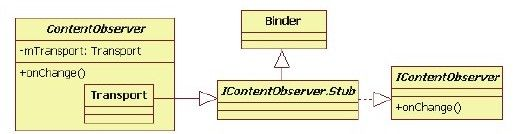

# 8.2.2　ContentResovler的registerContentObserver分析


8.2.2 ContentResovler的registerContentO bserver分析这部分的代码如下：

[--＞ContentResolver. java：
registerContentO bserver]

```
publi c fi nal void
registerContentObserver(Uri uri,
boolean notif yForDescendents,
ContentObserver observer){
/*
注意registerContentObserver传递的参
数,其中:
uri是客户端设置的它需要监听的数据项的
地址,用uri来表示
notif yForDescendents:如果该值为true,
则所有地址包含此uri的数据项发生变化时
都会触发通知;否则只有完全符合该uri地
址的数据项发生变化时才会触发通知。以文
件夹和
其中的文件为例,若uri指向某文件夹,则
需设置notif yForDescendents为true,即该
文件
夹下的任何文件发生变化,都需要通知监听
者。
observer是客户端设置的监听对象。当数据
项发生变化时,该对象的onChange函数将被
调用
*/
try{
/*
调用ContentService的
registerContentObserver函数,其第三个
参数是
observer.getContentObserver的返回值,
它是什么呢?
*/
getContentService
().registerContentObserver(uri,
notif yForDescendents,
observer.getContentObserver());
}……
}
```

registerContentO bserver最终将调用ContentService的registerContentO bserver函数，其中第三个参数是ContentObservergetContentObserver的返回值。这个返回值是什么呢？要搞明白这个问题，需请出ContentObserver家族成员。

1.ContentObserver介绍ContentObserver家族成员如图8-1所示。



图8-1 ContentObserver家族类图图8-1中的ContentObserver类和第7章中介绍的ContentProvider类非常类似，内部都定义了一个Transport类参与Binder通信。由图8-1可知，Transport类从IContentO bserver.Stub派生。从Binder通信角度来看，客户端进程中的Transport将是Bn端。如此，通过registerContentO bserver传递到ContentService所在进程的就是Bp端。

IContentObserverBp端对象的真实类型是IContentO bserver.Stub.Proxy。

注意IContentO bserver.java由aidl处理IContentObserver.aidl生成，其所在位置为out/targer/com m on/obj/JAVA_LIBRARIES/fram ew ork_interm ediates/src/core/java/android/database/IContentO bserver.java。

2.registerContentO bserver函数分析下面来看ContentService的registerContentO bserver函数的代码。

[--＞ContentService. java：
registerContentO bserver]

```
publi c void registerContentObserver
(Uri uri, boolean
notif yForDescendents,
IContentObserver observer){
……
synchronized(mRootNode){
//ContentService要做的事情其实很简单,
```

就是保存uri和observer的对应关系到

```
//其内部变量mRootNode中
mRootNode.addObserverLocked(uri,
observer, notif yForDescendents,
mRootNode, Binder.getCalli ngUid(),
Binder.getCalli ngPid());
}
```

m RootNode是ContentService的成员变量，其类型为ObserverNode。

ObserverNode的组织形式是数据结构中的树，其叶子节点的类型为ObserverEntry，它保存了uri和对应的IContentObserver对象。本节不关注它们的内部实现，读者若有兴趣，不妨自行研究。

至此，客户端已经为某数据项设置了ContentObserver。再来看通知机制实施的第二步，即通知观察者。
