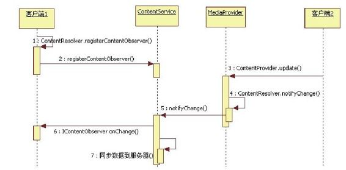

# 8.2.4　数据更新通知机制总结和深入探讨


```
restoreCalli ngIdentit y
(identit yToken);
```

总结上面所描述的数据更新通知机制的流程，如图8-2所示。

```
}
```



```
}
```

图8-2数据更新通知的流程图从前面的代码介绍和图8-2所示的流程来看，Android平台中的数据更新通知机制较为简单。不过此处尚有几个问题想和读者一起探讨。

问题一：由图8-2可知，客户端2调用ContentProvider的update函数将间接触发客户端1的ContentObserver的onChange函数被调用。如果客户端1在onChange函数中耗时过长，会不会导致客户端2阻塞在update函数中呢？

想到这个问题的读者应该是非常细致和认真的了。确实，从前面所示的代码和流程图来看，这个情况几乎是必然会发生的，但是实际上该问题并不存在，原因在下面这一段代码中：

[--＞IContentObserver. java：Proxy：
onChange]

```
private stati c class Proxy implements
android.database.IContentObserver{
private android.os.IBinder mRemote;
……
publi c void onChange(boolean
self Update)
throws android.os.RemoteExcepti on{
android.os.Parcel_data=android.os.Parc
el.obtain();
try{
_data.writ eInterfaceToken
(DESCRIPTOR);
_data.writ eInt(((self Update)?
(1):(0)));
//调用客户端1的ContentObserver Bn端的
onChange函数
mRemote.transact
(Stub.TRANSACTION_onChange,_data,
nu,
android.os.IBinder.FLAG_ONEWAY);
}fi na y{
_data.recycle();
}
……
}
```

以上代码告诉我们，ContentService在调用客户端注册的IContentObserver的onChange函数时，使用了FLAG_ONEW AY标志。根据第2章对该标志的介绍（参见2.2.1节），使用该标志的Binder调用只需将请求发给Binder驱动即可，无须等待客户端onChange函数的返回。因此，即使客户端1在onChange中恶意浪费时间，也不会阻塞客户端2的update函数了。

问题二：假设服务端有一项功能，需要客户端通过某种方式来控制它的开闭（即禁止或使用该功能），考虑一下有几种方式能实现这个控制机制？这是一个开放性问题，需要集思广益。

Android平台上至少有3种方法可以实现这个控制机制。

第一种：服务端实现一个API函数，客户端直接调用这个函数来控制。

第二种：客户端发送指定的广播，而服务端注册该广播的接收者，然后在这个广播接收者的onReceive函数中处理。

第三种：服务端输出一个ContentProvider，并为这个功能输出一个uri地址，然后注册一个ContentObserver。客户端可通过更新数据的方式来触发服务端ContentObserver的onChange函数，服务端在该函数中做对应处理即可。

在Android代码中，这三种方法都有使用。

下面将以Settings应用中和USB相关的功能设置为例来观察第一种和第三种方法的使用情况。

第一个实例和Android4.0中新支持的USBMTP/PTP功能有关，相关代码如下：

[--＞UsbSetti ngs. java：
onPreferenceTreeClick]

```
publi c boolean onPreferenceTreeCli ck
(PreferenceScreen preferenceScreen,
Preference preference){
……
if(preference==mMtp){
mUsbManager.setCurrentFuncti on
(UsbManager.USB_FUNCTION_MTP,
true);
updateToggles
(UsbManager.USB_FUNCTION_MTP);
}else if(preference==mPtp){
mUsbManager.setCurrentFuncti on
(UsbManager.USB_FUNCTION_PTP,
true);
updateToggles
(UsbManager.USB_FUNCTION_PTP);
}
return true;
}
```

由以上代码可知，如果用户从Settings界面中选择了使能MTP，将直接调用UsbM anager的setCurrentFunction来使能MTP功能。这个函数的Bn端实现在UsbService中。

不过，同样是USB相关的功能控制，ADB的开关控制却采用了第三种方法，相关代码为：

[--＞Developm entSetti ngs. java：
onClick]

```
publi c void onCli ck(DialogInterface
dialog, int which){
if
(which==DialogInterface.BUTTON_POSITI
VE){
mOkCli cked=true;
//设置Settings数据库ADB对应的数据项值
为1
Setti ngs.Secure.putInt(getActi vit y
().getContentResolver(),
Setti ngs.Secure.ADB_ENABLED,1);
}else
mEnableAdb.setChecked(false);//界面
更新
}
```

上面的数据项更新操作将导致UsbDeviceM anager做对应处理，其相关代码如下：

[--＞UsbDeviceM anager. java：
onChange]

```java
private class AdbSetti ngsObserver
extends ContentObserver{
……
publi c void onChange(boolean
self Change){
//从数据库中取出对应项的值
boolean enable=
(Setti ngs.Secure.getInt
(mContentResolver,
Setti ngs.Secure.ADB_ENABLED,0)>
0);
//发送MSG_ENABLE_ADB消息,
```

UsbDeviceManager将处理此消息

```
mHandler.sendMessage(MSG_ENABLE_ADB,
enable);
}
```

同样是USB相关的功能，Settings应用却采用了两种截然不同的方法来处理它们。这种做法为笔者目前所从事的项目中USB扩展功能的实现带来了极大困扰，因为我们想采用统一的方法来处理USB相关功能。到底应采用哪种方法比较合适呢？第一种方法和第三种方法各自的适用场景是什么？读者不妨仔细思考并将结论与大家分享。

我们在第7章中分析Cursorquery函数时曾看到过ContentObserver的身影，但是并没有对其进行详细分析。如果现在回过头去分析query函数流程中和ContentObserver相关的部分，则所涉及的流程可能比本节内容还要多。
