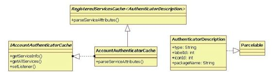
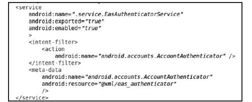
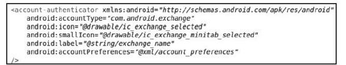
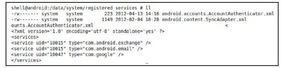

# 8.3.1　初识AccountManagerService


下面看AccountM anagerService创建时的代码：

[--＞System Server. java：
ServerThread.run]

```
……
//注册AccountManagerService到
ServiceManager,服务名为account
ServiceManager.addService
(Context.ACCOUNT_SERVICE,
new AccountManagerService
(context));
```

其构造函数的代码如下：

[--＞AccountM anagerService. java：
AccountM anagerService]

```
publi c AccountManagerService(Context
context){
//调用另外一个构造函数,其第三个参数将
构造一个AccountAuthenti catorCache对
```

象，它是

```
//什么呢?见下文分析
this(context,
context.getPackageManager(),
new AccountAuthenti catorCache
(context));
}
```

在AccountM anagerService构造函数中创建了一个AccountAuthenticatorCache对象，它是什么？来看下文。

1.AccountAuthenticatorCache分析AccountAuthenticatorCache是Android平台中账户验证服务（AccountAuthenticator Service,AAS）的管理中心。AAS由应用程序通过在AndroidM anifest.xm l中输出符合指定要求的Service信息而来。稍后读者将看到这些要求的具体格式。

先来看AccountAuthenticatorCache的派生关系，如图8-3所示。



图8-3 AccountAuthenticatorCache类图由图8-3可知：

AccountAuthenticatorCache从RegisteredServicesCache＜AuthenticatorDescription＞派生。

RegisteredServicesCache是一个模板类，专门用于管理系统中指定Service的信息收集和更新，而具体是哪些Service，则由RegisteredServicesCache构造时的参数指定。AccountAuthenticatorCache对外输出是由RegisteredServicesCache模板参数指定的类的实例。在图8-3中就是AuthenticatorDescription。

AuthenticatorDescription继承了Parcelable接口，这代表它可以跨Binder传递。该类描述了AAS相关的信息。

AccountAuthenticatorCache实现了IAccountAuthenticatorCache接口。这个接口供外部调用者使用以获取AAS的信息。

下面看AccountAuthenticatorCache的创建，其相关代码如下：

[--＞AccountAuthenticatorCache.java：
AccountAuthenticatorCache]

```java
publi c AccountAuthenti catorCache
(Context context){
/*
ACTION_AUTHENTICATOR_INTENT值
为"android.accounts.AccountAuthenti cat
or"
AUTHENTICATOR_META_DATA_NAME值
为"android.accounts.AccountAuthenti cat
or"
AUTHENTICATOR_ATTRIBUTES_NAME值
为"account-authenti cator"
*/
super(context,
AccountManager.ACTION_AUTHENTICATOR_IN
TENT,
AccountManager.AUTHENTICATOR_META_DATA
_NAME,
AccountManager.AUTHENTICATOR_ATTRIBUTE
S_NAME, sSeriali zer);
}
```

AccountAuthenticatorCache调用其基类RegisteredServicesCache的构造函数时，传递了3个字符串参数，这3个参数用于控制RegisteredServicesCache从PackageM anagerService获取哪些Service的信息。

（1）RegisteredServicesCache分析

[--＞RegisteredServicesCache.java：
RegisteredServicesCache]

```java
publi c RegisteredServicesCache
(Context context, String
interfaceName,
String metaDataName, String
a ributeName,
XmlSeriali zerAndParser<V>
seriali zerAndParser){
mContext=context;
//保存传递进来的参数
mInterfaceName=interfaceName;
mMetaDataName=metaDataName;
mA ributesName=a ributeName;
mSeriali zerAndParser=seriali zerAndPars
er;
File
dataDir=Environment.getDataDirectory
();
Fil e systemDir=new Fil e
(dataDir,"system");
//syncDir指
向/data/system/registered_service目录
Fil e syncDir=new Fil e
(systemDir,"registered_services");
//下面这个文件指向syncDir目录下的
android.accounts.AccountAuthenti cator.
xml
mPersistentServicesFil e=new AtomicFil e
(new Fil e(syncDir,
interfaceName+".xml"));
//生成服务信息
generateServicesMap();
fi nal BroadcastReceiver receiver=new
BroadcastReceiver(){
publi c void onReceive(Context
context1,Intent intent){
generateServicesMap();
}
};
//注册Package安装、卸载和更新等广播监
听者
mReceiver=new AtomicReference<
BroadcastReceiver>(receiver);
IntentFilt er intentFilt er=new
IntentFilt er();
intentFilt er.addActi on
(Intent.ACTION_PACKAGE_ADDED);
intentFilt er.addActi on
(Intent.ACTION_PACKAGE_CHANGED);
intentFilt er.addActi on
(Intent.ACTION_PACKAGE_REMOVED);
intentFilt er.addDataScheme
("package");
mContext.registerReceiver(receiver,
intentFilt er);
IntentFilt er sdFilt er=new IntentFilt er
();
sdFilt er.addActi on
(Intent.ACTION_EXTERNAL_APPLICATIONS_
AVAILABLE);
sdFilt er.addActi on
(Intent.ACTION_EXTERNAL_APPLICATIONS_
UNAVAILABLE);
mContext.registerReceiver(receiver,
sdFilt er);
}
```

由以上代码可知：

成员变量m PersistentServicesFile指向/data/system /registered_service目录下的一个文件，该文件保存了以前获取的对应Service的信息。就AccountAuthenticator而言，m PersistentServicesFile指向该目录的android.accounts.AccountAuthenticator.xml文件。

由于RegisteredServicesCache管理的是系统中指定Service的信息，当系统中有Package安装、卸载或更新时，RegisteredServicesCache也需要对应更新自己的信息，因为有些Service可能会随着APK被删除而不复存在。

generateServiceM ap函数将获取指定的Service信息，其代码如下：

[--＞RegisteredServicesCache. java：
generateServicesM ap]

```java
void generateServicesMap(){
//获取PackageManager接口,用来和
PackageManagerService交互
PackageManager
pm=mContext.getPackageManager();
ArrayList<ServiceInfo<V>>
serviceInfos=new ArrayList<
ServiceInfo<V>>();
/*
在本例中,查询PKMS中满足IntentAction
为"android.accounts.AccountAuthenti cat
or"
的服务信息。由以下代码可知,这些信息指
的是Service中声明的MetaData信息
*/
List<ResolveInfo>
resolveInfos=pm.queryIntentServices(
new Intent(mInterfaceName),
PackageManager.GET_META_DATA);
for(ResolveInfo resolveInfo:
resolveInfos){
try{
/*
调if用parserServiceInfo函数解析从PKMS中
获得的MetaData信息,该函数
返回的是一个模板类对象。就本例而言,这
个函数返回一个
ServiceInfo<AccountAuthenti cator>类
型的对象
*/
ServiceInfo<V>info=parseServiceInfo
(resolveInfo);
serviceInfos.add(info);
}
synchronized(mServicesLock){
(mPersistentServices==nu)
readPersistentServicesLocked();
mServices=Maps.newHashMap();
StringBuil der changes=new
StringBuil der();
```

……//检查mPersistentServices保存的服务信息和当前从PKMS中取出来的PKMS

```
//信息,判断是否有变化,如果有变化,需
```

要通知监听者。读者可自行阅读这段代码，

```
//注意其中uid的作用
mPersistentServicesFil eDidNotExist=fal
se;
}
```

接下来解析Service的parseServiceInfo函数。

（2）parseServiceInfo函数分析这部分的代码如下：

[--＞RegisteredServicesCache. java：
parseServiceInfo]

```java
private ServiceInfo<V>
parseServiceInfo(ResolveInfo
service)
throws XmlPu ParserExcepti on,
IOExcepti on{
android.content.pm.ServiceInfo
si=service.serviceInfo;
ComponentName componentName=new
ComponentName(si.packageName,
si.name);
PackageManager
pm=mContext.getPackageManager();
XmlResourceParser parser=nu;
try{
//解析MetaData信息
parser=si.loadXmlMetaData(pm,
mMetaDataName);
A ributeSet a rs=Xml.asA ributeSet
(parser);
int type;
……
String nodeName=parser.getName();
//调用子类实现的parseServiceA ributes
得到一个真实的对象,在本例中它是
//Authenti catorDescripti on。注意,传递
给parseServiceA ributes的第一个
//参数代表MetaData中的resource信息。详
细内容见下文Email的图例
V v=parseServiceA ributes(
pm.getResourcesForAppli cati on
(si.appli cati onInfo),
si.packageName, a rs);
fi nal android.content.pm.ServiceInfo
serviceInfo=service.serviceInfo;
fi nal Appli cati onInfo
appli cati onInfo=serviceInfo.appli cati o
nInfo;
fi nal int uid=appli cati onInfo.uid;
return new ServiceInfo<V>(v,
componentName, uid);
}……fina y{
if(parser!=nu)parser.close();
}
```

parseServiceInfo将解析Service中的MetaData信息，然后调用子类实现的parseService-A ributes函数，以获取特定类型Service的信息。

下面通过实例向读者展示最终的解析结果。

（3）AccountAuthenticatorCache分析总结在Em ail应用的AndroidM anifest.xm l中定义一个AAS，如图8-4所示。



图8-4 EmailAAS定义由图8-4可知，在Em ail中这个Service对应为EasAuthenticatorService，其Intent匹配的Action为android.accounts.AccountAuthenticator，其M etaData的nam e为android.accounts.AccountAuthenticator，而M etaData的具体信息保存在resource资源中，在本例中，它指向另外一个XML文件，即eas_authenticator.xm l，此文件的内容如图8-5所示。



图8-5 eas_authenticator.xm l的内容这个XML文件中的内容是有严格要求的，其中：

accountType标签用于指定账户类型（账户类型和具体应用有关，Android并未规定账户的类型）。

icon、sm a Icon、label和accountPreferences等用于界面显示。例如，当需要用户输入账户信息时，系统会弹出一个Activity，上述几个标签就用于界面显示。详细情况可阅读SDK文档AbstractAccountAuthenticator的说明。

android.accounts.AccountAuthenticator.xm l的内容如图8-6所示。



图8-6android.accounts.AccountAuthenticator.xml的内容由图8-6可知，笔者的测试机器上有3个AAS服务，其中同一个uid有两个服务（即uid为10015对应的两个Service）。

提示uid是在为PackageM anagerService解析APK文件时赋予APK的。读者不妨自行阅读fram ew orks/base/services/java/com /android/server/pm /Setti ngs.java中的newUserIdLPw函数。

下面来看AccountM anagerService的构造函数。

2.AccountM anagerService构造函数分析AccountM anagerService构造函数的代码如下：

[--＞AccountM anagerService. java：
AccountM anagerService]

```
publi c AccountManagerService(Context
context, PackageManager
packageManager,
IAccountAuthenti catorCache
authenti catorCache){
mContext=context;
mPackageManager=packageManager;
synchronized(mCacheLock){
//此数据库文件对应
为/data/system/accounts.db
mOpenHelper=new DatabaseHelper
(mContext);
}
mMessageThread=new HandlerThread
("AccountManagerService");
mMessageThread.start();
mMessageHandler=new MessageHandler
(mMessageThread.getLooper());
mAuthenti catorCache=authenti catorCache
;
//为AccountAuthenti catorCache设置一个
监听者,一旦AAS服务发生变化,
//AccountManagerService需要做对应处理
mAuthenti catorCache.setListener(this,
nu /*Handler*/);
sThis.set(this);
//监听ACTION_PACKAGE_REMOVED广播
IntentFilt er intentFilt er=new
IntentFilt er();
intentFilt er.addActi on
(Intent.ACTION_PACKAGE_REMOVED);
intentFilt er.addDataScheme
("package");
mContext.registerReceiver(new
BroadcastReceiver(){
publi c void onReceive(Context
context1,Intent intent){
purgeOldGrants();
}
},intentFilt er);
/*
accounts.db数据库中有一个grants表,用
于存储授权信息,该信息用于保存有权限获
取账
户信息的Package。下面的函数将根据
grants表中的数据查询PKMS判断这些
Package
是否还存在。如果系统中已经不存在这些
Package,则grants表需要更新
*/
purgeOldGrants();
/*
accounts.db中有一个accounts表,该表中
存储了账户类型和账户名。其中,账户类型
就是Authenti catorDescripti on中的
accountType,它和具体应用有关。下面这
个
函数将比较accounts表中的内容与
AccountAuthenti catorCache中服务的信
息,如果
AccountAuthenti catorCache已经不存在对
应账户类型的服务,则需要删除accounts表
中的对应项
*/
vali dateAccountsAndPopulateCache();
}
```

AccountM anagerService的构造函数较简单，有兴趣的读者可自行研究以上代码中未详细分析的函数。
