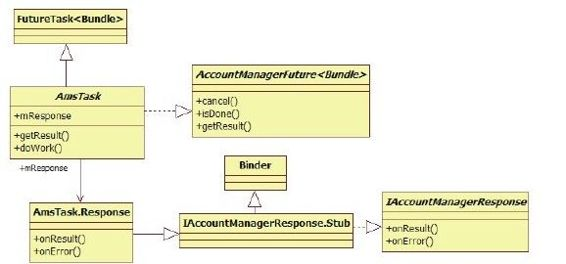
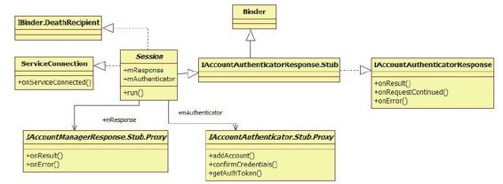
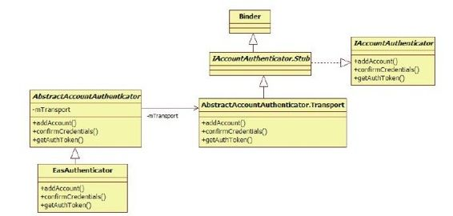
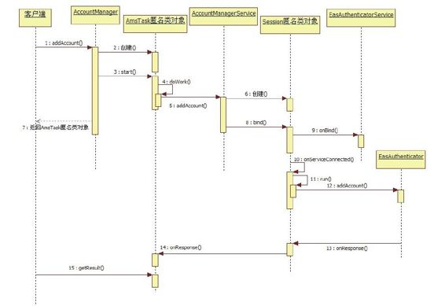

# 8.3.2　AccountManager addAccount分析


8.3.2 AccountM anageraddAccount分析这一节将分析AccountM anagerService中的一个重要的函数，即addAccount，其功能是为某项账户添加一个用户。下面以前面提及的Email为例来认识AAS的处理流程。

AccountM anagerService是一个运行在SystemServer中的服务，客户端进程必须借助AccountManager提供的API来使用AccountM anagerService服务，所以，本例需从AccountM anager的addAccount函数讲起。

1.AccountM anager的addAccount发起请求AccountM anager的addAccount函数的参数和返回值较复杂，先看其函数原型：

```
publi c AccountManagerFuture<Bundle>
addAccount(
fi nal String accountType,
fi nal String authTokenType,
fi nal String[] requiredFeatures,
fi nal Bundle addAccountOpti ons,
fi nal Acti vit y acti vit y,
AccountManagerCa back<Bundle>
ca back,
Handler handler)
```

在以上代码中：

addAccount的返回值类型是AccountM anagerFuture＜Bundle＞。其中，AccountM anager-Future是一个模板Interface，其真实类型只有在分析addAccount的实现时才能知道。

现在可以告诉读者的是，它和Java并发库

```
(concurrent库)中的FutureTask有关,是
[1]
```

对异步函数调用的一种封装。调用者在后期只要调用它的getResult函数即可取得addAccount的调用结果。由于addAccount可能涉及网络操作（例如，AAS需要把账户添加到网络服务器上），所以这里采用了异步调用的方法以避免长时间的阻塞。这也是AccountM anagerFuture的getResult不能在主线程中调用的原因。

addAccount的第一个参数accountType代表账户类型。该参数不能为空。就本例而言，它的值为com .android.em ail。

authTokenType、requiredFeatures和addAccountOptions与具体的AAS服务有关。如果想添加指定账户类型的Account，则须对其背后的AAS有所了解。

activity：此参数和界面有关。例如有些AAS需要用户输入用户名和密码，故需启动一个Activity。在这种情况下，AAS会返回一个Intent，客户端将通过这个Activity启动Intent所标示的Activity。我们将通过下文的分析介绍这一点。

ca back和handler：这两个参数与如何获取ifaddAccount返回结果有关。如这两个参数为空，客户端则须单独启动一个线程去调用AccountM anagerFuture的getResult函数。addAccount的代码如下：

[--＞AccountM anager. java：
addAccount]

```
publi c AccountManagerFuture<Bundle>
addAccount(fi nal String accountType,
fi nal String authTokenType, fi nal
String[] requiredFeatures,
fi nal Bundle addAccountOpti ons, fi nal
Acti vit y acti vit y,
AccountManagerCa back<Bundle>
ca back, Handler handler){
(accountType==nu)//accountType不
能为nu
throw new I egalArgumentExcepti on
("accountType is nu ");
fi nal Bundle opti onsIn=new Bundle
();
```

if（addAccountOpti ons！=nu）//保存客户端传入的addAccountOpti ons

```
opti onsIn.putA
(addAccountOpti ons);
opti onsIn.putString
(KEY_ANDROID_PACKAGE_NAME,
mContext.getPackageName());
//构造一个匿名类对象,该类继承自
```

AmsTask，并实现了doWork函数。

addAccount返回前

```
//将调用该对象的start函数
return new AmsTask(acti vit y, handler,
ca back){
publi c void doWork()throws
RemoteExcepti on{
//mService用于和AccountManagerService
通信
mService.addAcount(mResponse,
accountType, authTokenType,
requiredFeatures, acti vit y!=nu ,
opti onsIn);
}
}.start();
}
```

在以上代码中，AccountM anager的addAccount函数将返回一个匿名类对象，该匿名类继承自AmsTask类。那么，AmsTask又是什么呢？

（1）Am sTask介绍先来看AmsTask的继承关系，如图8-7所示。



图8-7 AmsTask继承关系由图8-7可知：

Am sTask继承自FutureTask，并实现了AccountM anagerFuture接口。

FutureTask是Java concurrent库中一个常用的类。AmsTask定义了一个doWork虚函数，该函数必须由子类来实现。

一个AmsTask对象中有一个mResponse成员，该成员的类型是AmsTask中的内部类Response。从Response的派生关系可知，Response将参与Binder通信，并且它是Binder通信的Bn端。而AccountM anagerService的addAccount将得到它的Bp端对象。当添加完账户后，AccountM anagerService会通过这个Bp端对象的onResult或onError函数向Response通知处理结果。

（2）AmsTask匿名类处理分析AccountM anager的addAccount最终返回给客户端的是一个AmsTask的子类，首先来了解它的构造函数，其代码如下：

[--＞AccountM anager.java：Am sTask]

```java
publi c AmsTask(Acti vit y acti vit y,
Handler handler,
AccountManagerCa back<Bundle>
ca back){
```

……//调用基类构造函数

```
//保存客户端传递的参数
mHandler=handler;
mCa back=ca back;
mActi vit y=acti vit y;
```

mResponse=new Response（）；//构造一个Response对象，并保存到mResponse中

```
}
```

下一步调用的是这个匿名类的start函数，代码如下：

[--＞AccountM anager. java：
Am sTask.start]

```
publi c fi nal AccountManagerFuture<
Bundle>start(){
try{
```

doWork（）；//调用匿名类实现的doWork函数

```
}……
return this;
}
```

匿名类实现的doWork函数即下面这个函数：

[--＞AccountM anager. java：

addAccount返回的匿名类]

```
publi c void doWork()throws
RemoteExcepti on{
//调用AccountManagerService的
addAccount函数,其第一个参数是
mResponse
mService.addAcount(mResponse,
accountType, authTokenType,
requiredFeatures, acti vit y!=nu ,
opti onsIn);
}
```

AccountM anager的addAccount函数的实现比较新奇，它内部使用了Java的concurrent类。不熟悉Java并发编程的读者有必要了解相关知识。

下面转到AccountM anagerService中去分析addAccount的实现。

2.AccountM anagerService addAccount转发请求AccountM anagerService addAccount的代码如下：

[--＞AccountM anagerService. java：
addAccount]

```
publi c void addAcount(fi nal
IAccountManagerResponse response,
fi();nal String accountType, fi nal String
authTokenType,
fi nal String[] requiredFeatures, fi nal
boolean expectActi vit yLaunch,
fi nal Bundle opti onsIn){
……
//检查客户端进程是否有
“android.permission.MANAGE_ACCOUNTS”
```

的权限

```
checkManageAccountsPermission();
fi nal int pid=Binder.getCalli ngPid
();
fi nal int uid=Binder.getCalli ngUid
//构造一个Bundle类型的opti ons变量,并
保存传入的optionsIn
fi nal Bundle opti ons=
(opti onsIn==nu)?new Bundle():
opti onsIn;
opti ons.putInt
(AccountManager.KEY_CALLER_UID,
uid);
opti ons.putInt
(AccountManager.KEY_CALLER_PID,
pid);
long
identit yToken=clearCalli ngIdentit y
();
try{
//创建一个匿名类对象,该匿名类派生自
```

Session类。最后调用该匿名类的bind函数

```java
new Session(response, accountType,
expectActi vit yLaunch, true){
publi c void run()throws
RemoteExcepti on{
mAuthenti cator.addAccount(this,
mAccountType,
authTokenType, requiredFeatures,
opti ons);
}
protected String toDebugString(long
now){
```

……//实现toDebugString函数

```
}
}.bind();}fi na y{
restoreCalli ngIdentit y
(identit yToken);
}
```

由以上代码可知，AccountM anagerService的addAccount函数最后也创建了一个匿名类对象，该匿名类派生自Session。addAccount最后还调用了这个对象的bind函数。其中最重要的内容就是Session。那么，Session又是什么呢？

（1）Session介绍Session家族成员如图8-8所示。



图8-8 Session家族示意图由图8-8可知：

Session从IAccountAuthenticatorResponse.Stub派生，这表明它将参与Binder通信，并且它是Bn端。那么这个Binder通信的目标是谁呢？它正是具体的AAS服务。Account-M anagerService会将自己传递给AAS，这样，AAS就得到IAccountAuthenticator-Response的Bp端对象。当AAS完成了具体的账户添加工作后，会通过IAccount-AuthenticatorResponse的Bp端对象向Session返回处理结果。

Session通过m Response成员变量指向来自客户端的IAccountM anagerResponse接口，当Session收到AAS的返回结果后，又通过IAccountM anagerResponse的Bp端对象向客户端返回处理结果。

Session m Authenticator变量的类型是IAccountAuthenticator，它用于和远端的AAS通信。客户端发起的请求将通过Session经由m Authenticator调用对应AAS中的函数。

由图8-7和图8-8可知，AccountM anagerService在addAccount流程中起桥梁的作用，具体如下：

客户端将请求发送给AccountM anagerService，然后AccountM anagerService再转发给对应的AAS。

AAS处理完的结果先返回给AccountM anagerService，再由AccountM anagerService返回给客户端。

由于图8-7和图8-8中定义的类名较相似，因此读者阅读时应仔细一些。

下面来看Session匿名类的处理。

（2）Session匿名类处理分析首先调用Session的构造函数，代码为：

[--＞AccountM anagerService. java：
Session]

```
publi c Session
(IAccountManagerResponse response,
String accountType,
boolean expectActi vit yLaunch, boolean
stripAuthTokenFromResult){
super();
……
/*
注lti意其中的参数,expectActi vit yLaunch由
客户端传来,如果用户调用
AccountManager addAccount时传入了
activity参数,则该值为true,
stripAuthTokenFromResult的默认值为true
*/
mStripAuthTokenFromResult =stripAuthTok
enFromResult;
mResponse=response;
mAccountType=accountType;
mExpectActi vit yLaunch=expectActi vit yLa
unch;
mCreati onTime=SystemClock.elapsedRea
me();
synchronized(mSessions){
//将这个匿名类对象保存到
AccountManagerService中的mSessions成员
中
mSessions.put(toString(),this);
}
```

try{//监听客户端死亡消息

```
response.asBinder().li nkToDeath
(this,0);
}……
}
```

获得匿名类对象后，addAccount将调用其bind函数，该函数由Session实现，代码如下：

[--＞AccountM anagerService. java：
Session：bind]

```java
void bind(){
//绑定到mAccountType指定的AAS。在本例
中,AAS的类型是“com.android.email”
if(!bindToAuthenti cator
(mAccountType)){
onError
(AccountManager.ERROR_CODE_REMOTE_EXC
EPTION,"bind fail ure");
}
```

bindToAuthenticator的代码为：

[--＞AccountM anagerService. java：
Session：bindToAuthenticator]

```java
private boolean bindToAuthenti cator
(String authenti catorType){
//从mAuthenti catorCache中查询满足指定
类型的服务信息
AccountAuthenti catorCache.ServiceInfo
<Authenti catorDescripti on>
authenti catorInfo=
mAuthenti catorCache.getServiceInfo(
Authenti catorDescripti on.newKey
(authenti catorType));
……
Intent intent=new Intent();
intent.setActi on
(AccountManager.ACTION_AUTHENTICATOR_
INTENT);
//设置目标服务的componentName
intent.setComponent
(authenti catorInfo.componentName);
//通过bindService启动指定的服务,成功
与否将通过第二个参数传递的
//ServiceConnecti on接口返回
if(!mContext.bindService(intent,
this, Context.BIND_AUTO_CREATE)){
……
}
return true;
}
```

由以上代码可知，Session的bind函数将启动指定类型的Service，这是通过bindService函数完成的。如果服务启动成功，Session的onServiceConnected函数将被调用，这部分代码如下：

[--＞AccountM anagerService. java：
Session：onServiceConnected]

```
publi c void onServiceConnected
(ComponentName name, IBinder
service){
//得到远端AAS返回的
IAccountAuthenti cator接口,这个接口用
于
//AccountManagerService和该远端AAS交互
mAuthenti cator=IAccountAuthenti cator.S
tub.asInterface(service);
try{
```

run（）；//调用匿名类实现的run函数

```
}……
}
```

匿名类实现的run函数非常简单，代码如下：

[--＞AccountM anagerService. java：

addAccount返回的匿名类]

```
new Session(response, accountType,
expectActi vit yLaunch, true){
publi c void run()throws
RemoteExcepti on{
//调用远端AAS实现的addAccount函数
mAuthenti cator.addAccount(this,
mAccountType,
authTokenType, requiredFeatures,
opti ons);
}
```

由以上代码可知，AccountM anagerService在addAccount最终将调用AAS实现的add-Account函数。

下面来看本例中满足“com .android.em ail”类型的服务是如何处理addAccount的请求的。该服务就是Em ail应用中的EasAuthenticatorService，下面来分析它。

3.EasAuthenticatorService处理请求EasAuthenticatorService的创建是AccountM anagerService调用了bindService完成的，该函数会触发EasAuthenticatorService的onBind函数的调用，这部分代码如下：

[--＞EasAuthenticatorService. java：
onBind]

```
publi c IBinder onBind(Intent intent)
{
if
(AccountManager.ACTION_AUTHENTICATOR_
INTENT.equals(
intent.getActi on())){
//创建一个EasAuthenti cator类型的对象,
```

并调用其getIBinder函数



```
return new EasAuthenti cator
(this).getIBinder();
}else return nu;
}
```

图8-9 EasAuthenticator家族类图下面来分析EasAuthenticator。

由图8-9可知：

（1）EasAuthenticator介绍EasAuthenticator从EasAuthenticator是AbstractAccountAuthenticator类派生。

EasAuthenticatorService定义的内部类，AbstractAccountAuthenti-cator内部有一其家族关系如图8-9所示。

个mTransport的成员变量，其类型是AbstractAccount-Authenticator的内部类Transport。在前面的onBind函数中，EasAuthenticator的getIBinder函数返回的就是这个变量。

Transport类继承自Binder，故它将参与Binder通信，并且是IAccountAuthenticator的Bn端。Session匿名类通过onServiceConnected函数将得到一个IAccountAuthen-ticator的Bp端对象。

当由AccoutM anagerService的addAccount创建的那个Session匿名类调用IAccount-Authenticator Bp端对象的addAccount时，将触发位于Emai进程中的IAccountAuthenticator Bn端的addAccount。下面来分析Bn端的addAccount函数。

（2）EasAuthenticator的addAccount函数分析根据上文的描述可知，Emai进程中首先被触发的是IAccountAuthenticator Bn端的addAccount函数，其代码如下：

[--＞AbstractAccountAuthenticator.
java：Transport：addAccount]

```java
private class Transport extends
IAccountAuthenti cator.Stub{
publi c void addAccount
(IAccountAuthenti catorResponse
response,
String accountType, String
authTokenType,
String[] features, Bundle opti ons)
throws RemoteExcepti on{
//检查权限
checkBinderPermission();
try{
//调用AbstractAccountAuthenti cator子类
实现的addAccount函数
fi nal Bundle result =
AbstractAccountAuthenti cator.this.addA
ccount(
new AccountAuthenti catorResponse
(response),
accountType, authTokenType, features,
opti ons);
//如果返回的result不为空,则调用
```

response的onResult返回结果。

```
//这个response是
IAccountAuthenti catorResponse类型,它
的onResult
//将触发位于Session匿名类中mResponse变
量的onResult函数被调用
if(result!=nu)
response.onResult(result);
}……
}
```

本例中AbstractAccountAuthenticator子类(即EasAuthenticator)实现的addAccount函数，代码如下：

[--＞EasAuthenticatorService. java：
EasAuthenticator.addAccount]

```
publi c Bundle addAccount
(AccountAuthenti catorResponse
response,
String accountType, String
authTokenType,
String[] requiredFeatures, Bundle
opti ons)
throws NetworkErrorExcepti on{
//EasAuthenti cator addAccount的处理逻
辑和Email应用有关,读者只做简单了解即
```

可。

```
//如果用户传递的账户信息保护了密码和用
```

户名，则走if分支。注意，其中有一些参数名是

```
//通用的,例如OPTIONS_PASSWORD,
OPTIONS_USERNAME等
if(opti ons!=nu&&
opti ons.containsKey
(OPTIONS_PASSWORD)
&&opti ons.containsKey
(OPTIONS_USERNAME)){
//创建一个Account对象,该对象仅包括两
个成员,一个是name,用于表示账户名;
//另一个是type,用于表示账户类型
fi nal Account account=new
Account(opti ons.getString
(OPTIONS_USERNAME),
AccountManagerTypes.TYPE_EXCHANGE);
//调用AccountManager的
addAccountExpli citl y将account对象和
password传递
//给AccountManagerService处理。读者可
自行研究这个函数,在其内部将这些信息写
入
//accounts.db的account表中
AccountManager.get
(EasAuthenti catorService.this).
addAccountExpli citl y(account,
opti ons.getString
(OPTIONS_PASSWORD),nu);
//根据Email应用的规则,下面将判断和该
账户相关的数据是否需要设置自动数据同步
//首先判断是否需要处理联系人自动数据同
步
boolean syncContacts=false;
if(opti ons.containsKey
(OPTIONS_CONTACTS_SYNC_ENABLED)&&
opti ons.getBoolean
(OPTIONS_CONTACTS_SYNC_ENABLED))
syncContacts=true;
ContentResolver.setIsSyncable
(account,
ContactsContract.AUTHORITY,1);
ContentResolver.setSyncAutomati ca y
(account,
ContactsContract.AUTHORITY,
syncContacts);
boolean syncCalendar=false;
```

……//判断是否需要设置Calendar自动数据同步

```
boolean syncEmail =false;
//如果选项中包含Email同步相关的功能,
```

则需要设置Email数据同步的相关参数

```
if(opti ons.containsKey
(OPTIONS_EMAIL_SYNC_ENABLED)&&
opti ons.getBoolean
(OPTIONS_EMAIL_SYNC_ENABLED))
syncEmail =true;
/*
下面这两个函数将和ContentService中的
SyncManager交互。注意这
两个函数:第一个函数setIsSyncable将设
置Email对应的同步服务功能标志,
第二个函数setSyncAutomati ca y将设置是
否自动同步Email。
数据同步的内容留待8.4节再详细分析
*/
ContentResolver.setIsSyncable
(account, Email Content.AUTHORITY,
1);
ContentResolver.setSyncAutomati ca y
(account, Email Content.AUTHORITY,
syncEmail);
//构造返回结果,注意,下面这些参数名是
Android统一定义的,如KEY_ACCOUNT_NAME
等
Bundle b=new Bundle();
b.putString
(AccountManager.KEY_ACCOUNT_NAME,
opti ons.getString
(OPTIONS_USERNAME));
b.putString
(AccountManager.KEY_ACCOUNT_TYPE,
AccountManagerTypes.TYPE_EXCHANGE);
return b;
}else{
//如果没有传递password,则需要启动一个
Acti vit y,该Acti vit y对应的Intent
//由acti onSetupExchangeIntent返回。注
意下面几个通用的参数,如
//KEY_ACCOUNT_AUTHENTICATOR_RESPONSE和
KEY_INTENT
Bundle b=new Bundle();
Intent
intent=AccountSetupBasics.acti onSetupE
xchangeIntent(
EasAuthenti catorService.this);
intent.putExtra(
AccountManager.KEY_ACCOUNT_AUTHENTICAT
OR_RESPONSE, response);
b.putParcelable
(AccountManager.KEY_INTENT,
intent);
return b;
}
```

不同的AAS有自己特定的处理逻辑，以上代码向读者展示了EasAuthenticatorService的工作流程。虽然每个AAS的处理方式各有不同，但Android还是定义了一些通用的参数，例如，OPTIONS_USERNAME用于表示用户名，OPTIONS_PASSWORD用于表示密码等。关于这方面的内容，读者可查阅SDK中AccountM anager的文档说明。

4.返回值的处理流程在EasAuthenticator的addAccount返回处理结果后，AbstractAuthenticator将通过IAccount-AuthenticatorResponse的onResult将其返回给由AccountM anagerService创建的Session匿名类对象。来看Session的onResult函数，其代码如下：

[--＞AccountM anagerService. java：
Session：onResult]

```
publi c void onResult(Bundle result){
mNumResult s++;
//从返回的result中取出相关信息,关于下
面这个if分支处理和状态栏中相关的逻辑,
//读者可自行研究
if(result!=nu&&!
TextUtil s.isEmpty(
result .getString
(AccountManager.KEY_AUTHTOKEN))){
String accountName=result .getString
(AccountManager.KEY_ACCOUNT_NAME);
String accountType=
result .getString
(AccountManager.KEY_ACCOUNT_TYPE);
if(!TextUtil s.isEmpty(accountName)
&&
!TextUtil s.isEmpty(accountType)){
Account account=new Account
(accountName, accountType);
cancelNotifi cati on(
getSigninRequiredNotifi cati onId
(account));
}}
IAccountManagerResponse response;
//如果客户端传递了activity参数,则
```

mExpectActi vit yLaunch为true。如果

```
//AAS返回的结果中包含KEY_INTENT,则表
明需要弹出Activity以输入账户和密码
if(mExpectActi vit yLaunch&&result!
=nu
&&result .containsKey
(AccountManager.KEY_INTENT)){
response=mResponse;
}else{
/*
getResponseAndClose返回的也是
mResponse,不过它会调用unBindService
断开和AAS服务的连接。就整个流程而言,
此时addAccount已经完成AAS和
AccountManagerService的工作,故无须再
保留和AAS服务的连接。而由于上面的if
分支还需要输入用户密码,因此以AAS和
AccountManagerService之间的工作
还没有真正完成
*/
response=getResponseAndClose();
}
if(response!=nu){
try{
……
if(mStripAuthTokenFromResult)
result .remove
(AccountManager.KEY_AUTHTOKEN);
//调用位于客户端的
IAccountManagerResponse的onResult函数
response.onResult(result);
}……
}
```

客户端的IAccountM anagerResponse接口由AmsTask内部类Response实现，其代码为：[ --＞AccountM anager.java：

```java
Am sTask:Response.onResult]
publi c void onResult(Bundle bundle){
Intent intent=bundle.getParcelable
(KEY_INTENT);
//如果需要弹出Activity,则要利用客户端
传入的Activity去启动AAS指定的
//Acti vit y。这个Acti vit y由AAS返回的
Intent来表示
if(intent!=nu&&mActi vit y!
=nu){
mActi vit y.startActi vit y(intent);
}else if(bundle.getBoolean
("retry")){
//如果需要重试,则再次调用doWork
try{
doWork();
}……
}else{
//将返回结果保存起来,当客户端调用
getResult时,就会得到相关结果
set(bundle);
}
```

5.AccountM anager的addAccount分析总结AccountM anager的addAccount流程分析起来会给人一种行云流水般的感觉。该流程涉及3个模块，分别是客户端、AccountM anagerService和AAS。整体难度虽不算大，但架构却比较巧妙。

总结起来addAccount相关流程如图8-10所示。



图8-10 AccountM anager的addAccount处理流程为了让读者看得更清楚，图8-10中略去了一些细枝末节的内容。另外，图8-10中第10步的onServiceConnected函数应由位于System Server中的ActivityThread对象调用，为方便阅读，这里没有画出ActivityThread对象。

[1]从设计模式角度来说，这属于ActiveObject模式。详细内容可阅读《Pa ern.O riented.Softw are.Architecture.Volum e.2》的第2章“ConcurrencyPa erns”。
