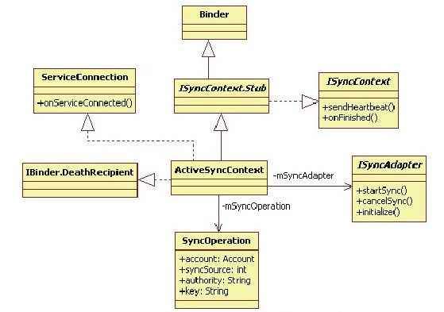
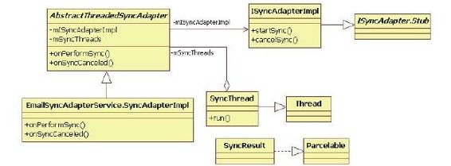
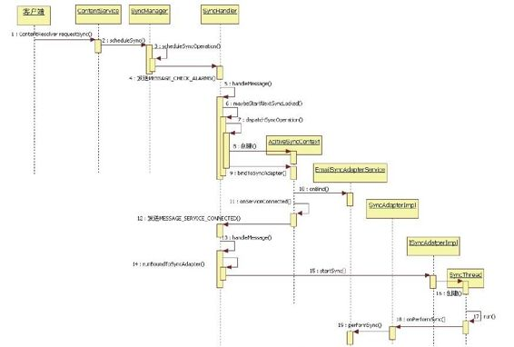

# 8.4.2　ContentResolver的requestSync分析


8.4.2 ContentResolver的requestSync分析ContentResolver提供了一个requestSync函数，用于发起一次数据同步请求。在本例中，该函数的调用方法如下：

```
Account email SyncAccount=new Account
("fanping.deng@gmail ",
"com.google");
String
email Authorit y="com.android.email .prov
ider";
Bundle email Bundle=new Bundle();
```

……//为emailBundle添加相关的参数。这些内容和具体的同步服务有关

```
//发起Email同步请求
ContentResolver.requesetSync
(email SyncAccount, email Authorit y,
email Bundle);
```

1.客户端发起请求ContentResolver的requestSync的代码如下：

[--＞ContentResolver. java：
requestSync]

```
publi c stati c void requestSync
(Account account, String authorit y,
Bundle extras){
//检查extras携带的参数的数据类型,目前
只支持fl oat、int和String等几种类型
vali dateSyncExtrasBundle(extras);
try{
//调用ContentService的requestSync函数
getContentService().requestSync
(account, authorit y, extras);
}……
}
```

与添加账户（addAccount）相比，客户端发起一次同步请求所要做的工作就太简单了。

下面转战ContentService去看它的requestSync函数。

2.ContentService的requestSync函数分析这部分的代码如下：

[--＞ContentService.java：requestSync]

```java
publi c void requestSync(Account
account, String authorit y, Bundle
extras){
ContentResolver.vali dateSyncExtrasBund
le(extras);
long
identit yToken=clearCalli ngIdentit y
();
try{
SyncManager syncManager=getSyncManager
();
if(syncManager!=nu){
//调用syncManager的scheduleSync
syncManager.scheduleSync(account,
authorit y, extras,
0,false);
}
}fi na y{
restoreCalli ngIdentit y
(identit yToken);
}
```

ContentService将工作转交给SyncManager来完成，其调用的函数是scheduleSync。

（1）SyncM anager的scheduleSync函数分析先行介绍的scheduleSync函数非常重要，其调用代码如下：

```
/*
scheduleSync一共5个参数,其作用分别如
下。
requestedAccount表明要进行同步操作的账
户。如果为空,SyncManager将同步所有账
户。
requestedAuthorit y表明要同步的数据项。
如果为空,SyncManager将同步所有数据
项。
extras指定同步操作中的一些参数信息。这
部分内容后续分析时再来介绍。
delay指定本次同步请求是否延迟执行。单
位为毫秒。
onlyThoseWit hUnkownSyncableState决定是
否只同步那些处于unknown状态的同步服
务。
该参数在代码中没有注释。结合前面对
syncable为unknown的分析,如果该参数为
true,则
本次同步请求的主要作用就是通知同步服务
进行初始化操作
*/
publi c void scheduleSync(Account
requestedAccount, String
requestedAuthorit y,
Bundle extras, long delay, boolean
onlyThoseWit hUnkownSyncableState)
```

关于scheduleSync的代码将分段分析，其相关代码如下：

```
[if-->SyncM anager.java:scheduleSync]
boopubli c void scheduleSync(Account
requestedAccount,
String requestedAuthorit y, Bundle
extras,
long delay, boolean
onlyThoseWit hUnkownSyncableState)
//判断是否允许后台数据传输
fi nal boolean
backgroundDataUsageA owed=!
mBootCompleted||
getConnecti vit yManager
().getBackgroundDataSetti ng();
(extras==nu)extras=new Bundle
();
//下面将解析同步服务中特有的一些参数信
息,下面将逐条解释
//SYNC_EXTRAS_EXPEDITED参数表示是否立
```

即执行。如果设置了该选项，则delay参数不起作用

```
//delay参数用于设置延迟执行时间,单位
为毫秒
Boolean expedit ed=extras.getBoolean(
ContentResolver.SYNC_EXTRAS_EXPEDITED,
false);
if(expedit ed)
delay=-1;
Account[] accounts;
if(requestedAccount!=nu){
accounts=new Account[]
{requestedAccount};
}……
//SYNC_EXTRAS_UPLOAD参数设置本次同步是
```

否为上传。从本地同步到服务端为Upload，

```
//反之为download
fi nal boolean
uploadOnly=extras.getBoolean(
ContentResolver.SYNC_EXTRAS_UPLOAD,
false);
//SYNC_EXTRAS_MANUAL等同于
SYNC_EXTRAS_IGNORE_BACKOFF加
//SYNC_EXTRAS_IGNORE_SETTINGS
fi nal boolean
manualSync=extras.getBoolean(
ContentResolver.SYNC_EXTRAS_MANUAL,
false);
//如果是手动同步,则忽略backo和
setti ngs参数的影响
if(manualSync){
//知识点一:
SYNC_EXTRAS_IGNORE_BACKOFF:该参数和
```

backo有关，见下文的解释

```
extras.putBoolean(
ContentResolver.SYNC_EXTRAS_IGNORE_BAC
KOFF, true);
//SYNC_EXTRAS_IGNORE_SETTINGS:忽略设
置
extras.putBoolean(
ContentResolver.SYNC_EXTRAS_IGNORE_SET
TINGS, true);
}
fi nal boolean
ignoreSetti ngs=extras.getBoolean(
ContentResolver.SYNC_EXTRAS_IGNORE_SET
TINGS, false);
//定义本次同步操作的触发源,见下文解释
int source;
if(uploadOnly){
source=SyncStorageEngine.SOURCE_LOCAL
;
}else if(manualSync){
source=SyncStorageEngine.SOURCE_USER;
}else if(requestedAuthorit y==nu){
source=SyncStorageEngine.SOURCE_POLL;
}else{
source=SyncStorageEngine.SOURCE_SERVER
;
}
```

在以上代码中，有两个知识点需要说明。

知识点一和backo（这个词不太好翻译）

有关。和其相关的应用场景是，如果本次同步操作执行失败，则尝试休息一会再执行，而backo在这个场景中的作用就是控制休息时间。由以上代码可知，当用户设置了手动（Manual）参数后，就无须对这次同步操作使用backo模式。

另外，在后续的代码中，我们会发现和backo有关的数据被定义成一个Paire＜Long,Long＞，即backo对应两个参数。

这两个参数到底有什么用呢？笔者在SyncM anager代码中找到了一个setBacko函数，其参数的命名很容易理解。setBacko函数的原型如下：

[--＞SyncM anager.java：setBacko ]

```java
publi c void setBacko(Account
account, String providerName,
long nextSyncTime, long nextDelay)
```

在调用这个函数时，Pair＜Long,Long＞中的两个参数分别对应nextSyncTim e和nextDelay，所以，Pair中的第一个参数对应nextSyncTim e，第二个参数对应nextDelay。backo的计算中实际上存在着一种算法。读者不妨先研究setBacko，然后再和我们一起分享这个算法的相关知识。

知识点二和SyncStorageEngine定义的触发源有关。说白了，触发源就是描述该次同步操作是因何而起的。SyncStorageEngine一共定义了4种类型的触发源，这里笔者直接展示其原文解释：

```
/*Enum value for a local-initi ated
sync.*/
publi c stati c fi nal int
SOURCE_LOCAL=1;
/**Enum value for a po -based sync
(e.g.,upon connecti on to network)*/
publi c stati c fi nal int
SOURCE_POLL=2;
/*Enum value for a user-initi ated
sync.*/
publi c stati c fi nal int
SOURCE_USER=3;
/*Enum value for a periodic sync.*/
publi c stati c fi nal int
SOURCE_PERIODIC=4;
```

触发源的作用主要是为了方便SyncStorageEngine开展对应的的统计工作。本书不深究这部分内容，感兴趣的读者可在学习完本节后自行研究。

关于scheduleSync下一阶段的工作，代码如下：

[--＞SyncM anager.java：scheduleSync]

```java
//从SyncAdaptersCache中取出所有
SyncService信息
fi nal HashSet<String>
syncableAuthoriti es=new HashSet<
String>();
for
(RegisteredServicesCache.ServiceInfo
<SyncAdapterType>
syncAdapter:
mSyncAdapters.getA Services()){
syncableAuthoriti es.add
(syncAdapter.type.authorit y);
}
//如果指定了本次同步的authority,则从
上述同步服务信息中找到满足要求的
SyncService
if(requestedAuthorit y!=nu){
fi nal boolean hasSyncAdapter=
syncableAuthoriti es.contains
(requestedAuthorit y);
syncableAuthoriti es.clear();
if(hasSyncAdapter)
syncableAuthoriti es.add
(requestedAuthorit y);
}
fi nal boolean masterSyncAutomati ca y=
mSyncStorageEngine.getMasterSyncAutoma
tica y();
ffior(String authorit y:
syncableAuthoriti es){
for(Account account:accounts){
//取出Authorit yInfo中的syncable属性
值,如果为1,则其状态为true,
//如果为-1,则其状态为unknown
int
isSyncable=mSyncStorageEngine.getIsSyn
cable(
account, authorit y);
if(isSyncable==0)
```

conti nue；//syncable为false，则不能进行同步操作nal

```
RegisteredServicesCache.ServiceInfo<
SyncAdapterType>
syncAdapterInfo=
mSyncAdapters.getServiceInfo(
SyncAdapterType.newKey(authorit y,
account.type));
……
//有些同步服务支持多路并发同步操作
fi nal boolean a owPara elSyncs=
syncAdapterInfo.type.a owPara elSync
s();
fi nal boolean
isAlwaysSyncable=syncAdapterInfo.type.
isAlwaysSyncable();
//如果该同步服务此时的状态为unknown,
```

且它又是永远可同步的

```
(AlwaysSyncable),
//那么通过setIsSyncable设置该服务的状
态为1
if(isSyncable<0&&
isAlwaysSyncable){
mSyncStorageEngine.setIsSyncable
(account, authorit y,1);
isSyncable=1;
}
//如果只能操作unknow状态的同步服务,但
该服务的状态不是unknown,则不允许后续
操作
if(onlyThoseWit hUnkownSyncableState&
&isSyncable>=0)
conti nue;
//如果此同步服务不支持上传,但本次同步
又需要上传,则不允许后续操作
if(!
syncAdapterInfo.type.supportsUploading
()&&uploadOnly)
conti nue;
//判断是否允许执行本次同步操作。如果同
步服务状态为unknown,则总是允许发起同
```

步请求，

```
//因为这时的同步请求只是为了初始化
SyncService
boolean syncA owed=(isSyncable<
0)||ignoreSetti ngs
||(backgroundDataUsageA owed&&
masterSyncAutomati ca y
&&
mSyncStorageEngine.getSyncAutomati ca
y(
account, authorit y));
……
//取出对应的backo参数
Pair<Long, Long>
backo =mSyncStorageEngine.getBacko
(
account, authorit y);
//获取延迟执行时间
long
delayUntil =mSyncStorageEngine.getDelay
Until Time(
account, authorit y);
fi nal long backo Time=backo!=nu ?
backo .fi rst:0;
if(isSyncable<0){
Bundle newExtras=new Bundle();
```

/if/如果syncable状态为unknown，则需要设置一个特殊的参数，即

```
//SYNC_EXTRAS_INITIALIZE,它将通知
SyncService进行初始化操作
newExtras.putBoolean
(ContentResolver.SYNC_EXTRAS_INITIALI
ZE, true);
scheduleSyncOperati on(
new SyncOperati on(account, source,
authorit y, newExtras,0,
backo Time, delayUntil ,
a owPara elSyncs));
}
(!
onlyThoseWit hUnkownSyncableState)
scheduleSyncOperati on(
new SyncOperati on(account, source,
authorit y, extras, delay,
backo Time, delayUntil ,
a owPara elSyncs));
```

}//for循环结束

```
}
```

scheduleSync函数较复杂，难点在于其策略控制。建议读者反复阅读这部分内容。

scheduleSync最后将构造一个SyncOperation对象，并调用scheduleSyncOperation处理它。

scheduleSyncOperation内部会将这个SyncOperation对象保存到m SyncQueue中，然后发送M ESSAGE_CHECK_ALARM S消息让m SyncHandler处理。由于scheduleSyncOperation函数比较简单，因此下面将直接去mSyncHandler的handleM essage函数中分析MESSAGE_CHECK_ALARM S的处理过程。

（2）处理MESSAGE_CHECK_ALARM S消息SyncHandler的handleM essage代码如下：

[--＞SyncM anager.java：SyncHandler：
handleM essage]

```java
publi c void handleMessage(Message
msg){
long
earli estFuturePo Time=Long.MAX_VALUE
;
long
nextPendingSyncTime=Long.MAX_VALUE;
try{
wait Until ReadyToRun();
mDataConnecti onIsConnected=readDataCon
necti onState();
//获得WakeLock,防止在同步过程中掉电
mSyncManagerWakeLock.acquire();
//处理周期同步的操作
earli estFuturePo Time=scheduleReadyPe
riodicSyncs();
swit ch(msg.what){
……
case
SyncHandler.MESSAGE_CHECK_ALARMS:
//调用maybeStartNextSyncLocked函数,返
```

回一个时间。见下文解释

```
nextPendingSyncTime=maybeStartNextSync
Locked();
break;
……
}//swit ch结束
}fi na y{
manageSyncNotifi cati onLocked();
/*
将上边函数调用的返回值传递给
manageSyncAlarmLocked,该函数内部与
AlarmManagerService交互,其实就是定义
一个定时提醒。在Alarm超时后,就会广播
在SyncManager构造函数中定义的那个
PendingIntent mSyncAlarmIntent,
而SyncManager收到该广播后又会做对应处
理。相关内容读者可自行阅读
*/
manageSyncAlarmLocked
(earli estFuturePo Time,
nextPendingSyncTime);
mSyncTimeTracker.update();
mSyncManagerWakeLock.release();
}
```

如以上代码所述，MESSAGE_CHECK_ALARM S消息的处理就是调用m aybeStartN ext-SyncLocked函数。这个函数内容较烦琐，它主要做了以下几项工作。

检查SyncQueue中保存的同步操作对象SyncOperation，判断它们对应的同步服务的状态是否为false，如果为false，则不允许执行该同步操作。

查询ConnectivityM anagerService以判断目标同步服务是否使用了网络。如果该服务当前没有使用网络，则不允许执行该同步操作。

判断同步操作对象的执行时间是否已到，如果未到，则不允许执行该操作。

将通过上述判断的同步操作对象SyncOperation与当前系统中正在执行的同步操作上下文对象进行比较。系统当前正在执行的同步操作上下文对象对应的数据类是ActiveSyncContext，它是在同步操作对象之上的一个封装，包含了能和同步服务交互的接口。由于并非所有同步服务都支持多路并发同步操作，因此这里需做一些处理，以避免不必要的同步操作。另外，如果一个仅对应初始化同步服务的同步操作执行时间过长（由系统属性“sync.m ax_tim e_per_sync”控制，默认是5分钟），则系统需要做一些处理。

提示m aybeStartN extSyncLocked是笔者在本节留给读者自行分析的函数中最难的一个。读者务必阅读完下面的分析后，尝试去研究此函数。

1通过上述层层考验后，m anageSyncAlarm Locked最后将调用dispatchSyncOperation真正去派发一个同步操作。下面来看dispatchSyncOperation的代码。

[--＞SyncM anager. java：
dispatchSyncOperation]

```java
private boolean dispatchSyncOperati on
(SyncOperati on op){
SyncAdapterType
syncAdapterType=SyncAdapterType.
newKey(op. authorit y,
op.account.type);
RegisteredServicesCache. ServiceInfo<
SyncAdapterType>
syncAdapterInfo=
mSyncAdapters. getServiceInfo
(syncAdapterType);
……
//构造一个Acti veSyncContext对象,它就
是前面提到的同步操作上下文对象
Acti veSyncContext acti veSyncContext=
new Acti veSyncContext(op,
insertStartSyncEvent(op),
syncAdapterInfo.uid);
acti veSyncContext.mSyncInfo=
mSyncStorageEngine.addActi veSync
(acti veSyncContext);
//mActi veSyncContexts保存了当前系统中
所有的Acti veSyncContext对象
mActi veSyncContexts.add
(acti veSyncContext);
//为该对象绑定到具体的同步服务上
if(!
acti veSyncContext.bindToSyncAdapter
(syncAdapterInfo)){
closeActi veSyncContext
(acti veSyncContext);
return false;
}
return true;
}
```

ActiveSyncContext是SyncM anager和同步服务交互的关键类，其家族图谱如图8-16所示。



图8-16 ActiveSyncContext的UM L类图图8-16中的ActiveSyncContext和图8-8中的Session非常像。ActiveSyncContext的主要工作包括下面两部分。

它将首先通过bindService方式启动SyncService，并在onServiceConnected函数中得到用于和SyncService交互的接口对象，即参与Binder通信的ISyncAdapterBp端。

ActiveSyncContext是ISyncContext接口的Binder通信的Bn端，它在调用ISync-Adapter的startSync时，会把自己传递给同步服务。同步服务得到的当然是ISyncContext的Bp端对象。当同步服务完成此次同步操作后就会调用ISyncContext的Bp端对象的onFinished函数以通知ActiveSyncContext同步操作的执行结果。

下面来看第一部分的工作。

（3）ActiveSyncContext派发请求这部分的代码如下：

[--＞SyncM anager. java：
ActiveSyncContext.bindToSyncAdapter]

```
boolean bindToSyncAdapter
(RegisteredServicesCache.ServiceInfo
info){
Intent intent=new Intent();
intent.setActi on
("android.content.SyncAdapter");
//设置目标同步服务的ComponentName
intent.setComponent
(info.componentName);
intent.putExtra
(Intent.EXTRA_CLIENT_LABEL,
com.android.internal.R.string.sync_bin
ding_label);
intent.putExtra
(Intent.EXTRA_CLIENT_INTENT,
PendingIntent.getActi vit y(
mContext,0,
new Intent
(Setti ngs.ACTION_SYNC_SETTINGS),
0));
mBound=true;
//调用bindService启动指定的同步服务
fi nal boolean
bindResult =mContext.bindService
(intent, this,
Context.BIND_AUTO_CREATE|Context.BIND_
NOT_FOREGROUND
|Context.BIND_ALLOW_OOM_MANAGEMENT);
if(!bindResult)
mBound=false;
return bindResult;
}
```

当目标SyncService从其onBind函数返回后，ActiveSyncContext的onServiceConnected将被调用，该函数的内部处理流程如下：

[--＞SyncM anager. java：
ActiveSyncContext.onServiceConnected]

```
publi c void onServiceConnected
(ComponentName name, IBinder
service){
Message msg=mSyncHandler.obtainMessage
();
msg.what=SyncHandler.MESSAGE_SERVICE_C
ONNECTED;
//构造一个ServiceConnecti onData对象,
```

并发送MESSAGE_SERVICE_CONNECTED消息

```
//给mSyncHandler。第二个参数就是
SyncService在onBind函数中返回的
ISyncAdapter的
//Binder通信对象。不过在
Acti veSyncContext中,它是Bp端
msg.obj=new ServiceConnecti onData
(this,
ISyncAdapter.Stub.asInterface
(service));
mSyncHandler.sendMessage(msg);
}
```

[--＞SyncM anager. java：
SyncHandler.handleM essage]

```
case
SyncHandler.MESSAGE_SERVICE_CONNECTED
:{
ServiceConnecti onData msgData=
(ServiceConnecti onData)msg.obj;
if(isSyncStill Acti ve
(msgData.acti veSyncContext))
//调用runBoundToSyncAdapter函数处理
runBoundToSyncAdapter
(msgData.acti veSyncContext,
msgData.syncAdapter);
break;
}
```

[--＞SyncM anager. java：
runBoundToSyncAdapter]

```java
private void runBoundToSyncAdapter
(fi nal Acti veSyncContext
acti veSyncContext,
ISyncAdapter syncAdapter){
acti veSyncContext.mSyncAdapter=syncAda
pter;
fi nal SyncOperati on
syncOperati on=acti veSyncContext.mSyncO
perati on;
try{
acti veSyncContext.mIsLinkedToDeath=tru
e;
syncAdapter.asBinder().li nkToDeath
(acti veSyncContext,0);
//调用目标同步服务的startSync函数
syncAdapter.startSync
(acti veSyncContext,
syncOperati on.authorit y,
syncOperati on.account,
syncOperati on.extras);
}……
}
```

对SynManager工作的分析到此为止，下面将分析目标同步服务。

3.Em ailSyncAdapterService处理请求在本例中，目标同步服务位于Em ailSyncAdapterService中，先看它通过onBind函数返回给ActiveSyncContext的是什么。

（1）onBind分析这部分的代码如下：

[--＞Em ailSyncAdapterService. java：
onBind]

```
publi c IBinder onBind(Intent intent)
{
//sSyncAdapter是
Email SyncAdapterService的内部类对象,
```

见下文解释

```
return
sSyncAdapter.getSyncAdapterBinder
();
}
```

在以上代码中，sSyncAdapter的类型是Em ailSyncAdapterService中的内部类Sync-AdapterIm pl。它的派生关系如图8-17所示。

由图8-17可知：

AbstractThreadSyncAdapter是核心类，其内部有一个成员变量m ISyncAdapterIm l，该变量用于和ActiveSyncContext交互，是ISyncAdapterBinder通信的Bn端。该对象也是以上代码中onBind函数的返回值。

SyncThread从Thread派生。从这一点可看出，同步服务将创建工作线程来执行具体的同步操作。AbstractThreadSyncAdapter中的mSyncThreads保存该同步服务中所有的SyncThread对象。



图8-17 SyncAdapterIm pl派生关系图同步操作的结果将通过SyncResult返回给SyncM anager。

下面再来看SyncM anagerrunBoundToSyncAdapter函数最后调用的startSync函数。

（2）startSync分析在SyncService中，首先被调用的函数是ISyncAdapterIm pl的startSync函数，其代码为：

[--＞AbstractThreadedSyncAdapter.
java：ISyncAdapterIm pl.startSync]

```
publi c void startSync(ISyncContext
syncContext, String authorit y,
Account account, Bundle extras){
//构造一个SyncContext对象,用于保存上
下文信息
fi nal SyncContext
syncContextCli ent=new SyncContext
(syncContext);
boolean alreadyInProgress;
fi nal Account threadsKey=toSyncKey
(account);
synchronized(mSyncThreadLock){
//判断是否存在已经在执行的SyncThread
if(!mSyncThreads.containsKey
(threadsKey)){
if(mAutoIniti ali ze
&&extras!=nu&&extras.getBoolean
(
ContentResolver.SYNC_EXTRAS_INITIALIZE
, false)){
//一般而言,mAutoIniti ali ze都为true,
```

表示同步服务支持自动初始化

```
//如果该服务对应的syncable状态为
unknown,则重新设置syncable为1
if(ContentResolver.getIsSyncable
(account, authorit y)<0)
ContentResolver.setIsSyncable
(account, authorit y,1);
//直接返回,不再做后续的处理,实际上后
续的流程是可以继续进行的
syncContextCli ent.onFinished(new
SyncResult());
return;
}
//创建一个新的SyncThread对象
SyncThread syncThread=new SyncThread(
"SyncAdapterThread-"+
mNumSyncStarts.incrementAndGet(),
syncContextCli ent, authorit y, account,
extras);
mSyncThreads.put(threadsKey,
syncThread);
```

syncThread.start（）；//启动工作线程

```
alreadyInProgress=false;
}else{
alreadyInProgress=true;
}
if(alreadyInProgress)
syncContextCli ent.onFinished
(SyncResult .ALREADY_IN_PROGRESS);
}
```

假如没有匹配的工作线程（根据account生成一个key作为标志来查找是否已经存在对应的工作线程），SyncService将创建一个SyncThread，其run函数代码如下：

[--＞AbstractThreadedSyncAdapter.
java：ISyncAdapterIm pl.run]

```
publi c void run(){
Process.setThreadPriorit y
(Process.THREAD_PRIORITY_BACKGROUND
);
SyncResult syncResult =new SyncResult
();
ContentProviderCli ent provider=nu;
try{
if(isCanceled())return;
//获得同步操作指定的ContentProvider,
provider是ContentProviderCli ent
//类型,用于和目标ContentProvider交互
provider=mContext.getContentResolver
().
acquireContentProviderCli ent
(mAuthorit y);
if(provider!=nu){
//调用AbstractThreadedSyncAdapter子类
的onPerformSync函数
AbstractThreadedSyncAdapter.this.onPer
formSync(mAccount,
mExtras, mAuthorit y, provider,
syncResult);
}else
syncResult .databaseError=true;
}fi na y{
if(provider!=nu)
provider.release();
```

if（！isCanceled（））//通知结果

```
mSyncContext.onFinished
(syncResult);
//工作完成,将该线程从mSyncThreads中移
除
synchronized(mSyncThreadLock){
mSyncThreads. remove(mThreadsKey);
}
```

来看AbstractThreadedSyncAdapter子类实现的onPerformSync函数，在本例中，子类是SyncAdapterIm pl，代码如下：

[--＞Em ailSyncAdapterService. java：
SyncAdapterIm pl.onPerform Sync]

```
publi c void onPerformSync(Account
account, Bundle extras, String
authorit y,
ContentProviderCli ent provider,
SyncResult syncResult){
try{
//调用Email SyncAdapterService
performSync完成真正的同步,这部分代码
和
//Email业务逻辑相关,此处不再深入研究
Email SyncAdapterService.performSync
(mContext, account, extras,
authorit y, provider, syncResult);
}……
}
```

执行完onPerform Sync函数后，ISyncAdapterIm pl.run返回前会调用m SyncContext.onFinished函数，通知位于SyncM anager中的ActiveSyncContext同步操作的结果。读者可自行研究这部分内容。

4.ContentResolverrequestSync分析总结总结requestSync的工作流程，如图8-18所示。



图8-18 requestSync流由图8-18可知，requestSync涉及的对象及调用流程比较烦琐。但从技术上看，则没有什么需要特别注意的地方。
