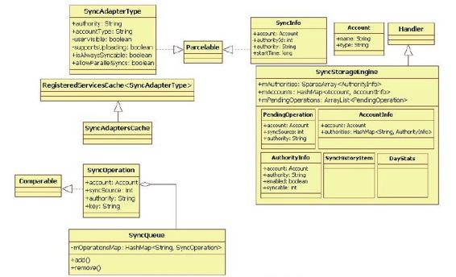
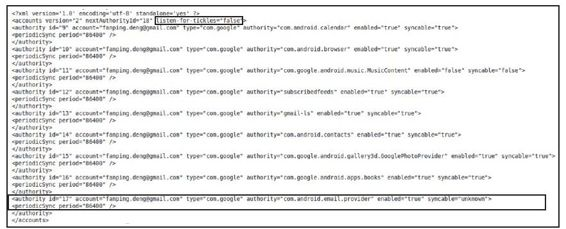
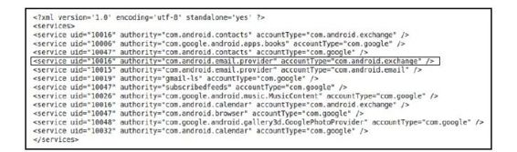
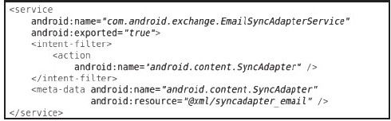
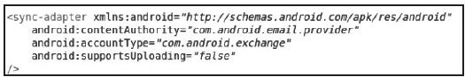

# 8.4　数据同步管理SyncManager分析


本节将分析ContentService中负责数据同步管理的SyncM anager。SynM anager和Account-M anagerService之间的关系比较紧密。同时，由于数据同步涉及手机中重要数据（例如联系人信息、Email、日历等）

的传输，因此它的控制逻辑非常严谨，知识点也比较多，难度相对比AccountM anagerService大。

先来认识数据同步管理的核心类SyncM anager。

8.4.1初识SyncM anagerSyncManager的构造函数的代码较长，可分段来看。下面先来介绍第一段的代码。

1.SyncM anager介绍这部分的代码如下：

[--＞SyncM anager.java：SyncM anager]

```java
publi c SyncManager(Context context,
boolean factoryTest){
mContext=context;
//SyncManager中的几位重要成员登场。见
下文的解释
SyncStorageEngine.init(context);
mSyncStorageEngine=SyncStorageEngine.g
etSingleton();
mSyncAdapters=new SyncAdaptersCache
(mContext);
mSyncQueue=new SyncQueue
(mSyncStorageEngine,
mSyncAdapters);
HandlerThread syncThread=new
HandlerThread("SyncHandlerThread",
Process.THREAD_PRIORITY_BACKGROUND);
syncThread.start();
mSyncHandler=new SyncHandler
(syncThread.getLooper());
mMainHandler=new Handler
(mContext.getMainLooper());
/*
mSyncAdapters类似于
AccountManagerService中的
AccountAuthenti catorCache,
它用于管理系统中和SyncService相关的服
务信息。下边的函数为mSyncAdapters增加
一个
监听对象,一旦系统中的SyncService发生
变化(例如安装了一个提供同步服务的APK
包),则
SyncManager需要针对该服务发起一次同步
请求。同步请求由scheduleSync函数发送,
后文再分析此函数
*/
mSyncAdapters.setListener(new
RegisteredServicesCacheListener<
SyncAdapterType>(){
publi c void onServiceChanged
(SyncAdapterType type,
boolean removed){
if(!removed){
scheduleSync(nu , type.authorit y,
nu,0,false);
}
},mSyncHandler);
```

在以上代码中，首先见到的是SyncManager的几位重要成员，它们之间的关系如图8-11所示。



图8-11 SyncM anager成员类图由图8-11可知，SyncM anager的这几位成员的功能大体可分为3部分：

左上角是SyncAdaptersCache类，从功能和派生关系上看，它和AccountManager-Service中的AccountAuthenticatorCaches类似。

SyncAdaptersCache用于管理系统中SyncService服务的信息。在SyncM anager中，SyncService的信息用SyncAdapter-Type类来表示。

左下角是SyncQueue和SyncOperation类，SyncOperation代表一次正在执行或等待执行的同步操作，而SyncQueue通过mOperationsM ap保存系统中存在的Sync-Operation。

右半部分是SyncStorageEngine，由于同步操作涉及重要数据的传输，加之可能耗时较长，所以SyncStorageEngine提供了一些内部类来保存同步操作中的一些信息。例如PendingOperation代表保存在本地文件中的还没有执行完的同步操作的信息。另外，SyncStrorageEngine还需要对同步操作进行一些统计，例如耗电量统计等。

SyncStorageEngine包含的内容较多，读者学习完本章后可自行研究相关内容。

SyncManager家族成员的责任分工比较细，后续分析时再具体讨论它们的作用。下面接着看SyncManager的构造函数：

[--＞SyncM anager.java：SyncM anager]

```java
……
//创建一个用于广播发送的
PendingIntent,该PendingIntent用于和
//AlarmManagerService交互
mSyncAlarmIntent=PendingIntent.getBroa
dcast(
mContext,0,new Intent
(ACTION_SYNC_ALARM),0);
//注册CONNECTIVITY_ACTION广播监听对
象,用于同步操作需要使用网络来传输数
```

据，所以

```
//此处需要监听和网络相关的广播
IntentFilt er intentFilt er=
new IntentFilt er
(Connecti vit yManager.CONNECTIVITY_ACT
ION);
context.registerReceiver
(mConnecti vit yIntentReceiver,
intentFilt er);
if(!factoryTest){
//监听BOOT_COMPLETED广播
intentFilt er=new IntentFilt er
(Intent.ACTION_BOOT_COMPLETED);
context.registerReceiver
(mBootCompletedReceiver,
intentFilt er);
}
//监听BACKGROUND_DATA_SETTING_CHANGED
```

广播。该广播与是否允许后台传输数据有关，

```
//用户可在Setti ngs应用程序中设置对应选
项
intentFilt er=
new IntentFilt er(Connecti vit yManager.
ACTION_BACKGROUND_DATA_SETTING_CHANGED
);
context.registerReceiver
(mBackgroundDataSetti ngChanged,
intentFilt er);
//监视设备存储空间状态广播。由于
SyncStorageEngine会保存同步时的一些信
```

息到存储

```
//设备中,所以此处需要监视存储设备的状
态
intentFilt er=new IntentFilt er
(Intent.ACTION_DEVICE_STORAGE_LOW);
intentFilt er.addActi on
(Intent.ACTION_DEVICE_STORAGE_OK);
context.registerReceiver
(mStorageIntentReceiver,
intentFilt er);
//监听SHUTDOWN广播。此处设置优先级为
100,即优先接收此广播
intentFilt er=new IntentFilt er
(Intent.ACTION_SHUTDOWN);
intentFilt er.setPriorit y(100);
context.registerReceiver
(mShutdownIntentReceiver,
intentFilt er);
```

if（！factoryTest）{//和通知服务交互，用于在状态栏上提示用户

```
mNotifi cati onMgr=
(Notifi cati onManager)
context.getSystemService
(Context.NOTIFICATION_SERVICE);
//注意,以下函数注册的广播将针对前面创
建的mSyncAlarmIntent
context.registerReceiver(new
SyncAlarmIntentReceiver(),
new IntentFilt er
(ACTION_SYNC_ALARM));
}……
mPowerManager=(PowerManager)
context.getSystemService
(Context.POWER_SERVICE);
//创建WakeLock,防止同步过程中掉电
mHandleAlarmWakeLock=
mPowerManager.newWakeLock
(PowerManager.PARTIAL_WAKE_LOCK,
HANDLE_SYNC_ALARM_WAKE_LOCK);
mHandleAlarmWakeLock.setReferenceCount
ed(false);
mSyncManagerWakeLock=
mPowerManager.newWakeLock
(PowerManager.PARTIAL_WAKE_LOCK,
SYNC_LOOP_WAKE_LOCK);
mSyncManagerWakeLock.setReferenceCount
ed(false);
//知识点一:监听SyncStorageEngine的状
态变化,具体见下文解释
mSyncStorageEngine.addStatusChangeList
ener(
ContentResolver.SYNC_OBSERVER_TYPE_SET
TINGS,
new ISyncStatusObserver.Stub(){
publi c void onStatusChanged(int
which){
sendCheckAlarmsMessage();
}
});
//知识点二:监视账户的变化。如果用户添
```

加或删除了某个账户，则需要做相应处理。

```
//具体见下文解释
if(!factoryTest){
AccountManager.get
(mContext).addOnAccountsUpdatedListe
ner(
SyncManager.this,
mSyncHandler, false);
onAccountsUpdated(AccountManager.get
(mContext).getAccounts());
}
```

在以上代码中，有两个重要知识点。

第一，SyncM anager为SyncStorageEngine设置了一个状态监听对象。根据前文的描述，在SyncManager家族中，SyncStorageEngine专门负责管理和保存同步服务中绝大部分的信息，所以当外界修改了这些信息时，SyncStorageEngine需要通知状态监听对象。我们可以通过一个例子了解其工作流程。下面的setSyncAutomatica y函数的作用是设置是否自动同步某个账户的某项数据，代码如下：

[--＞ContentService.java：
setSyncAutom atica y]

```java
publi c void setSyncAutomati ca y
(Account account, String
providerName,
boolean sync){
```

……//检查WRITE_SYNC_SETTINGS权限

```
long
identit yToken=clearCalli ngIdentit y
();
try{
SyncManager syncManager=getSyncManager
();
if(syncManager!=nu){
/*
通过SyncManager找到SyncStorageEngine对
象,并调用它的
setSyncAutomati ca y函数。在其内部会修
改对应账户的同步服务信息,然后通知
监听者,而这个监听者就是SyncManager设
置的那个状态监听对象
*/
syncManager.getSyncStorageEngine
().setSyncAutomati ca y(
account, providerName, sync);
}
}fi na y{
restoreCalli ngIdentit y
(identit yToken);
}
```

在以上代码中，最终调用的是SyncStorageEngine的函数，但SyncManager也会因状态监听对象被触发而做出相应动作。实际上，ContentService中大部分设置同步服务参数的API，其内部实现就是先直接调用SyncStorageEngine的函数，然后再由SyncStorageEngine通知监听对象。读者在阅读代码时，仔细一些就可明白这一关系。

第二，SyncM anager将为AccountManager设置一个账户更新监听对象（注意，此处是AccountManager，而不是AccountM anagerService。

AccountManager这部分功能的代码不是很简单，读者有必要反复研究）。在Android平台上，数据同步和账户的关系非常紧密，并且同一个账户可以对应不同的数据项。例如，在EasAuthenticator的addAccount实现中，读者会发现一个Exchange账户可以对应Contacts、Calendar和Em ail三种不同的数据项。在添加Exchange账户时，还可以选择是否同步其中的某项数据（通过判断实现addAccount时传递的options是否含有对应的同步选项，例如同步邮件数据时需要设置的OPTIONS_EM AIL_SYNC_ENABLED选项）。由于SyncManager和账户之间的这种紧密关系的存在，SyncManager就必须监听手机中账户的变化情况。

提示上述两个知识点涉及的内容都是一些非常细节的问题，本章将它们作为小任务，读者可自行进行研究。

下面来认识一下SyncManager家族中的几位主要成员，首先是SyncStorageEngine。

2.SyncStorageEngine介绍SyncStorageEngine负责整个同步系统中信息管理方面的工作。先看其init函数代码：

[--＞SyncStorageEngine.java：init]

```java
publi c stati c void init(Context
context){
if(sSyncStorageEngine!=nu)
return;
/*
得到系统中加密文件系统的路径,如果手机
中没有加密的文件系统(根据系统属性
“persist.securit y.efs.enabled”的值来
判断),则返回的路径为/data,
目前的Android手机大部分都没有加密文件
系统,故dataDir为/data
*/
File
dataDir=Environment.getSecureDataDirec
tory();
//创建SyncStorageEngine对象
sSyncStorageEngine=new
SyncStorageEngine(context,
dataDir);
}
```

SyncStorageEngine的构造函数代码为：

[--＞SyncStorageEngine. java：
SyncStorageEngine]

```java
private SyncStorageEngine(Context
context, Fil e dataDir){
mContext=context;
sSyncStorageEngine=this;
mCal=Calendar.getInstance
(TimeZone.getTimeZone("GMT+0"));
Fil e systemDir=new Fil e
(dataDir,"system");
Fil e syncDir=new Fil e
(systemDir,"sync");
syncDir.mkdirs();
//mAccountInfoFil e指
向/data/system/sync/accounts.xml
mAccountInfoFil e=new AtomicFil e(new
Fil e(syncDir,"accounts.xml"));
//mStatusFil e指
向/data/system/sync/status.bin,该文件
记录
//一些和同步服务相关的状态信息
mStatusFil e=new AtomicFil e(new Fil e
(syncDir,"status.bin"));
//mStatusFil e指
向/data/system/sync/pending.bin,该文
```

件记录了当前处于pending

```
//状态的同步请求
mPendingFil e=new AtomicFil e(new Fil e
(syncDir,"pending.bin"));
//mStatusFil e指
向/data/system/sync/stats.bin,该文件
```

记录同步服务管理运行过程

```
//中的一些统计信息
mStati sti csFil e=new AtomicFil e(new
Fil e(syncDir,"stats.bin"));
/*
解析上述4个文件,从下面的代码看,似乎
是先读(read×××)后写
(write×××),这是怎
么回事?答案在AtomicFile中,它内部实际
包含两个文件,其中一个用于备份,防止数
据丢失。
感兴趣的读者可以自行研究AtomicFile类,
其实现非常简单
*/
readAccountInfoLocked();
readStatusLocked();
readPendingOperati onsLocked();
readStati sti csLocked();
readAndDeleteLegacyAccountInfoLocked
();
writ eAccountInfoLocked();
writ eStatusLocked();
writ ePendingOperati onsLocked();
writ eStati sti csLocked();
}
```

上述init和SyncStorageEngine的构造函数都比较简单，故不再详述。下面将分析accounts.xm l。以下是笔者Kindle Fire(CM 9的ROM)机器中的accounts.xml文件，如图8-12所示。

图8-12中两个黑框中内容的作用如下：

第一个框中的listen-for-tickles，该标签和Android平台中的M aster Sync有关。

MasterSync用于控制手机中是否所有账户对应的所有数据项都自动同步。用户可通过ContentResolversetM asterSyncAutom atica y进行设置。

第二个框代表一个AuthorityInfo。



AuthorityInfo记录了账户和SyncService相关的一些信息。此框中的account为笔者的邮箱，type为“com.google”。另外，从图8-12中还可发现，一个账户（包含account和type两个属性）可以对应多种类图8-12 accounts.xm l内容展示型的数据项，例如此框中对应的数据项是“com .android.em ail.provider”，而此框syncable的unknown状态较难理解，它和前面一个AuthorityInfo对应的数据项是参数SYNC_EXTRAS_INITIALIZE有关，官方“com .google.android.apps.books”。

的解释如下：

AuthorityInfo中的periodicSync用于控制周期同步的时间，单位是秒，默认是86400

```
/**
秒,也就是1天。另外,AuthorityInfo中还
有一个重要属性syncable,它的可选值为
Set by the SyncManager to request that
true、false和unknown(在代码中,这3个
the SyncAdapter initi ali ze it self for
值分别对应整型值1、0和-1)。
the given account/authorit y pair.One
required initi ali zati on step is to
ensure that setIsSyncable()has been
ca ed wit h a>=0 value.
When this fl ag is set the SyncAdapter
does not need to do a fu sync,
though it is a owed to do so.
*/
publi c stati c fi nal String
SYNC_EXTRAS_INITIALIZE="initi ali ze";
```

由以上解释可知，如果某个SyncService的状态为unknown，那么在启动它时必须传递一个SYNC_EXTRAS_INITIALIZE选项，SyncService解析该选项后即可知自己尚未被初始化。当它完成初始化后，需要调用setIsSyncable函数设置syncable属性值为1。另外，SyncService初始化完成后，是否可接着执行同步请求呢？目前的设计是，它们并不会立即执行同步，需要用户再次发起请求。读者在后续小节中会看到与此相关的处理。

此处先来看setIsSyncable的使用示例，前面分析的EasAuthenticatoraddAccount中有如下的函数调用：

```
//添加完账户后,将设置对应的同步服务状
态为1
ContentResolver.setIsSyncable
(account, Email Content.AUTHORITY,
1);
ContentResolver.setSyncAutomati ca y
(account, Email Content.AUTHORITY,
syncEmail);
```

在EasAuthenticator中，一旦添加了账户，就会设置对应SyncService的syncable属性值为1。SyncManager将根据这个状态做一些处理，例如立即发起一次同步操作。

注意是否设置syncable属性值和具体应用有关，图8-12第二个框中的gmail邮件同步服务就没有因为笔者添加了账户而设置syncable属性值为1。

3.SyncAdaptersCache介绍再看SyncAdaptersCache，其构造函数代码如下：

[--＞SyncAdaptersCache. java：
SyncAdaptersCache]

```
SyncAdaptersCache(Context context){
/*
调用基类RegisteredServicesCache的构造
函数,其中SERVICE_INTERFACE
和SERVICE_META_DATA的值为
“android.content.SyncAdapter”,
ATTRIBUTES_NAME为字符串"sync-adapter"
*/
super(context, SERVICE_INTERFACE,
SERVICE_META_DATA,
ATTRIBUTES_NAME, sSeriali zer);
}
```

SyncAdaptersCache的基类是RegisteredServicesCache。8.3.1节已经分析过Registered-ServicesCache了，此处不再赘述。下面展示一个实际的例子，如图8-13所示。



图8-13android.content.SyncAdapter.xm l图8-13列出了笔者KindleFire上安装的同步服务，其中黑框列出的是“om .android.exchange”，该项服务和Android中Exchange应用有关。Exchange的AndroidM anifest.xml文件的信息如图8-14所示。

图8-14列出了Exchange应用所支持的针对邮件提供的同步服务，即EmailSync-AdapterService。该服务会通过m eta-data中的resource来描述自己，这部分内容如图8-15所示。



图8-14 ExchangeAndroidM anifest.xm l文件示意



图8-15 syncadapter_em ail.xm l内容展示图8-15告诉我们，Em ailSyncAdapterService对应的账户类型是“com .android.exchange”，需要同步的邮件数据地址由contentAuthority表示，即本例中的“com .android.em ail.provider”。注意，Em ailSyncAdapterService只支持从网络服务端同步数据到本机，故supportsUploading为false。

再看SyncManager家族中最后一位成员SyncQueue。

4.SyncQ ueue介绍SyncQueue用于管理同步操作对象SyncOperation。SyncQueue的构造函数代码为：

[--＞SyncQ ueue.java：SyncQ ueue]

```java
publi c SyncQueue(SyncStorageEngine
syncStorageEngine,
fi nal SyncAdaptersCache syncAdapters)
{
mSyncStorageEngine=syncStorageEngine;
//从SyncStorageEngine中取出上次没有完
成的同步操作信息,这类信息由
//PendingOperati ons表示
ArrayList<
SyncStorageEngine.PendingOperati on>
ops
=mSyncStorageEngine.getPendingOperati o
ns();
fi nal int N=ops.size();
for(int i=0;i<N;i++){
SyncStorageEngine.PendingOperati on
op=ops.get(i);
//从SyncStorageEngine中取出该同步操作
的backo信息
fi nal Pair<Long, Long>backo =
syncStorageEngine.getBacko
(op.account, op.authorit y);
//从SyncAdaptersCache中取出该同步操作
对应的同步服务信息,如果同步服务已经不
存在,
//则无须执行后面的流程
fi nal
RegisteredServicesCache.ServiceInfo<
SyncAdapterType>
syncAdapterInfo=syncAdapters.getServic
eInfo(
SyncAdapterType.newKey(op.authorit y,
op.account.type));
if(syncAdapterInfo==nu)conti nue;
//构造一个SyncOperati on对象
SyncOperati on syncOperati on=new
SyncOperati on(
op.account, op.syncSource,
op.authorit y, op.extras,0,
backo!=nu ?backo .fi rst:0,
syncStorageEngine.getDelayUntil Time
(op.account, op.authorit y),
syncAdapterInfo.type.a owPara elSync
s());
syncOperati on.expedit ed=op.expedit ed;
syncOperati on.pendingOperati on=op;
//将SyncOperati on对象保存到
mOperati onsMap变量中
add(syncOperati on, op);
}
```

SyncQueue比较简单，其中一个比较难理解的概念是backo，后文再对此作解释。

至此，SyncManager及相关家族成员已介绍完毕。下面将通过实例分析同步服务的工作流程。在本例中，将同步Email数据，目标同步服务为Em ailSyncAdapterService。
