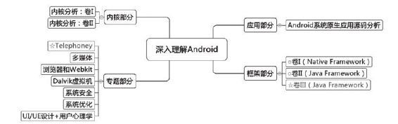

# “深入理解Android”系列书籍的规划路线图

“深入理解Android”系列书籍的规划路线图一、Roadmap“深入理解Android”系列书籍从卷I推出以后就受到广大读者的喜爱。在和读者交流的过程中，笔者被问及最多的一个问题就是，卷Ⅱ什么时候推出？内容会是什么？实际上，笔者和策划编辑杨福川在系列书籍的编写过程中，也在考虑这个问题：Android涉及的内容简直是浩如烟海，然而，哪些知识点能帮助读者更快、更好地了解Android？

一方面帮助大家在深入了解Android系统的基础上，能更娴熟地进行应用开发；另一方面能帮助读者搭建一个兼具Android甚至嵌入式系统的具有相当深度和广度的知识架构？在反复讨论和仔细研究之后，我们试规划了如图1所示的“深入理解Android”系列书籍的Roadmap：

图1“深入理解Android”系列书籍的Roadm ap图1将整个系列分为4个部分：应用部分、框架部分、专题部分和内核部分。这几部分内容规划的大致思路为：

1.应用部分这部分拟以Android源码中自带的那些应用程序为分析目标，充分展示Google在自家SDK平台上做应用开发的深厚功力。这些应用包括Contacts、Ga ery2、M m s、Browser等，它们的分析难度都不可小觑。

通过对这些系出名门的应用的分析，我们希望读者不仅能把握商业级应用程序开发的精髓，还能更精熟地掌握Android应用开发的各种技能。

2.Fram ework部分这部分关注Android的框架，拟包括3本书：

卷I：以Native层Framework模块为分析对象。知识点包括init、binder、zygote、jni、M essage和Handler、audio系统、surface系统、vold、rild和m ediascanner。本书已于2011年9月出版，虽然是基于Android2.2的，读者如果扎实地掌握并理解了其中的内容，那么以后再研究2.3或4.0版本中对应的模块，也是轻而易举之事。

卷II和卷III：以Java层Fram ework模块为分析对象。卷II基于4.0.1版，包括UI相关服务和Window系统之外的一些重要服务，如PackageM anagerService、ActivityM anagerService、Pow erM anagerService、ContentService、ContentProvider等。而卷III将以输入系统、W indowM anagerService、UI相关服务为主要目标。相对于其他模块来说，UI相关服务可能会随着Android系统升级而发生较大的变化，所以卷III也许会基于Android4.1。

Framework部分所包括的这3本书的目的是让读者对整个Android系统有较大广度、一定深度的认识，这有益于读者构建一个更为完整的Android系统知识结构。应当指出，这3本书不可能覆盖Android Fram ework中的所有知识点，因此，尚需读者在此基础上，结合不同需求，进行进一步的深入研究。

3.专题部分这部分旨在帮助读者沿着Android平台中的某一些专业方向，进行深度挖掘，拟规划如下专题：

Telephony专题：涵盖System Server中相关的通信服务、rild、短信、电话等模块。

多媒体专题：涵盖MultiMedia相关的模块，包括Stagefright、OMX等。另外，我们也打算引入开源世界中最流行的一些编解码引擎和播放引擎作为分析对象。

浏览器和Webkit专题，该专题难度非常大，但其重要性却不言而喻。

Dalvik虚拟机专题：该专题希望对Dalvik进行一番深度研究，涉及面包括Java虚拟机的实现、Android的一些特殊定制等内容。

Android系统安全专题：该专题的目标是分析Android系统上提供的安全方面的控制机制。另外，Linux平台上的一些常用安全机制（例如，文件系统加密等）也是本书所要考虑的。

UI/UE设计以及心理学专题：该专题希望能提供一些心理学方面的指导以及具体的UI/UE设计方面的指南以帮助开发人员开发出更美、更体贴和更方便的应用。

专题部分隐含着的一个极为重要的宗旨：即基于Android，而高于Android。换言之，这些书籍虽都以Android为切入点，但我们更希望读者学到的知识、掌握的技术却不局限于Android平台。

4.内核部分这部分拟以Linux内核为主。虽然这方面的经典教材非常多，但要么是诸如《Linux内核情景分析》之类的鸿篇巨帙，要么是类似《Linux内核设计与实现》，内容过于简洁。另外，现有书籍使用的内核源码都已比较陈旧。为此，我们希望能有一本难度适中、知识面较广、深度适宜的书籍。

另外，除了通过书籍传播知识外，我们也会引入博客等其他渠道来补充Roadmap中未能涉及的知识点。

二、英雄帖Google为这个世界贡献了Android这一奇葩，那么我们能做些什么呢？我们的理想是，围绕深入理解Android这一系列，编撰出国内最高品质的系列书籍，以飨读者。如果读者是正在前沿拼杀的“攻城狮”，那么我们甘愿做及时为您运送精神食粮的后勤兵！

主持人杨澜有一句话说得好：“原来我只佩服成功的人，现在我更尊敬那些正在努力的人”。我们也盛情邀请那些已付出艰辛努力或正在努力、有热情、懂技术，并乐于与人分享的朋友们加入到我们这个团队里来，共同为“攻城狮”们做些实事！目前卷III、Telephony专题已有合适的后勤兵们正在为之努力奋斗，相信不久的将来读者们就能享受到他们通过奋斗结出的硕果了！

请有意的朋友们和我们联系，我们的电子邮箱：

杨福川：linux1689@ gm ail.com邓凡平：

fanping.deng@ gm ail.com杨福川、邓凡平
