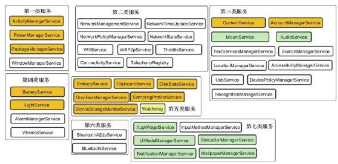
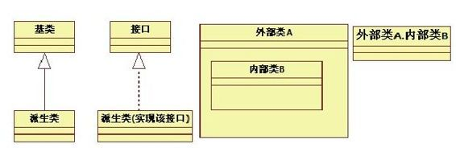

# 前言




位于第六大类的是蓝牙服务。

位于第七大类的是UI方面的服务，如状态栏服务、通知管理服务等。

以上这些服务就是Android FrameworkJava层的核心。毫不夸张地说，它们也是Android系统的基石。另外，这些服务的内容远非一本书所能囊括。作为AndroidJava层Framework分析的先头部队，本书涵盖了以下内容：

第1章，介绍了阅读本书需要做的一些准备工作，包括Android4.0源码的下载和编译、Eclipse开发环境的搭建，以及Android系统进程（system _process）的调试等。

第2章，介绍了Java Binder和M essageQueue的实现。

第3章，介绍了SystemServer，并分析了图1中第五类包含的服务的工作原理。这些服务包括EntropyService、DropBoxM anagerService、DiskStatsService、DeviceStorageM onitorService、Sam plingProfil erService和ClipboardService。

第4章，分析了PackageM anagerService，该服务负责Android系统中的Package信息查询和APK安装、卸载、更新等方面的工作。

第5章，讲解了PowerM anagerService，它是Android中电源管理的核心服务。本章对其中的W akeLock、Power按键处理、Ba eryStatsService和Ba eryService都做了一番较为深入的分析。

第6章，以ActivityM anagerService为分析重点，该服务是Android的核心服务。本章对ActivityM anagerService的启动、Activity的创建和启动、BroadcastReceiver的工作原理、Android中的进程管理等内容进行了较为深入的研究。

第7章，对ContentProvider的创建和启动、SQLite相关知识、Cursor query和close的实现等进行了较为深入的分析。

第8章，以ContentService和AccountM anagerService为分析对象，介绍了数据更新通知机制的实现、账户管理和数据同步等方面的知识。

图1中的其他服务将会在“深入理解Android”系列的其他书中详细分析。该系列书的规划请见本书最后面的“深入理解Android系列图书路线图”。

本书以直接剖析源码的方式进行讲解，旨在引领读者一步步深入于Android系统中相关模块的内部原理，去理解它们是如何实现、如何工作的。在分析过程中，笔者根据个人研究Android代码的心得，采用了精简流程和逐个击破的方法。同时，笔者还提出了一些难度不大的知识点、相关的补充阅读资料，甚至笔者在实际项目中遇到的开放式问题，留给读者自行研究和探讨。总之，笔者希望读者在阅读完本书后，至少能有以下两个收获：

能从“基于Android并高于Android”的角度来看待和分析Android。

能初步具有大型复杂代码的分析能力。

读者对象适合阅读本书的读者包括：

（1）Android应用开发工程师虽然应用开发工程师平常接触的多是AndroidSDK，但是只有更深入地理解了Android系统运行原理，才能写出更健壮、更高效的模块。

（2）Android系统开发工程师系统开发工程师常常需要深入理解系统的运转过程，而本书所涉及的内容正是他们在工作和学习中最想了解的。那些对具体服务(如ActivityM anagerService、PackageM anagerService）感兴趣的读者，也可以单刀直入，阅读本书相关章节。

（3）对Android系统运行原理感兴趣的读者这部分读者需要具有基本的Android开发知识基础。

如何阅读本书本书是针对Android源码进行分析的，而源码文件所在的路径一般都很长，例如，文件AndroidRuntime.cpp的真实路径是fram eworks/base/core/jni/AndroidRuntime.cpp。为了行文方便，在各章节开头，均把本章涉及的源码路径全部列出，而在具体分析源码时，则只列出该源码的文件名。

例如：

[--＞AndroidRuntim e.cpp]

```cpp
//这里是源码和一些注释
另外,本书在描述类之间的关系及函数调用
```

流程上，使用了UML的静态类图及序列图。

UML是一个强大的工具，但它的建模规范过于烦琐，为更简单清晰地描述事情的本质，本书并未完全遵循UML的建模规范。这里仅举一例，如图2所示。



图2 UML示例图在图2中：

外部类内部的方框用于表示内部类。另外，“外部类A.内部类B”也用于表示内部类。接口和普通类用同一种框图表示。

本书所使用的UML图都比较简单，读者不必花费大量时间专门学习UML。

这里有必要提醒一下，要阅读此书，应具有Java基本知识。

[1]另外，本书和《深入理解Android卷I》

（简称“卷I”）部分章节有一定联系，主要集中在Binder和M essageQueue部分。读者可将“卷I中”这部分内容作为补充阅读资料来学习。卷I部分内容的电子版下载地址为：

h p：//download.csdn.net/detail/hzbooks/3677793。

本书涉及的Android4.0源码以及一些开发工具的下载地址为：

h p：//115.com /folder/fauqpj0t#Android-ICS-SOURCE-CODE。

勘误和支持由于作者的水平有限，加之写作时间仓促，书中难免会出现一些错误或不准确的地方，恳请读者批评和指正。若有问题，可通过邮箱或在博客上留言与笔者共同讨论。笔者的联系方式是：

邮箱：fanping.deng@ gm ail.com博客：blog.csdn.net/innost、cnblogs.net/innost和h p：//m y.oschina.net/innost/blog致谢本书即将付梓！首先要感谢杨福川编辑的大力支持。另外，要感谢本书的审稿编辑姜影。

再一次感谢我所在的中科创达（ThunderSoft）公司。有幸工作在这样一个互相信任、互相鼓励、平等和开放式的环境中，我才能完成本书。公司领导所给予的机会和挑战，时时鞭策着我保持虚心学习的心态。此外，我所在团队的各位同仁也给予了我不少支持和帮助。本书出版之日，将是我们团队为之努力奋斗的Android系统高效、稳定运行于客户手机之时！

一如既往地感谢妻子和家人，他们是我奋斗的动力。

谢谢在人生和职业道路上曾给予我指导的诸位师长。

当然，最应感谢的还是肯花费宝贵时间和精
