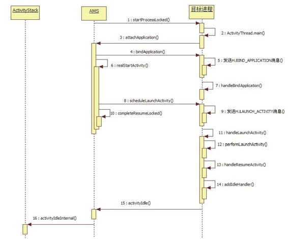
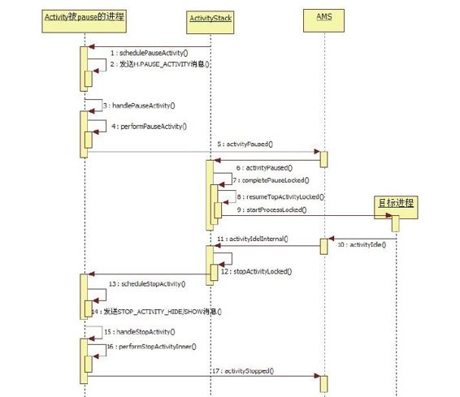

# 深入理解Android:卷II_1


```
}//synchronized结束
```

}//for循环结束……//处理等待结束的Activiti es

```
//发送ACTION_BOOT_COMPLETED广播
if(booti ng)mService.fi nishBooti ng
();
……
return res;
}
```

在activityIdleInternal中有一个关键点，即处理那些因为本次Activity启动而被暂停的Activity。有两种情况需考虑：

如果被暂停的Activity处于finishing状态(如Activity在其onPause中调用了finish函数），则调用finishCurrentActivityLocked。

否则，要调用stopActivityLocked处理暂停的Activity。

此处涉及除AMS和目标进程外的第三个进程，即被切换到后台的那个进程。不过至此，我们的目标Activity终于正式登上了历史舞台。

提示本例的分析结束了吗？没有。因为am设置了-W选项，所以其实我们还在startActivity-AndW ait函数中等待结果。

ActivityStack中有两个函数能够触发AMSnotif yA，一个是reportActivityLaunchedLocked，另一个



是reportActivityVisibleLocked。前面介绍的activityInternal函数只在from Tim eout为true时才会调用reportActivityLaunchedLocked，但本例中from Tim eout为false，这该如何是好？

该问题的解答非常复杂，简单点说就是：当Activity显示出来时，其在AMS中对应ActivityRecord对象的windowVisible函数将被调用，其内部会触发reportActivityLaunched-Locked函数，这图6-15 startActivity后半程总结样我们的startActivityAndW ait才能被唤图6-15中涉及16个重要函数调用，而且这醒。

仅是startActivity后半部分的调用流程，可7.startActivity分析之后半程总结见整个流程有多么复杂！

总结startActivity后半部分的流程，主要涉8.startPausingLocked函数分析及目标进程和AMS的交互，如图6-15所现在我们分析图6-14中的示。

startPausingLocked分支。根据前面的介绍，当启动一个新Activity时，系统将先行处理当前的Activity，即调用startPausingLocked函数来暂停当前Activity。

（1）startPausingLocked分析该部分的代码如下：

[--＞ActivityStack.java：
startPausingLocked]

```java
private fi nal void startPausingLocked
(boolean userLeaving, boolean
uiSleeping){
//mResumedActi vit y保存当前正显示的
Acti vit y
Acti vit yRecord prev=mResumedActi vit y;
mResumedActi vit y=nu;
//设置mPausingActi vit y为当前Acti vit y
mPausingActi vit y=prev;
mLastPausedActi vit y=prev;
prev.state=Acti vit yState.PAUSING;//设
```

置状态为PAUSING

```
prev.task.touchActi veTime();
……
if(prev.app!=nu&&
prev.app.thread!=nu){
try{
//①调用当前Activity所在进程的
schedulePauseActi vit y函数
prev.app.thread.schedulePauseActi vit y
(prev, prev.fi nishing,
userLeaving,
prev.confi gChangeFlags);
if(mMainStack)
mService.updateUsageStats(prev,
false);
}……//catch分支
}……//else分支
if(!mService.mSleeping&&!
mService.mShutti ngDown){
//获取WakeLock,以防止在Acti vit y切换过
程中掉电
mLaunchingActi vit y.acquire();
if(!mHandler.hasMessages
(LAUNCH_TIMEOUT_MSG)){
Message msg=mHandler.obtainMessage
(LAUNCH_TIMEOUT_MSG);
mHandler.sendMessageDelayed(msg,
LAUNCH_TIMEOUT);
}
if(mPausingActi vit y!=nu){
//暂停输入事件派发
if(!uiSleeping)
prev.pauseKeyDispatchingLocked();
//设置PAUSE超时,时间为500毫秒,这个时
间相对较短
Message msg=mHandler.obtainMessage
(PAUSE_TIMEOUT_MSG);
msg.obj=prev;
mHandler.sendMessageDelayed(msg,
PAUSE_TIMEOUT);
}……//else分支
}
```

startPausingLocked将调用应用进程的schedulePauseActivity函数，并设置500毫秒的超时时间，所以应用进程需尽快完成相关处理。和scheduleLaunchActivity一样，schedulePauseActivity将向ActivityThread主线程发送PAUSE_ACTIVITY消息，最终该消息由handlePauseActivity来处理。

（2）handlePauseActivity分析这部分的代码如下：

[--＞ActivityThread.java：
handlePauseActivity]

```java
private void handlePauseActi vit y
(IBinder token, boolean fi nished,
boolean userLeaving, int
confi gChanges){
//当Acti vit y处于fi nishing状态时,
```

finished参数为true，不过在本例中该值为

```
false
Acti vit yCli entRecord r=mActi viti es.get
(token);
if(r!=nu){
//调用Acti vit y的onUserLeaving函数,
if(userLeaving)
performUserLeavingActi vit y(r);
r.acti vit y.mConfi gChangeFlags|=confi gC
hanges;
//调用Acti vit y的onPause函数
performPauseActi vit y(token, fi nished,
r.isPreHoneycomb());
……
try{
//调用AMS的acti vit yPaused函数
Acti vit yManagerNati ve.getDefault
().acti vit yPaused(token);
}……
}
```

[--＞ActivityM anagerService.java：
activityPaused]

```java
publi c fi nal void acti vit yPaused
(IBinder token){
……
mMainStack.acti vit yPaused(token,
false);
}
```

[--＞ActivityStack.java：activityPaused]

```java
fi nal void acti vit yPaused(IBinder
token, boolean ti meout){
Acti vit yRecord r=nu;
synchronized(mService){
int index=indexOfTokenLocked
(token);
if(index>=0){
r=mHistory.get(index);
//从消息队列中撤销PAUSE_TIMEOUT_MSG消
息
mHandler.removeMessages
(PAUSE_TIMEOUT_MSG, r);
if(mPausingActi vit y==r){
r.state=Acti vit yState.PAUSED;//设置
```

Acti vit yRecord的状态

```
completePauseLocked();//完成本次
Pause操作
}if……
}
(3)com pletePauseLocked分析
```

这部分的代码具体如下：

[--＞ActivityStack.java：
com pletePauseLocked]

```java
private fi nal void completePauseLocked
(){
Acti vit yRecord prev=mPausingActi vit y;
if(prev!=nu){
(prev.fi nishing){
prev=fi nishCurrentActi vit yLocked
(prev, FINISH_AFTER_VISIBLE);
}else if(prev.app!=nu){
if(prev.confi gDestroy){
destroyActi vit yLocked(prev, true,
false);
}else{
//①将刚才被暂停的Activity保存到
mStoppingActi viti es中
mStoppingActi viti es.add(prev);
if(mStoppingActi viti es.size()>3){
```

/if/如果被暂停的Activity超过3个，则发送IDLE_NOW_MSG消息，该消息最终

```
//由我们前面介绍的acti veIdleInternal处
理
scheduleIdleLocked();
}
//设置mPausingActi vit y为nu,这是图6-
14中②、③分支的分割点
mPausingActi vit y=nu;
}
//②resumeTopActi vit yLocked将启动目标
Acti vit y
(!mService.isSleeping())
resumeTopActi vit yLocked(prev);
……
}
```

就本例而言，以上代码还算简单，最后还是通过resum eTopActivityLocked来启动目标Activity。当然，由于之前已经设置了mPausingActivity为nu，所以最终会走到图6-14中③的分支。

（4）stopActivityLocked分析根据前面的介绍，此次目标Activity将走完onCreate、onStart和onResum e流程，但是被暂停的Activity才刚走完onPause流程，那么它的onStop什么时候调用呢？答案就在activityIdelInternal中，它将为mStoppingActivities中的成员调用stopActivityLocked函数。

[--＞ActivityStack.java：
stopActivityLocked]

```java
private fi nal void stopActi vit yLocked
(Acti vit yRecord r){
if((r.intent.getFlags()&
Intent.FLAG_ACTIVITY_NO_HISTORY)!=0
||(r.info.fl ags&
Acti vit yInfo.FLAG_NO_HISTORY)!=0){
if(!r.fi nishing){
requestFinishActi vit yLocked(r,
Acti vit y.RESULT_CANCELED, nu,
"no-history");
}
}else if(r.app!=nu&&
r.app.thread!=nu){
try{
r.stopped=false;
//设置STOPPING状态,并调用对应的
scheduleStopActi vit y函数
r.state=Acti vit yState.STOPPING;
r.app.thread.scheduleStopActi vit y(r,
r.visible,
r.confi gChangeFlags);
}……
}
```

对应进程的scheduleStopActivity函数将根据visible的情况，向主线程消息循环发送H.STOP_ACTIVITY_HIDE或H.STOP_ACTIVITY_SHOW消息。不论哪种情况，最终都由handleStopActivity来处理。

[--＞ActivityThread.java：
handleStopActivity]

```java
private void handleStopActi vit y
(IBinder token, boolean show, int
confi gChanges){
Acti vit yCli entRecord r=mActi viti es.get
(token);
r.acti vit y.mConfi gChangeFlags|=confi gC
hanges;
StopInfo info=new StopInfo();
//调用Acti vit y的onStop函数
performStopActi vit yInner(r, info,
show, true);
……
```

try{//调用AMS的acti vit yStopped函数

```
Acti vit yManagerNati ve.getDefault
().acti vit yStopped(
```



```
r.token, r.state, info.thumbnail ,
info.descripti on);
}
```

虽然AMS没有为stop设置超时消息处理，但是严格来说，还是有超时限制的，只是这个超时处理与activityIdleInternal结合起来了。

图6-16 startPausingActivity流程总结（5）startPausingLocked总结图6-16比较简单，读者最好结合代码再把流程走一遍，以加深理解。

startPausingLocked的流程如图6-16所示。

9.startActivity总结Activity的启动就介绍到这里。这一路分析下来，相信读者也和笔者一样觉得此行绝不轻松。先回顾一下此次旅程：

行程的起点是am。am是Android中很重要的程序，读者务必要掌握它的用法。我们利用am start命令，发起本次目标Activity的启动请求。

接下来进入ActivityM anagerService和ActivityStack这两个核心类。对于启动Activity来说，这段行程又可分细分为两个阶段：第一阶段的主要工作就是根据启动模式和启动标志找到或创建ActivityRecord及对应的TaskRecord；第二阶段工作就是处理Activity启动或切换相关的工作。

然后讨论了AMS直接创建目标进程并运行Activity的流程，其中涉及目标进程的创建，目标进程中Android运行环境的初始化，目标Activity的创建以及onCreate、onStart及onResum e等其生命周期中重要函数的调用等相关知识点。

接着又讨论了AMS先暂停当前Activity，然后再创建目标进程并运行Activity的流程。

其中牵扯到两个应用进程和AMS的交互，其难度之大可见一斑。

读者在阅读本节时，务必要区分此旅程中两个阶段工作的重点：其一是找到合适的

```
ActivityRecord和TaskRecord;其二是调度
```

相关进程进行Activity切换。在SDK文档中，介绍最为详细的是第一阶段中系统的处理策略，例如启动模式、启动标志的作用等。第二阶段工作其实是与Android组件调度相关的工作。SDK文档只是针对单个Activity进行生命周期方面的介绍。

坦诚地说，这次旅程略过不少逻辑情况。原因有二，一方面受限于精力和篇幅；另一方面是作为调度核心类，和AMS相关的代码及处理逻辑非常复杂，而且其间还夹杂了与WMS的交互逻辑，使复杂度更甚。再者，笔者个人感觉这部分代码肯定谈不上高效、严谨和美观，甚至有些丑陋（在分析它们的过程中，远没有研究Audio、Surface时那种畅快淋漓的感觉）。

此处列出几个供读者深入研究的点：

各种启动模式、启动标志的处理流程。

Configuration发生变化时Activity的处理，以及在Activity中对状态保存及恢复的处理流程。

Activity生命周期各个阶段的转换及相关处理。Android 2.3以后新增的与Fragm ent的生命周期相关的转换及处理。

建议在研究代码前，先仔细阅读SDK文档相关内容，以获取必要的感性认识，否则直接看代码很容易迷失方向。

[1]关于Zygote的工作原理，请读者阅读卷I第4章“深入理解Zygote”。
