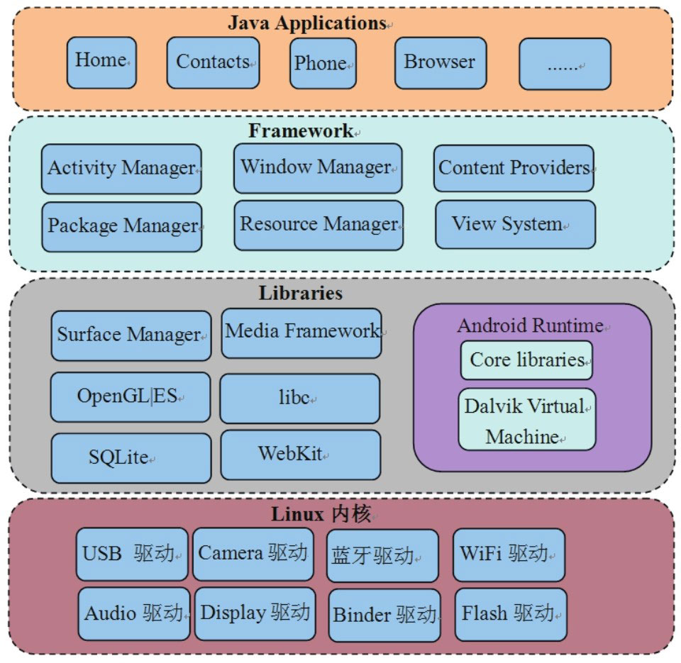
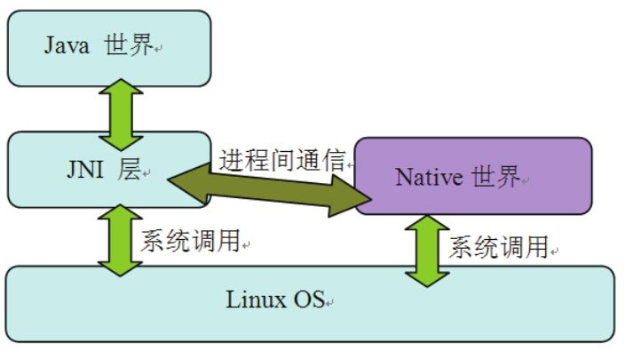

# 1.1 系统架构

1.1.1Android系统架构Android是Google公司推出的一款智能手机平台。该平台本身是基于Linux内核的，图1-1展示了这个系统的架构：

图1-1Android系统架构从上图中可以看出，Android系统大体可分为四层，从下往上依次是：

Linux内核层：包含了Linux内核和一些驱动模块（比如USB驱动、Camera驱动、蓝牙驱动等）​。目前Android2.2（代号为Froyo）基于Linux内核2.6版本。

Libraries层：这一层提供动态库（也叫共享库）​、Android运行时库、Dalvik虚拟机等。从编程语言角度来说，这一层大部分都是用C或C++写的，所以也可以简单地把它看成是Native层。

Framework层：这一层大部分用Java语言编写，它是Android平台上Java世界的基石。

Applications层：与用户直接交互的就是这些应用程序，它们都是用Java开发的。

从上面的介绍可看出，Android系统的最大特点之一就是搭建了一个被广大Java开发者热捧的Java世界。但这个世界并不是空中楼阁，它的运转依赖于另一个被Google极力隐藏的Native世界。两个世界的交互关系可用图1-2来表示：

图1-2Java世界和Native世界交互从上图可知：

Java虽具有与平台无关的特性，但Java和具体平台之间的隔离却是由JNI层来实现的。Java是通过JNI层调用LinuxOS中的系统调用来完成对应的功能的，例如创建一个文件或一个Socket等。

除了Java世界外，还有一个核心的Native世界，它为整个系统高效和平稳地运行提供了强有力的支持。一般而言，Java世界经由JNI层通过IPC方式与Native世界交互，而Android平台上最为神秘的IPC方法就是Binder了，第6章将详细分析Binder。除此之外，Socket也是常用的IPC方式。这些内容在后面的代码分析中都会见到。
