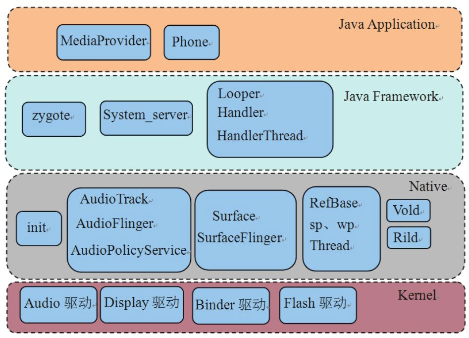

# 1.1.2 本书的架构

本书所分析的模块也将遵循Android系统架构，如图1-3所示：

图1-3本书的架构图从上图可知，本书所分析的各个模块除未涉及Kernel外，其他三层均有所涉及，它们分别是：

Native层包括init、Audio系统（包括AudioTrack、AudioFlinger和AudioPolicyService）​、Surface系统（包括Surface和SurfaceFlinger）​、常用类（包括RefBase、sp、wp等）​、Vold和Rild。

JavaFramework层包括zygote、System_server以及Java中的常用类（包括Handler和Looper等）​。

JavaApplication层包括MediaProvider和Phone。
