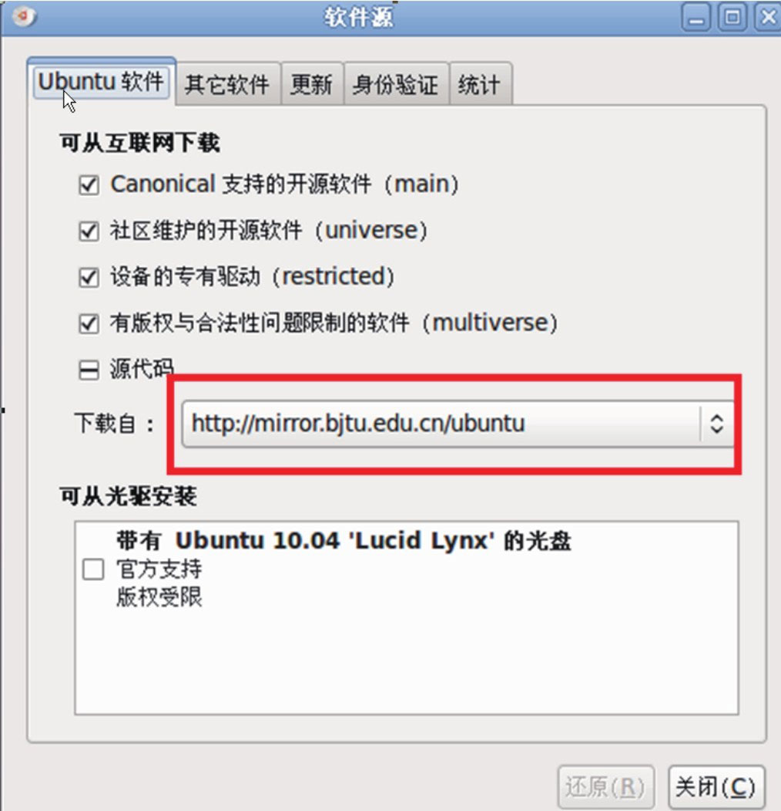

# 1.2.1 下载源码

Android源码采用Git作为版本管理工具，这个工具是由Linux之父LinusTorvalds采用纯C开发。关于Git为什么使用C语言开发的问题，还引发了一场关于C和C++孰好孰坏的大讨论，不过LinusTorvalds显然没树起“居庙堂之高，则忧其民”的形象。对于普通“码农”而言，用最合适的工具、最实用的办法来很好地完成工作才是最重要的。所以，C、C++、Java、Python等都仅仅只是工具而已。

下面将详细介绍如何下载Android的源码。

1.设置软件源在下载Android的源码前，有些下载工具需要从Ubuntu软件源上下载。可以为Ubuntu系统指定一个软件源。有些软件源上有这些工具，有些却没有，而且各个软件源的下载速度也不同，所以应首先找到一个合适的软件源。

Ubuntu软件源的设置界面如图1-4所示：

图1-4Ubuntu软件源设置从上图中可发现，将软件源地址设置成了hp://mirror.bjtu.edu.cn/ubuntu。每个人可根据自己的情况选择合适的软件源。

2.下载Android源码下面开始下载Android源码，工序比较简单，可一气呵成。

apt-getinstagit-corecurl#先下载这两个工具mkdir-p/develop/download-froyo#在根目录下建立develop和download-froyo两个目录cd～/develop/download-froyo#进入这个目录curlhp://Android.git.kernel.org/repo＞./repo#从源码网站下载repo脚本，该脚本是Google为了方便源码下载而提供的，通过该脚本可下载整套源码。

chmoda+xrepo#设置该脚本为可执行./repoinit-ugit://Android.git.kernel.org/platform/manifest.git-bfroyo#初始化git库#下载源码，大小约为2GB，如果网速快，估计也得要2个多小时。./reposync下载完后，该目录中的内容如图1-5所示：

图1-5源码下载结果注意Kernel的代码必须单独下载，下载方法如下：

gitclonegit://android.git.kernel.org/kernel/common.gitkernel
