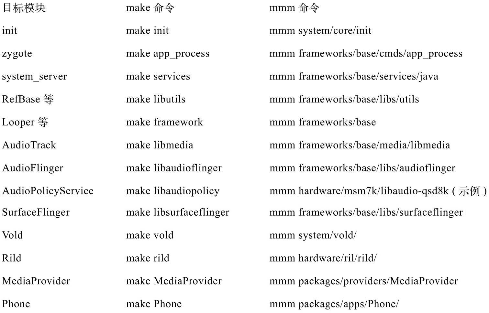

# 1.2.2 编译源码


1.部署JDKFroyo的编译依赖JDK1.5，所以首先要做的就是下载JDK1.5。下载网址是hp://www.oracle.com/technetwork/java/javase/downloads/index-jdk5-jsp-142662.html。下载得到的文件为jdk-1_5_0_22-linux-i586.bin，把它放到任意一个目录中，笔者将它放在了/develop中，然后在这个目录中执行如下命令：

```html
        ./jdk-1_5_0_22-linux-i586.bin   #执行这个文件
```

这个命令的功能其实就是解压，解压后的结果在/develop/jdk1.5.0_22目录中。现在有了JDK，再按照下面的步骤部署它即可：

（1）在～/.bashrc文件的末尾添加以下几句话：

exportJAVA_HOME=/develop/jdk1.5.0_22#设置为刚才解压的目录exportJRE_HOME=JAVA_HOME/jreexportCLASSPATH=$JAVA_HOME/lib:$JRE_HOME/lib:$CLASSPATHexportPATH=$JAVA_HOME/bin:$JRE_HOME/bin:$PATH（2）重新登录系统，这样JDK资源就能被正确找到了。

2.编译源码Android的编译有自己的一套规则，主要利用的是mk文件。网上有太多关于它的解说了，这里不再赘述，只简单地介绍其编译工序：

进入源码目录（以笔者的开发环境为例，也就是cd/develop/download_froyo）​：

执行.build/envsetup.sh，这个脚本用来设置Android的编译环境。

执行choosecombo命令，这个命令用来选择编译目标（如目标硬件平台、eng还是user等）​。一般而言，手机厂商会设置自己特有的编译选项。

执行完上面几个步骤后，就可以编译系统了。

Android平台提供了三个命令用于编译，它们分别是make、mmm和mm，这三个命令的使用方法及其优劣如下：

make：不带任何参数，它用于编译整个系统，时间较长，笔者不推荐这种做法，除非读者想编译整个系统。

makeMediaProvider：下面几个例子都以编译MediaProvider为例。这种方式对应于单个模块编译。它的优点是，会把该模块依赖的其他模块也一起编译。例如makelibmedia，就会把libmedia依赖的库全部编译好。其缺点也很明显，它需要搜索整个源码来定位MediaProvider模块所使用的Android.mk文件，并且还要判断该模块所依赖的其他模块是否有修改。整体编译时间较长。

mmmpackages/providers/MediaProvider：该命令将编译指定目录下的目标模块，而不编译它所依赖的模块。所以，如果读者是初次编译，采用这种方式编译一个模块往往会报错。错误的原因是因为它依赖的模块没有被编译。

mm：这种方式需要先用cd命令进入packages/providers/MediaProvider目录，然后执行mm命令。该命令会编译当前目录下的模块。它和mmm一样，只编译目标模块，mm和mmm命令编译的速度都很快。

从使用的角度来看，笔者有如下建议：

如果只知道目标模块的名称，则应使用make模块名的方式来编译目标模块。

例如，如果要编译libmedia，则直接使用makelibmedia即可。另外，初次编译时也要采用这种方法。

如果不知道目标模块的名称，但知道目标模块所处的目录，则可使用mmm或mm命令来编译。当然，初次编译还必须使用make命令，以后的编译就可使用mmm或mm了，这样会节约不少时间。

注意一般的编译方式都使用增量编译，即只编译发生变化的目标文件，但有时则需重新编译所有目标文件，那么就可使用make命令的-B选项。例如make-B模块名，或者mm-B、mmm-B。在mm和mmm内部，也是调用make命令的，而make的-B选项将强制编译所有目标文件。

Android的编译工序比较简单，难点主要在Android.mk文件的编写，读者可上网搜索与此相关的学习资料。

3.本书各模块的编译目标本书各模块的编译目标如表1-1所示，这里仅列出几个有代表性的模块：

表1-1本书各模块的编译目标



假设makeframework，那么编译完的结果则如图1-6所示：

图1-6makeframework的结果从上图可看出，make命令编译了framework-res.apk和framework.jar两个模块。它们编译的结果在out/target/product/generic/system/framework下。利用adb命令把这两个文件push到手机的system/framework目录即可替换旧的文件。如果想测试这个新模块，则需要先杀掉所有使用该模块的进程，进程重启后会重新加载模块，这时就能使用新的文件了。例如，想测试刚修改的libaudioflinger模块，通过adb命令push上去后，要先杀掉mediaserver进程，因为libaudioflinger库目前只有该进程在使用。当mediaserver重启后，就会加载新push上来的libaudioflinger库了。

注意系统服务被杀掉后一般都会自动重启（由init控制，见第3章中的分析）​。
